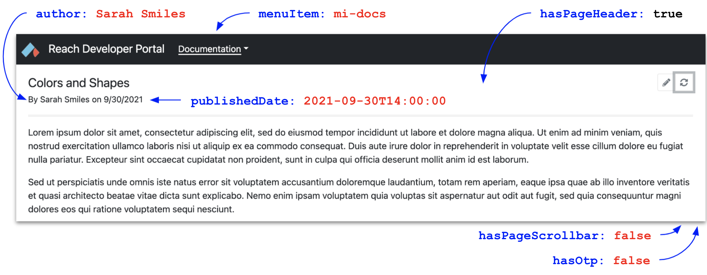

# Reach Developer Portal

This repository contains the source files and site generator for the [Reach Developer Portal](https://reach-sh.github.io).

## Deploy the site locally

1. Clone this repository to your computer:

    ```
    git clone https://github.com/reach-sh/reach-developer-portal.git
    ```

1. Change directory:

    ```
    cd reach-developer-portal
    ```

1. Convert source files to website files.

    ```
    make build
    ```

    (Node.js and npm are required. I use Node.js v16.3.0.)

1. Run `make serve-up`

   You can turn it off with `make serve-down`.

1. Browse to http://127.0.0.1:8081 or http://localhost:8081.

## Create a webpage

1. Create a page folder (e.g. colors-and-shapes):

    ```
    mkdir -p en/pages/colors-and-shapes
    ```

1. Create an index.md file inside your page folder:

    ```
    touch en/pages/colors-and-shapes/index.md
    ```

1. Add content to the index.md file. For sample content, browse to the [Sample Page](https://reach-sh.github.io/en/pages/sample/), click the Pencil icon, click the second Pencil icon, and copy.

1. Generate the webpage:

    ```
    node tools/generator.js -t folder -d en/pages/colors-and-shapes
    ```

1. Browse to http://localhost:8081/en/pages/colors-and-shapes.

## Configure the webpage

Consider the following index.md file:

 ```
 # Colors and Shapes

Lorem ipsum dolor sit amet ...
```

Because this file specifies no frontmatter, the corresponding webpage reflects default options:

<p></p>

Adding frontmatter to an index.md file changes the presentation and/or behavior of the corresponding webpage. Note the added frontmatter:

```
---
author: Sarah Smiles
hasOtp: false
hasPageScrollbar: false
menuItem: mi-docs
publishedDate: 2021-09-30T14:00:00
---

# Colors and Shapes

Lorem ipsum dolor sit amet ...
```

The corresponding webpage reflects the newly specified options:

<p></p>

Below is a table of the current page configuration options:

|Option|Type|Default|Description|
|-|-|-|-|
|author|string|null|Displays "By" + author.|
|hasEditBtn|boolean|true|Displays or hides the pencil icon.|
|hasOtp|boolean|true|Displays or hides the *On This Page* panel.|
|hasPageHeader|boolean|true|Displays or hides the title, icons, author, and publication date.|
|hasPageScrollbar|boolean|true|Displays or hides the page scrollbar. Scrolling works either way.|
|hasRefreshBtn|boolean|true|Displays or hides the refresh icon.|
|menuItem|string|null|Internal use at this point.|
|publishedDate|string|null|Displays or hides the publication date. Use 2021-09-30T14:00:00 GMT format.|

## About source files

Each webpage traces its source to a folder within the [books](https://github.com/reach-sh/reach-developer-portal/tree/master/en/books) or [pages](https://github.com/reach-sh/reach-developer-portal/tree/master/en/pages) directories.

<p></p>

The [books](https://github.com/reach-sh/reach-developer-portal/tree/master/en/books) directory contains book, chapter, and leaf folders which correspond to book, chapter, and leaf webpages:

<p></p>

The [pages](https://github.com/reach-sh/reach-developer-portal/tree/master/en/pages) directory contains standalone and dummy folders. Standalone folders correspond to webpages. Dummy folders do not correspond to webpages. Instead, they provide a user-determined organizational hierarchy for standalone folders.

<p></p>

Each page folder (book, chapter, leaf, standalone) houses an index.md file containing the source for the webpage.

<p></p>

The index.md file conforms to [Github-flavored markdown](https://github.github.com/gfm/). It often begins with a hash symbol + space + page title:

```
# Demo Page
```

It may contain headings, paragraphs, lists, code snippets, tables, html, etc. as demonstrated on the [Demo Page](https://github.com/reach-sh/reach-developer-portal/blob/master/en/pages/demo/index.md). It may also contain links to supplemental files (e.g. images) that reside in the same folder, and links to external resources (e.g. videos):

<p></p>

## Responsive Defaults

The various screen widths (seen below) determine whether a user sees, on initial load, a book column versus an expander hamburger (on the left) and an on-this-page (otp) column versus an expander hamburger (on the right).

> **Important**<br/>
> The user explicitly expanding or collapsing the OTP column sets a "preferred state" flag which the application applies to every medium, large, or extra large page the user visits. Reloading the JavaScript file clears this flag. I could save this state to localStorage, but I don't see an immediate need. 

#### Extra Large

<p></p>

#### Large

<p></p>

#### Medium

<p></p>

#### Small

<p></p>

#### Extra Small

<p></p>

## Themes

Reach colors are reddish (#F45747), light blueish (#6AC6E7), and inkish (#1A1C23).

```
background: "url(/en/pages/home/stars2.jpeg), rgba(var(--bs-dark-rgb),var(--bs-bg-opacity))"
```

## About the generator

A Node.js command-line application, the site generator which, for the most part, transforms markdown files into html files, will continue to evolve over the next few months. Here is the current help menu:

```
$ node tools/generator.js -h
Options:
  -h, --help      Show help.  [boolean]
  -v, --version   Show version.  [boolean]
  -d, --dir       Specify dirpath.  [string] [default: ""]
  -e, --edit      Add edit button to page.  [boolean] [default: true]
  -l, --language  Specify language (e.g. en, zh).  [string] [default: "en"]
  -r, --refresh   Add refresh button to page.  [boolean] [default: true]
  -t, --type      Specify file type.  [string] [required] [choices: "all", "base", "book", "css", "folder", "folders", "js"]

Examples:
  generator.js
  generator.js -t all
  generator.js -t book -d books/demo
  generator.js -t css
  generator.js -t base -l en
  generator.js -t folder -d en/books/demo
  generator.js -t folders -d en/books/demo
  generator.js -t js
```

Below are some additional examples.

If you modify an index.md file (e.g. `en/books/demo/amphibians/frogs`), you regenerate the corresponding webpage with the `folder` flag:

```
$ node tools/generator.js -t folder -d en/books/demo/amphibians/frogs
```

If you modify various index.md files within a hierarchy (e.g. `en/books/demo`), you regenerate all the corresponding webpages with the `folders` flag:

```
$ node tools/generator.js -t folders -d en/books/demo
```
