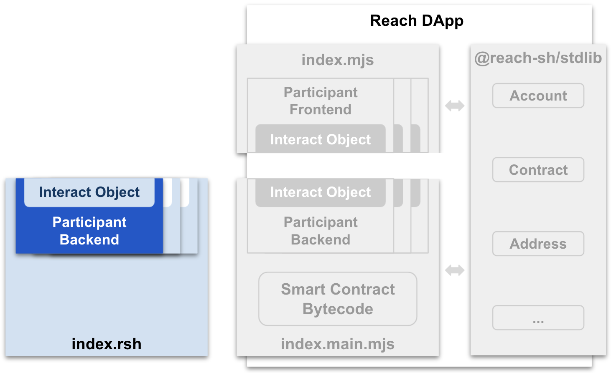

# Backend Programming

This chapter focuses on Reach Programming which uses the Reach programming language to write code in *index.rsh*, and the [Reach Script]() to (among other actions) compile *index.rsh* into *index.main.mjs*:

Be sure to complete [Getting Started](/en/books/essentials/getting-started/), including [Install and Run](/en/books/essentials/getting-started/install-and-run/) and [Set up an IDE](/en/books/essentials/getting-started/set-up-an-ide/), before continuing.

This chapter includes the following pages:

* [Reach Script](/en/books/essentials/backend-programming/reach-script/) explains the [reach](https://github.com/reach-sh/reach-lang/blob/master/reach) command-line script which is the primary tool for Reach developers.

* [Language Models](/en/books/essentials/backend-programming/language-models/) describes the fundamental assumptions and concepts of Reach including the evaluation and compilation models. 

* [Computations](/en/books/essentials/backend-programming/computations/) documents Reach comments, blocks, statements, and expressions that are common to all Reach [Modes]().

* [Modules](/en/books/essentials/backend-programming/modules/) explains the statements and expressions specific to Reach `.rsh` files.

* [Modes](/en/books/essentials/backend-programming/modes/) details the four modes of Reach: *Initialization*, *Step*, *Local Step*, and *Consensus Step*.

* [JavaScript](/en/books/essentials/backend-programming/javascript/) describes the idiosyncrasies of compiled Reach code.

* [Error Codes](/en/books/essentials/backend-programming/error-codes/) lists the error codes produced by the Reach Compiler.
