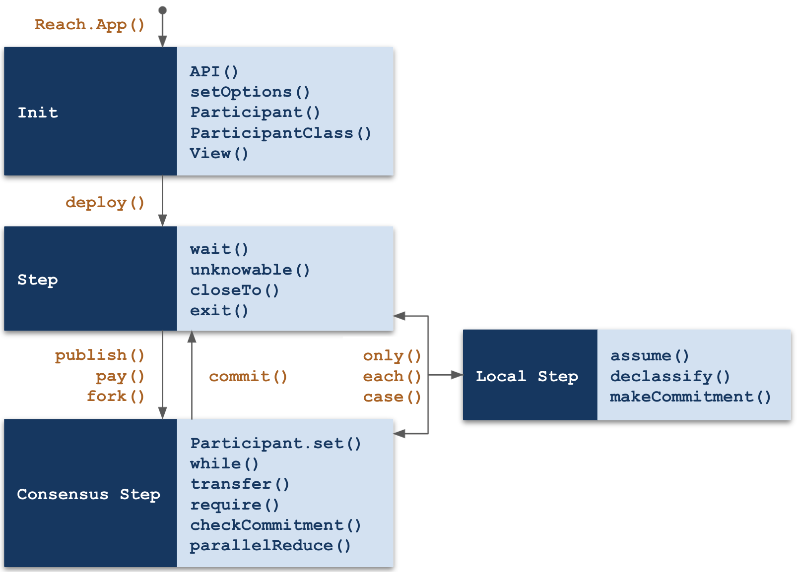

# Modes and Steps

Reach programs are organized into four modes: *Init*, *Step*, *Local Step*, and *Consensus Step*. Consider this diagram:

<div></div>

The dark blue boxes in the diagram represent modes. The orange functions cause transitions between modes. All modes allow the statements and expressions valid for [Computations](/en/books/essentials/backend-programming/computations/), but the light-blue boxes in the diagram represent some of the additional statements and expressions permitted by that particular mode.

# Init Mode

The body of `Reach.App` represents Application Initialization mode:

``` js
export const main = Reach.App(() => {
  setOptions({ verifyArithmetic: true, connectors: [ETH, ALGO ] });
  const S = Participant('Seller', sellerInteract);
  const B = Participant('Buyer', buyerInteract);
  const V = View('Main', { price: UInt });
  deploy();
```

* Line 1: Reach.App accepts a no-argument function that specifies a DApp. See [Reach.App]().
* Line 2: Optionally, Init mode overrides default compile options.
* Line 3-4: Init mode specifies DApp participants.
* Line 5: Optionally, Init mode specifies DApp views.
* Line 6: The `deploy` function transitions from Init mode to Step mode.

Below are descriptions of each permitted statement/expression:

## API

An API is defined with `API(apiName, apiInterface)` or `API(apiInterface)`:

``` js nonum
API('Voter', { vote: Fun([Address], UInt) })
API({ vote: Fun([Address], UInt) })
```

`apiName` is a string that labels the API and `apiInterface` is an object where each field indicates the type of a function provided by the contract as an API. These APIs are available in frontends via the `ctc.apis` object. The value returned by this function is an object where the fields are the members of apiInterface are may be used in .api components of fork and parallelReduce to specify the behavior of the corresponding call. These are called API member functions. Each function must occur exactly once in the entire program.

## deploy

The `deploy()` statement deploys the DApp and finalizes all the available APIs, Participants, Views, and compilation options. Its continuation is a step, which means its content is specified by steps. It represents the body of the DApp to be compiled.

## Participant

A participant is declared with the following:

``` js nonum
Participant(participantName, participantInteractInterface)
```

`participantName` is a string which indicates the name of the participant function in the generated backend code. Each `participantName` must be unique.

`participantInteractInterface` is a participant interact interface, an object where each field indicates the type of a function or value which must be provided to the backend by the frontend for interacting with the participant.

## ParticipantClass

A participant is declared with the following:

``` js nonum
ParticipantClass(participantName, participantInteractInterface)
```

`participantName` is a string which indicates the name of the participant function in the generated backend code. Each `participantName` must be unique.

`participantInteractInterface` is a participant interact interface, an object where each field indicates the type of a function or value which must be provided to the backend by the frontend for interacting with the participant.

## setOptions

The `setOptions({})` statement overrides default application parameters. Here is an example:

``` js nonum
setOptions({ verifyArithmetic: true, connectors: [ETH, ALGO ] });
```

Possible options include the following:

|Option|Type|Default|
|-|-|-|
|`connectors`|`Array`|`[ALGO, ETH]`|
|`verifyArithmetic`|`Boolean`|`false`|
|`verifyPerConnector`|`Boolean`|`false`|

Descriptions:

* *connectors*. A tuple of the connectors that the application should be compiled for. By default, all available connectors are chosen.
* *verifyArithmetic*. Determines whether arithmetic operations automatically introduce static assertions that they do not overflow beyond UInt.max. This defaults to false, because it is onerous to verify. We recommend turning it on before final deployment, but leaving it off during development. When it is false, connectors will ensure that overflows do not actually occur on the network.
* *verifyPerConnector*. Determines whether verification is done per connector, or once for a generic connector. When this is true, then connector-specific constants, like UInt.max, will be instantiated to literal numbers. This concretization of these constants can induce performance degradation in the verifier.

## View

A view is defined with `View(viewName, viewInterface)` or `View(viewInterface)`:

``` js nonum
View('NFT', { owner: Address })
View({ owner: Address })
```

`viewName` is a string that labels the view and `viewInterface` is an object where each field indicates the type of a function or value provided by the contract associated with the specified DApp. These views are available in frontends via the ctc.views object. In the DApp, the result of this application argument is referred to as a view object.

# Step Mode

Actions that apply to all participants occur within a step. The `exit()` statement is an example:

``` js nonum
export const main = Reach.App(() => {
  const S = Participant('Seller', {});
  const B = Participant('Buyer', {});
  deploy();

    ...

  exit();
});
```

## call

The statement is written like this:

``` js nonum
const [ DOMAIN, RET_FUN ] = call(API_EXPR)
  .pay(API_PAY_EXPR)
  .assume(API_ASSUME_EXPR)
  .throwTimeout(DELAY_EXPR, THROW_EXPR)
```

* `DOMAIN` is the domain of the API member function.
* `RET_FUN` is a function that returns a value to the API call. This function must be called.
* `API_EXPR` is an expression that evaluates to an API member function.
* `API_PAY_EXPR`, `API_ASSUME_EXPR`, and `throwTimeout` are optional. See [Fork](#fork).

The statement transitions the program from a step to a consensus step. It calls the given API member function, returns a pair `[DOMAIN, RET_FUN]`, and publishes the domain of the API member function.

Here is an example:

``` js nonum
const A = API('A', { isGt: Fun([UInt, UInt], Bool); });
// ...
const [ dom, k ] = call(A.isGt).assume((x, y) => x != y).pay((x, y) => x);
const [x, y] = dom;
k(x > y);
commit();
```

## closeTo

The statement is written like this:

``` js nonum
closeTo( Who, after, nonNetPayAmt ) 
```

The statement has participant Who make a publication, then transfer the balance() and the non-network [pay amount](/en/books/essentials/terminology/#pay-amount) to Who and end the DApp after executing the function after in a step. The nonNetPayAmt parameter should be a [pay amount](/en/books/essentials/terminology/#pay-amount). For example, when closing a program that uses a Token token, the argument would be [ [balance(tok), tok] ]. The after and nonNetPayAmt arguments are optional.

## exit

The statement is written like this:

``` js nonum
exit(); 
```

An exit statement, written exit();, halts the computation. It is a terminator statement, so it must have an empty tail. It may only occur in a step.

## fork

A fork statement is an abbreviation of a common race and switch pattern you could write yourself. The idea is that each of the participants in the case components do an independent local step evaluation of a value they would like to publish and then all race to publish their value. The one that "wins" the race then determines not only the value (& pay expression), but also what consensus step code runs to consume the value. The sample fork statement linked to the fork keyword is roughly equivalent to:

``` js nonum
// We first define a Data instance so that each participant can publish a
// different kind of value
const ForkData = Data({Alice: UInt, Bob: Null});
// Then we bind these values for each participant
Alice.only(() => {
 const fork_msg = ForkData.Alice(19);
 const fork_when = declassify(interact.keepGoing()); });
Bob.only(() => {
 const fork_msg = ForkData.Bob(null);
 const fork_when = declassify(interact.keepGoing()); });
// They race
race(Alice, Bob)
 .publish(fork_msg)
 .when(fork_when)
 // The pay ammount depends on who is publishing
 .pay(fork_msg.match( {
   Alice: (v => v),
   Bob: ((_) => wager) } ))
 // The timeout is always the same
 .timeout(deadline, () => {
   race(Alice, Bob).publish();
   transfer(wager).to(this);
   commit();
   exit(); });

 // We ensure that the correct participant published the correct kind of value
 require(fork_msg.match( {
   // Alice had previously published
   Alice: (v => this == Alice),
   // But Bob had not.
   Bob: ((_) => true) } ));

 // Then we select the appropriate body to run
 switch (fork_msg) {
   case Alice: {
     assert (this == Alice);
     require(v == 19);
     transfer(wager + 19).to(this);
     commit();
     exit(); }
   case Bob: {
     Bob.set(this);
     commit();

     Alice.only(() => interact.showOpponent(Bob));

     race(Alice, Bob).publish();
     transfer(2 * wager).to(this);
     commit();
     exit(); }
 }
```

This pattern is tedious to write and error-prone, so the fork statement abbreviates it for Reach programmers. When a participant specifies multiple cases, the msg field of the participant will be wrapped with an additional variant signifying what case was chosen.

A fork statement is written like this:

``` js nonum
fork()
.paySpec(TOKENS_EXPR)
.case(PART_EXPR,
  PUBLISH_EXPR,
  PAY_EXPR,
  CONSENSUS_EXPR)
.api(API_EXPR,
  API_ASSUME_EXPR,
  API_PAY_EXPR,
  API_CONSENSUS_EXPR)
.timeout(DELAY_EXPR, () =>
  TIMEOUT_BLOCK);
// or
.throwTimeout(DELAY_EXPR, THROW_EXPR)
```

* `TOKENS_EXPR` is an expression that evaluates to a tuple of Tokens;
* `PART_EXPR` is an expression that evaluates to a participant;
* `PUBLISH_EXPR` is a syntactic arrow expression that is evaluated in a local step for the specified participant and must evaluate to an object that may contain a msg field, which may be of any type, and a when field, which must be a boolean;
* (optional) `PAY_EXPR` is an expression that evaluates to a function parameterized over the msg value and returns a [pay amount](/en/books/essentials/terminology/#pay-amount); if this component is left-out, it is synthesized to zero;
* `CONSENSUS_EXPR` is a syntactic arrow expression parameterized over the msg value which is evaluated in a consensus step;
* `API_EXPR` is an expression that evaluates to an API member function;
* (optional) `API_ASSUME_EXPR` is a function parameterized over the input to the API member function which is evaluated for effect in a local step; thus it may be used to add assume constraints on the values given by the API; if this is absent, then it is synthesized to an empty function; if it is present, then API_PAY_EXPR must be included;
* (optional) `API_PAY_EXPR` is a function parameterized over the input to the API member function which is evaluated to determine the [pay amount](/en/books/essentials/terminology/#pay-amount), like PAY_EXPR;
* `API_CONSENSUS_EXPR` is a function parameterized over the input to the API member function and a function that returns a value to the API call; this function must be called;
* the timeout and throwTimeout parameter are as in an consensus transfer.

Here is an example:

``` js nonum
fork()
.case(Alice, (() => ({
  msg: 19,
  when: declassify(interact.keepGoing()) })),
  ((v) => v),
  (v) => {
    require(v == 19);
    transfer(wager + 19).to(this);
    commit();
    exit();
  })
.case(Bob, (() => ({
  when: declassify(interact.keepGoing()) })),
  ((_) => wager),
  (_) => {
    commit();

    Alice.only(() => interact.showOpponent(Bob));

    race(Alice, Bob).publish();
    transfer(2 * wager).to(this);
    commit();
    exit();
  })
.timeout(deadline, () => {
  race(Alice, Bob).publish();
  transfer(wager).to(this);
  commit();
  exit(); });
```

## each and only

Local steps occur in the body of each and only statements.

The statements are written like this:

``` js nonum
each([Alice, Bob], () => {const pretzel = interact.random(); });

Alice.only(() => {const pretzel = interact.random(); });
```

A local step statement is written PART.only(() => BLOCK), where PART is a participant identifier and BLOCK is a block. Within BLOCK, PART is bound to the address of the participant. Any bindings defined within the block of a local step are available in the statement’s tail as new local state. For example,

``` js nonum
Alice.only(() => {const x = 3; });
Alice.only(() => {const y = x + 1; }); 
```

is a valid program where Alice’s local state includes the private values x (bound to 3) and y (bound to 4). However, such bindings are not consensus state, so they are purely local state. For example,

``` js nonum
Alice.only(() => {const x = 3; });
Bob.only(() => {const y = x + 1; }); 
```

is an invalid program, because Bob does not know x.

The interact shorthand, written PART.interact.METHOD(EXPR_0, ..., EXPR_n), is available for calling an interact function from outside of an only block. Such functions must return Null; therefore, they are only useful if they produce side-effects, such as logging on the frontend. For example, the function log in the participant interact interface of Alice may be called via:

``` js nonum
Alice.interact.log(x); 
```

## publish, pay, when, timeout

A consensus transfer is written like this:

``` js nonum
PART_EXPR.publish(ID_0, ..., ID_n)
 .pay(PAY_EXPR)
 .when(WHEN_EXPR)
 .timeout(DELAY_EXPR, () =>
   TIMEOUT_BLOCK)
 // or
 .throwTimeout(DELAY_EXPR, THROWN_EXPR)
```

where PART_EXPR is an expression that evaluates to a participant or race expression, ID_0 through ID_n are identifiers for PART’s public local state, PAY_EXPR is a public expression evaluating to a [pay amount](/en/books/essentials/terminology/#pay-amount), WHEN_EXPR is a public expression evaluating to a boolean and determines if the consensus transfer takes place, DELAY_EXPR is a public expression that depends on only consensus state and evaluates to a time argument, TIMEOUT_BLOCK is a timeout block, which will be executed after the DELAY_EXPR time argument passes without PART executing this consensus transfer.

All of the expressions within a consensus transfer are evaluated in a pure context, which may not alter the state of the application. The PAY_EXPR, WHEN_EXPR, and DELAY_EXPR expressions must refer only to the consensus state, including the new data published via the .publish component.

The continuation of a consensus transfer statement is a consensus step, which is finalized with a commit statement. The continuation of a timeout block is the same as the continuation of the function the timeout occurs within.

The publish component exclusive-or the pay component may be omitted, if either there is no publication or no transfer of network tokens to accompany this consensus transfer. The when component may always be omitted, in which case it is assumed to be true. publish or pay must occur first, after which components may occur in any order. For example, the following are all valid:

``` js nonum
Alice.publish(coinFlip);

Alice.pay(penaltyAmount);

Alice.pay(penaltyAmount).publish(coinFlip);

Alice.publish(coinFlip)
     .timeout(DELAY, () => closeTo(Bob, () => exit()));

Alice.pay(penaltyAmount)
     .timeout(DELAY, () => {
       Bob.publish();
       commit();
       exit(); });

Alice.publish(bid).when(wantsToBid);
```

The timeout component must be included if when is not statically true. This ensures that your clients will eventually complete the program. If a consensus transfer is a guaranteed race between non-class participants and a participant class that may attempt to transfer (i.e. when is not statically false), then a timeout may be explicitly omitted by writing .timeout(false).

.throwTimeout may be used in place of .timeout. It accepts a DELAY_EXPR and an EXPR, which will be thrown if a timeout should occur. If an EXPR is not provided, then null will be thrown. If a consensus transfer uses .throwTimeout, it must be within a try statement.

If a consensus transfer specifies a single participant, which has not yet been fixed in the application and is not a participant class, then this statement does so; therefore, after it the PART may be used as an address.

If a consensus transfer specificies a single participant class, then all members of that class will attempt to perform the transfer, but only one will succeed.

A consensus transfer binds the identifiers ID_0 through ID_n for all participants to the values included in the consensus transfer, overwriting any bindings that already exist for those identifiers. If an existing participant, not included in PART_EXPR, has previously bound one of these identifiers, then the program is not valid. In other words, the following program is not valid:

``` js nonum
Alice.only(() => {
 const x = 1; });
Bob.only(() => {
 const x = 2; });
Claire.only(() => {
 const x = 3; });
race(Alice, Bob).publish(x);
commit();
```

because Claire is not included in the race. However, if we were to rename Claire’s x into y, then it would be valid, because although Alice and Bob both bind x, they participate in the race, so it is allowed. In the tail of this program, x is bound to either 1 or 2, i.e., either Alice or Bob’s value is overwritten. This overwriting applies even if Alice wins and Alice is a participant class, i.e., the value of x in the tail is guaranteed to be the single value that was agreed upon in the consensus.

## race

``` js nonum
race(Alice, Bob).publish(bet);
```

A race expression, written race(PARTICIPANT_0, ..., PARTICIPANT_n);, constructs a participant that may be used in a consensus transfer statement, such as publish or pay, where the various participants race to be the first one to perform the consensus transfer. Reach provides a shorthand, Anybody, which serves as a race between all the participants.

## unknowable

``` js nonum
unknowable( Notter, Knower(var_0, ..., var_N), [msg] )
```

A knowledge assertion that the participant Notter does not know the results of the variables var_0 through var_N, but that the participant Knower does know those values. It accepts an optional bytes argument, which is included in any reported violation.

## wait

``` js nonum
wait(TIME);
```
 
A wait statement, written wait(TIME);, delays the computation until the TIME time argument passes. TIME must be pure and only reference values known by the consensus state. It may only occur in a step.

# Local Step Mode

A Reach local step occurs in the body of [each and only](#each-and-only) statements. It represents the actions taken by a single participant in an application. Inside of a local step, `this` refers to the participant performing the step. This is useful when the local step was initiated by an each expression.

## assume

The expression is written like this:

``` js nonum
assume( claim, [msg] ) 
```

An assumption where claim evaluates to true with honest frontends. This may only appear in a local step. It accepts an optional bytes argument, which is included in any reported violation.

## declassify

The expression is written like this:

``` js nonum
declassify( arg ) 
```

The declassify primitive performs a declassification of the given argument.

## didPublish

The expression is written like this:

``` js nonum
didPublish() 
```

Returns a boolean that indicates whether the last publication was made by this principal.

## fail

The expression is written like this:

``` js nonum
fail() 
```

`fail` is a convenience method equivalent to assume(false). This may only appear in a local step.

## interact

The expression is written like this:

``` js nonum
interact.amount
interact.notify(handA, handB)
interact.chooseAmount(heap1, heap2) 
```

An interaction expression, written interact.METHOD(EXPR_0, ..., EXPR_n), where METHOD is an identifier bound in the participant interact interface to a function type, and EXPR_0 through EXPR_n are expressions that evaluate to the result of an interaction with a frontend that receives the evaluation of the n expressions and sends a value.

An interaction expression may also be written interact.KEY, where KEY is bound in the participant interact interface to a non-function type.

An interaction expression may only occur in a local step.

## makeCommitment

The expression is written like this:

``` js nonum
makeCommitment( interact, x ) 
```

Returns two values, [ commitment, salt ], where salt is the result of calling interact.random(), and commitment is the digest of salt and x. This is used in a local step before checkCommitment is used in a consensus step.

# Consensus Step Mode

A Reach consensus step occurs in the continuation of a consensus transfer statement. It represents the actions taken by the consensus network contract of an application. Inside of a consensus step, `this` refers to the address of the participant that performed the consensus transfer. This is useful when the consensus transfer was initiated by a race expression.

## checkCommitment

The expression is written like this:

``` js nonum
checkCommitment( commitment, salt, x ) 
```

Makes a requirement that commitment is the digest of salt and x. This is used in a consensus step after makeCommitment was used in a local step.

## commit

The statement is written like this:

``` js nonum
commit(); 
```

A commit statement, written commit();, commits to statement’s continuation as the next step of the DApp computation. In other words, it ends the current consensus step and allows more local steps.

## continue

The statement is written like this:

``` js nonum
[ heap1, heap2 ] = [ heap1 - 1, heap2 ];
continue; 
```

A continue statement may occur within a while statement’s block and is written:

``` js nonum
LHS = UPDATE_EXPR;
continue; 
```

where the identifiers bound by LHS are a subset of the variables bound by the nearest enclosing while statement and UPDATE_EXPR is an expression which may be bound by LHS.

A continue statement is a terminator statement, so it must have an empty tail.

A continue statement may be written without the preceding identifier update, which is equivalent to writing

``` js nonum
[] = [];
continue; 
```

A continue statement must be dominated by a consensus transfer, which means that the body of a while statement must always commit(); before calling continue;. This restriction may be lifted in future versions of Reach, which will perform termination checking.

As a special case, a continue statement may occur in a step, if the UPDATE_EXPR transitions to a consensus step. In other words, this is a valid program:

``` js nonum
const f = () => {
 commit();
 A.publish();
 return 1;
};

var x = 0;
invariant(balance() == 0);
while ( x == 0 ) {
 x = f();
 continue;
}
```

## each and only (consensus)

[each and only](#each-and-only) are allowed in consensus steps and are executed by backends once they observe the completion of the consensus step (i.e., after the associated commit statement.)

## Map

The expression is written like this:

``` js nonum
const bidsM = new Map(UInt);
bidsM[this] = 17;
delete bidsM[this];
```

A new mapping of linear state may be constructed in a consensus step by writing new Map(TYPE_EXPR), where TYPE_EXPR is some type.

This returns a value which may be used to dereference particular mappings via map[ADDR_EXPR], where ADDR_EXPR is an address. Such dereferences return a value of type Maybe(TYPE_EXPR), because the mapping may not contain a value for ADDR_EXPR.

A mapping may be modified by writing map[ADDR_EXPR] = VALUE_EXPR to install VALUE_EXPR (of type TYPE_EXPR) at ADDR_EXPR, or by writing delete map[ADDR_EXPR] to remove the mapping entry. Such modifications may only occur in a consensus step.

## parallelReduce

A parallel reduce statement is essentially an abbreviation of pattern of a while loop combined with a fork statement that you could write yourself. This is an extremely common pattern in decentralized applications.

The idea is that there are some values (the LHS) which after intialization will be repeatedly updated uniquely by each of the racing participants until the condition does not hold:

``` js nonum
var LHS = INIT_EXPR;
DEFINE_BLOCK;
invariant(INVARIANT_EXPR);
while(COND_EXPR) {
  fork()
  .case(PART_EXPR,
    PUBLISH_EXPR,
    PAY_EXPR,
    (m) => {
      LHS = CONSENSUS_EXPR(m);
      continue; })
  .timeout(DELAY_EXPR, () =>
    TIMEOUT_BLOCK);
}
```

The statement is written like this:

``` js nonum
const LHS =
  parallelReduce(INIT_EXPR)
  .define(() => DEFINE_BLOCK)
  .invariant(INVARIANT_EXPR)
  .while(COND_EXPR)
  .paySpec(TOKENS_EXPR)
  .case(PART_EXPR,
    PUBLISH_EXPR,
    PAY_EXPR,
    CONSENSUS_EXPR)
  .api(API_EXPR,
    ASSUME_EXPR,
    PAY_EXPR,
    CONSENSUS_EXPR)
  .timeout(DELAY_EXPR, () =>
    TIMEOUT_BLOCK);
```

The LHS and INIT_EXPR are like the initialization component of a while loop; and, the .invariant and .while components are like the invariant and condition of a while loop; the DEFINE_BLOCK is like the DEFINE_BLOCK of a while loop; while the .case, .api, .timeout, and .paySpec components are like the corresponding components of a fork statement.

The .case component may be repeated many times, just like in a fork statement.

The .define component may define bindings that reference the LHS values. These bindings are accessible from every component of the parallelReduce statement, except for the INIT_EXPR.

Here is an example:

``` js nonum
const [ keepGoing, as, bs ] =
  parallelReduce([ true, 0, 0 ])
  .invariant(balance() == 2 * wager)
  .while(keepGoing)
  .case(Alice, (() => ({
    when: declassify(interact.keepGoing()) })),
    (_) => {
      each([Alice, Bob], () => {
        interact.roundWinnerWas(true); });
      return [ true, 1 + as, bs ]; })
  .case(Bob, (() => ({
    when: declassify(interact.keepGoing()) })),
    (_) => {
      each([Alice, Bob], () => {
        interact.roundWinnerWas(false); });
      return [ true, as, 1 + bs ]; })
  .timeout(deadline, () => {
    showOutcome(TIMEOUT)();
    race(Alice, Bob).publish();
    return [ false, as, bs ]; });
```

## remote

The expression is written like this:

``` js nonum
const randomOracle =
  remote( randomOracleCtcInfo, {
    getRandom: Fun([], UInt),
  });
const randomVal = randomOracle.getRandom.pay(randomFee)();
```

A remote object represents a foreign contract in a Reach application. During a consensus step, a Reach computation may consensually communicate with such an object via a prescribed interface.

A remote object is constructed by calling the remote function with a Contract and an interface—an object where each key is bound to a function type. For example:

``` js nonum
const randomOracle =
  remote( randomOracleCtcInfo, {
    getRandom: Fun([], UInt),
  });
const token =
  remote( tokenCtcInfo, {
    balanceOf: Fun([Address], UInt),
    transferTo: Fun([UInt, Address], Null),
  });
```

Once constructed, the fields of a remote object represent those remote contract interactions, referred to as remote functions. For example, randomOracle.getRandom, token.balanceOf, and token.transferTo are remote functions in the example.

A remote function may be invoked by calling it with the appropriate arguments, whereupon it returns the specified output. In addition, a remote function may be augmented with one of the following operations:

* REMOTE_FUN.pay(AMT) — Returns a remote function that receives a pay amount, AMT, from the caller when it is called.

* REMOTE_FUN.bill(AMT) — Returns a remote function that provides a pay amount, AMT, to the caller when it returns.

* REMOTE_FUN.withBill() — Returns a remote function that provides some number of network tokens and, possibly, non-network tokens to the caller when it returns. The exact amount is returned from the invocation by wrapping the original result in a tuple.

    If the remote contract is not expected to return non-network tokens then a pair is returned, where the amount of network tokens received is the first element, and the original result is the second element.

    If the remote contract is expected to return non-network tokens then a triple is returned, where the amount of network tokens received is the first element, a tuple of the non-network tokens received is the second element, and the original result is the third element. If the caller expects to receive non-network tokens, they must provide a tuple of tokens as an argument to withBill. The ordering of tokens in the argument is reserved when returning the amounts received. For example,

    ``` js nonum
    const [ returned, [gilRecv, zmdRecv], randomValue ] =
      randomOracle.getRandom.pay(stipend).withBill([gil, zmd])();
    ```

    might be the way to communicate with a random oracle that receives a conservative approximation of its actual cost and returns what it does not use, along with some amount of GIL and ZMD. This operation may not be used with REMOTE_FUN.bill.

## require

The expression is written like this:

``` js nonum
require( claim, [msg] ) 
```

A requirement where claim evaluates to true with honest participants. This may only appear in a consensus step. It accepts an optional bytes argument, which is included in any reported violation.

## Set

The expression is written like this:

``` js nonum
const bidders = new Set();
bidders.insert(Alice);
bidders.remove(Alice);
bidders.member(Alice); // false
```

A Set is another container for linear state. It is simply a type alias of Map(Null); it is only useful for tracking Addresses. Because a Set is internally a Map, it may only be constructed in a consensus step.

A Set may be modified by writing s.insert(ADDRESS) to install ADDRESS in the set, s, or s.remove(ADDRESS) to remove the ADDRESS from the set. Such modifications may only occur in a consensus step.

s.member(ADDRESS) will return a Bool representing whether the address is in the set.

## .throughTimeout

## .timeRemaining

## Token

The expression is written like this:

``` js nonum
require(supply >= 2 * amt);
const tok = new Token({ name, symbol, url, metadata, supply, decimals });
transfer(amt, tok).to(who);
tok.burn(amt);
assert(tok.supply() == supply - amt);
tok.burn();
assert(tok.destroyed() == false);
tok.destroy();
```

We refer to creation of a new non-network token as token minting. It is written with the expression new Token(PARAMS), where PARAMS is an object with the following keys:

* `name`: A value of type Bytes(32); defaults to empty.

* `symbol`: A value of type Bytes(8); defaults to empty.

* `url`: A value of type Bytes(96); defaults to empty.

* `metadata`: A value of type Bytes(32); defaults to empty. This value is intended to be a digest of a larger metadata document.

* `supply`: A value of type UInt; defaults to UInt.max.

* `decimals`: A value of type UInt; defaults to 6 on Algorand, and 18 on Ethereum and Conflux.

This returns a Token value and deposits a supply amount of the new non-network tokens into the contract account associated with the DApp. These tokens must be destroyed by the end of the DApp.

A token has the following methods:

* Token.burn(tok, amt), or tok.burn(amt), where tok is a Token value and amt is a UInt value, may be used to burn tokens in the contract account, meaning that they are utterly destroyed and can never be recovered.

* Token.destroy(tok), or tok.destroy(), where tok is a Token value, may be used to destroy the token so that it may never be used again by any users on the consensus network. This must be called before the application exits.

* Token.destroyed(tok), or tok.destroyed(), where tok is a Token value, returns whether destroy has been called on tok yet.

* Token.supply(tok), or tok.supply(), where tok is a Token value, may be used to query the current supply of tokens, i.e. the number of tokens which have not been burnt.

## transfer

The expression is written like this:

``` js nonum
transfer(10).to(Alice);
transfer(2, gil).to(Alice); 
```

A transfer expression, written transfer(AMOUNT_EXPR).to(ADDR_EXPR), where AMOUNT_EXPR is an expression that evaluates to an unsigned integer, and ADDR_EXPR evaluates to an address, performs a transfer of network tokens from the contract to the named participant. AMOUNT_EXPR must evaluate to less than or equal to the balance of network tokens in the contract account.

A transfer expression may also be written transfer(AMOUNT_EXPR, TOKEN_EXPR).to(ADDR_EXPR), where TOKEN_EXPR is a Token, which transfers non-network tokens of the specified type.

A transfer expression may only occur within a consensus step.

## while

A while statement may occur within a consensus step and is written:

``` js nonum
var LHS = INIT_EXPR;
DEFINE_BLOCK; // optional
invariant(INVARIANT_EXPR);
while( COND_EXPR ) BLOCK
```

where LHS is a valid left-hand side of an identifier definition where the expression INIT_EXPR is the right-hand side, and DEFINE_BLOCK is an optional block that may define bindings that use the LHS values which are bound inside the rest of the while and its tail, and INVARIANT_EXPR is an expression, called the loop invariant, that must be true before and after every execution of the block BLOCK, and if COND_EXPR is true, then the block executes, and if not, then the loop terminates and control transfers to the continuation of the while statement. The identifiers bound by LHS are bound within DEFINE_BLOCK, INVARIANT_EXPR, COND_EXPR, BLOCK, and the tail of the while statement.

Here is an example:

``` js nonum
var [ heap1, heap2 ] = [ 21, 21 ];
{ const sum = () => heap1 + heap2; }
invariant(balance() == 2 * wagerAmount);
while ( sum() > 0 ) {
  ....
  [ heap1, heap2 ] = [ heap1 - 1, heap2 ];
  continue; }
```