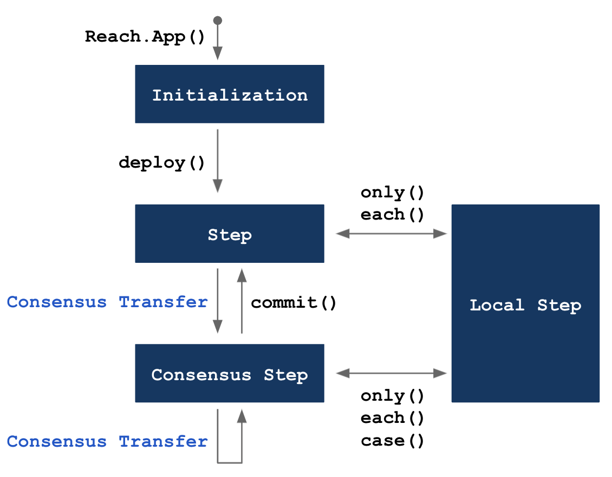

# Reach Modes

Reach programs are organized into four modes: 

1. [Initialization](#initialization) defines Participants, Views, and APIs, and, optionally, overrides default compilation settings.
1. [Step](#step) defines actions taken by all participants.
1. [Local Step](#local-step) defines actions taken by a particular participant.
1. [Consensus Step](#consensus-step) defines actions taken by the contract.

## Transitions

The following diagram indicates mode transitions:

<div></div>

## Consensus Transfers

A consensus transfer is a statement or expression that (a) facilitates agreement among participants, (b) transitions to a consensus step, and (3) records the agreement as a transaction on the distributed ledger (i.e. blockchain) of the consensus network. These actions include `publish`, `pay`, `race`, `fork`, and `parallelReduce`. The developer chooses which consensus transfer to use depending on the number of participants, tasks, and iterations:

|# Participants|# Tasks|# Iterations|Consensus Transfer|
|-|-|-|-|
|One|One|One|`publish` or `pay`|
|Many|One|One|`race`|
|Many|Many|One|`fork`|
|Many|Many|Many|`parallelReduce`|

The following list describes when to use each type of consensus transfer:

* Use `publish` to cause one participant to make a value (e.g. the price of an item) available to all other participants.
* Use `pay` to cause one participant to pay an amount to the contract account.
* Use `race` when multiple participants are racing to `publish` or `pay`.
* Use `fork` when multiple participants are racing to do different actions. 
* Use `parallelReduce` when muliple participants are iteratively racing or forking.

`commit` transitions from a consensus step to a step.

## Statements and Expressions

In addition to the statements and expressions found in [Reach Syntax](/en/books/essentials/backend-programming/reach-syntax/), each mode supports the additional statements and expressions described below.

# Initialization

The Reach compiler recognizes `export const main = Reach.App(() => {}` as a Reach DApp, and the body of `Reach.App` represents Application Initialization mode:

``` js
export const main = Reach.App(() => {
  setOptions({ verifyArithmetic: true, connectors: [ETH, ALGO ] });
  const S = Participant('Seller', sellerInteract);
  const B = Participant('Buyer', buyerInteract);
  const V = View('Main', { price: UInt });
  deploy();
```

* Line 1: `Reach.App` accepts a no-argument function that specifies a DApp.
* Line 2: Optionally, `setOptions` overrides default compile options.
* Line 3-4: `Participant` specifies DApp participants.
* Line 5: `View` specifies DApp views.
* Line 6: The `deploy` function transitions from Initialization mode to Step mode.

In addition to the statements and expressions described in [Computations](/en/books/essentials/backend-programming/computations/), Initialization mode supports the following statements/expressions:

## API

An `API` expression defines an API in the contract.

### Declaration

``` js nonum
API(name, interface)
// or 
API(interface)
```

* `name` is a string that labels the API.
* `interface` is an object comprised of methods available in frontends via the `ctc.apis` object. 
* The return value is an object whose fields are the `interface` methods. The object may be used in the `.api` component of `fork` and `parallelReduce` expressions. Each object method must occur exactly once in the entire program.

### Example

See [examples/api-full/index.rsh](https://github.com/reach-sh/reach-lang/blob/master/examples/api-full/index.rsh).

## deploy

The `deploy` statement defines Participants, Views, APIs, and compiler options, and transitions from Initialization mode to Step mode.

### Example

``` js nonum
deploy();
```

## Participant

A `Participant` expression defines a participant.

### Declaration

``` js nonum
Participant(name, interface)
```

* `name` is a string indicating the name of the participant function in the generated backend code. Each name must be unique.
* `interface` is an interact object comprised of property and method declarations defined in the corresponding frontend interact object.

### Example

``` js nonum
const sellerInteract = {
  price: UInt,
  wisdom: Bytes(128),
  reportReady: Fun([UInt], Null)
};

const S = Participant('Seller', sellerInteract);
```

## ParticipantClass

A `ParticipantClass` expression defines a type of participant.

### Declaration

``` js nonum
ParticipantClass(name, interface)
```

* `name` is a string which indicates the name of the participant class function in the generated backend code. Each name must be unique.
* `interface` is an interact object comprised of property and method declarations defined in the corresponding frontend interact object.

### Example

``` js nonum
const sponsorApi = {
  donation: UInt,
  reportDonation: Fun([Address, UInt, UInt, UInt, UInt], Null),
};

const S = ParticipantClass('Sponsor', sponsorApi);
```

## setOptions

The `setOptions` statement overrides default application parameters.

### Declaration

``` js nonum
setOptions(options)
```

`options` is an object containing zero or more of the following options:

|Option|Type|Default|
|-|-|-|
|`connectors`|`Array`|All available connectors|
|`verifyArithmetic`|`Boolean`|`false`|
|`verifyPerConnector`|`Boolean`|`false`|

`connectors` is an array of tuples indicating for which consensus networks the compiler will generate contract bytecode. 

`verifyArithmetic` is a boolean value indicating whether arithmetic operations introduce static assertions that they do not overflow beyond `UInt.max`. This defaults to false because it is onerous to verify. We recommend turning it on before final deployment, but leaving it off during development. When it is false, connectors will ensure that overflows do not actually occur on the network.

`verifyPerConnector` is a boolean value that determines whether verification is done per connector, or once for a generic connector. When this is true, then connector-specific constants, like UInt.max, will be instantiated to literal numbers. This concretization of these constants can induce performance degradation in the verifier.

### Example

``` js nonum
setOptions({ verifyArithmetic: true, connectors: [ETH, ALGO ] });
```

## View

A View expression defines a view object that allows non-participants to see public variables in the contract.

### Declaration

``` js nonum
View(name, viewInterface)
// or
View(viewInterface)
```

* `name` is a string that labels the view.
* `interface` is an object comprised of properties and methods available in frontends via the `ctc.views` object.
* The return value is an object referred to as a `view` object.

### Example

The program instantiates the view in Line 4 and initializes the `price` property in Line 10:

``` js
export const main = Reach.App(() => {
  const S = Participant('Seller', sellerInteract);
  const B = Participant('Buyer', buyerInteract);
  const V = View('Main', { price: UInt });
  deploy();

  S.only(() => { const price = declassify(interact.price); });
  S.publish(price);
  S.interact.reportReady(price);
  V.price.set(price);
  commit();
```

# Step

A *Step* consists of actions that apply to all participants. In addition to the statements and expressions described in [Computations](/en/books/essentials/backend-programming/computations/), Step mode supports the following statements/expressions:

## call

The `call` expression invokes the specified API function.

### Declaration

``` js nonum
const [ DOMAIN, RET_FUN ] = call(API_EXPR)
  .pay(API_PAY_EXPR)
  .assume(API_ASSUME_EXPR)
  .throwTimeout(DELAY_EXPR, THROW_EXPR)
```

* `API_EXPR` is an expression that evaluates to an API member function.
* `pay`, `assume`, and `throwTimeout` are optional. See [Fork](#fork).
* The return value is `[ DOMAIN, RET_FUN ]` where `DOMAIN` is specific to the function, and `RET_FUN` is a function that *must be called* to return a value to the API function.

### Example

``` js nonum
const A = API('A', { isGt: Fun([UInt, UInt], Bool); });
// ...
const [ dom, k ] = call(A.isGt).assume((x, y) => x != y).pay((x, y) => x);
const [x, y] = dom;
k(x > y);
commit();
```

## closeTo

The `closeTo` expression causes the specified participant to publish, receive a `transfer` of the contract balance and the [pay amount](/en/books/essentials/terminology/#pay-amount), and then exit. 

### Declaration

``` js nonum
closeTo( Who, after, nonNetPayAmt ) 
```

* `Who` is the participant.
* `after` is a no-argument function called before exit. It is optional.
* `nonNetPayAmt`. See [Pay Amount](/en/books/essentials/terminology/#pay-amount). It is optional.

### Example

``` js nonum
const aliceInteract = {
  informTimeout: Fun([], Null)
};

B.pay(wager).timeout(DEADLINE, () => closeTo(A, informTimeout));
```

## exit

The `exit` statement halts the computation. It is a terminator statement, so it must have an empty tail.

### Example

``` js nonum
exit();
```

## fork

A `fork` statement organizes a competition among several participants (each intent on accomplishing a potentially different task), determines which participant wins the competition, and executes the winner's task.

### Declaration

``` js nonum
fork()
  .paySpec(TOKENS_EXPR)
  .case(PART_EXPR,
    PUBLISH_EXPR,
    PAY_EXPR,
    CONSENSUS_EXPR)
  .api(API_EXPR,
    API_ASSUME_EXPR,
    API_PAY_EXPR,
    API_CONSENSUS_EXPR)
  .timeout(DELAY_EXPR, () => TIMEOUT_BLOCK);
  // or
  .throwTimeout(DELAY_EXPR, THROW_EXPR)
```

* `TOKENS_EXPR` is an expression that evaluates to a tuple of Tokens;
* `PART_EXPR` is an expression that evaluates to a participant;
* `PUBLISH_EXPR` is a syntactic arrow expression that is evaluated in a local step for the specified participant and must evaluate to an object that may contain a msg field, which may be of any type, and a when field, which must be a boolean;
* (optional) `PAY_EXPR` is an expression that evaluates to a function parameterized over the msg value and returns a [pay amount](/en/books/essentials/terminology/#pay-amount); if this component is left-out, it is synthesized to zero;
* `CONSENSUS_EXPR` is a syntactic arrow expression parameterized over the msg value which is evaluated in a consensus step;
* `API_EXPR` is an expression that evaluates to an API member function;
* (optional) `API_ASSUME_EXPR` is a function parameterized over the input to the API member function which is evaluated for effect in a local step; thus it may be used to add assume constraints on the values given by the API; if this is absent, then it is synthesized to an empty function; if it is present, then API_PAY_EXPR must be included;
* (optional) `API_PAY_EXPR` is a function parameterized over the input to the API member function which is evaluated to determine the [pay amount](/en/books/essentials/terminology/#pay-amount), like PAY_EXPR;
* `API_CONSENSUS_EXPR` is a function parameterized over the input to the API member function and a function that returns a value to the API call; this function must be called;
* the timeout and throwTimeout parameter are as in an consensus transfer.

### Example

``` js nonum
fork()
.case(Alice, (() => ({
  msg: 19,
  when: declassify(interact.keepGoing()) })),
  ((v) => v),
  (v) => {
    require(v == 19);
    transfer(wager + 19).to(this);
    commit();
    exit();
  })
.case(Bob, (() => ({
  when: declassify(interact.keepGoing()) })),
  ((_) => wager),
  (_) => {
    commit();

    Alice.only(() => interact.showOpponent(Bob));

    race(Alice, Bob).publish();
    transfer(2 * wager).to(this);
    commit();
    exit();
  })
.timeout(deadline, () => {
  race(Alice, Bob).publish();
  transfer(wager).to(this);
  commit();
  exit(); });
```

### Intuition

A fork statement is an abbreviation of a common race and switch pattern you could write yourself. The idea is that each of the participants in the case components do an independent local step evaluation of a value they would like to publish and then all race to publish their value. The one that "wins" the race then determines not only the value (& pay expression), but also what consensus step code runs to consume the value. The example above is roughly equivalent to the following:

``` js nonum
// We first define a Data instance so that each participant can publish a different kind of value.
const ForkData = Data({ Alice: UInt, Bob: Null });

// Then we bind these values for each participant
Alice.only(() => {
  const fork_msg = ForkData.Alice(19);
  const fork_when = declassify(interact.keepGoing());
});
Bob.only(() => {
  const fork_msg = ForkData.Bob(null);
  const fork_when = declassify(interact.keepGoing());
});

// They race
race(Alice, Bob)
  .publish(fork_msg)
  .when(fork_when)

  // The pay ammount depends on who is publishing
  .pay(fork_msg.match({
    Alice: (v => v),
    Bob: ((_) => wager)
  }))

  // The timeout is always the same
  .timeout(deadline, () => {
    race(Alice, Bob).publish();
    transfer(wager).to(this);
    commit();
    exit();
  });

// We ensure that the correct participant published the correct kind of value
require(fork_msg.match({

  // Alice had previously published
  Alice: (v => this == Alice),

  // But Bob had not.
  Bob: ((_) => true)
}));

// Then we select the appropriate body to run
switch (fork_msg) {
  case Alice: {
    assert(this == Alice);
    require(v == 19);
    transfer(wager + 19).to(this);
    commit();
    exit();
  }
  case Bob: {
    Bob.set(this);
    commit();

    Alice.only(() => interact.showOpponent(Bob));

    race(Alice, Bob).publish();
    transfer(2 * wager).to(this);
    commit();
    exit();
  }
}
```

This pattern is tedious to write and error-prone, so the fork statement abbreviates it for Reach programmers. When a participant specifies multiple cases, the msg field of the participant will be wrapped with an additional variant signifying what case was chosen.

## each and only

`each` and `only` statements transition from *step* mode to *local step* mode and then back to *step* mode. In other words, local steps occur within the body of `each` and `only` statements.

### Declaration

``` js nonum
each(PART_TUPLE () => BLOCK)
// and
PART.only(() => BLOCK)
```

* `PART_TUPLE` is a tuple of participants (e.g. `[Alice, Bob]`).
* `PART` is a participant.
* `BLOCK` stands for one or more local statements.

### Example

``` js nonum
Alice.only(() => { const x = 3; });
// and 
each([Alice, Bob], () => { const pretzel = interact.random(); });
```

### Details

A local step statement is written PART.only(() => BLOCK), where PART is a participant identifier and BLOCK is a block. Within BLOCK, PART is bound to the address of the participant. Any bindings defined within the block of a local step are available in the statement’s tail as new local state. For example,

``` js nonum
Alice.only(() => {
  const x = 3; });
Alice.only(() => {
  const y = x + 1; }); 
```

is a valid program where Alice’s local state includes the private values x (bound to 3) and y (bound to 4). However, such bindings are not consensus state, so they are purely local state. For example,

``` js nonum
Alice.only(() => {
  const x = 3; });
Bob.only(() => {
  const y = x + 1; }); 
```

is an invalid program, because Bob does not know x.

The interact shorthand, written PART.interact.METHOD(EXPR_0, ..., EXPR_n), is available for calling an interact function from outside of an only block. Such functions must return Null; therefore, they are only useful if they produce side-effects, such as logging on the frontend. For example, the function log in the participant interact interface of Alice may be called via:

``` js nonum
Alice.interact.log(x);
```

An each local step statement can be written as each(PART_TUPLE () => BLOCK), where PART_TUPLE is a tuple of participants and BLOCK is a block. It is an abbreviation of many local step statements that could have been written with only.

## publish, pay, when, timeout

A consensus transfer often involves one or more of the following expressions: `publish`, `pay`, `when`, and `timeout`. 

### Declaration

``` js nonum
PART_EXPR.publish(ID_0, ..., ID_n)
  .pay(PAY_EXPR)
  .when(WHEN_EXPR)
  .timeout(DELAY_EXPR, () => TIMEOUT_BLOCK)
  // or
  .throwTimeout(DELAY_EXPR, THROWN_EXPR)
```

* `PART_EXPR` is an expression that evaluates to a participant or race expression.
* `ID_0` through `ID_n` are identifiers for the participants’s public local state.
* `PAY_EXPR` is a public expression evaluating to a [pay amount](/en/books/essentials/terminology/#pay-amount).
* `WHEN_EXPR` is a public expression evaluating to a boolean and determines if the consensus transfer takes place. 
* `DELAY_EXPR` is a public expression that depends on only consensus state and evaluates to a time argument.
* `TIMEOUT_BLOCK` is a timeout block, which will be executed after the delay. 
* `DELAY_EXPR` time argument passes without the participant executing this consensus transfer.

### Examples

``` js nonum
Alice.publish(wagerAmount)
  .pay(wagerAmount)
  .timeout(DELAY, () => {
    Bob.publish();
    commit();
    return false; 
  }); 

Alice.publish(wagerAmount)
  .pay(wagerAmount)
  .timeout(DELAY, () => closeTo(Bob, false)); 

Alice.publish(wagerAmount)
  .pay(wagerAmount)
  .timeout(false);
```

### Details

All of the expressions within a consensus transfer are evaluated in a pure context, which may not alter the state of the application. The PAY_EXPR, WHEN_EXPR, and DELAY_EXPR expressions must refer only to the consensus state, including the new data published via the .publish component.

The continuation of a consensus transfer statement is a consensus step, which is finalized with a commit statement. The continuation of a timeout block is the same as the continuation of the function the timeout occurs within.

See the guide section on non-participation to understand when to use timeouts and how to use them most effectively.

The publish component exclusive-or the pay component may be omitted, if either there is no publication or no transfer of network tokens to accompany this consensus transfer. The when component may always be omitted, in which case it is assumed to be true. publish or pay must occur first, after which components may occur in any order. For example, the following are all valid:

``` js nonum
Alice.publish(coinFlip);

Alice.pay(penaltyAmount);

Alice.pay(penaltyAmount).publish(coinFlip);

Alice.publish(coinFlip)
  .timeout(DELAY, () => closeTo(Bob, () => exit()));

Alice.pay(penaltyAmount)
  .timeout(DELAY, () => {
    Bob.publish();
    commit();
    exit(); 
  });

Alice.publish(bid).when(wantsToBid);
```

The timeout component must be included if when is not statically true. This ensures that your clients will eventually complete the program. If a consensus transfer is a guaranteed race between non-class participants and a participant class that may attempt to transfer (i.e. when is not statically false), then a timeout may be explicitly omitted by writing .timeout(false).

.throwTimeout may be used in place of .timeout. It accepts a DELAY_EXPR and an EXPR, which will be thrown if a timeout should occur. If an EXPR is not provided, then null will be thrown. If a consensus transfer uses .throwTimeout, it must be within a try statement.

If a consensus transfer specifies a single participant, which has not yet been fixed in the application and is not a participant class, then this statement does so; therefore, after it the PART may be used as an address.

If a consensus transfer specificies a single participant class, then all members of that class will attempt to perform the transfer, but only one will succeed.

A consensus transfer binds the identifiers ID_0 through ID_n for all participants to the values included in the consensus transfer, overwriting any bindings that already exist for those identifiers. If an existing participant, not included in PART_EXPR, has previously bound one of these identifiers, then the program is not valid. In other words, the following program is not valid:

``` js nonum
Alice.only(() => {const x = 1; });
Bob.only(() => {const x = 2; });
Claire.only(() => {const x = 3; });
race(Alice, Bob).publish(x);
commit();
```

because Claire is not included in the race. However, if we were to rename Claire’s x into y, then it would be valid, because although Alice and Bob both bind x, they participate in the race, so it is allowed. In the tail of this program, x is bound to either 1 or 2, i.e., either Alice or Bob’s value is overwritten. This overwriting applies even if Alice wins and Alice is a participant class, i.e., the value of x in the tail is guaranteed to be the single value that was agreed upon in the consensus.

## race

A `race` expression organizes a competition among several participants (each intent on accomplishing the same task), determines which participant wins the competition, and executes task for the winner.

### Declaration

``` js nonum
race(PARTICIPANT_0, ..., PARTICIPANT_n)
```

### Example

``` js nonum
race(Alice, Bob).publish(bet);
```

## unknowable

The `unknowable` expression asserts that one participant does not know certain values while another participant does.

### Declaration

``` js nonum
unknowable( Notter, Knower(var_0, ..., var_N), [msg] )
```

* `Notter` is the participant that is asserted not to know.
* `Knower` is the participant that is asserted to know.
* `var_0, ..., var_N` are the values not known and known.
* `msg` is a byte array included in any reported violation.

### Example

``` js nonum
sss
```

## wait

A `wait` statement delays computation for a duration specified in terms of seconds or in terms of increments specific to the consensus network.

### Declaration

``` js nonum
wait(TIME)
```

* `Time` (See [Time Argument](/en/books/essentials/terminology/#time-argument).)

### Example

``` js nonum
sss
```

# Local Step

A *Local Step* occurs in the body of [each and only](#each-and-only) statements. It represents the actions taken by a single participant in an application. Inside a local step, `this` refers to the participant performing the step, useful when the local step was initiated by an `each` expression. In addition to the statements and expressions described in [Computations](/en/books/essentials/backend-programming/computations/), Local Step mode supports the following statements/expressions:

## assume

The `assume` expression asserts that a particular claim is true for honest frontends.

### Declaration

``` js nonum
assume( claim, [msg] )
```

* `claim` is an expression that evaluates to `true` or `false`.
* `msg` is a byte array included in any reported violation.

### Example

``` js nonum
sss
```

## declassify

A `declassify` expression changes a local-state value from private to public.

### Declaration

``` js nonum
declassify( arg )
```

`arg` is any private local-state value.

### Example

``` js nonum
sss
```

## didPublish

The `didPublish` expression returns a boolean indicating whether the last publication was made by this principal.

### Example

``` js nonum
didPublish();
```

## fail

The `fail` expression is equivalent to `assume(false)`.

## interact

The `interact` expression represents the interact object of the local participant.

### Declaration

``` js nonum
interact.METHOD(EXPR_0, ..., EXPR_n)
// or
interact.PROPERTY
```

* `METHOD` is an interact object method.
* `PROPERTY` is an interact object property.

### Example

``` js nonum
each([S, B], () => interact.reportCancellation());
// or
S.only(() => { const price = declassify(interact.price); });
```

## makeCommitment

The `makeCommitment` expression 

### Declaration

``` js nonum
sss
```

### Example

``` js nonum
sss
```

# Consensus Step

A *Consensus Step* occurs in the continuation of a consensus transfer statement. It represents the actions taken by the consensus network contract of an application. Inside of a consensus step, `this` refers to the address of the participant that performed the consensus transfer. This is useful when the consensus transfer was initiated by a race expression. In addition to the statements and expressions described in [Computations](/en/books/essentials/backend-programming/computations/), Consensus Step mode supports the following statements/expressions:

## checkCommitment

### Declaration

``` js nonum
sss
```

### Example

``` js nonum
sss
```

## commit

A `commit` statement ends the current consensus step and transitions to the next step allowing additional local steps.

### Example

``` js nonum
commit();
```

## continue

A `continue` statement 

### Declaration

``` js nonum
sss
```

### Example

``` js nonum
sss
```

## each and only (consensus)

[each and only](#each-and-only) are allowed in consensus steps and are executed by backends once they observe the completion of the consensus step (i.e., after the associated commit statement.)

## Map

A `Map` expression creates a specialized array. The length of the array is the number of participants in the contract. The keys are the participant addresses. All values are one specified type.

### Declaration

``` js nonum
new Map(TYPE_EXPR)
```

* `TYPE_EXPR` specifies the [Type](/en/books/essentials/backend-programming/computations/#types) for all values.

### Example

``` js nonum
const bidsM = new Map(UInt);
bidsM[this] = 17;
delete bidsM[this];
```

## parallelReduce

### Declaration

``` js nonum
sss
```

### Example

``` js nonum
sss
```

## remote

### Declaration

``` js nonum
sss
```

### Example

``` js nonum
sss
```

## require

### Declaration

``` js nonum
sss
```

### Example

``` js nonum
sss
```

## Set

A `Set` expression creates a specialized Array. The length of the array is the number of participants in the contract. The keys are the participant addresses. All values are boolean (initially set to `false`).

### Example

``` js nonum
const bidders = new Set();
bidders.insert(Alice);
bidders.remove(Alice);
bidders.member(Alice); // false
```

## .throughTimeout

### Declaration

``` js nonum
sss
```

### Example

``` js nonum
sss
```

## .timeRemaining

### Declaration

``` js nonum
sss
```

### Example

``` js nonum
sss
```

## Token

The `Token` expression mints a new non-network token. 

### Declaration

``` js nonum
new Token(PARAMS)
```

* `PARAMS` is an object with the keys in the table below.

    |Key|Type|Default|
    |-|-|-|
    |`name`|`Bytes(32)`|empty|
    |`symbol`|`Bytes(8)`|empty|
    |`url`|`Bytes(96)`|empty|
    |`metadata`|`Bytes(32)`|empty|
    |`supply`|`UInt`|`UInt.max`|
    |`decimals`|`UInt`|ALGO = 6; CFX and ETH = 18|

This returns a Token value and deposits a supply amount of the new non-network tokens into the contract account associated with the DApp. These tokens must be destroyed by the end of the DApp. A token has the following methods:

* `Token.burn(tok, amt)` or `tok.burn(amt)`, where tok is a Token value and amt is a UInt value, may be used to burn tokens in the contract account, meaning that they are utterly destroyed and can never be recovered.

* `Token.destroy(tok)` or `tok.destroy()`, where tok is a Token value, may be used to destroy the token so that it may never be used again by any users on the consensus network. This must be called before the application exits.

* `Token.destroyed(tok)` or `tok.destroyed()`, where tok is a Token value, returns whether destroy has been called on tok yet.

* `Token.supply(tok)` or `tok.supply()`, where tok is a Token value, may be used to query the current supply of tokens, i.e. the number of tokens which have not been burnt.

### Example

``` js nonum
require(supply >= 2 * amt);
const tok = new Token({ name, symbol, url, metadata, supply, decimals });
transfer(amt, tok).to(who);
tok.burn(amt);
assert(tok.supply() == supply - amt);
tok.burn();
assert(tok.destroyed() == false);
tok.destroy();
```

## transfer

A `transfer` expression transfers the specified number of tokens from the contract account to the specified participant account.

### Declaration

``` js nonum
transfer(AMOUNT_EXPR).to(ADDR_EXPR)
// or
transfer(AMOUNT_EXPR, TOKEN_EXPR).to(ADDR_EXPR)
```

* `AMOUNT_EXPR` is an unsigned integer specifying the number of tokens to transfer from the contract. This amount must evaluate to less than or equal to the balance of network tokens in the contract account.
* `ADDR_EXPR` is the target address for the transfer.
* `TOKEN_EXPR` is a Token type. This argument is optional.

### Example

``` js nonum
transfer(10).to(Alice);
```

## while

A `while` statement loops until the specified condition is `false`.

### Declaration

``` js nonum
var LHS = INIT_EXPR;
DEFINE_BLOCK; // optional
invariant(INVARIANT_EXPR);
while( COND_EXPR ) BLOCK
```

* `LHS` is a valid left-hand side of an identifier definition where the expression INIT_EXPR is the right-hand side.
* `DEFINE_BLOCK` is an optional block that may define bindings that use the LHS values which are bound inside the rest of the while and its tail.
* `INVARIANT_EXPR` is an expression, called the loop invariant, that must be true before and after every execution of the block BLOCK
* `COND_EXPR` is the condition. While it is true the block executes. When it is false the loop terminates and control transfers to the continuation of the while statement. The identifiers bound by `LHS` are bound within `DEFINE_BLOCK`, `INVARIANT_EXPR`, `COND_EXPR`, `BLOCK`, and the tail of the while statement.

### Example

``` js nonum
var [ heap1, heap2 ] = [ 21, 21 ];
{ const sum = () => heap1 + heap2; }
invariant(balance() == 2 * wagerAmount);
while ( sum() > 0 ) {
  ....
  [ heap1, heap2 ] = [ heap1 - 1, heap2 ];
  continue; }
```