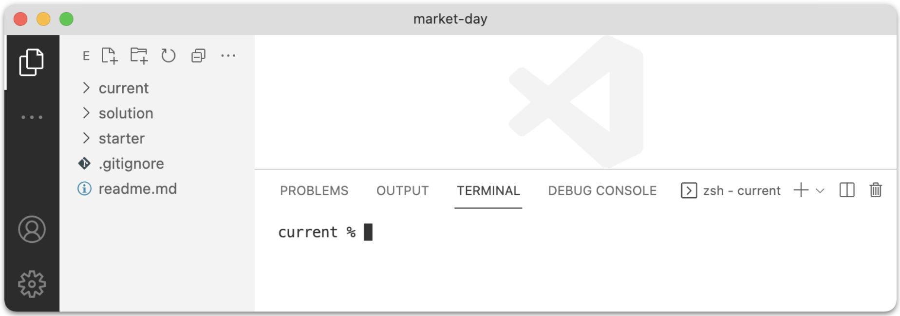
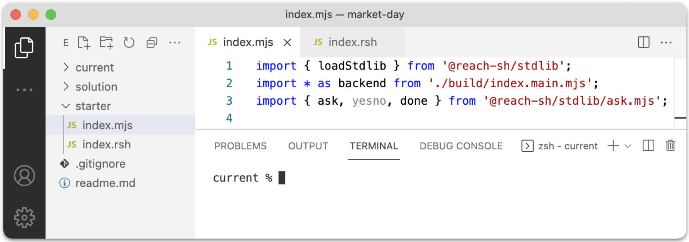
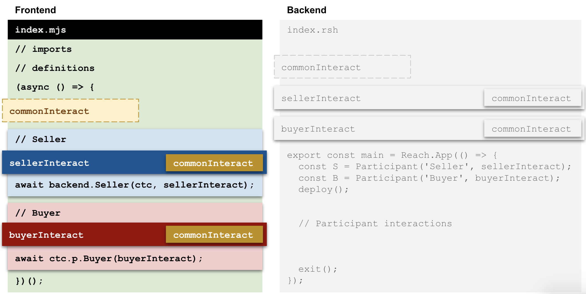
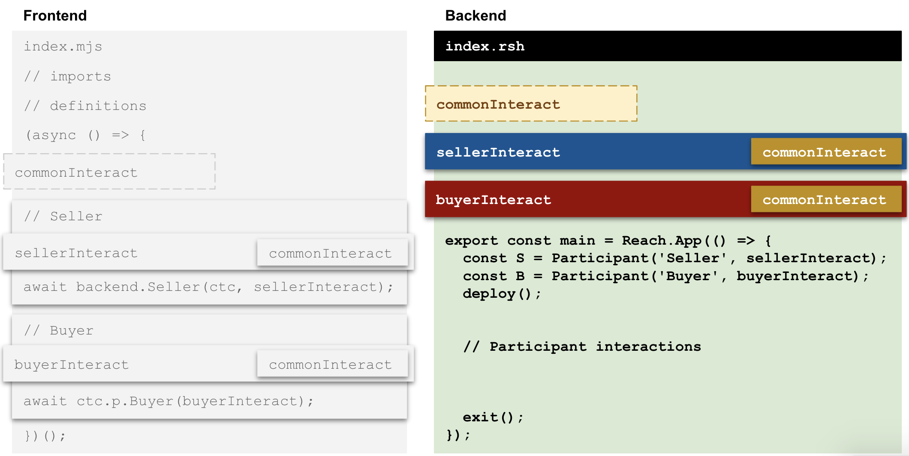
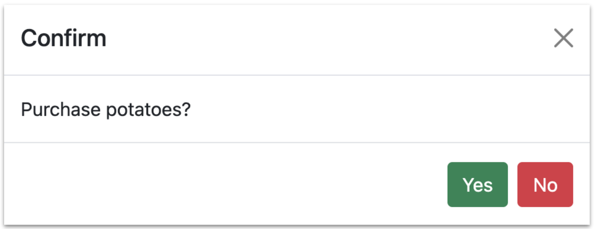
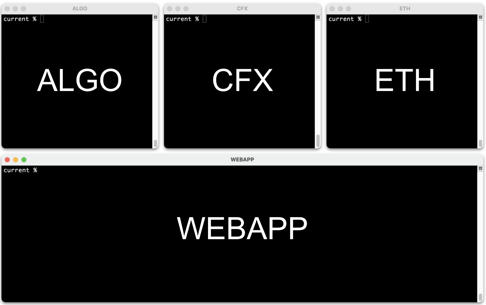

# Market Day

This tutorial builds upon [Wisdom for Sale](/en/books/essentials/tutorials/wisdom-for-sale/) by demonstrating how to use a variety of data types (string, integer, boolean, object, and array) in interact objects. You should complete [Wisdom for Sale](/en/books/essentials/tutorials/wisdom-for-sale/) before continuing.

The tutorial shows you how to build [Market Day](https://github.com/hagenhaus/market-day), a command-line and web-based application that enables two participants, a seller and a buyer, to trade vegetables for tokens via a smart contract running on a private Algorand, Ethereum, or Conflux consensus network residing in a Docker container on your computer. Your DApp creates and funds two accounts (one for each participant), enables the seller and buyer to make a transaction, and exits. 

The contract in this tutorial supports a single transaction between a seller and a buyer. Other tutorials present contracts that support transactions between a seller and multiple buyers.

# Learning Objectives

The following learning objectives describe what you will be able to do as a result of completing this tutorial.

1. Visualize Reach command-line DApp design
1. Implement strings, integers, booleans, objects, and arrays in interact object.

# Examine the transaction

The following diagram represents a market-day transaction:

<div></div>

The contract automatically supplies a product list to the buyer who chooses a product type, chooses a quantity, and confirms the purchase. Once the buyer completes or cancels the purchase, the contract exits. 

# Clone and run

This section shows you how to clone the tutorial repository.

1. Clone the [market-day](https://github.com/hagenhaus/market-day) repository:

    ``` nonum
    $ cd ~/reach
    $ git clone https://github.com/hagenhaus/market-day.git
    ```

1. Open the repository in vscode, and change directory to *current*.

    <p></p>

1. Copy *index.mjs* and *index.rsh* from the *starter* folder to the *current* folder.

    <p></p>

1. Open two terminals (i.e. shells):

    <p></p>

1. Change directory in both terminals:

    ``` nonum
    $ ~/reach/market-day/current
    ```

1. Run the following command in both terminals:

    ``` nonum
    $ export REACH_CONNECTOR_MODE=ALGO-devnet
    ```

1. In the Seller Terminal, run your DApp as the seller:

    ``` nonum
    $ reach run index seller
    ```

1. In the Buyer Terminal, run your DApp as the buyer:

    ``` nonum
    $ reach run index buyer
    ```

1. When prompted, copy & paste the contract info from the Seller Terminal to the Buyer Terminal. Final output should resemble the following:

    <div class="row gx-3">
    <div class="col-12 col-lg-auto">

    ``` nonum
    Your role is seller.
    The consensus network is ALGO.
    Your balance is 1000 ALGO.
    Contract info: 259
    Exiting contract.
    Your balance is 999.997 ALGO.
    ```

    </div>
    <div class="col-12 col-lg-auto">

    ``` nonum
    Your role is buyer.
    The consensus network is ALGO.
    Paste contract info:
    259
    Your balance is 1000 ALGO.
    Exiting contract.
    Your balance is 999.998 ALGO.
    ```

    </div>
    </div>

1. Repeat Steps 6-9 for *CFX-devnet* and *ETH-devnet*.

# Examine DApp design

The starter files for this tutorial may seem, at first glance, more complex than the starter files for the Wisdom for Sale tutorial. But, upon closer inspection, you will notice that they consist of boilerplate code useful for starting any Reach command-line DApp. Together, a Reach DApp frontend (index.mjs) and backend (index.rsh) reflect, roughly, the organization illustrated in the diagram below:

<div></div>

Note the following:

* There is a one-to-one correspondence between the frontend and backend interact objects.
* This correspondence includes most interact properties and methods. 
* The seller calls `backend.Seller` to pass the interact object to the backend.
* The buyer calls `contract.participant.Buyer` to do the same.
* The seller and buyer sections often include methods that return promises, so async/await is needed.

## Review frontend starter

This section helps you map the frontend portion of the diagram to the code in *index.mjs*. 

<div></div>

This table maps the diagram to the code below:

|Diagram|Code|
|-|-|
|imports|Lines 1-3|
|definitions|Lines 9-19|
|commonInteract|Lines 23-25|
|seller and sellerInteract|Lines 28-39|
|buyer and buyerInteract|Lines 42-53|

### index.mjs

``` js
load: https://raw.githubusercontent.com/hagenhaus/market-day/master/starter/index.mjs
```

## Review backend starter

This section helps you map the backend portion of the diagram to the code in *index.rsh*. 

<div></div>

This table maps the diagram to the code below:

|Diagram|Code|
|-|-|
|commonInteract|Lines 3-5|
|sellerInteract|Lines 7-10|
|buyerInteract|Lines 12-14|
|Participant definitions|Lines 16-18|
|Init mode to Step mode transition|Line 17|
|Participant interactions|Lines 21-28|

### index.rsh

``` js
load: https://raw.githubusercontent.com/hagenhaus/market-day/master/starter/index.rsh
```

# Add products to contract (seller)

This section shows you how to do the following:

1. Implement seller code that adds a product list to the contract.
1. Implement contract code that passes the product list to the buyer.
1. Implement buyer code that displays the list.

The seller offers potatoes at 200 **standard units** per bag, carrots at 100 su per bunch, and corn at 50 su per ear:

<div></div>

The `products` object reflects this information:

``` js nonum
const products = [
  { name: 'Potatoes', unit: 'bag', units: 'bags', price: toAU(200) },
  { name: 'Carrots', unit: 'bunch', units: 'bunches', price: toAU(100) },
  { name: 'Corn', unit: 'ear', units: 'ears', price: toAU(50) }
];
```

The seller also provides an announcement:

``` js nonum
const announcement = 'List of products for sale:';
```

We can bundle `announcement` and `products` into a `sellerInfo` object:

``` js nonum
const sellerInfo = {
  announcement: 'List of products for sale:',
  products: [
    { name: 'Potatoes', unit: 'bag', units: 'bags', price: toAU(200) },
    { name: 'Carrots', unit: 'bunch', units: 'bunches', price: toAU(100) },
    { name: 'Corn', unit: 'ear', units: 'ears', price: toAU(50) }
  ]
};
```

The following are directions to add code that passes `sellerInfo` from seller to buyer via the contract:

1. In *index.mjs*, add a `sellerInfo` property to `sellerInteract`:

    ``` js nonum
    sellerInfo: {
      announcement: 'List of products for sale:',
      products: [
        { name: 'Potatoes', unit: 'bag', units: 'bags', price: toAU(200) },
        { name: 'Carrots', unit: 'bunch', units: 'bunches', price: toAU(100) },
        { name: 'Corn', unit: 'ear', units: 'ears', price: toAU(50) }
      ]
    }
    ```

1. In *index.mjs*, add a `shop` method to `buyerInteract`:

    ``` js nonum
    shop: async (sellerInfo) => {
      console.log(sellerInfo.announcement);
      sellerInfo.products.forEach((p, i) => {
        console.log(`${i + 1}. ${p.name} at ${toSU(p.price)} ${suStr} per unit (${p.unit}).`);
      });
      const order = { prodNum: 0, prodAmt: 0 };
      return order;
    }
    ```

    The `shop` method accepts a `sellerInfo` object and returns an `order` object.

1. In *index.rsh*, add the following constants to the top of the file:

    ``` js nonum
    const announcement = Bytes(28);
    const product = Object({ name: Bytes(10), unit: Bytes(6), units: Bytes(8), price: UInt })
    const products = Array(product, 3);
    ```

1. In *index.rsh*, add a `sellerInfo` property to `sellerInteract`:

    ``` js nonum
    sellerInfo: Object({ announcement: announcement, products: products }),
    ```

1. In *index.rsh*, add a `shop` method to `buyerInteract`:

    ``` js nonum
    shop: Fun(
      [Object({ announcement: announcement, products: products })],
      Object({ prodNum: UInt, prodAmt: UInt })
    )
    ```

    This `shop` method also accepts a `sellerInfo` object and returns an `order` object.

1. In *index.rsh*, find the following:

    ``` js nonum
    S.publish();
    ```

1. Replace it with the following:

    ``` js nonum
    S.only(() => { const sellerInfo = declassify(interact.sellerInfo); });
    S.publish(sellerInfo);
    ```

1. In *index.rsh*, find the following:

    ``` js nonum
    B.publish();
    ```

1. Replace it with the following:

    ``` js nonum
    B.only(() => { const order = declassify(interact.shop(sellerInfo)); });
    B.publish(order);
    ```

1. Run your DApp in the seller and buyer terminals. Output should resemble the following:

    <div class="row gx-3">
    <div class="col-12 col-lg-auto">

    ``` nonum
    Your role is seller.
    The consensus network is ALGO.
    Your balance is 1000 ALGO.
    Contract info: 105
    Exiting contract.
    Your balance is 999.997 ALGO.
    ```

    </div>
    <div class="col-12 col-lg-auto">

    ``` nonum
    Your role is buyer.
    The consensus network is ALGO.
    Paste contract info:
    105
    Your balance is 1000 ALGO.
    List of products for sale:
    1. Potatoes at 200 ALGO per unit (bag).
    2. Carrots at 100 ALGO per unit (bunch).
    3. Corn at 50 ALGO per unit (ear).
    Exiting contract.
    Your balance is 999.998 ALGO.
    ```

    </div>
    </div>

# Shop for products (buyer)

This section enables the frontend to take the buyer's order (or cancellation), and pass it via the backend to the contract.

1. In *index.mjs*, find the `shop` method in `buyerInteract`.

1. Add Lines 7-14 which query the buyer about the product and amount:

    ``` js 
    shop: async (sellerInfo) => {
      console.log(sellerInfo.announcement);
      sellerInfo.products.forEach((p, i) => {
        console.log(`${i + 1}. ${p.name} at ${toSU(p.price)} ${suStr} per unit (${p.unit}).`);
      });
      const order = { prodNum: 0, prodAmt: 0 };
      const prodNum = await ask(`Enter 1-${sellerInfo.products.length}, or 0 to exit:`, (x => x));
      if (1 <= prodNum && prodNum <= sellerInfo.products.length) {
        order.prodNum = prodNum;
        order.prodAmt = await ask(`Enter number of units, or 0 to exit:`, (x => x));
        const p = sellerInfo.products[order.prodNum - 1];
        const unitWord = order.prodAmt == 1 ? p.unit : p.units;
        console.log(`You are ordering ${order.prodAmt} ${unitWord} of ${p.name} at ${toSU(p.price)} ${suStr} per ${p.unit}.`);
      }
      return order;
    }
    ```

    An order with `prodNum == 0` or `prodAmt == 0` means a cancelled order.

1. In *index.mjs*, add `reportCancellation` to `commonInteract`:

    ``` js nonum
    reportCancellation: () => { console.log(`${role == 'buyer' ? 'You' : 'The buyer'} cancelled the order.`); }
    ```

1. In *index.rsh*, add `reportCancellation` to `commonInteract`:

    ``` js nonum
    reportCancellation: Fun([], Null)
    ```

1. In *index.rsh*, replace the last `commit()` with the following:

    ``` js nonum
    if (order.prodNum == 0 || order.prodNum > sellerInfo.products.length || order.prodAmt == 0) {
      commit();
      each([S, B], () => interact.reportCancellation());
      each([S, B], () => interact.reportExit());
      exit();
    } else {
      commit();
    }
    ```

1. Run your DApp in the seller and buyer terminals several times. As the buyer, when you specify an order, buyer output should include an order summary:

    ``` nonum
    You are ordering 2 bunches of Carrots at 100 ALGO per bunch.
    Exiting contract.
    Your balance is 999.998 ALGO.
    ```

    When you cancel an order (by setting `prodNum` or `prodAmt` to 0) output should indicate the cancellation:

    ``` nonum
    You cancelled the order.
    Exiting contract.
    Your balance is 999.998 ALGO.
    ```

# Complete a transaction

This section shows you how to do the following:

1. Implement contract code to calculate the total price of the transaction.
1. Implement contract and frontend code to verify the transaction with the buyer.
1. Implement contract code to complete the transaction.

Here are the steps:

1. In *index.mjs*, add a `confirmPurchase` method to `buyerInteract`:

    ``` js nonum
    confirmPurchase: async (total) => await ask(`Do you want to complete the purchase for ${toSU(total)} ${suStr}?`, yesno)
    ```

1. In *index.rsh*, add a `confirmPurchase` method to `buyerInteract`:

    ``` js nonum
    confirmPurchase: Fun([UInt], Bool)
    ```

1. In *index.rsh*, add the following:

    ``` js nonum
    S.only(() => { const total = sellerInfo.products[order.prodNum - 1].price * order.prodAmt; });
    S.publish(total);
    commit();

    B.only(() => { const willBuy = declassify(interact.confirmPurchase(total)); });
    B.publish(willBuy);

    if (!willBuy) {
      commit();
      each([S, B], () => interact.reportCancellation());
      each([S, B], () => interact.reportExit());
      exit();
    } else {
      commit();
    }

    B.pay(total);
    transfer(total).to(S);
    commit();
    ```

    Note that the contract (not the frontend) must calculate the total price to ensure transparency. Also note that the simple calculation shown here does not check whether `prodAmt` is less than available inventory, nor does it check whether `prodAmt * price` is less than the buyer's account balance. A production-ready calculation would include both checks.

1. Run the DApp in the seller and buyer terminals, and purchase a reasonable amount of a product:

    <div class="row gx-3">
    <div class="col-12 col-lg-auto">

    ``` nonum
    Your role is seller.
    The consensus network is ALGO.
    Your balance is 1000 ALGO.
    Contract info: 161
    Exiting contract.
    Your balance is 1199.996 ALGO.
    ```

    </div>
    <div class="col-12 col-lg-auto">

    ``` nonum
    Your role is buyer.
    The consensus network is ALGO.
    Paste contract info:
    161
    Your balance is 1000 ALGO.
    List of products for sale:
    1. Potatoes at 200 ALGO per unit (bag).
    2. Carrots at 100 ALGO per unit (bunch).
    3. Corn at 50 ALGO per unit (ear).
    Enter 1-3, or 0 to exit:
    2
    Enter number of units, or 0 to exit:
    2
    You are ordering 2 bunches of Carrots at 100 ALGO per bunch.
    Do you want to complete the purchase for 200 ALGO?
    y
    Exiting contract.
    Your balance is 799.994 ALGO.
    ```

    </div>
    </div>

    Although the transaction completes successfully, the DApp does not provide enough information about the transaction to either participant. The following steps implement additional notifications.

1. In *index.mjs*, add the following methods to `commonInteract`:

    ``` js nonum
    reportPayment: (payment) => console.log(`${role == 'buyer' ? 'You' : 'The buyer'} paid ${toSU(payment)} ${suStr} to the contract.`),
    reportTransfer: (payment) => console.log(`The contract paid ${toSU(payment)} ${suStr} to ${role == 'seller' ? 'you' : 'the seller'}.`),
    reportFulfillment: (p, amt) => { 
      const subjectVerb = role == 'seller' ? 'You owe' : 'The seller owes';
      const directObject = role == 'buyer' ? 'you' : 'the buyer';
      console.log(`${subjectVerb} ${directObject} ${amt} ${amt == 1 ? p.unit : p.units} of ${p.name}.`); 
    }
    ```

1. In *index.rsh*, add the same methods to `commonInteract`:

    ``` js nonum
    reportPayment: Fun([UInt], Null),
    reportTransfer: Fun([UInt], Null),
    reportFulfillment: Fun([product, UInt], Null),
    ```

1. In *index.rsh*, add Lines 2, 4, and 5 to call these methods:

    ``` js
    B.pay(total);
    each([S, B], () => interact.reportPayment(total));
    transfer(total).to(S);
    each([S, B], () => interact.reportTransfer(total));
    each([S, B], () => interact.reportFulfillment(sellerInfo.products[order.prodNum - 1], order.prodAmt));
    commit();
    ```

1. Run the DApp. The output should include lines similar to the following:

    <div class="row gx-3">
    <div class="col-12 col-lg-auto">

    ``` nonum
    Your role is seller.
    ...
    The buyer paid 250 ALGO to the contract.
    The contract paid 250 ALGO to you.
    You owe the buyer 5 ears of Corn.
    ```

    </div>
    <div class="col-12 col-lg-auto">

    ``` nonum
    Your role is buyer.
    ...
    You paid 250 ALGO to the contract.
    The contract paid 250 ALGO to the seller.
    The seller owes you 5 ears of Corn.
    ```

    </div>
    </div>

# View the contract

This section shows you how to have the buyer (before attaching) peek into the deployed contract to view the `sellerInfo` (including the array of `products`), and explains why viewing contract data before attaching is sometimes advantageous.

Below is the *index.mjs* version of `confirmPurchase` from the `buyerInteract` object:

``` js nonum
confirmPurchase: async (total) => await ask(`Do you want to complete the purchase for ${toSU(total)} ${suStr}?`, yesno)
```

The backend calls the function (passing `total`), and the frontend displays `total` to the buyer, asks for a decision, waits for the answer, and returns `true` or `false` to the backend. Effective for a command-line app, this approach doesn't work as well for a webapp which might use a modal in place of `ask-yesno`:

<div></div>

Using Bootstrap as a example, here is how to display a modal:

``` js nonum
const modal = new bootstrap.Modal(document.getElementById('confirm-modal'), {})
modal.show();
```

Note that `modal.show()` does not display the modal and wait for an answer. Rather, it returns immediately to the caller (before the modal appears), and, to get the answer, the application listens (asynchronously) for *Yes* and *No* button events. So, the application cannot call `modal.show()` from within `confirmPurchase`, wait for an answer, and return `true` or `false` to the backend.

Instead, a webapp can do the following prior to attaching to the contract:

1. Get and display the product list to the buyer.
1. Get confirmation from the buyer.

Once confirmed, the webapp can attach to the contract and complete the transaction (skipping the existing `confirmPurchase` by, for now, always returning `true`). The following directions show you how to obtain `sellerInfo` from the contract before attaching:

1. In *index.rsh*, add Lines 4 and 10:

    ``` js
    export const main = Reach.App(() => {
      const S = Participant('Seller', sellerInteract);
      const B = Participant('Buyer', buyerInteract);
      const V = View('Main', { sellerInfo: Object({ announcement: announcement, products: products }) });
      deploy();

      S.only(() => { const sellerInfo = declassify(interact.sellerInfo); });
      S.publish(sellerInfo);
      S.interact.reportReady();
      V.sellerInfo.set(sellerInfo);
      commit();
    ```

1. In *index.mjs*, add Lines 4-9 (in the Buyer section):

    ``` js
    const acc = await stdlib.newTestAccount(iBalance);
    const info = await ask('Paste contract info:', (s) => JSON.parse(s));
    const ctc = acc.contract(backend, info);
    console.log('BEGIN VIEW SECTION');
    const sellerInfo = await ctc.views.Main.sellerInfo();
    sellerInfo[1].products.forEach((p, i) => {
      console.log(`${i + 1}. ${p.name} at ${toSU(p.price)} ${suStr} per unit (${p.unit}).`);
    });
    console.log('END VIEW SECTION');
    await showBalance(acc);
    await ctc.p.Buyer(buyerInteract);
    await showBalance(acc);
    ``` 

1. Run your DApp as the seller and the buyer. Buyer output should resemble the following:

    ```
    Your role is buyer.
    The consensus network is ALGO.
    Paste contract info:
    15
    BEGIN VIEW SECTION
    1. Potatoes at 200 ALGO per unit (bag).
    2. Carrots at 100 ALGO per unit (bunch).
    3. Corn at 50 ALGO per unit (ear).
    END VIEW SECTION
    Your balance is 1000 ALGO.
    List of products for sale:
    1. Potatoes at 200 ALGO per unit (bag).
    2. Carrots at 100 ALGO per unit (bunch).
    3. Corn at 50 ALGO per unit (ear).
    Enter 1-3, or 0 to exit:
    2
    Enter number of units, or 0 to exit:
    2
    You are ordering 2 bunches of Carrots at 100 ALGO per bunch.
    Do you want to complete the purchase for 200 ALGO?
    y
    You paid 200 ALGO to the contract.
    The contract paid 200 ALGO to the seller.
    The seller owes you 2 bunches of Carrots.
    Exiting contract.
    Your balance is 799.994 ALGO.
    ```

    Lines 5-9 in the output demonstrate that the buyer can view `sellerInfo` before attaching to the contract.

1. In *index.mjs*, comment out the *VIEW SECTION* code that you added above. You don't need this code in the command-line implementation of your DApp, but you will see the equivalent of this code when you examine the webapp implementation below. Specifically, in [webapp.mjs](https://github.com/hagenhaus/market-day/blob/master/solution/webapp.mjs), see the `view-btn` event listener.

# Examine the webapp

The [market-day](https://github.com/hagenhaus/market-day) repository includes a [Bootstrap](https://getbootstrap.com/docs/5.1/getting-started/introduction/)-based webapp implementation that you can inspect and modify:

<p class="ratio ratio-16x9 my-4" style="max-width:500px;">
  <iframe 
    src="https://www.youtube.com/embed/lZnzqOiYarY" 
    frameborder="0"  
    allowfullscreen>
  </iframe>
</p>

You need node.js and npm installed on your computer because you will need the [http-server](https://www.npmjs.com/package/http-server) package (or similar) to run the webapp. Below are directions for running and inspecting the DApp:

1. Copy [index.html](https://github.com/hagenhaus/market-day/blob/master/solution/index.html) and [webapp.mjs](https://github.com/hagenhaus/market-day/blob/master/solution/webapp.mjs) from the solution directory to your current directory.

1. Stop and remove all your Reach containers:

    ``` nonum
    $ reach down
    ```

1. Open four terminals (i.e. shells):

    <p></p>

1. Change directory in each terminal:

    ``` nonum
    $ ~/reach/market-day/current
    ```

1. In the ALGO Terminal, run the following:

    ``` nonum
    $ export REACH_CONNECTOR_MODE=ALGO-devnet
    $ reach devnet
    ```

1. In the CFX Terminal, run the following:

    ``` nonum
    $ export REACH_CONNECTOR_MODE=CFX-devnet
    $ reach devnet
    ```

1. In the ETH Terminal, run the following:

    ``` nonum
    $ export REACH_CONNECTOR_MODE=ETH-devnet
    $ reach devnet
    ```

1. In the Webapp Terminal, run the following:

    ``` nonum
    $ npm i --global http-server # Install the package globally if you haven't already.
    $ http-server -c-1 -p 8080   # Run the webapp.
    ```

    Output should look similar to the following:

    ``` nonum
    Starting up http-server, serving ./

    http-server settings: 
    CORS: disabled
    Cache: -1 seconds
    Connection Timeout: 120 seconds
    Directory Listings: visible
    AutoIndex: visible
    Serve GZIP Files: false
    Serve Brotli Files: false
    Default File Extension: none

    Available on:
      http://127.0.0.1:8080
      http://192.168.1.4:8080
    Hit CTRL-C to stop the server
    ```

1. Browse to one of the urls listed above. `http://localhost:8080` should probably work, too.

1. Click *Choose a DevNet*, and select *Algorand*. The Deploy button should turn green.

1. Click *Deploy*. The *View* button should turn green. 

1. Click *View*. The *Attach* button should turn green. Choose a product and quantity.

1. Click *Attach*, and then click *Yes*. The *Reset* button should turn green.

1. Click *Reset*, and try it again with a different `Price` and `Wisdom` string.

Note that the webapp doesn't run reliably on Conflux or Ethereum yet.

# Self assessment

Click on the question to view the answer.

1. <p class="q-and-a" data-bs-toggle="collapse" href="#one-to-one" aria-expanded="false">Is there is a one-to-one correspondence between frontend and backend interact objects?</p>

    <div class="collapse mb-3" id="one-to-one">
      <div class="card card-body">Yes. Generally, participant frontend and backend interact objects mirror each other to enable communication between frontends and backends.</div>
    </div>

1. <p class="q-and-a" data-bs-toggle="collapse" href="#async-await" aria-expanded="false">Why do Reach JS Stdlib method invocations often appear within an async scope?</p>

    <div class="collapse mb-3" id="async-await">
      <div class="card card-body">Many Stdlib methods are asynchronous. Examples include balanceOf and newTestAccount. An synchronous method returns a promise immediately and the promised value eventually. JavaScipt code uses the await keyword to wait for promised values, and the await keyword must appear within an async scope.</div>
    </div>

1. <p class="q-and-a" data-bs-toggle="collapse" href="#common-interact" aria-expanded="false">What is the best practice for including the same properties and/or methods in two different interact objects?</p>

    <div class="collapse mb-3" id="common-interact">
      <div class="card card-body">Put the common properties and methods in their own interact object (e.g. commonInteract) and use the JavaScript spread operator (i.e. ...commonInteract) inside the interact objects where you want to include the common items.</div>
    </div>

1. <p class="q-and-a" data-bs-toggle="collapse" href="#pay-transfer" aria-expanded="false">In Reach smart contracts, does a participant pay another participant directly?</p>

    <div class="collapse mb-3" id="pay-transfer">
      <div class="card card-body">No. A participant pays the contract, and the contract transfers funds to another participant.</div>
    </div>

1. <p class="q-and-a" data-bs-toggle="collapse" href="#view" aria-expanded="false">Is it possible to peak at data inside a smart contract without attaching to the contract?</p>

    <div class="collapse mb-3" id="view">
      <div class="card card-body">Yes. Reach views enable participants to view declassified smart-contract data with attaching to the contract.</div>
    </div>

1. <p class="q-and-a" data-bs-toggle="collapse" href="#modes" aria-expanded="false">Name the four Reach modes.</p>

    <div class="collapse mb-3" id="modes">
      <div class="card card-body">Init, Step, Local Step, and Consensus Step.</div>
    </div>

1. <p class="q-and-a" data-bs-toggle="collapse" href="#consensus-step" aria-expanded="false">A consensus step specifies actions taken by ____.</p>

    <div class="collapse mb-3" id="consensus-step">
      <div class="card card-body">The contract.</div>
    </div>

1. <p class="q-and-a" data-bs-toggle="collapse" href="#deploy" aria-expanded="false">What is the name of the Reach function that causes a transition from Init mode to Step mode?</p>

    <div class="collapse mb-3" id="deploy">
      <div class="card card-body">deploy.</div>
    </div>

1. <p class="q-and-a" data-bs-toggle="collapse" href="#fun" aria-expanded="false">Explain the parts of a Reach function definition.</p>

    <div class="collapse mb-3" id="fun">
      <div class="card card-body">Consider Fun([UInt], Bool). Fun means function definition. [] indicates the argument array. This function has one argument. The argument is an unsigned integer. Bool indicates that this function returns a boolean.</div>
    </div>

1. <p class="q-and-a" data-bs-toggle="collapse" href="#webapp-stdlib" aria-expanded="false">How does a webapp access the Reach JS Stdlib?</p>

    <div class="collapse mb-3" id="webapp-stdlib">
      <div class="card card-body">The Reach JS Stdlib is available on a CDN: (e.g. https://cdn.jsdelivr.net/npm/@reach-sh/stdlib@latest/dist/browser/reachsdk.min.js).</div>
    </div>

