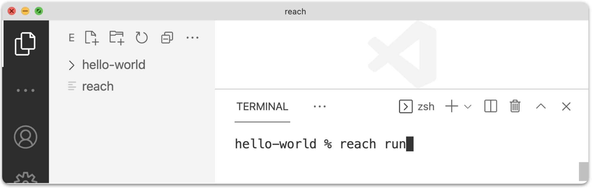

# Set up an IDE

This tutorial shows you how to set up a Reach development environment for Mac, Linux, or Windows PC. You can develop Reach applications using any project directory structure and IDE. This page describes the project directory structure and IDE used in the examples throughout the site. Be sure to complete [Quick Start](/en/books/essentials/quick-start/) first.

# Organize your projects

The examples throughout this site use the following project directory structure:

```
~/reach                      # Root directory.
~/reach/reach                # Reach script file.
~/reach/hello-world          # Project directory. See Quick Start.
~/reach/wisdom-for-sale      # Project directory. See Tutorials.
~/reach/market-day           # Project directory. See Tutorials.
~/reach/rock-paper-scissors  # Project directory. See Tutorials.
~/reach/my-project-01        # Project directory. Your project. Rename.
~/reach/my-project-02        # Project directory. Your project. Rename.
~/reach/...
```

# Add reach to path

If you add `~/reach` to your `PATH` environment variable, you can use `reach <command>` to run the [reach](https://github.com/reach-sh/reach-lang/blob/master/reach) script from any current working directory. Otherwise, use `~/reach/reach <command>` to do the same.

To add `~/reach` to `PATH` for the current terminal, use this:

``` nonum
$ export PATH=~/reach:$PATH
```

To do so for any terminal you open, add the following to your startup file (e.g. *.bashrc*, *.zshrc*, etc.):

``` nonum
PATH=~/reach:$PATH
```

To apply this change to your current terminal, rerun your startup file (e.g. close/open terminal or use [source](https://en.wikipedia.org/wiki/Dot_(command))). 

Many instructions on this site assume that you have added `~/reach` to `PATH`.

# Install VSCode

1. Install [Visual Studio Code](https://code.visualstudio.com/).

1. Add the following file association to vscode preferences:

    ``` nonum
    "files.associations": {
      "*.rsh": "javascript"
    }
    ```
    
1. Open `~/reach`:

    <p></p>

1. Change directory to `~/reach/hello-world`:

    <p></p>

1. Execute `reach run` to verify that your devenv is working:

    <p></p>

    Expect to see the following Hello World output:

    ```
    ...
    Hello, Alice and Bob!
    Launching...
    Starting backends...
    Goodbye, Alice and Bob!
    ```

# Maintain Reach environment

From time to time, you will need to do the following:

* Upgrade your `~/reach/reach` script:

    ``` nonum
    $ cd ~/reach
    $ reach upgrade
    ```

* Stop and remove your Reach Docker containers.

    ``` nonum
    $ reach down
    ```

* Update your Reach Docker images.

    ``` nonum
    $ reach update
    ```

# Maintain Docker Environment

## reach-devnet is ambiguous

The following command may emit this error:

``` nonum
$ reach devnet
ERROR: 2 matches found based on name: network reach-devnet is ambiguous
```

This error indicates that your Docker environment has two networks with the same name (i.e. *reach-devnet*):

``` nonum
$ docker network ls
NETWORK ID     NAME            DRIVER    SCOPE
6a1eb744c3da   bridge          bridge    local
731ef93dc5ee   host            host      local
fcf2f7562b08   none            null      local
99aa458bc910   reach-devnet    bridge    local
0515874f7eea   reach-devnet    bridge    local
```

Note that *bridge*, *host*, and *none* are pre-defined networks that cannot be removed.

Fix this issue by removing one or both duplicate networks:

``` nonum
$ docker network rm 99aa458bc910
```

Then, run `reach devnet` again.
