# Wisdom for Sale

This tutorial shows you how to build [Wisdom for Sale](https://github.com/hagenhaus/wisdom-for-sale), a command-line and web-based application that enables two participants, a seller and a buyer, to trade wisdom for tokens via a smart contract running on a private Algorand, Ethereum, or Conflux consensus network residing in a Docker container on your computer. Your DApp creates and funds two accounts (one for each participant), enables the seller and buyer to make a transaction, and exits.

# Learning Objectives

The following learning objectives describe what you will be able to do as a result of completing this tutorial.

1. Define essential Reach terms.
1. Build a simple Reach command-line DApp.
1. Convert the command-line DApp into a vanilla Webapp.

# Examine the transaction

The following diagram represents the wisdom-for-sale transaction:

<div>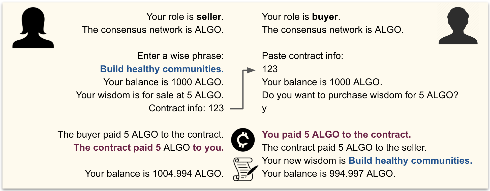</div>

This particular transaction took place on an Algorand devnet. The Algorand cryptocurrency standard token unit is the *ALGO*. As indicated by the final balances in the diagram, the seller received 0.006 ALGO less than the agreed upon price, and the buyer paid 0.003 ALGO more. These expenses represent *gas*, the cost of doing business on a consensus network. The seller paid a little more gas than the buyer because the seller deployed the contract.

# Clone the repository

This section shows you how to clone the tutorial repository.

1. Clone the [wisdom-for-sale](https://github.com/hagenhaus/wisdom-for-sale) repository:

    ``` nonum
    $ cd ~/reach
    $ git clone https://github.com/hagenhaus/wisdom-for-sale.git
    ```

1. Open the repository in vscode, and change directory to *current*.

    <p>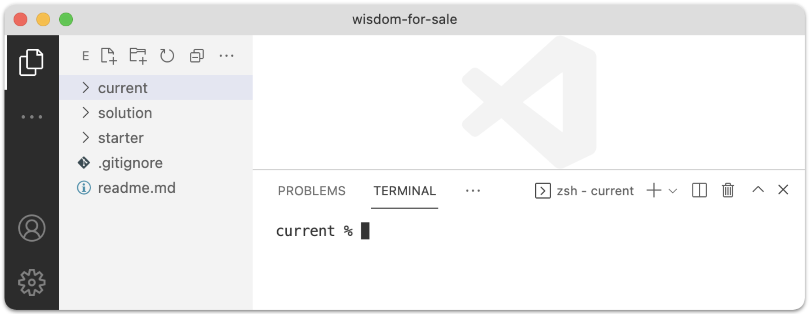</p>

1. Copy *index.mjs* and *index.rsh* from the *starter* folder to the *current* folder, and open both new files.

    <p>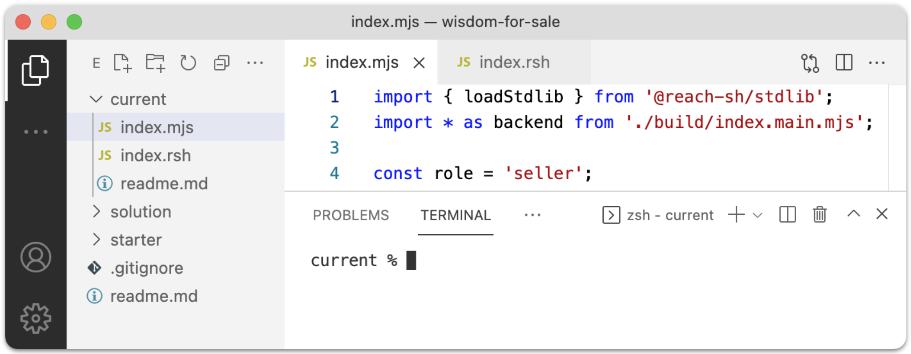</p>

## Review frontend starter

The frontend source file is [index.mjs](https://github.com/hagenhaus/wisdom-for-sale/blob/master/starter/index.mjs):

``` js
load: https://raw.githubusercontent.com/hagenhaus/wisdom-for-sale/master/starter/index.mjs
```

Below is a line-by-line description of this JavaScript code:

* Line 1: Import the Reach JS Standard Library loader.
* Line 2: Import the JS backend compiled from index.rsh.
* Line 4: Hard-code the role. You will change this later.
* Line 5: Display the role.
* Line 7: Load the Reach JS Stdlib for the consensus network specified by `REACH_CONNECTOR_MODE` env var.
* Line 8: Display the consensus network type.
* Line 10: Enable enclosed code to await the fulfillment of promises.
* Line 12: Define empty (for now) object.
* Line 15: Code for when you run this app as the seller.
* Line 16: Define empty (for now) object.
* Line 18: Create an account for the seller. *parseCurrency* transforms units from standard to atomic.
* Line 19: Get a reference to the contract.
* Line 20: Initiate interaction with contract for seller.
* Line 24: Code for when you run this app as the buyer.
* Line 25: Define empty (for now) object.

## Review backend starter

The backend source file is [index.rsh](https://github.com/hagenhaus/wisdom-for-sale/blob/master/starter/index.rsh).

``` js
load: https://raw.githubusercontent.com/hagenhaus/wisdom-for-sale/master/starter/index.rsh
```

Below is a line-by-line description of this Reach code:

* Line 1: Instruction to the compiler.
* Lines 3-5: Define empty (for now) objects.
* Line 7: Reach standard application initialization.
* Line 8: Define a constant to represent the seller.
* Line 9: Define a constant to represent the buyer.
* Line 10: Finalize participant and other options, and proceed to a Reach step.
* Line 12: Terminate computation.

# Run the DApp

This section shows you how to run your DApp. Reach can compile your DApp to run on any of the following consensus network types:

* `ALGO-devnet`
* `CFX-devnet`
* `ETH-devnet`

You tell the Reach compiler which type by setting the `REACH_CONNECTOR_MODE` environment variable. One way is to set the variable and execute `reach run` on the same line:

``` nonum
$ REACH_CONNECTOR_MODE=ALGO-devnet reach run
```

Another is to export the variable and then execute `reach run`:

``` nonum
$ export REACH_CONNECTOR_MODE=ALGO-devnet
$ reach run
```

Follow these steps to run the DApp:

1. In the vscode terminal, set `REACH_CONNECTOR_MODE=ALGO-devnet` and run the app on the same line:

    <p>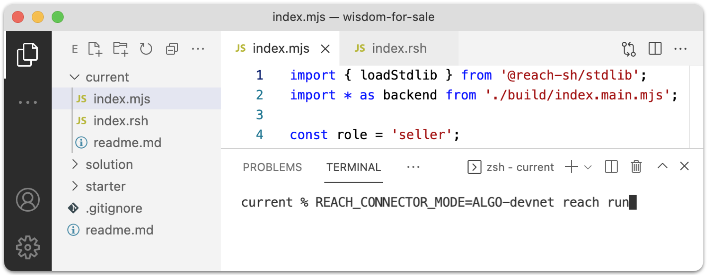</p>

1. This time, first `export REACH_CONNECTOR_MODE=ALGO-devnet`, and then run the app:

    ``` nonum
    $ export REACH_CONNECTOR_MODE=ALGO-devnet
    $ reach run
    ```

1. Repeat the first two steps for `CFX` and `ETH`.

> For consistency, output in this tutorial reflects `REACH_CONNECTOR_MODE=ALGO-devnet`.

Where does your DApp run? In your current environment, the Reach Compiler, the consensus network devnets, your application, and the smart contract run on your computer in Docker containers instantiated from Reach Docker images.

<button class="btn btn-success btn-sm" type="button" data-bs-toggle="collapse" data-bs-target="#ebp" aria-expanded="false">
  <i class="fas fa-info-circle me-2"></i><span>Explore Build Output</span>
</button>

<span class="collapse" id="ebp">

Here is sample output:

```
current % REACH_CONNECTOR_MODE=ALGO-devnet reach run
Verifying knowledge assertions
Verifying for generic connector
  Verifying when ALL participants are honest
  Verifying when NO participants are honest
  Verifying when ONLY "Buyer" is honest
  Verifying when ONLY "Seller" is honest
Checked 4 theorems; No failures!
[+] Building 0.2s (7/7) FINISHED
 => [internal] load build definition from Dockerfile                                         0.0s
 => => transferring dockerfile: 234B                                                         0.0s
 => [internal] load .dockerignore                                                            0.0s
 => => transferring context: 75B                                                             0.0s
 => [internal] load metadata for docker.io/reachsh/runner:0.1.5                              0.0s
 => [internal] load build context                                                            0.0s
 => => transferring context: 4.60kB                                                          0.0s
 => CACHED [1/2] FROM docker.io/reachsh/runner:0.1.5                                         0.0s
 => [2/2] COPY . /app                                                                        0.0s
 => exporting to image                                                                       0.0s
 => => exporting layers                                                                      0.0s
 => => writing image sha256:13e69eb72504bbc85074476e5d1183b6ad2734a5eabc9e56c2138023d64a507a 0.0s
 => => naming to docker.io/reachsh/reach-app-current:latest                                  0.0s

Use 'docker scan' to run Snyk tests against images to find vulnerabilities and learn how to fix them
Creating reach2021-10-13t14-26-55z-vcv1_reach-app-current_run ... done

> @reach-sh/current@ index /app
> node --experimental-modules --unhandled-rejections=strict index.mjs

The consensus network is ALGO.
Your role is seller.
```

Below is a line-by-line description:

* Line 1: The Reach Compiler inputs *reach.rsh*.

    <p>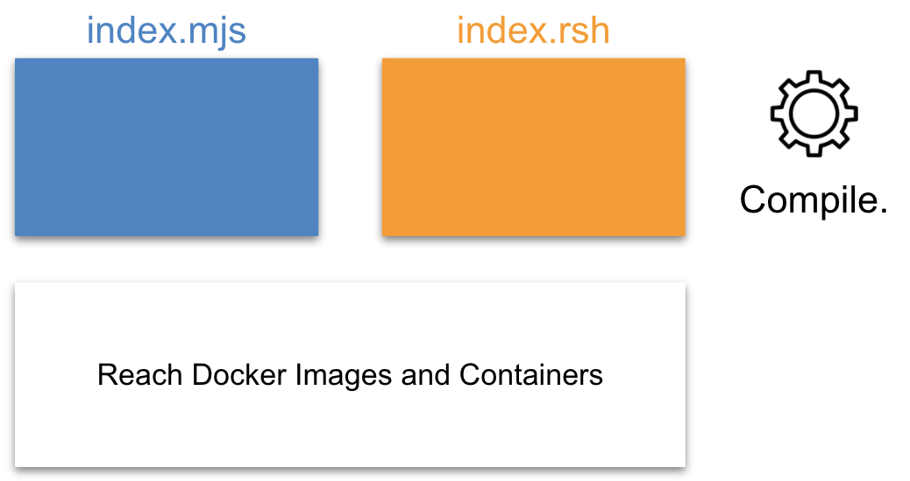</p>

    And, it outputs *index.main.mjs* consisting of the compiled backend (blue) and the smart contract (dark orange):

    <p>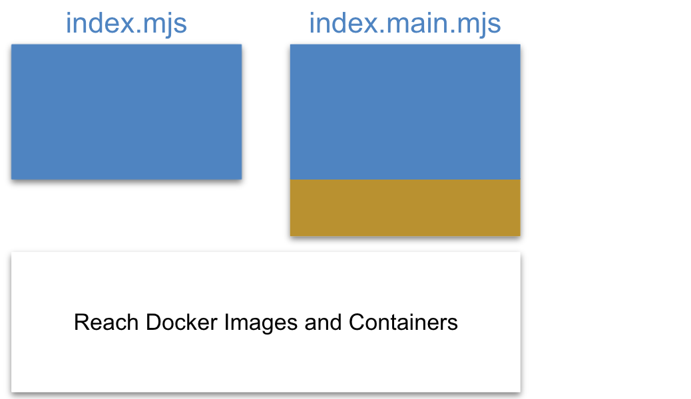</p>

* Line 2: The Reach Verification Engine validates the smart contract:

    <p>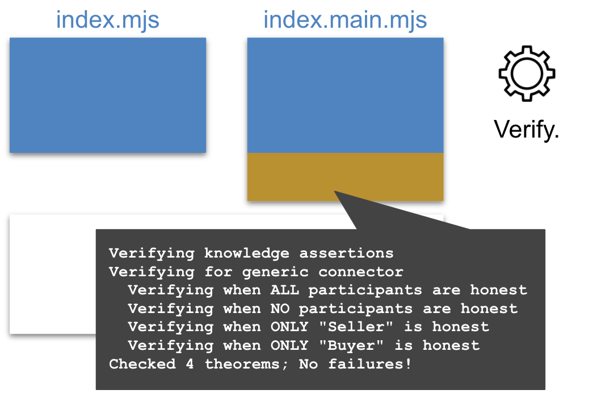</p>

* Lines 10-22: The process builds a Docker image for your application.

    <p>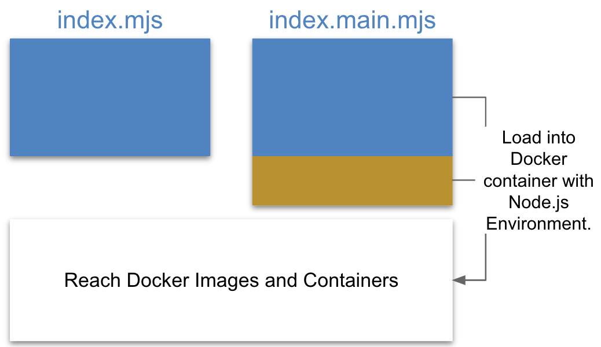</p>

    Note the mention of *Dockerfile* and *.dockerignore*. The `reach run` command creates the following set of files, deleting all but *index.main.mjs* on completion:

    ``` nonum
    build/index.main.mjs
    .dockerignore
    .gitignore
    Dockerfile
    package.json
    ```

    For some of your Reach projects, you may find it useful to retain and edit these files, especially *package.json*. To create and retain these files, run `reach scaffold` before running `reach run`.

* Line 24: The process checks the new image for vulnerabilities.

    <p></p>

* Line 27: The process runs your app in a container built from the image.

    <p>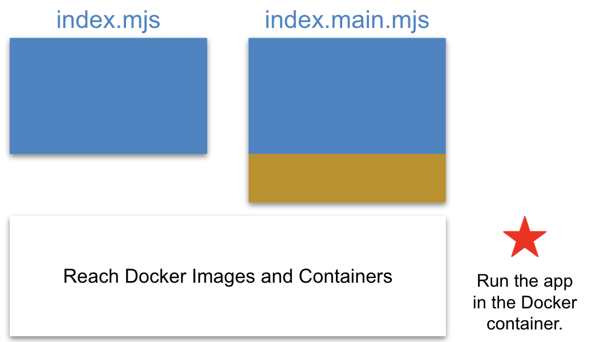</p>

* Line 30-31: Your application outputs these messages.

<hr style="background-color:#198754;opacity:1;height:6px;"/>
</span>

# Pass an argument

This section shows you how to tell your DApp whether to run as the seller or the buyer. You do this by passing *role* as a command-line argument (e.g. `reach run index seller`). You cannot do this by passing *role* as a custom environment variable (e.g. `ROLE=seller reach run`) because the [reach](https://github.com/reach-sh/reach-lang/blob/master/reach) script exports only a pre-determined list of environment variables (including `REACH_CONNECTOR_MODE`) within the Docker container where it runs your DApp. Follow these directions to pass *role* as a command-line argument:

1. In *index.mjs*, find the following line:

    ``` js nonum
    const role = 'seller';
    ```

1. Replace it with the following, and save the file:

    ``` js nonum
    if (process.argv.length < 3 || ['seller', 'buyer'].includes(process.argv[2]) == false) {
      console.log('Usage: reach run index [seller|buyer]');
      process.exit(0);
    }
    const role = process.argv[2];
    ```

1. Open two terminals (i.e. shells):

    <p>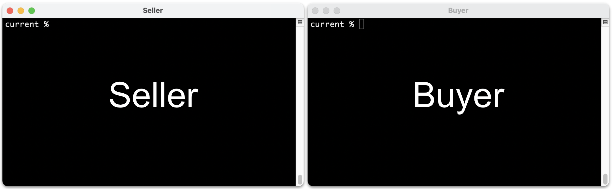</p>

1. Change directory in both terminals:

    ``` nonum
    $ ~/reach/wisdom-for-sale/current
    ```

1. Run the following command in both terminals:

    ``` nonum
    $ export REACH_CONNECTOR_MODE=ALGO-devnet
    ```

1. In the Seller Terminal, run your DApp as the seller:

    ``` nonum
    $ reach run index seller
    ```

    When you pass arguments to `reach run`, the first one must be the name of the `index.rsh` file without the extension (i.e. `index`) as seen above. 
    
    Application output should resemble the following:

    ``` nonum
    The consensus network is ALGO.
    Your role is seller.
    ```

1. In the Buyer Terminal, run your DApp as the buyer:

    ``` nonum
    $ reach run index buyer
    ```

    Output should resemble the following:

    ``` nonum
    The consensus network is ALGO.
    Your role is buyer.
    ```

# Add a Node.js package

This section shows you how to leverage the [yargs](https://www.npmjs.com/package/yargs) Node.js package to manage command-line arguments as an alternative to using the simple technique described above.  

This section is **optional**. If you do **not** want to add a Node.js package to your DApp at this time, you can skip to the next section, continuing to use the following commands throughout the remainder of this tutorial:

``` nonum
$ reach run index seller
$ reach run index buyer
```

If you **do** complete this section, you will need to use the following commands instead:

``` nonum
$ reach run index -r seller
$ reach run index -r buyer
```

Adding a Node.js package to your Reach DApp is easy:

1. In any terminal, change directory:

    ``` nonum
    $ cd ~/reach/wisdom-for-sale/current
    ```

1. Create non-temporary Reach scaffolding files:

    ``` nonum
    $ reach scaffold
    ```

1. Install the Node.js package:

    ``` nonum
    $ npm i yargs
    ```

1. Open *Dockerfile*, and uncomment 

    ``` nonum
    COPY package.json /app/package.json
    RUN npm install
    RUN npm link @reach-sh/stdlib
    ```

    `COPY` and `RUN` are commands understood by Docker.

1. Open *index.mjs*, and add the following import near the top of the file:

    ``` nonum
    import yargs from 'yargs';
    ```

1. In *index.mjs*, find the following code:

    ``` js nonum
    if (process.argv.length < 3 || ['seller', 'buyer'].includes(process.argv[2]) == false) {
      console.log('Usage: reach run index [seller|buyer]');
      process.exit(0);
    }
    const role = process.argv[2];

1. Replace it with the following:

    ``` js nonum
    const argv = yargs(process.argv.slice(2))
      .option('help', {
        alias: 'h',
        describe: 'Show help.',
        type: 'boolean'
      })
      .option('role', {
        alias: 'r',
        describe: 'Specify role.',
        type: 'string',
        choices: ['seller', 'buyer'],
        default: 'seller'
      })
      .argv

    const role = argv.r;
    ```

1. Tell your DApp to display help information:

    ``` nonum
    $ reach run index -h
    ```

    Output should resemble the following:

    ``` nonum
    Options:
      -h, --help     Show help.          [boolean]
          --version  Show version number [boolean]
      -r, --role     Specify role.       [string] [choices: "seller", "buyer"] [default: "seller"]
    ```

1. In the Seller Terminal, run your DApp as the seller:

    ``` nonum
    $ reach run index -r seller
    ```
    
    Output should resemble the following:

    ``` nonum
    The consensus network is ALGO.
    Your role is seller.
    ```

1. In the Buyer Terminal, run your DApp as the buyer:

    ``` nonum
    $ reach run index -r buyer
    ```

    Output should resemble the following:

    ``` nonum
    The consensus network is ALGO.
    Your role is buyer.
    ```

For the remainder of the tutorial, remember to use the `-r` flag.

# Explore units and balances

This section helps you explore standard and atomic units using the [JavaScript Standard Library](/en/books/essentials/support-for-js-frontends/). Regarding tokens, each consensus network has a (divisible) standard unit and an (indivisible) atomic unit. Users usually want to see standard units. A smart contract, on the other hand, *always* deals with atomic units. So, your DApp needs to convert between the two frequently. `parseCurrency` converts from standard to atomic. `formatCurrency` converts from atomic to standard. 

1. In *index.mjs*, find the following line:

    ``` js nonum
    console.log(`The consensus network is ${stdlib.connector}.`);
    ```

1. Add the following below it, and run your DApp as the seller to view the standard and atomic units for your network:

    ``` js nonum
    console.log(`The standard unit is ${stdlib.standardUnit}`);
    console.log(`The atomic unit is ${stdlib.atomicUnit}`);
    ```

    Output should resemble the following:

    ``` nonum
    The consensus network is ALGO.
    The standard unit is ALGO
    The atomic unit is μALGO
    ```

1. Replace your two `console.log` additions with the following, and run again:

    ``` js nonum
    const suStr = stdlib.standardUnit;
    const auStr = stdlib.atomicUnit;
    console.log(`The standard unit is ${suStr}`);
    console.log(`The atomic unit is ${auStr}`);
    ```

    Output should be the same.

1. Replace your additions with the following, and run again:

    ``` js nonum
    const suStr = stdlib.standardUnit;
    const auStr = stdlib.atomicUnit;
    const toAU = (su) => stdlib.parseCurrency(su);
    const toSU = (au) => stdlib.formatCurrency(au, 4);
    const suBal = 1000;
    console.log(`Balance is ${suBal} ${suStr}`);
    const auBal = toAU(suBal);
    console.log(`Balance is ${auBal} ${auStr}`);
    console.log(`Balance is ${toSU(auBal)} ${suStr}`);
    ```

    Output should resemble the following:

    ``` nonum
    The consensus network is ALGO.
    Balance is 1000 ALGO
    Balance is 1000000000 μALGO
    Balance is 1000 ALGO
    ```

1. Replace your additions with the following:

    ``` js nonum
    const suStr = stdlib.standardUnit;
    const toAU = (su) => stdlib.parseCurrency(su);
    const toSU = (au) => stdlib.formatCurrency(au, 4);
    const iBalance = toAU(1000);
    const showBalance = async (acc) => console.log(`Your balance is ${toSU(await stdlib.balanceOf(acc))} ${suStr}.`);
    ```

    You use `iBalance` and `showBalance` in the next steps.

1. In *index.mjs*, find and replace Line 1 (below) with Line 2 to utilize `iBalance`:

    ``` js
    const acc = await stdlib.newTestAccount(stdlib.parseCurrency(1000));
    const acc = await stdlib.newTestAccount(iBalance);
    ```

1. In *index.mjs*, insert `showBalance` in two places (Lines 2 and 5) to show the account balance before and after contract deployment:

    ``` js
    const acc = await stdlib.newTestAccount(iBalance);
    await showBalance(acc);
    const ctc = acc.contract(backend);
    await backend.Seller(ctc, sellerInteract);
    await showBalance(acc);
    ```

1. Run your DApp again. Output should resemble the following:

    ``` nonum
    Your role is seller.
    The consensus network is ALGO.
    Your balance is 1000 ALGO.
    Your balance is 1000 ALGO.
    ```

    The second balance is now poised to reflect the results of the transactions you will implement below.

# Deploy the contract (seller)

This section shows you how to have the seller (1) deploy the contract and (2) return the contract information to be used later by the buyer to attach to the contract. The format of contract information varies depending on the consensus network. Here are examples:

|Conensus Network|Contract Information Example|
|-|-|
|Algorand|`49`|
|Conflux|`"NET999:TYPE.CONTRACT:ACDWGDGH6DKDAJ528Y5CCWMX8NBVPHXU72S3FPF8CY"`|
|Ethereum|`"0x403372276F841d7451E6417Cc7B17fDD159FE34C"`|

In this tutorial, the seller outputs the contract information to the Seller Terminal, and the buyer copies & pastes the contract information from the Seller Terminal to the Buyer Terminal (including the quotation marks if persent). In real life, the seller would need to search for a contract name and its associated contract information in some repository. 

<button class="btn btn-success btn-sm" type="button" data-bs-toggle="collapse" data-bs-target="#fsci" aria-expanded="false">
  <i class="fas fa-info-circle me-2"></i><span>Storing and Finding Contract Information</span>
</button>

<span class="collapse" id="fsci">

Not done yet.

<hr style="background-color:#198754;opacity:1;height:6px;"/>
</span>

Follow these directions to have the seller deploy the contract and return the contract information:

1. In *index.mjs*, find the following line:

    ``` js nonum
    const sellerInteract = { ...commonInteract };
    ```

1. Replace it with the following:

    ``` js nonum
    const sellerInteract = { 
      ...commonInteract,
      price: toAU(5),
      reportReady: async (price) => {
        console.log(`Your wisdom is for sale at ${toSU(price)} ${suStr}.`);
        console.log(`Contract info: ${JSON.stringify(await ctc.getInfo())}`);
      }
    };
    ```

    You will add a `wisdom` property to the `sellerInteract` later in the tutorial.

1. In *index.rsh*, find the following line:

    ``` js nonum
    const sellerInteract = { ...commonInteract };
    ```

1. Replace it with the following Reach code:

    ``` js
    const sellerInteract = {
      ...commonInteract,
      price: UInt,
      reportReady: Fun([UInt], Null),
    };
    ```
    
    * Line 1: `sellerInteract` is a user-defined Reach object.
    * Line 2: The spread syntax `...` adds all `commonInteract` properties (none yet) to the object.
    * Line 3: `price ` is a `UInt`, a Reach-defined unsigned integer. 
    * Line 4: `reportReady` is a function that takes a `UInt` as an argument and returns nothing.

1. In *index.rsh*, add Lines 3-6 between `deploy` and `exit`:

    ``` js
    deploy();

    S.only(() => { const price = declassify(interact.price); });
    S.publish(price);
    S.interact.reportReady(price);
    commit();

    exit();
    ```

    * Line 1: `deploy` initializes the DApp, and transitions to a step.
    * Line 3: `S.only()` transitions to a local step in which seller gets `price`.
    * Line 4: `S.publish()` transitions to a consensus step.
    * Line 5: `S.interact` transitions to a local step in which seller passes `price` to frontend.
    * Line 6: `commit()` transitions to a step.
    * Line 8: `exit()` halts the contract forever.

    The next section explains these functions in more detail. For now, know that Reach programs (the *index.rsh* portion of your Reach DApp) are organized into four modes, and that `deploy`, `only`, `publish`, `commit`, and `exit` cause mode transitions.

1. Run your DApp as the seller. Output should resemble the following:

    ``` nonum
    Your role is seller.
    The consensus network is ALGO.
    Your balance is 1000 ALGO.
    Your wisdom is for sale at 5 ALGO.
    Contract info: 3
    Your balance is 999.996 ALGO.
    ```

    The seller creates the contract, retrieves the contract information, and makes it available to the buyer who will (shortly) use the information to attach to the contract. Note that simply deploying the contract cost the seller gas.

The interact objects introduced in this section facilitate communication between the frontend (e.g. `index.mjs`) and backend (e.g. `index.main.mjs`) of Reach applications, (remembering that `index.rsh` is the pre-compiled version of `index.main.mjs`). The [Market Day](/en/books/essentials/tutorials/market-day/) tutorial explores interact objects in more detail. 

# Attach to the contract (buyer)

This section shows you how to have the buyer attach to the contact. It also introduces *@reach-sh/stdlib/ask.mjs*, a minimal Reach Node.js package for command-line input.

1. In *index.mjs*, add the following near the top of the file:

    ``` js nonum
    import { ask, yesno, done } from '@reach-sh/stdlib/ask.mjs';
    ```

1. And, add `done();` just before `})();` at the bottom of the file. 

1. In *index.mjs*, find the following line:

    ``` js nonum
    const buyerInteract = { ...commonInteract };
    ```

1. Replace it with the following:

    ``` js
    const buyerInteract = {
      ...commonInteract,
      confirmPurchase: async (price) => await ask(`Do you want to purchase wisdom for ${toSU(price)} ${suStr}?`, yesno)
    };

    const acc = await stdlib.newTestAccount(iBalance);
    const info = await ask('Paste contract info:', (s) => JSON.parse(s));
    const ctc = acc.contract(backend, info);
    await showBalance(acc);
    await ctc.p.Buyer(buyerInteract);
    await showBalance(acc);
    ```

    * Line 3: `ask` and `yesno` are functions in `@reach-sh/stdlib/ask.mjs`. `yesno` accepts only `y` or `n`.
    * Line 7: You must parse contract information (so, it must be parsable).
    * Line 10: You can substitute *participants* for *p*.

1. In *index.rsh*, find the following line:

    ``` js nonum
    const buyerInteract = { ...commonInteract };
    ```

1. Replace it with the following Reach code:

    ``` js
    const buyerInteract = {
      ...commonInteract,
      confirmPurchase: Fun([UInt], Bool)
    };
    ```

    * Line 1: `buyerInteract` is a user-defined Reach object.
    * Line 2: The spread syntax `...` adds all `commonInteract` properties (none yet) to the object.
    * Line 3: `confirmPurchase` is a function that takes a `UInt` and returns a `Bool`.

1. In *index.rsh*, add the following before `exit()`:

    ``` js
    B.only(() => { const willBuy = declassify(interact.confirmPurchase(price)); });
    B.publish(willBuy);
    if (!willBuy) {
      commit();
    } else {
      commit();
    }
    ```

    * Line 1: `confirmPurchase` passes `price` and returns `true` or `false` from frontend.
    * Line 2: `B.publish()` transitions to a consensus step.
    * Line 4: `commit()` transitions to a step.

    See [Reach Mode Diagram](#reach-mode-diagram) and [Reach Mode Definitions](#reach-mode-definitions) at the bottom of this section for an explanation about *index.rsh* code.

1. Run your DApp as both the seller and the buyer. When prompted, copy & paste the contract info from the Seller Terminal to the Buyer Terminal. Output should resemble the following:

    <div class="row gx-3">
    <div class="col-12 col-lg-auto">

    ``` nonum
    Your role is seller.
    The consensus network is ALGO.
    Your balance is 1000 ALGO.
    Your wisdom is for sale at 5 ALGO.
    Contract info: 23
    Your balance is 999.997 ALGO.
    ```

    </div>
    <div class="col-12 col-lg-auto">

    ``` nonum
    Your role is buyer.
    The consensus network is ALGO.
    Paste contract info:
    23
    Your balance is 1000 ALGO.
    Do you want to purchase wisdom for 5 ALGO?
    n
    Your balance is 999.998 ALGO.
    ```

    </div>
    </div>

## Reach Mode Diagram

Reach programs (the *index.rsh* portion of your Reach DApp) are organized into four modes: *Init Mode*, *Step Mode*, *Local Step Mode*, and *Consensus Step Mode*. Consider this diagram:

<div>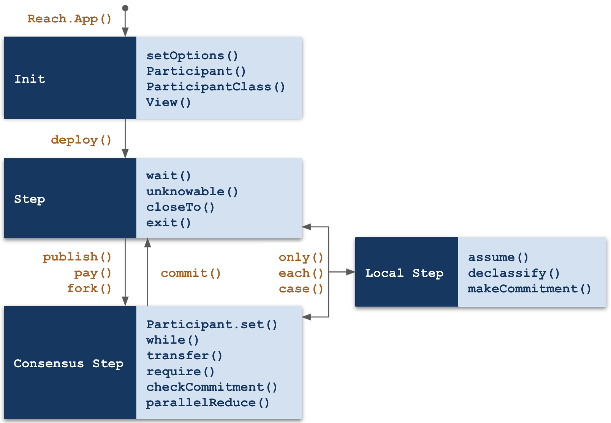</div>

The dark blue boxes in the diagram represent modes. The light blue boxes represent actions (functions) permitted within the mode. The orange text represents functions that cause transitions between modes. 

## Reach Mode Definitions

### Init Mode

Application Initialization defines participants and views (see [View the contract](#view-the-contract) later in the tutorial). It also, optionally, overrides default compile options. Lines 2 and 3 below occur in the *Init* mode:

``` js
export const main = Reach.App(() => {
  const S = Participant('Seller', sellerInteract);
  const B = Participant('Buyer', buyerInteract);
  deploy();
```

You can also override compile options (Line 2 below) in the *Init* mode:

``` js
export const main = Reach.App(() => {
  setOptions({ verifyArithmetic: true, connectors: [ETH, ALGO ] });
  const S = Participant('Seller', sellerInteract);
  const B = Participant('Buyer', buyerInteract);
  deploy();
```

The `deploy` function transitions from the *Init* mode to the *Step* mode. 

### Step Mode

A Step specifies actions taken by each and every participant. `exit()`, for example, is a function that must occur within a step, and it means that each and every participant exits the contract after which that instance of the contract becomes forever unavailable.

### Local Step Mode

A Local Step specifies actions taken by a single participant. Local steps must occur within the body of `only` or `each` statements. Here is an example:

``` js nonum
S.only(() => { const price = declassify(interact.price); });
```

`only()` and `each()` transition to a local step and then back to the originating mode (step or consensus step).

### Consensus Step Mode

A Consensus Step specifies actions taken by the contract itself. Later in this tutorial, the contract calls `transfer` to transfer funds from the contract to the seller.

# Cancel a transaction

This section shows you how to cancel a transaction.

1. In *index.mjs*, find the following line:

    ``` js nonum
    const commonInteract = {};
    ```

1. Replace it with the following:

    ``` js nonum
    const commonInteract = {
      reportCancellation: () => { console.log(`The buyer cancelled the order.`); }
    };
    ```

1. In *index.rsh*, find the following line:

    ``` js nonum
    const commonInteract = {};
    ```

1. Replace it with the following:

    ``` js nonum
    const commonInteract = {
      reportCancellation: Fun([], Null)
    };
    ```

1. In *index.rsh*, add Lines 3 and 4 to existing code:

    ``` js
    if (!willBuy) {
      commit();
      each([S, B], () => interact.reportCancellation());
      exit();
    } else {
      commit();
    }
    ```

1. Run your DApp as both the seller and the buyer. Answer `n` when asked to buy wisdom. Output should include the following:

    <div class="row gx-3">
    <div class="col-12 col-lg-auto">

    ``` nonum
    Your role is seller.
    The buyer cancelled the order.
    ```

    </div>
    <div class="col-12 col-lg-auto">

    ``` nonum
    Your role is buyer.
    The buyer cancelled the order.
    ```

    </div>
    </div>

    In the Buyer Terminal, it might be more consistent to output *You cancelled the order* instead of *The buyer cancelled the order*. The following steps implement this slight change.

1. In *index.mjs*, modify `commonInteract`:

    ``` js nonum
    const commonInteract = (role) => ({
      reportCancellation: () => { console.log(`${role == 'buyer' ? 'You' : 'The buyer'} cancelled the order.`); }
    });
    ```

1. In *index.mjs*, modify `sellerInteract` and `buyerInteract` to pass `role` to *commonInteract*:

    ``` js nonum
    const sellerInteract = {
      ...commonInteract(role),
    }

    const buyerInteract = {
      ...commonInteract(role),
    }
    ```

1. Rerun your DApp as the seller and buyer. Answer `n` again. Now, buyer output should include *You cancelled the order*:

    <div class="row gx-3">
    <div class="col-12 col-lg-auto">

    ``` nonum
    Your role is seller.
    The buyer cancelled the order.
    ```

    </div>
    <div class="col-12 col-lg-auto">

    ``` nonum
    Your role is buyer.
    You cancelled the order.
    ```

    </div>
    </div>

# Complete a transaction

This section shows you how to get wisdom from the seller on the frontend, and swap it for tokens on the backend.

1. In *index.mjs*, add a `wisdom` property to `sellerInteract` right after the `price` property:

    ``` js nonum
    wisdom: await ask('Enter a wise phrase, or press Enter for default:', (s) => {
      let w = !s ? 'Build healthy communities.' : s;
      if (!s) { console.log(w); }
      return w;
    }),
    ```

1. In *index.rsh*, add a `wisdom` property to `sellerInteract` right after the `price` property:

    ``` js nonum
    wisdom: Bytes(128),
    ```

1. Run your DApp as the seller to test the new input mechanism. You can Ctrl-C twice to exit.

1. In *index.mjs*, add `reportWisdom` to `buyerInteract`:

    ``` js nonum
    reportWisdom: (wisdom) => console.log(`Your new wisdom is "${wisdom}"`)
    ```

1. In *index.rsh*, add `reportWisdom` to `buyerInteract`:

    ``` js nonum
    reportWisdom: Fun([Bytes(128)], Null)
    ```

1. In *index.rsh*, add the following before `exit()`:

    ``` js 
    B.pay(price);
    commit();

    S.only(() => { const wisdom = declassify(interact.wisdom); });
    S.publish(wisdom);
    transfer(price).to(S);
    commit();

    B.interact.reportWisdom(wisdom);
    ```

    * Line 1: The buyer always pays the contract.
    * Line 4: After the buyer commits to purchase, the seller declassifies the wisdom.
    * Line 5: The seller makes the wisdom available to the buyer.
    * Line 6: The contract transfers funds to the seller.
    * Line 9: The buyer sends the new wisdom to the frontend for the user.

1. Run your DApp as the seller and the buyer. Answer `y` when asked to buy wisdom. Output should resemble the following:

    <div class="row gx-3">
    <div class="col-12 col-lg-auto">

    ``` nonum
    Your role is seller.
    The consensus network is ALGO.
    Enter a wise phrase, or press Enter for default:
    
    Build healthy communities.
    Your balance is 1000 ALGO.
    Your wisdom is for sale at 5 ALGO.
    Contract info: 90
    Your balance is 1004.994 ALGO.
    ```

    </div>
    <div class="col-12 col-lg-auto">

    ``` nonum
    Your role is buyer.
    The consensus network is ALGO.
    Paste contract info:
    90
    Your balance is 1000 ALGO.
    Do you want to purchase wisdom for 5 ALGO?
    y
    Your new wisdom is "Build healthy communities."
    Your balance is 994.997 ALGO.
    ```

    It might be nice to inform the seller and the buyer when the `pay` and `transfer` actions take place. The next steps add these improvements.

1. In *index.mjs*, add the following to `commonInteract`:

    ``` js nonum
    reportPayment: (payment) => console.log(`${role == 'buyer' ? 'You' : 'The buyer'} paid ${toSU(payment)} ${suStr} to the contract.`),
    reportTransfer: (payment) => console.log(`The contract paid ${toSU(payment)} ${suStr} to ${role == 'seller' ? 'you' : 'the seller'}.`),
    ```

1. In *index.rsh*, add the following to `commonInteract`:

    ``` js nonum
    reportPayment: Fun([UInt], Null),
    reportTransfer: Fun([UInt], Null),
    ```

1. In *index.rsh*, add Lines 2 and 10 to existing code:

    ``` js
    B.pay(price);
    each([S, B], () => interact.reportPayment(price));
    commit();

    S.only(() => { const wisdom = declassify(interact.wisdom); });
    S.publish(wisdom);
    transfer(price).to(S);
    commit();

    each([S, B], () => interact.reportTransfer(price));
    B.interact.reportWisdom(wisdom);
    ```

    * Line 2: `each` calls `interact.reportPayment` for each participant in the array.
    * Line 10: `each` calls `interact.reportTransfer` for each participant in the array.

1. Run your DApp as the seller and the buyer. Answer `y` when asked to buy wisdom. Output should resemble the following:

    <div class="row gx-3">
    <div class="col-12 col-lg-auto">

    ``` nonum
    Your role is seller.
    The consensus network is ALGO.
    Enter a wise phrase, or press Enter for default:
    
    Build healthy communities.
    Your balance is 1000 ALGO.
    Your wisdom is for sale at 5 ALGO.
    Contract info: 113
    The buyer paid 5 ALGO to the contract.
    The contract paid 5 ALGO to you.
    Your balance is 1004.994 ALGO.
    ```

    </div>
    <div class="col-12 col-lg-auto">

    ``` nonum
    Your role is buyer.
    The consensus network is ALGO.
    Paste contract info:
    113
    Your balance is 1000 ALGO.
    Do you want to purchase wisdom for 5 ALGO?
    y
    You paid 5 ALGO to the contract.
    The contract paid 5 ALGO to the seller.
    Your new wisdom is "Build healthy communities."
    Your balance is 994.997 ALGO.
    ```

# View the contract

This section shows you how to have the buyer (before attaching) peek into the deployed contract to view the price, and explains why viewing contract data before attaching is sometimes advantageous.

Below is the *index.mjs* version of `confirmPurchase` from the `buyerInteract` object:

``` js nonum
confirmPurchase: async (price) => await ask(`Do you want to purchase wisdom for ${toSU(price)} ${suStr}?`, yesno),
```

The backend calls the function (passing `price`), and the frontend displays `price` to the buyer, asks for a decision, waits for the answer, and returns `true` or `false` to the backend. Effective for a command-line app, this approach doesn't work as well for a webapp which might use a modal in place of `ask-yesno`:

<div></div>

Using Bootstrap as a example, here is how to display a modal:

``` js nonum
const modal = new bootstrap.Modal(document.getElementById('confirm-modal'), {})
modal.show();
```

Note that `modal.show()` does not display the modal and wait for an answer. Rather, it returns immediately to the caller (before the modal appears), and, to get the answer, the application listens (asynchronously) for *Yes* and *No* button events. So, the application cannot call `modal.show()` from within `confirmPurchase`, wait for an answer, and return `true` or `false` to the backend.

Instead, a webapp can do the following prior to attaching to the contract:

1. Get and display the price to the buyer.
1. Get confirmation from the buyer.

Once confirmed, the webapp can attach to the contract and complete the transaction (skipping the existing `confirmPurchase` by, for now, always returning `true`). The following directions show you how to obtain `price` from the contract before attaching:

1. In *index.rsh*, add Lines 4 and 10:

    ``` js
    export const main = Reach.App(() => {
      const S = Participant('Seller', sellerInteract);
      const B = Participant('Buyer', buyerInteract);
      const V = View('Main', { price: UInt });
      deploy();

      S.only(() => { const price = declassify(interact.price); });
      S.publish(price);
      S.interact.reportReady(price);
      V.price.set(price);
      commit();
    ```

1. In *index.mjs*, add Lines 4 and 5 (in the Buyer section):

    ``` js
    const acc = await stdlib.newTestAccount(iBalance);
    const info = await ask('Paste contract info:', (s) => JSON.parse(s));
    const ctc = acc.contract(backend, info);
    const price = await ctc.views.Main.price();
    console.log(`The price of wisdom is ${price[0] == 'None' ? '0' : toSU(price[1])} ${suStr}.`);
    await showBalance(acc);
    await ctc.p.Buyer(buyerInteract)
    await showBalance(acc);
    ```

1. Run your DApp as the seller and the buyer. Buyer output should include the following:

    ``` nonum
    The price of wisdom is 5 ETH.
    ```

Using a view, the buyer is able to obtain `price` before attaching to the contract.

<button class="btn btn-success btn-sm" type="button" data-bs-toggle="collapse" data-bs-target="#apav" aria-expanded="false">
  <i class="fas fa-info-circle me-2"></i><span>About Participants and Views</span>
</button>

<span class="collapse" id="apav">

Not done yet.

<hr style="background-color:#198754;opacity:1;height:6px;"/>
</span>

# Examine the webapp

The [wisdom-for-sale](https://github.com/hagenhaus/wisdom-for-sale) repository includes a [Bootstrap](https://getbootstrap.com/docs/5.1/getting-started/introduction/)-based webapp implementation that you can inspect and modify:

<p class="ratio ratio-16x9 my-4" style="max-width:500px;">
  <iframe 
    src="https://www.youtube.com/embed/dOssmYL2ULA" 
    frameborder="0"  
    allowfullscreen>
  </iframe>
</p>

You need node.js and npm installed on your computer because you will need the [http-server](https://www.npmjs.com/package/http-server) package (or similar) to run the webapp. Below are directions for running and inspecting the DApp:

1. Copy [index.html](https://github.com/hagenhaus/wisdom-for-sale/blob/master/solution/index.html) and [webapp.mjs](https://github.com/hagenhaus/wisdom-for-sale/blob/master/solution/webapp.mjs) from the solution directory to your current directory.

1. Stop and remove all your Reach containers:

    ``` nonum
    $ reach down
    ```

1. Open four terminals (i.e. shells):

    <p>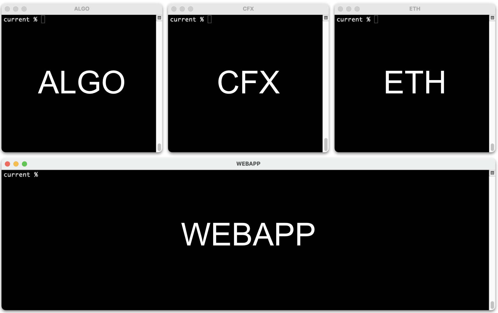</p>

1. Change directory in each terminal:

    ``` nonum
    $ ~/reach/wisdom-for-sale/current
    ```

1. In the ALGO Terminal, run the following:

    ``` nonum
    $ export REACH_CONNECTOR_MODE=ALGO-devnet
    $ reach devnet
    ```

1. In the CFX Terminal, run the following:

    ``` nonum
    $ export REACH_CONNECTOR_MODE=CFX-devnet
    $ reach devnet
    ```

1. In the ETH Terminal, run the following:

    ``` nonum
    $ export REACH_CONNECTOR_MODE=ETH-devnet
    $ reach devnet
    ```

1. In the Webapp Terminal, run the following:

    ``` nonum
    $ npm i --global http-server # Install the package globally if you haven't already.
    $ http-server -c-1 -p 8080   # Run the webapp.
    ```

    Output should look similar to the following:

    ``` nonum
    Starting up http-server, serving ./

    http-server settings: 
    CORS: disabled
    Cache: -1 seconds
    Connection Timeout: 120 seconds
    Directory Listings: visible
    AutoIndex: visible
    Serve GZIP Files: false
    Serve Brotli Files: false
    Default File Extension: none

    Available on:
      http://127.0.0.1:8080
      http://192.168.1.4:8080
    Hit CTRL-C to stop the server
    ```

1. Browse to one of the urls listed above. `http://localhost:8080` should probably work, too.

1. Click *Choose a DevNet*, and select *Algorand*. The Deploy button should turn green.

1. Click *Deploy*. The *Attach* button should turn green.

1. Click *Attach*, and then click *Yes*. The *Reset* button should turn green.

1. Click *Reset*, and try it again with a different `Price` and `Wisdom` string.

1. Click *Choose a DevNet*, select *Ethereum*, and repeat the Deploy, Attach, Reset steps.

Note that the webapp doesn't run reliably on Conflux yet.

# Self Assessment

Click on the question to view the answer.

1. <p class="q-and-a" data-bs-toggle="collapse" href="#standard-atomic" aria-expanded="false">Do smart contracts use standard or atomic units?</p>

    <div class="collapse mb-3" id="standard-atomic">
      <div class="card card-body">Smart contracts use atomic (indivisible) units. User interfaces, on the other hand, often use standard units to present cryptocurrency amounts to users. Therefore, Reach frontends frequently need to convert between the two. The Reach JS Stdlib function parseCurrency converts from standard to atomic, and the function formatCurrency converts from atomic to standard.</div>
    </div>

1. <p class="q-and-a" data-bs-toggle="collapse" href="#participants" aria-expanded="false">Reach DApps create smart contracts that enable ____ to interact on consensus networks.</p>

    <div class="collapse mb-3" id="participants">
      <div class="card card-body">Participants. A Reach program describes participant interactions from which the Reach compiler derives a smart contract.</div>
    </div>

1. <p class="q-and-a" data-bs-toggle="collapse" href="#interact" aria-expanded="false">Name the objects that comprise the interface between Reach frontend and backend participants.</p>

    <div class="collapse mb-3" id="interact">
      <div class="card card-body">Interact objects enable Reach frontend and backend participants to communicate.</div>
    </div>

1. <p class="q-and-a" data-bs-toggle="collapse" href="#filenames" aria-expanded="false">Name the Reach default frontend and backend files.</p>

    <div class="collapse mb-3" id="filenames">
      <div class="card card-body">index.mjs and index.rsh are the default frontend and backend filenames respectively. The Reach compiler compiles index.rsh into index.main.mjs.</div>
    </div>

1. <p class="q-and-a" data-bs-toggle="collapse" href="#bytecode" aria-expanded="false">In addition to participant backends, what does index.main.mjs contain?</p>

    <div class="collapse mb-3" id="bytecode">
      <div class="card card-body">It also contains the smart contract bytecode for each supported consensus network.</div>
    </div>

1. <p class="q-and-a" data-bs-toggle="collapse" href="#verification-engine" aria-expanded="false">When does the Reach Verification Engine run?</p>

    <div class="collapse mb-3" id="verification-engine">
      <div class="card card-body">Compile time.</div>
    </div>

1. <p class="q-and-a" data-bs-toggle="collapse" href="#js-stdlibs" aria-expanded="false">Can Reach DApps run on local Dockerized devnets?</p>

    <div class="collapse mb-3" id="js-stdlibs">
      <div class="card card-body">Yes. Running Reach DApps on local Dockerized devnets is a convenient way to develop and test.</div>
    </div>

1. <p class="q-and-a" data-bs-toggle="collapse" href="#conn-mode" aria-expanded="false">Name the environment variable used by Reach to determine the target consensus network.</p>

    <div class="collapse mb-3" id="conn-mode">
      <div class="card card-body">REACH_CONNECTOR_MODE</div>
    </div>

1. <p class="q-and-a" data-bs-toggle="collapse" href="#reach-down" aria-expanded="false">Name the reach command that stops and removes all Reach Docker containers.</p>

    <div class="collapse mb-3" id="reach-down">
      <div class="card card-body">reach down</div>
    </div>

1. <p class="q-and-a" data-bs-toggle="collapse" href="#view" aria-expanded="false">Name the reach object that allows frontends to peak into a contract without attaching.</p>

    <div class="collapse mb-3" id="view">
      <div class="card card-body">View</div>
    </div>