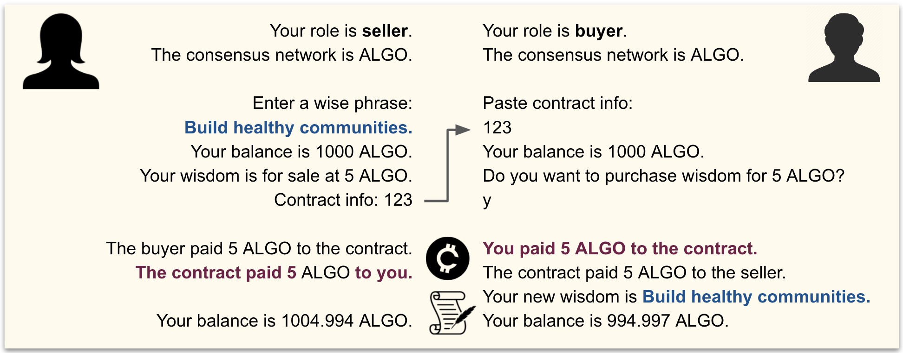
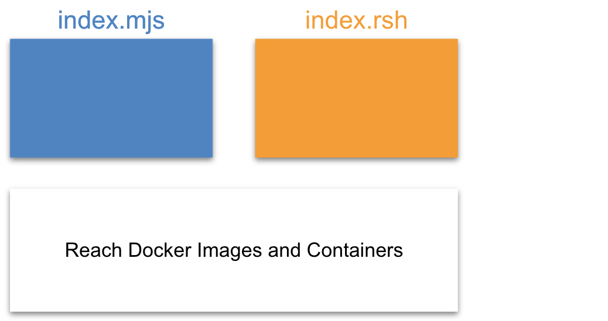
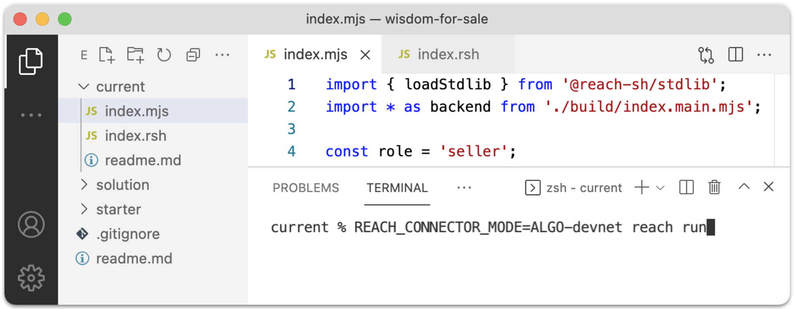
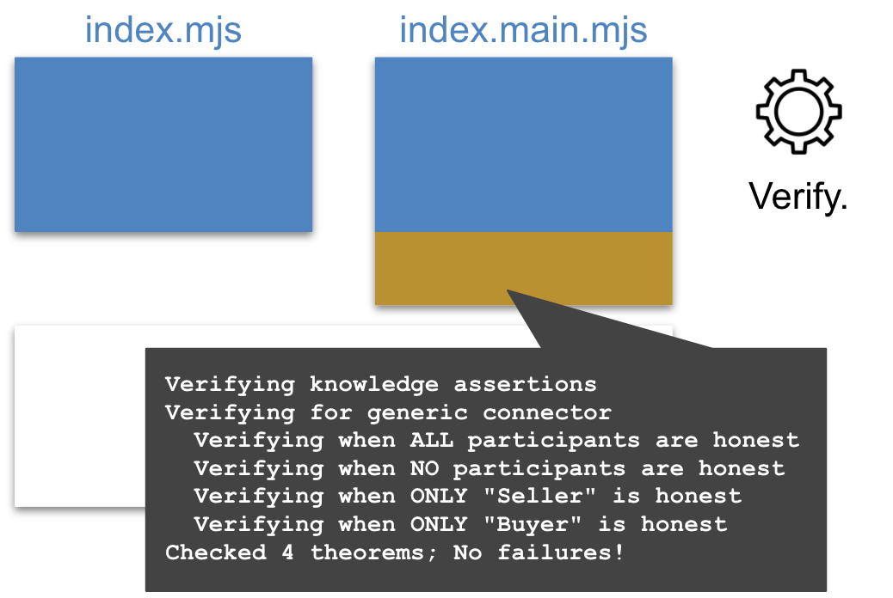
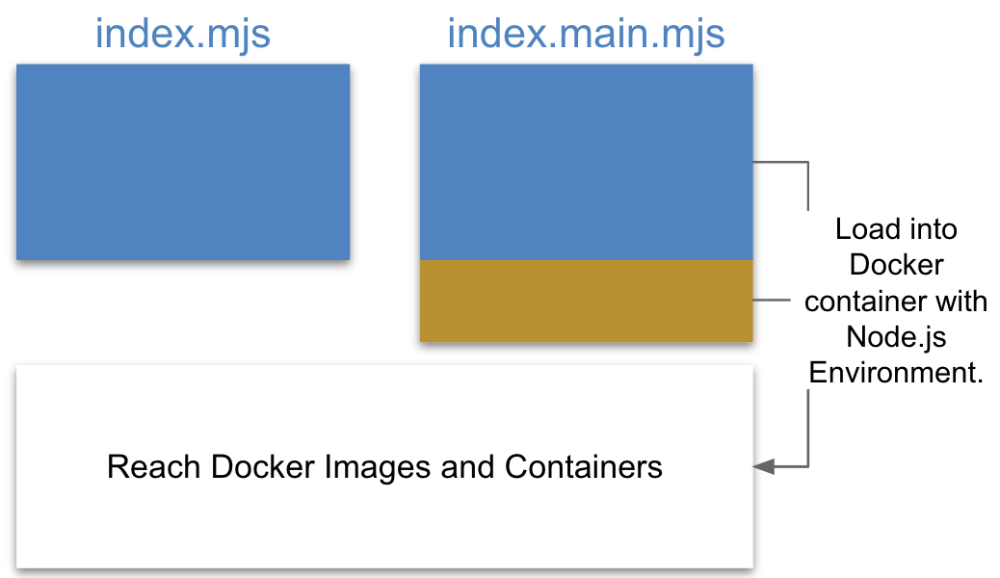
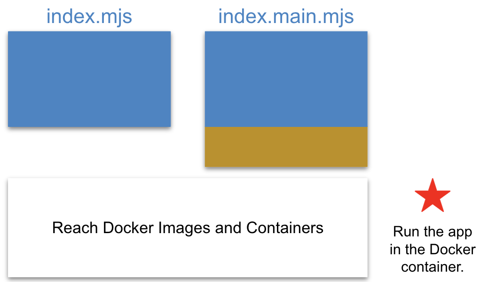

# Wisdom for Sale

This tutorial introduces you to Reach DApp development. The tutorial is easy and fun, and it prepares you for more advanced Reach tutorials and projects. Be sure to complete [Quick Start](/en/books/essentials/quick-start/) and [Development Environment](/en/books/essentials/developer-environment/) before proceeding.

# Overview

During this tutorial, you will build a command-line version and a webapp version of [Wisdom for Sale](https://github.com/hagenhaus/wisdom-for-sale), an application that enables two participants, a seller and a buyer, to trade wisdom for currency via a smart contract running on a private Algorand, Ethereum, or Conflux consensus network (e.g. devnet) residing in a Docker container on your computer. Your DApp will create and fund an account for each participant. Then, it will enable the seller and buyer to make a deal.

## Wisdom for Tokens

The following diagram represents the wisdom-for-sale deal.

<div></div>

This particular transaction took place on an Ethereum devnet. The Ethereum cryptocurrency standard token unit is the *Ether* or *ETH*. The tutorial also allows you to perform this transaction on an Algorand or Conflux devnet. The Algorand standard unit is the *ALGO*, and the Conflux standard unit is the *CFX*. As indicated by the final balances in the diagram, the seller received 0.0019 ETH less than the agreed upon price, and the buyer paid 0.0003 ETH more. These expenses represent *gas*, the cost of doing business on a consensus network. The seller paid a little more gas than the buyer because the seller deployed the contract.

## Start-to-finish Video

Speaking of contracts, creating a Reach DApp does *not* entail implementing a smart contract. Rather, it means using the Reach programming language to describe, step by step (in *index.rsh*) participant interactions from which the Reach compiler derives a smart contract. The following video illustrates:

<p class="ratio ratio-16x9 my-4" style="max-width:500px;">
  <iframe 
    src="https://www.youtube.com/embed/_hh2Vm9OdZ0" 
    frameborder="0"  
    allowfullscreen>
  </iframe>
</p>

Developers use the Reach programming language to write (in *index.rsh*) the pre-compiled backend code that, syntactically, follows modern JavaScript rules. Here is an appreviated sample:

[index.rsh](https://github.com/hagenhaus/wisdom-for-sale/blob/master/starter/index.rsh)
``` js
load: https://raw.githubusercontent.com/hagenhaus/wisdom-for-sale/master/starter/index.rsh
```

The Reach compiler transforms *reach.rsh* into *index.main.mjs* which is composed of two parts:

1. The Compiled Backend facilitates communication between your frontend and the consensus network. It is compiler-generated JavaScript: 

    ``` js
    export const _version = '0.1.5';
    export const _backendVersion = 3;
    ...
    export async function Buyer(ctc, interact) {
      ...
    };

    export async function Seller(ctc, interact) {
      ...
    };
    ```

1. The Smart Contract is deployed to the consensus network where it facilitates participant transactions. It is compiler-generated JSON and (network-specific) bytecode:

    ``` js
    const _ETH = {
      ABI: `[...]`,
      Bytecode: `0x6080604052604051610b19 ...`,
      BytecodeLen: 2841,
      Which: `oD`,
      version: 3,
      views: {}
    };
    ```

> This tutorial presents frontends written in JavaScript, but Reach also supports, via the [Reach RPC Server](/en/books/essentials/support-for-rpc-frontends/), frontends written in various languages.

Also mentioned in the video are (1) the Reach [JavaScript Standard Library](/en/books/essentials/support-for-js-frontends/) which supports Reach applications by providing properties and methods dealing with accounts, arithmetic, big numbers, comparisons, consensus network providers, contracts, debugging, encryption, randomization, and time, (2) interact objects which are JavaScript objects that enable communication between Reach frontends and backends, explained in detail below, and (3) the Reach Verification Engine which helps to ensure that the immutable smart contract you deploy will run without errors like forgetting to transfer all the otherwise unretrievable tokens out of smart contract account before the contract exits.

# Clone the repository

Before proceeding, be sure to complete [Quick Start](/en/books/essentials/quick-start/) and [Development Environment](/en/books/essentials/developer-environment/).

1. Clone the [wisdom-for-sale](https://github.com/hagenhaus/wisdom-for-sale) repository:

    ``` nonum
    $ cd ~/reach
    $ git clone https://github.com/hagenhaus/wisdom-for-sale.git
    ```

1. Open the repository in vscode.

    <p></p>

1. Copy *index.mjs* and *index.rsh* from the *starter* folder to the *current* folder. Do all your work in the *current* folder.

# Review the starter files

**index.mjs**

``` js
load: https://raw.githubusercontent.com/hagenhaus/wisdom-for-sale/master/starter/index.mjs
```

Below is a line-by-line description:

* Line 1: Import the Reach JS Standard Library loader.
* Line 2: Import the JS backend compiled from index.rsh.
* Line 3: Import a Reach Node.js package to help with command-line i/o.
* Line 5: Load the Reach JS Stdlib for the consensus network specified by the `REACH_CONNECTOR_MODE`.
* Line 6: Display the consensus network type.
* Line 8: Hard-code the role. You will change this later.
* Line 9: Display the role.
* Line 11: Enable enclosed code to await the fulfillment of promises.
* Line 14: Code for when you run this app as the seller.
* Line 15: Create an account for the seller. *parseCurrency* transforms units from standard to atomic.
* Line 16: Get a reference to the contract.
* Line 17: Call `Seller(ctc, interact)` in *index.main.mjs* which deploys the contract.
* Line 24: Tell *ask.mjs* that you are finished.

**index.rsh**

``` js
load: https://raw.githubusercontent.com/hagenhaus/wisdom-for-sale/master/starter/index.rsh
```

Below is a line-by-line description:

* Line 1: Instruction to the compiler.
* Line 3: Reach standard application initialization.
* Line 4: Define a constant to represent the seller. The `{}` indicates an empty interact object.
* Line 5: Define a constant to represent the buyer. Same.
* Line 6: Finalize participant and other options.
* Line 8: Terminate computation.

# Run the app

The following diagram illustrates your environment before you run the starter app. Your application consists of a frontend (index.mjs), a backend (index.rsh), and the Reach Docker environment where everything will run including the Reach compiler, your application, the consensus network devnets, and the smart contract. 

<p></p>

Now, run your starter app in the vscode terminal three times, once for each supported consensus network. Use the commands below in succession:

``` nonum
$ REACH_CONNECTOR_MODE=ALGO-devnet reach run
$ REACH_CONNECTOR_MODE=ETH-devnet reach run
$ REACH_CONNECTOR_MODE=CFX-devnet reach run
```

<p></p>

Here is sample output:

```
current % REACH_CONNECTOR_MODE=ALGO-devnet reach run
Verifying knowledge assertions
Verifying for generic connector
  Verifying when ALL participants are honest
  Verifying when NO participants are honest
  Verifying when ONLY "Buyer" is honest
  Verifying when ONLY "Seller" is honest
Checked 4 theorems; No failures!
[+] Building 0.2s (7/7) FINISHED
 => [internal] load build definition from Dockerfile                                         0.0s
 => => transferring dockerfile: 234B                                                         0.0s
 => [internal] load .dockerignore                                                            0.0s
 => => transferring context: 75B                                                             0.0s
 => [internal] load metadata for docker.io/reachsh/runner:0.1.5                              0.0s
 => [internal] load build context                                                            0.0s
 => => transferring context: 4.60kB                                                          0.0s
 => CACHED [1/2] FROM docker.io/reachsh/runner:0.1.5                                         0.0s
 => [2/2] COPY . /app                                                                        0.0s
 => exporting to image                                                                       0.0s
 => => exporting layers                                                                      0.0s
 => => writing image sha256:13e69eb72504bbc85074476e5d1183b6ad2734a5eabc9e56c2138023d64a507a 0.0s
 => => naming to docker.io/reachsh/reach-app-current:latest                                  0.0s

Use 'docker scan' to run Snyk tests against images to find vulnerabilities and learn how to fix them
Creating reach2021-10-13t14-26-55z-vcv1_reach-app-current_run ... done

> @reach-sh/current@ index /app
> node --experimental-modules --unhandled-rejections=strict index.mjs

The consensus network is ALGO.
Your role is seller.
```

Below is a line-by-line description:

* Line 1: The Reach Compiler inputs *reach.rsh*.

    <p></p>

    And, it outputs *index.main.mjs* consisting of the compiled backend (blue) and the smart contract (dark orange):

    <p></p>

* Line 2: The Reach Verification Engine validates the smart contract:

    <p></p>

* Lines 10-22: The process builds a Docker image for your application.

    <p></p>

    Note the mention of *Dockerfile* and *.dockerignore*. The `reach run` command creates the following set of files, deleting all but *index.main.mjs* on completion:

    ``` nonum
    build/index.main.mjs
    .dockerignore
    .gitignore
    Dockerfile
    package.json
    ```

    For some of your Reach projects, you may find it useful to retain and edit these files, especially *package.json*. To create and retain these files, run `reach scaffold`.

* Line 24: The process checks the new image for vulnerabilities.

    <p></p>

* Line 27: The process runs your app in a container built from the image.

    <p></p>

* Line 30-31: Output from your application frontend.

# Pass arguments

In this section, you modify the starter app to accept a command-line argument specifying whether to run as the seller or buyer. Although this change does not involve Reach directly, it does emphasize that your application represents two different participants negotiating via the same contract.

1. In *index.mjs*, replace `const role = 'seller';` with the following:

    ``` js
    if (process.argv.length < 3 || ['seller', 'buyer'].includes(process.argv[2]) == false) {
      console.log('Usage: reach run index [seller|buyer]');
      process.exit(0);
    }
    const role = process.argv[2];
    ```

1. Open two terminals (i.e. shells), and change directory in both to `~/reach/wisdom-for-sale/current`:

    <p></p>

    The left terminal is the *Seller Terminal*, and the right is the *Buyer Terminal*.

1. In the Seller Terminal, run one of the following:

    ``` nonum
    $ REACH_CONNECTOR_MODE=ALGO-devnet reach run index seller
    $ REACH_CONNECTOR_MODE=ETH-devnet reach run index seller
    $ REACH_CONNECTOR_MODE=CFX-devnet reach run index seller
    ```

1. In the *Buyer Terminal*, run the corresponding command:

    ``` nonum
    $ REACH_CONNECTOR_MODE=ALGO-devnet reach run index buyer
    $ REACH_CONNECTOR_MODE=ETH-devnet reach run index buyer
    $ REACH_CONNECTOR_MODE=CFX-devnet reach run index buyer
    ```

1. Repeat for the other consensus networks.

## About adding Node packages

Explain that `reach scaffold` produces a *package.json* file useful for adding Node.js packages (e.g. [yargs](https://www.npmjs.com/package/yargs)) not covered in this tutorial.

## Environment variable Limits

Discuss ways to pass information to Reach command-line apps. Setting an environment variable does not work. Explain why.

# Use the Reach Stdlib

## Review current usage

``` js
stdlib.connector();
stdlib.parseCurrency();
stdlib.newTestAccount();
```

## Inspect Stdlib

Temporarily add the following just below `const stdlib = loadStdlib(process.env)`:

``` js
console.log(stdlib);
```

Run the following in the Seller Terminal:

``` nonum
$ reach run index seller > output.txt
```

Inspect *output.txt* which displays Reach Stdlib properties, methods, and objects. Reach frontends and backends leverage this library. [Support for JS Frontends](/en/books/essentials/support-for-js-frontends/) documents that portion of the library intended for frontends.

Remove the `console.log` statement.

## Leverage additional methods

Add the following just below `const stdlib = loadStdlib(process.env)`:

``` js
const suStr = stdlib.standardUnit;
const toAU = (su) => stdlib.parseCurrency(su);
const toSU = (au) => stdlib.formatCurrency(au, 4);
const iBalance = toAU(1000);
const showBalance = async (acc) => console.log(`Your balance is ${toSU(await stdlib.balanceOf(acc))} ${suStr}.`);
```

Explain each of these.

Replace `stdlib.parseCurrency(1000)` with `iBalance`.

Add `showBalance` in two places like this:

``` js
const acc = await stdlib.newTestAccount(iBalance);
await showBalance(acc);
const ctc = acc.deploy(backend);
await backend.Seller(ctc, {});
await showBalance(acc);
```

Run the app in the Seller Terminal. Here is the output:

``` nonum
The consensus network is ETH.
Your role is seller.
Your balance is 1000 ETH.
Your balance is 1000 ETH.
```

# Add seller interact

## Add seller frontend interact

Add an interact object to *index.mjs* for the seller.

``` js
// SELLER INTERACT
const sellerInteract = {
  price: toAU(5),
  wisdom: 'Scatter sunshine.',
  reportReady: async (price) => {
    console.log(`Your wisdom is for sale at ${toSU(price)} ${suStr}.`);
    console.log(`Contract info for buyer: ${await ctc.getInfo()}.`);
  }
};
```

Replace `await backend.Seller(ctc, {})` with `await backend.Seller(ctc, sellerInteract);`.

## Add seller backend interact

Add a corresponding interact object to *index.rsh* for the seller.

``` js
// SELLER INTERACT
const sellerInteract = {
  price: UInt,
  wisdom: Bytes(128),
  reportReady: Fun([UInt], Null)
};
```

Replace `const S = Participant('Seller', {})` with `const S = Participant('Seller', sellerInteract)`.

## Add seller local step

Add a local step for seller:

``` js
S.only(() => { const price = declassify(interact.price); });
S.publish(price);
S.interact.reportReady(price);
commit();
```

## Test seller interact

Run in the Seller Terminal:

``` nonum
The consensus network is ETH.
Your role is seller.
Your balance is 1000 ETH.
Your wisdom is for sale at 5 ETH.
Contract info for buyer: 0xbBD687F2cCa8AC0cB4c51ff0Da9632eF32aC1F7D.
Your balance is 999.9998 ETH.
```

# Add buyer interact

## Add buyer frontend interact

``` js
// BUYER INTERACT
const buyerInteract = {
  confirmPurchase: async (price) => await ask(`Do you want to purchase wisdom for ${toSU(price)} ${suStr} (y/n)?`, yesno)
};
```

```
const acc = await stdlib.newTestAccount(iBalance);
const info = await ask('Paste contract info:', (s) => s);
const ctc = acc.attach(backend, info);
await showBalance(acc);
await backend.Buyer(ctc, buyerInteract);
await showBalance(acc);
```

## Add buyer backend interact

``` js
// BUYER INTERACT
const buyerInteract = {
  confirmPurchase: Fun([UInt], Bool)
};
```

Replace `const B = Participant('Buyer', {})` with `const B = Participant('Buyer', buyerInteract)`.

## Add buyer local step

``` js
B.only(() => {
  const willBuy = declassify(interact.confirmPurchase(price));
});
B.publish(willBuy);

if (!willBuy) {
  commit();
} else {
  commit();
}
```

## Test buyer interact

Run both the seller and buyer roles. Copy the contract information from the Seller Terminal to the Buyer Terminal.

# Add common interact

## Add common frontend interact

``` js
// COMMON INTERACT
const commonInteract = {
  reportCancellation: () => { console.log('The buyer cancelled the order.'); }
};
```

Add a `...commonInteract,` property to `sellerInteract` and `buyerInteract`.

## Add common backend interact

``` js
// COMMON INTERACT
const commonInteract = {
  reportCancellation: Fun([], Null)
};
```

Add a `...commonInteract,` property to `sellerInteract` and `buyerInteract`.

## Add willBuy conditional

Modify the `if` statement:

``` js
if (!willBuy) {
  commit();
  each([S, B], () => interact.reportCancellation());
  exit();
} else {
  commit();
}
```

## Test common interact

Run both the seller and buyer roles. When prompted, cancel the transaction.

```
The buyer cancelled the order.
```

## Add "who" and retest

``` js
const commonInteract = (who) => ({
  reportCancellation: () => { console.log(`${who == 'buyer' ? 'You' : 'The buyer'} cancelled the order.`); }
});
```

Add a `...commonInteract(role),` property to `sellerInteract` and `buyerInteract`.

Retest.

```
You cancelled the order.
```

# Complete the transaction

## Modify frontend common interact

```
const commonInteract = (who) => ({
  reportPayment: (payment) => console.log(`${who == 'buyer' ? 'You' : 'The buyer'} paid ${toSU(payment)} ${suStr} to the contract.`),
  reportTransfer: (payment) => console.log(`The contract paid ${toSU(payment)} ${suStr} to ${who == 'seller' ? 'you' : 'the seller'}.`),
  reportCancellation: () => { console.log(`${who == 'buyer' ? 'You' : 'The buyer'} cancelled the order.`); }
});
```

## Modify backend common interact

```
const commonInteract = {
  reportPayment: Fun([UInt], Null),
  reportTransfer: Fun([UInt], Null),
  reportCancellation: Fun([], Null)
};
```

## Add pay and transfer steps

```
B.pay(price);
each([S, B], () => interact.reportPayment(price));
commit();

S.only(() => { const wisdom = declassify(interact.wisdom); });
S.publish(wisdom);
transfer(price).to(S);
commit();

each([S, B], () => interact.reportTransfer(price));
B.interact.reportWisdom(wisdom);
```

## Test pay and transfer steps

