# Reach Essentials

Reach is a programming language for building blockchain applications and the smart contracts they deploy to consensus networks. View the carousel to learn more:

  

    
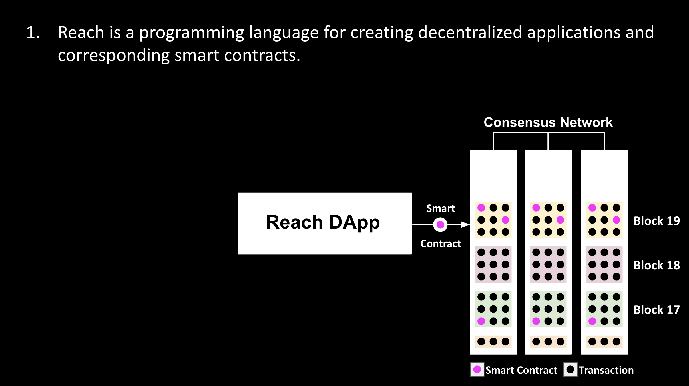

    
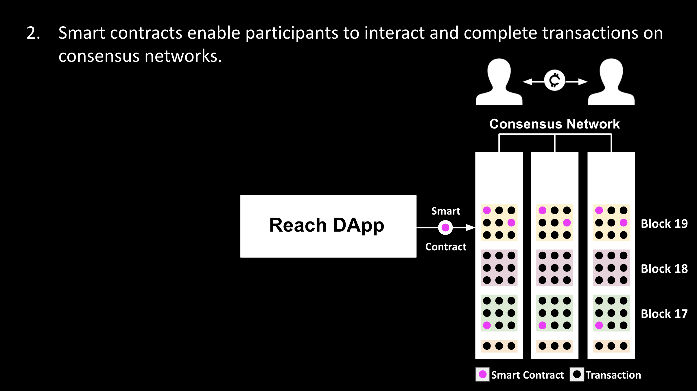

    
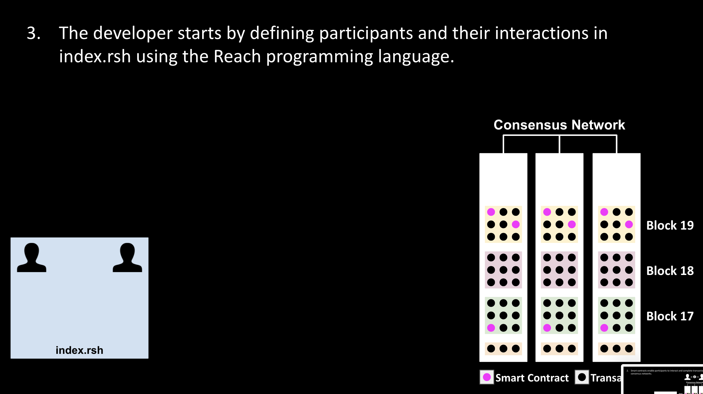

    
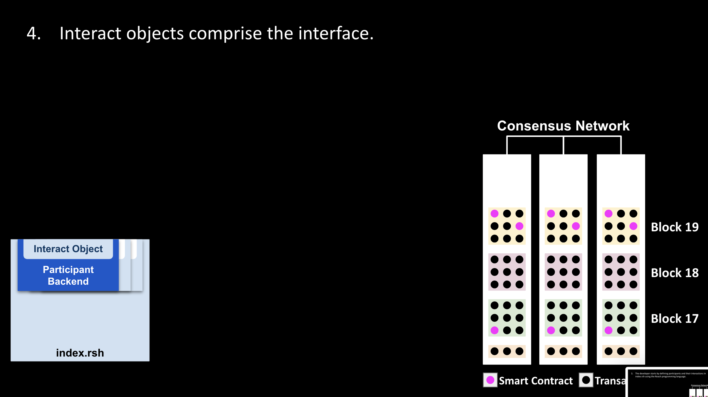

    
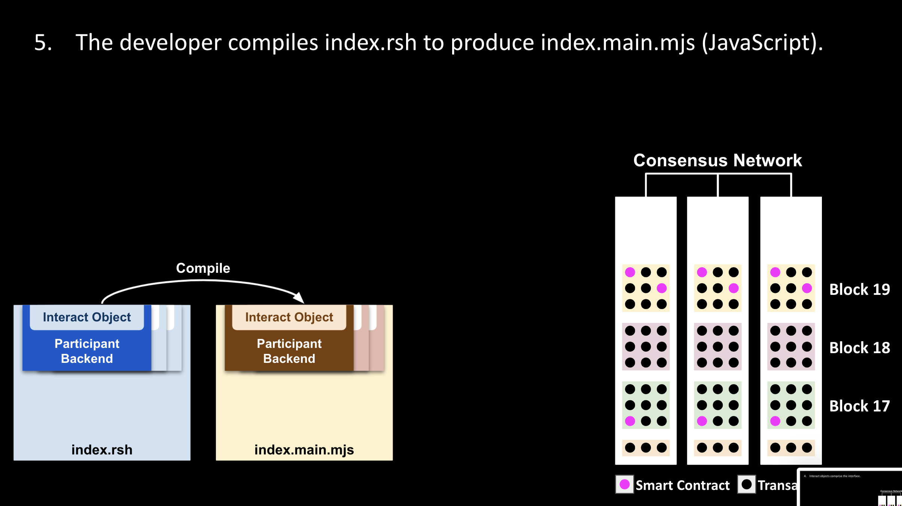

    
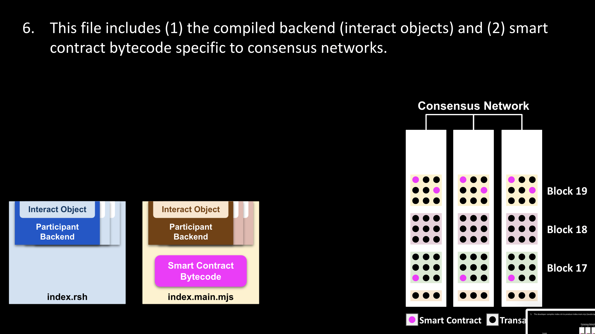

    

    
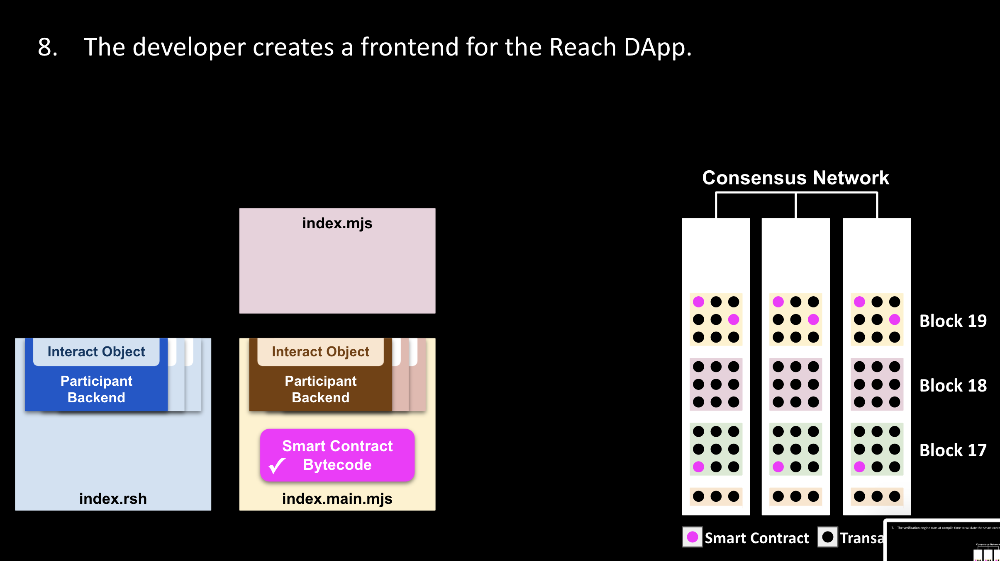

    
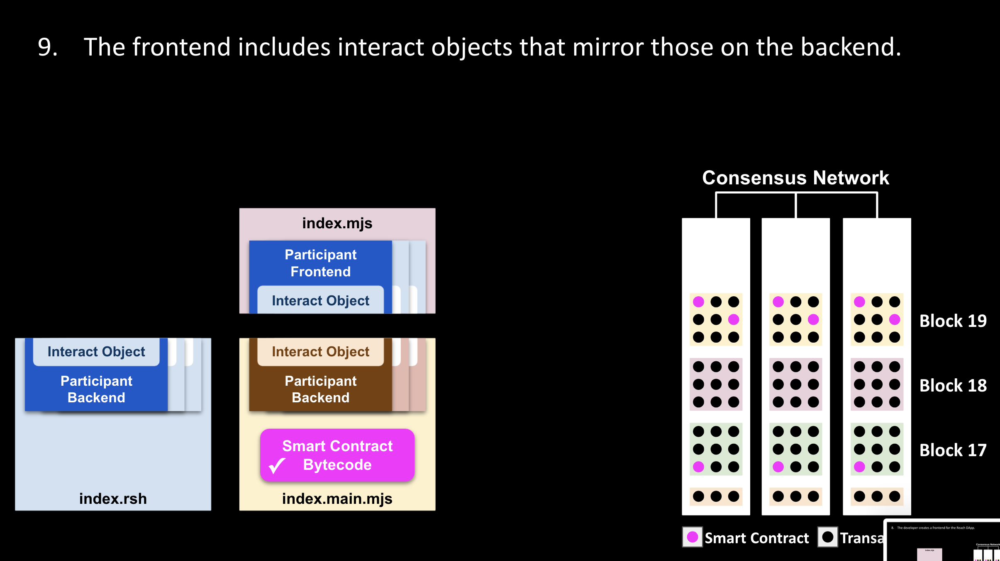

    
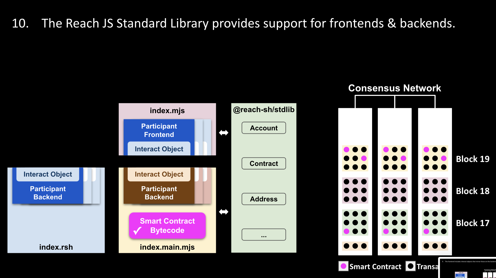

    
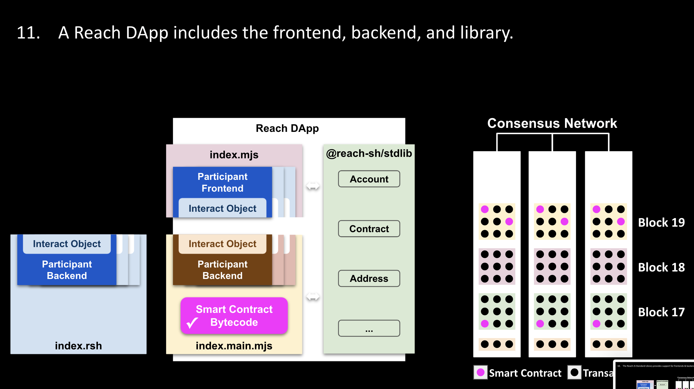

    

    
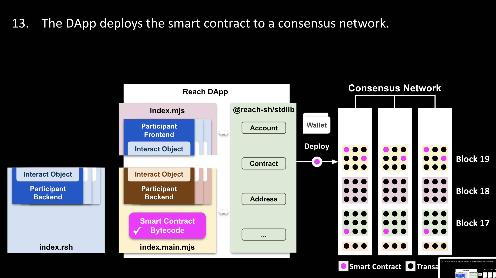

    
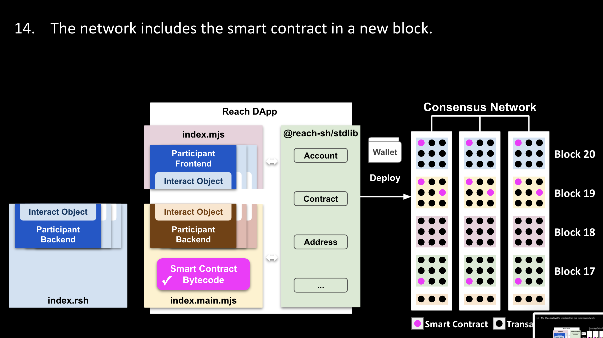

    
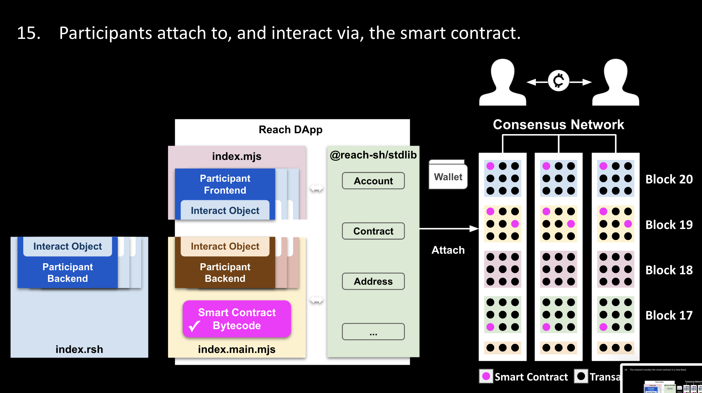

  

  <button class="carousel-control-prev" type="button" data-bs-target="#develop-and-deploy-carousel" data-bs-slide="prev" style="justify-content: left;">
    
    Previous
  </button>
  <button class="carousel-control-next" type="button" data-bs-target="#develop-and-deploy-carousel" data-bs-slide="next" style="justify-content: right;">
    
    Next
  </button>

# Programming Language

Lorem ipsum dolor sit amet, consectetur adipiscing elit, sed do eiusmod tempor incididunt ut labore et dolore magna aliqua. Ut enim ad minim veniam, quis nostrud exercitation ullamco laboris nisi ut aliquip ex ea commodo consequat. Duis aute irure dolor in reprehenderit in voluptate velit esse cillum dolore eu fugiat nulla pariatur. Excepteur sint occaecat cupidatat non proident, sunt in culpa qui officia deserunt mollit anim id est laborum.

# Decentralized Applications

Lorem ipsum dolor sit amet, consectetur adipiscing elit, sed do eiusmod tempor incididunt ut labore et dolore magna aliqua. Ut enim ad minim veniam, quis nostrud exercitation ullamco laboris nisi ut aliquip ex ea commodo consequat. Duis aute irure dolor in reprehenderit in voluptate velit esse cillum dolore eu fugiat nulla pariatur. Excepteur sint occaecat cupidatat non proident, sunt in culpa qui officia deserunt mollit anim id est laborum.

<!--
Creating a Reach DApp does *not* entail implementing a smart contract. Rather, it involves using the Reach programming language to describe, step by step, participant interactions from which the Reach compiler derives a smart contract. The video below provides a mental framework for understanding Reach development and deployment. See also the [Google Slide Presentation](https://docs.google.com/presentation/d/1fzrBNkwzzC7DPL7reAOG6Vwy2bEjLp9CJBLnKAPg2yc/present?usp=sharing).

  <iframe 
    src="https://www.youtube.com/embed/4MJqPNelqCE"
    frameborder="0"  
    allowfullscreen>
  </iframe>

Mentioned in the video are (1) the Reach [JavaScript Standard Library](/en/books/essentials/support-for-js-frontends/) which supports Reach applications by providing properties and methods dealing with accounts, arithmetic, big numbers, comparisons, consensus network providers, contracts, debugging, encryption, randomization, and time, (2) interact objects which are JavaScript objects that enable communication between Reach frontends and backends, explained in detail below, and (3) the Reach Verification Engine which helps to ensure that the immutable smart contract you deploy will run without errors like the error of forgetting to transfer all the otherwise unretrievable tokens out of a smart contract account before the contract exits.
-->

# Smart Contracts

Sed ut perspiciatis unde omnis iste natus error sit voluptatem accusantium doloremque laudantium, totam rem aperiam, eaque ipsa quae ab illo inventore veritatis et quasi architecto beatae vitae dicta sunt explicabo. Nemo enim ipsam voluptatem quia voluptas sit aspernatur aut odit aut fugit, sed quia consequuntur magni dolores eos qui ratione voluptatem sequi nesciunt. Neque porro quisquam est, qui dolorem ipsum quia dolor sit amet, consectetur, adipisci velit, sed quia non numquam eius modi tempora incidunt ut labore et dolore magnam aliquam quaerat voluptatem. Ut enim ad minima veniam, quis nostrum exercitationem ullam corporis suscipit laboriosam, nisi ut aliquid ex ea commodi consequatur? Quis autem vel eum iure reprehenderit qui in ea voluptate velit esse quam nihil molestiae consequatur, vel illum qui dolorem eum fugiat quo voluptas nulla pariatur

# Participants

At vero eos et accusamus et iusto odio dignissimos ducimus qui blanditiis praesentium voluptatum deleniti atque corrupti quos dolores et quas molestias excepturi sint occaecati cupiditate non provident, similique sunt in culpa qui officia deserunt mollitia animi, id est laborum et dolorum fuga. Et harum quidem rerum facilis est et expedita distinctio. Nam libero tempore, cum soluta nobis est eligendi optio cumque nihil impedit quo minus id quod maxime placeat facere possimus, omnis voluptas assumenda est, omnis dolor repellendus. Temporibus autem quibusdam et aut officiis debitis aut rerum necessitatibus saepe eveniet ut et voluptates repudiandae sint et molestiae non recusandae. Itaque earum rerum hic tenetur a sapiente delectus, ut aut reiciendis voluptatibus maiores alias consequatur aut perferendis doloribus asperiores repellat.

# Consensus Networks

Donec erat ex, luctus eu commodo sed, semper a ante. Pellentesque nibh mi, interdum quis tortor at, imperdiet porttitor nibh. Duis sollicitudin lacus eget imperdiet malesuada. Ut et ornare leo. Nunc interdum eget lacus eget mattis. In ullamcorper mollis augue, non faucibus nisi facilisis ac. Ut nulla tellus, vulputate lobortis posuere vulputate, tristique in nisi. Nulla viverra nisl sit amet consectetur pellentesque. Vivamus efficitur odio et auctor scelerisque. Ut elementum ex sit amet ante bibendum fermentum. Vivamus non tortor id arcu mattis ultricies sed vel leo.

# Transactions

Donec lacinia ex nisi, tempus pellentesque ante pharetra blandit. Sed et sem et mauris vulputate tincidunt sit amet a erat. Quisque tortor erat, faucibus lobortis elit at, ornare tincidunt elit. Donec vitae ex id lacus interdum iaculis. Aliquam erat volutpat. Phasellus dui massa, egestas in arcu eu, eleifend vehicula lorem. Aliquam urna nulla, rutrum et elementum et, porta id tortor. Cras aliquet ipsum quam, vel imperdiet dolor sodales sed.

# Frontend/Backend

Donec erat ex, luctus eu commodo sed, semper a ante. Pellentesque nibh mi, interdum quis tortor at, imperdiet porttitor nibh. Duis sollicitudin lacus eget imperdiet malesuada. Ut et ornare leo. Nunc interdum eget lacus eget mattis. In ullamcorper mollis augue, non faucibus nisi facilisis ac. Ut nulla tellus, vulputate lobortis posuere vulputate, tristique in nisi. Nulla viverra nisl sit amet consectetur pellentesque. Vivamus efficitur odio et auctor scelerisque. Ut elementum ex sit amet ante bibendum fermentum. Vivamus non tortor id arcu mattis ultricies sed vel leo.

# Interact Objects

Quisque eget metus id sem lacinia ornare. Mauris tristique, sem a viverra bibendum, nisl sem posuere lectus, at auctor orci orci vitae justo. Vivamus sed ligula et nisl rhoncus pellentesque sed eget diam. Nam sit amet facilisis turpis, vitae feugiat dui. Curabitur feugiat lectus ac ipsum aliquam, in maximus risus fermentum. Cras imperdiet ac arcu quis venenatis. Maecenas mollis posuere arcu, nec aliquet odio cursus id. Cras mattis tincidunt ligula, eget tempor ipsum egestas eu. In lorem elit, aliquet eget est vitae, faucibus ultrices nisi.

# Verification

At vero eos et accusamus et iusto odio dignissimos ducimus qui blanditiis praesentium voluptatum deleniti atque corrupti quos dolores et quas molestias excepturi sint occaecati cupiditate non provident, similique sunt in culpa qui officia deserunt mollitia animi, id est laborum et dolorum fuga. Et harum quidem rerum facilis est et expedita distinctio. Nam libero tempore, cum soluta nobis est eligendi optio cumque nihil impedit quo minus id quod maxime placeat facere possimus, omnis voluptas assumenda est, omnis dolor repellendus. Temporibus autem quibusdam et aut officiis debitis aut rerum necessitatibus saepe eveniet ut et voluptates repudiandae sint et molestiae non recusandae. Itaque earum rerum hic tenetur a sapiente delectus, ut aut reiciendis voluptatibus maiores alias consequatur aut perferendis doloribus asperiores repellat.

# Standard Library

Quisque eget metus id sem lacinia ornare. Mauris tristique, sem a viverra bibendum, nisl sem posuere lectus, at auctor orci orci vitae justo. Vivamus sed ligula et nisl rhoncus pellentesque sed eget diam. Nam sit amet facilisis turpis, vitae feugiat dui. Curabitur feugiat lectus ac ipsum aliquam, in maximus risus fermentum. Cras imperdiet ac arcu quis venenatis. Maecenas mollis posuere arcu, nec aliquet odio cursus id. Cras mattis tincidunt ligula, eget tempor ipsum egestas eu. In lorem elit, aliquet eget est vitae, faucibus ultrices nisi.

# Frontend/Backend

Donec erat ex, luctus eu commodo sed, semper a ante. Pellentesque nibh mi, interdum quis tortor at, imperdiet porttitor nibh. Duis sollicitudin lacus eget imperdiet malesuada. Ut et ornare leo. Nunc interdum eget lacus eget mattis. In ullamcorper mollis augue, non faucibus nisi facilisis ac. Ut nulla tellus, vulputate lobortis posuere vulputate, tristique in nisi. Nulla viverra nisl sit amet consectetur pellentesque. Vivamus efficitur odio et auctor scelerisque. Ut elementum ex sit amet ante bibendum fermentum. Vivamus non tortor id arcu mattis ultricies sed vel leo.

# Accounts and Wallets

Quisque eget metus id sem lacinia ornare. Mauris tristique, sem a viverra bibendum, nisl sem posuere lectus, at auctor orci orci vitae justo. Vivamus sed ligula et nisl rhoncus pellentesque sed eget diam. Nam sit amet facilisis turpis, vitae feugiat dui. Curabitur feugiat lectus ac ipsum aliquam, in maximus risus fermentum. Cras imperdiet ac arcu quis venenatis. Maecenas mollis posuere arcu, nec aliquet odio cursus id. Cras mattis tincidunt ligula, eget tempor ipsum egestas eu. In lorem elit, aliquet eget est vitae, faucibus ultrices nisi.