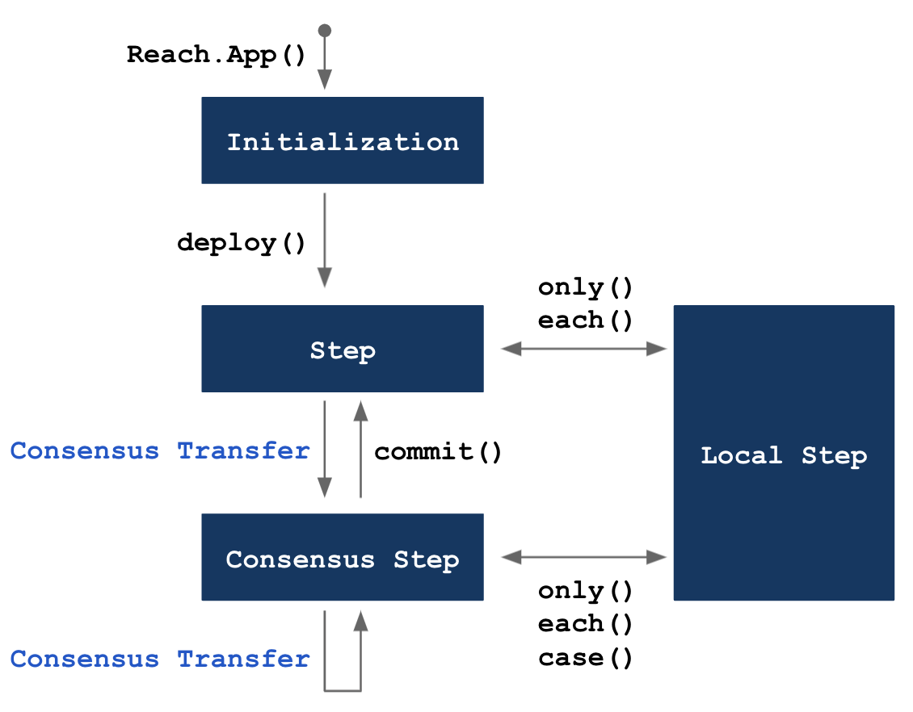

# Reach Modes

Reach programs are organized into four modes: 

1. [Initialization](#initialization) defines Participants, Views, and APIs, and, optionally, overrides default compilation settings.
1. [Step](#step) defines actions taken by all participants.
1. [Local Step](#local-step) defines actions taken by a particular participant.
1. [Consensus Step](#consensus-step) defines actions taken by the contract.

# Transitions

The following diagram indicates mode transitions:

<div></div>

# Consensus Transfers

A consensus transfer is a statement or expression that (a) facilitates agreement among participants, (b) transitions to a consensus step, and (3) records the agreement as a transaction on the distributed ledger (i.e. blockchain) of the consensus network. These actions include `publish`, `pay`, `race`, `fork`, and `parallelReduce`. The developer chooses which consensus transfer to use depending on the number of participants, tasks, and iterations:

|# Participants|# Tasks|# Iterations|Consensus Transfer|
|-|-|-|-|
|One|One|One|`publish` or `pay`|
|Many|One|One|`race`|
|Many|Many|One|`fork`|
|Many|Many|Many|`parallelReduce`|

The following list describes when to use each type of consensus transfer:

* Use `publish` to cause one participant to make a value (e.g. the price of an item) available to all other participants.
* Use `pay` to cause one participant to pay an amount to the contract account.
* Use `race` when multiple participants are racing to `publish` or `pay`.
* Use `fork` when multiple participants are racing to do different actions. 
* Use `parallelReduce` when muliple participants are iteratively racing or forking.

`commit` transitions from a consensus step to a step.

# Modes

## Initialization

The Reach compiler recognizes `export const main = Reach.App(() => {}` as a Reach DApp. Initialization Mode is the first part of `Reach.App`, ending when `deploy()` transitions to Step Mode:

``` js
export const main = Reach.App(() => {
  // Initialization Mode
  setOptions({ verifyArithmetic: true, connectors: [ETH, ALGO ] });
  const S = Participant('Seller', sellerInteract);
  const B = Participant('Buyer', buyerInteract);
  const V = View('View', { price: UInt });
  const A = API('Voter', { write: Fun([UInt], State) });
  deploy();
  // Step Mode
  // ...
});
```

* Line 1: `Reach.App` accepts a no-argument function that specifies a DApp.
* Line 3: Optionally, `setOptions` overrides default compile options.
* Line 4-5: `Participant` specifies DApp participants.
* Line 6: `View` specifies a DApp view through which non-participants can see public variables.
* Line 7: `API` specifies a DApp API offering member functions.
* Line 8: The `deploy` function transitions from Initialization mode to Step mode.

Statements and expressions unique to Initialization Mode include the following:

* [API](/en/essentials/backend-programming/reach-types/#api)
* [deploy](/en/essentials/backend-programming/reach-statements/#deploy)
* [Participant](/en/essentials/backend-programming/reach-types/#participant)
* [ParticipantClass](/en/essentials/backend-programming/reach-types/#participant-class)
* [setOptions](/en/essentials/backend-programming/reach-statements/#setoptions)
* [View](/en/essentials/backend-programming/reach-types/#view)

## Step

A *Step* consists of actions that apply to all participants. Statements and expressions unique (or partially unique) to Step Mode include the following:

* [call](/en/essentials/backend-programming/reach-expressions/#call)
* [closeTo](/en/essentials/backend-programming/reach-expressions/#closeto)
* [exit](/en/essentials/backend-programming/reach-statements/#exit)
* [fork](/en/essentials/backend-programming/reach-statements/#fork)
* [each, only](/en/essentials/backend-programming/reach-statements/#only)
* [publish, pay, when, timeout](/en/essentials/backend-programming/reach-statements/#publish)
* [race](/en/essentials/backend-programming/reach-expressions/#race)
* [unknowable](/en/essentials/backend-programming/reach-expressions/#unknowable)
* [wait](/en/essentials/backend-programming/reach-statements/#wait)

## Local Step

A *Local Step* occurs in the body of [each and only](/en/essentials/backend-programming/reach-statements/#only) statements. It represents the actions taken by a single participant in an application. Inside a local step, `this` refers to the participant performing the step which is useful when the local step was initiated by an `each` expression. Statements and expressions unique to Local Step Mode include the following:

* [assume](/en/essentials/backend-programming/reach-expressions/#assume)
* [declassify](/en/essentials/backend-programming/reach-expressions/#declassify)
* [didPublish](/en/essentials/backend-programming/reach-expressions/#didpublish)
* [fail](/en/essentials/backend-programming/reach-expressions/#fail)
* [interact](/en/essentials/backend-programming/reach-expressions/#interact)
* [makeCommitment](/en/essentials/backend-programming/reach-expressions/#makecommitment)

## Consensus Step

A *Consensus Step* occurs in the continuation of a consensus transfer statement. It represents the actions taken by the consensus network contract of an application. Inside a consensus step, `this` refers to the address of the participant that performed the consensus transfer. This is useful when the consensus transfer was initiated by a race expression. Statements and expressions unique (or partially unique) to Consensus Step Mode include the following:

* [checkCommitment](/en/essentials/backend-programming/reach-expressions/#checkcommitment)
* [commit](/en/essentials/backend-programming/reach-statements/#commit)
* [continue](/en/essentials/backend-programming/reach-statements/#continue)
* [each, only](/en/essentials/backend-programming/reach-statements/#only)
* [Map](/en/essentials/backend-programming/reach-types/#map)
* [parallelReduce](/en/essentials/backend-programming/reach-statements/#parallelreduce)
* [remote](/en/essentials/backend-programming/reach-types/#remote)
* [require](/en/essentials/backend-programming/reach-expressions/#require)
* [Set](/en/essentials/backend-programming/reach-types/#set)
* [throughTimeout](/en/essentials/backend-programming/reach-expressions/#throughtimeout)
* [timeRemaining](/en/essentials/backend-programming/reach-expressions/#timeremaining)
* [Token](/en/essentials/backend-programming/reach-types/#token)
* [transfer](/en/essentials/backend-programming/reach-types/#transfer)
* [while](/en/essentials/backend-programming/reach-statements/#while)
