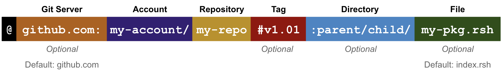

# Reach Modules

Reach modules are specified in source files with `.rsh` extensions (e.g. *index.rsh* or *dao.rsh*). Here is a simple example:

``` js
'reach 0.1';
export const main = Reach.App(() => {
  const S = Participant('Seller', {});
  const B = Participant('Buyer', {});
  deploy();
  exit();
});
```

* Line 1: Reach compiler version (major and minor numbers,  but no patch number).
* Line 2: Application initialization function. 
* Line 3-4: Expressions that instantiate participants.
* Line 5: Statement that transitions from Initialization mode to Step mode,
* Line 6: Statement that halts computation.

In addition to the statements and expressions found in [Reach Syntax](/en/essentials/backend-programming/reach-syntax/), modules support the additional statements and expression described below.

# export

The `export` statement exports definitions allowing other modules to import them. Here are three valid exports:

``` js nonum
export const x = 1;
export const [a, b, ...more] = [ 0, 1, 2, 3, 4 ];
export function add1(x) { return x + 1; };
```

You can use `export` to export and rename definitions after the fact, too:

``` js nonum
const w = 2;
const z = 0;
export {w, z as zero};
```

And, you can use `export` to re-export and rename identifiers from other modules even if you do not import these identifiers into the current module:

``` js nonum
export {u, x as other_x} from './other-module.rsh';
```

Frontends use the [Reach JS Standard Library](http://localhost:8081/en/essentials/frontend-programming/javascript-frontends/) `getExports` method to access backend exports.

# import

The `import` statement imports (into the current module) definitions from other Reach modules. Reach supports *local* and *package* imports. 

## Local

A *local import* imports (into the current module) other modules in your project:

``` js nonum
import 'games-of-chance.rsh';
```

When a module, `X`, contains a local import, written `import "LIB.rsh";`, then the path `"LIB.rsh"` must resolve to another Reach source file. The exports from the module defined by `"LIB.rsh"` are included in the set of bound identifiers in `X`:

``` js nonum
import {flipCoin, rollDice as d6} from 'games-of-chance.rsh';
```

Import statements may limit or rename the imported identifiers:

``` js nonum
import * as gamesOfChance from 'games-of-chance.rsh';
```

Imports may also bind the entire module to a single identifier which is an object with fields corresponding to that module’s exports. Import cycles are invalid. The path given to an import may not include `..` to specify files outside the current directory, nor may it be an absolute path. It must be a relative path which is resolved relative to the parent directory of the source file in which it appears.

## Package

A *package import* imports (into the local module) remote libraries that may be fetched from [Github](https://github.com/) or other sources:

``` js nonum
import * as func from '@reach-sh/reach-example-package';
import * as func from '@reach-sh/reach-example-package:src/func.rsh';
import * as func from '@github.com:reach-sh/reach-example-package#main:src/func.rsh';
```

Package imports obey the same rules as local imports, but they support the following extended path syntax which allows Reach programmers to seamlessly plug into third-party libraries hosted on the internet:

<div></div>

Note the following:

1. All valid package imports must begin with the `@` character.
1. If you do not specify a *Tag*, Reach defaults to the master branch and then the main branch.
1. If you do specify a *Tag*, use git tags to denote version releases (e.g. `v0.2.1`). Branch names also work.

Below are several pseudo examples:

``` js nonum
@account/repo
@account/repo:
@account/repo:a/b/file.rsh
@account/repo:a/b/
@account/repo:file.rsh
@account/repo#
@account/repo#:
@account/repo#:a/b/file.rsh
@account/repo#:a/b/
@account/repo#:file.rsh
@account/repo#ref
@account/repo#ref:
@account/repo#ref:a/b/file.rsh
@account/repo#ref:a/b/
@account/repo#ref:file.rsh
   
@server:account/repo
@server:account/repo:
@server:account/repo:a/b/file.rsh
@server:account/repo:a/b/
@server:account/repo:file.rsh
@server:account/repo#
@server:account/repo#:
@server:account/repo#:a/b/file.rsh
@server:account/repo#:a/b/
@server:account/repo#:file.rsh
@server:account/repo#ref
@server:account/repo#ref:
@server:account/repo#ref:a/b/file.rsh
@server:account/repo#ref:a/b/
@server:account/repo#ref:file.rsh
```

Since git repositories evolve and change over time, Reach takes extra steps in order to pin a given module import’s version to the specific SHA hash of the specified revision at the time the package is first installed. These pins are stored in a [lockfile](/en/essentials/backend-programming/reach-script/#reach-compile), which should be included in your source control system.

# Reach.App

The `Reach.App` expression accepts a no-argument function (e.g. `() => {}`) that specifies the entire DApp between its curly braces:

``` js
const sellerInteract = {
  displayResult: Fun(Int, Null) 
};

export const main = Reach.App(() => {
  const S = Participant('Seller', sellerInteract);
  deploy();

  const result = 0;
  S.only(() => { interact.displayResult(result); });

 exit();
});
```

* Line 5: The function starts in [Initialization](/en/essentials/backend-programming/reach-modes/#initialization) mode.
* Line 7: `deploy()` transitions the function to [Step](/en/essentials/backend-programming/reach-modes/#step) mode.

