# Reach Essentials

Reach is a programming language for building blockchain applications and the smart contracts they deploy to consensus networks. View the carousel to learn more:

  

    
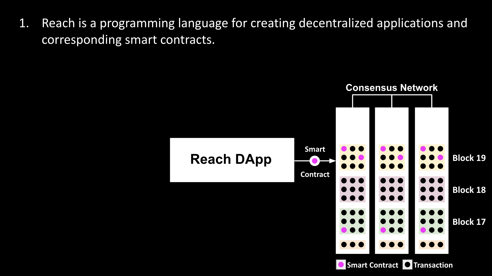

    
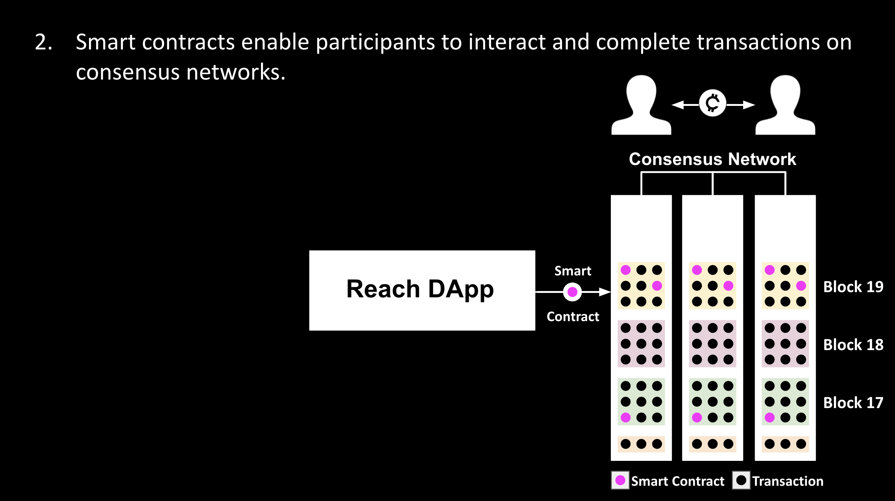

    
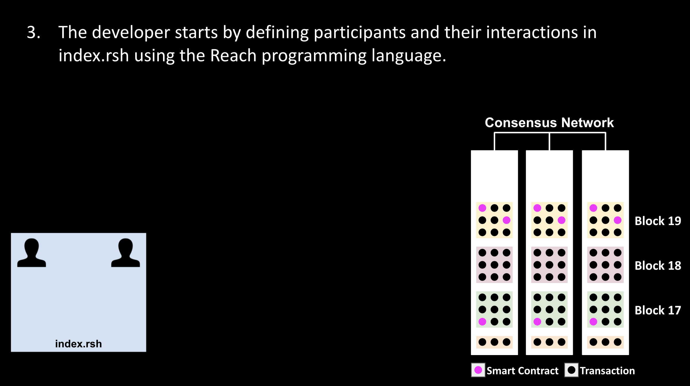

    
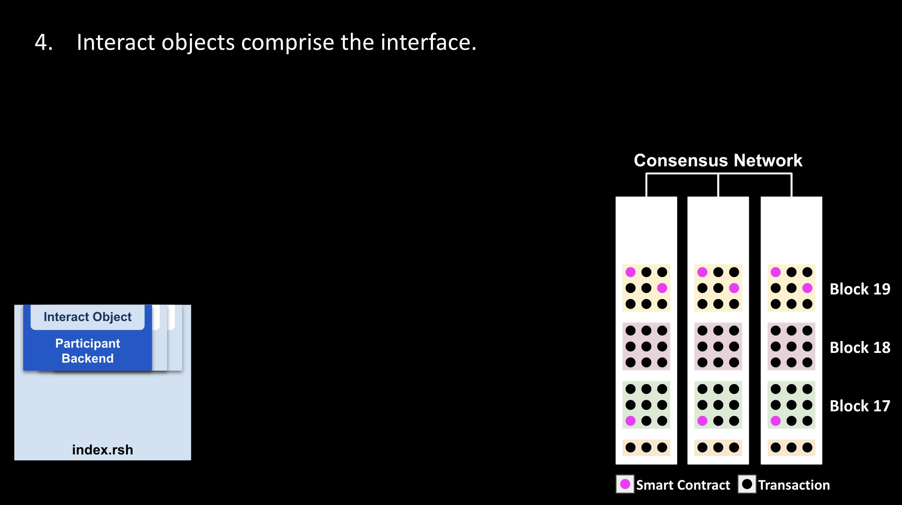

    
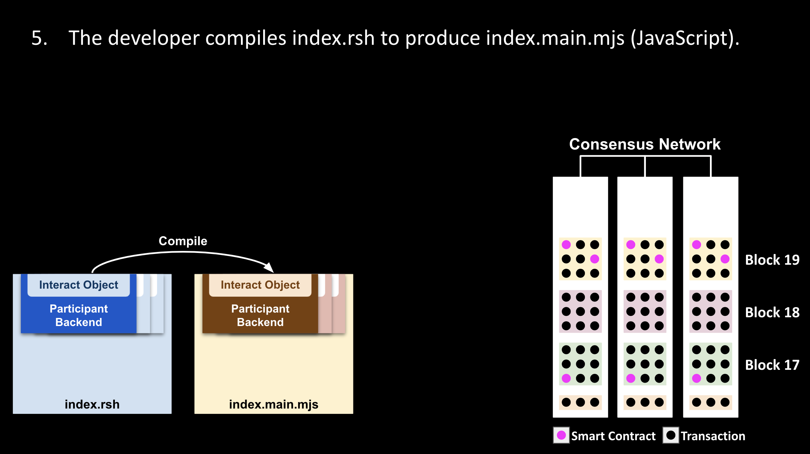

    

    
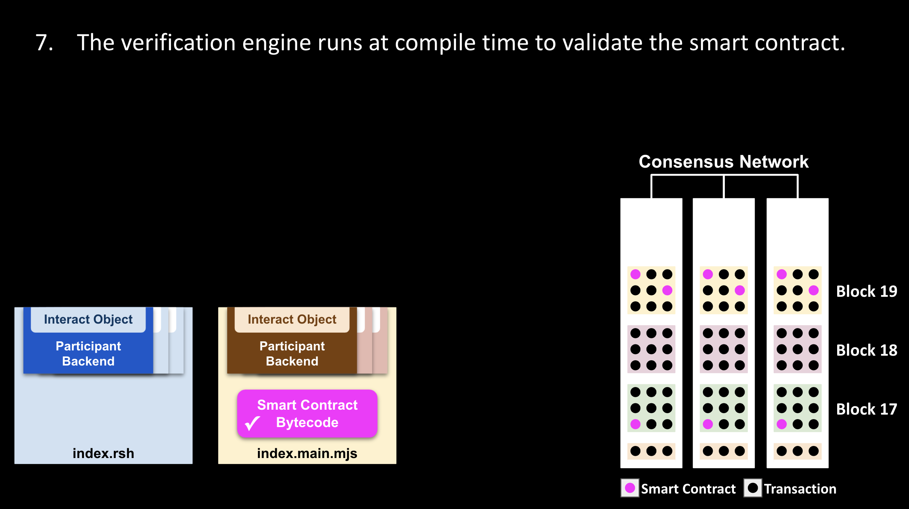

    
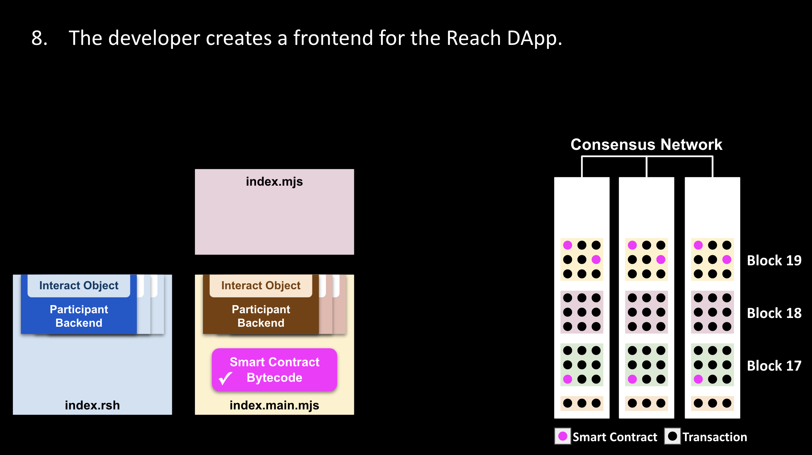

    
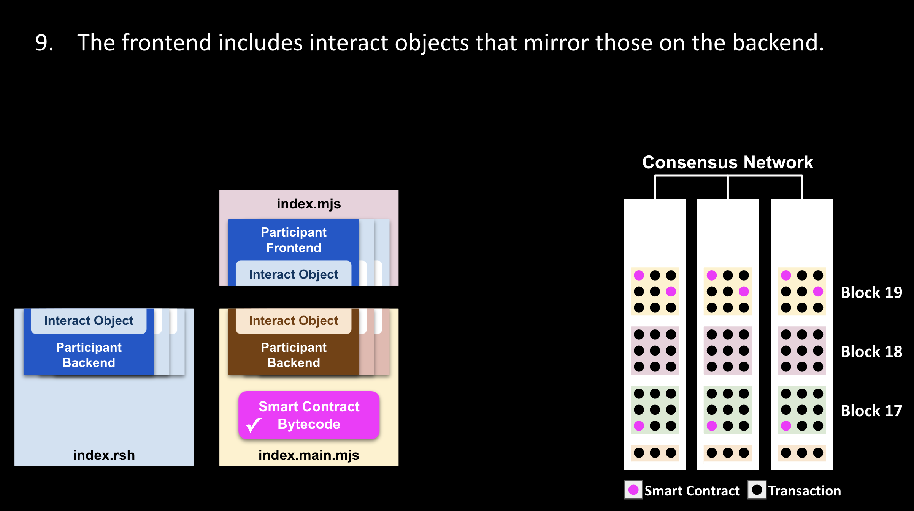

    
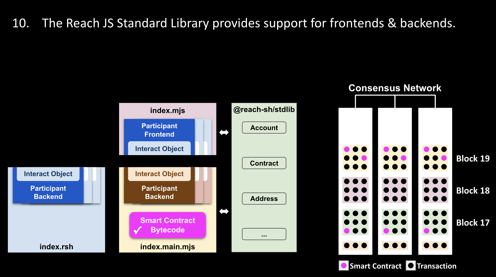

    
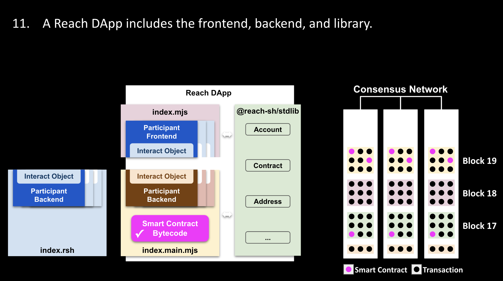

    
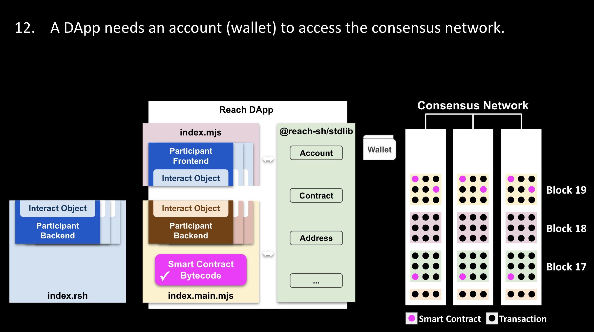

    
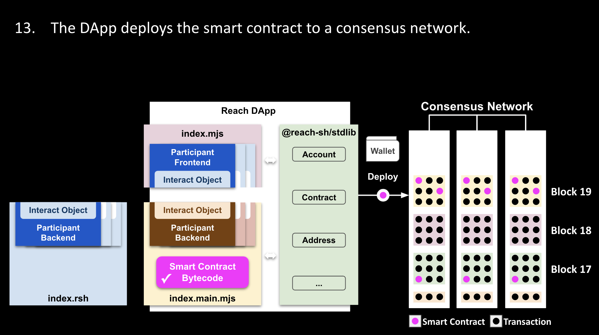

    
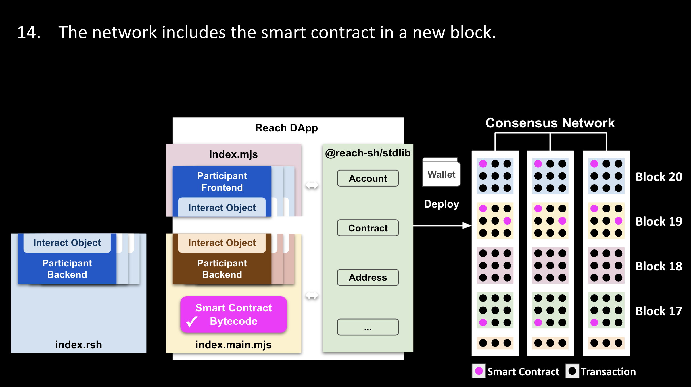

    
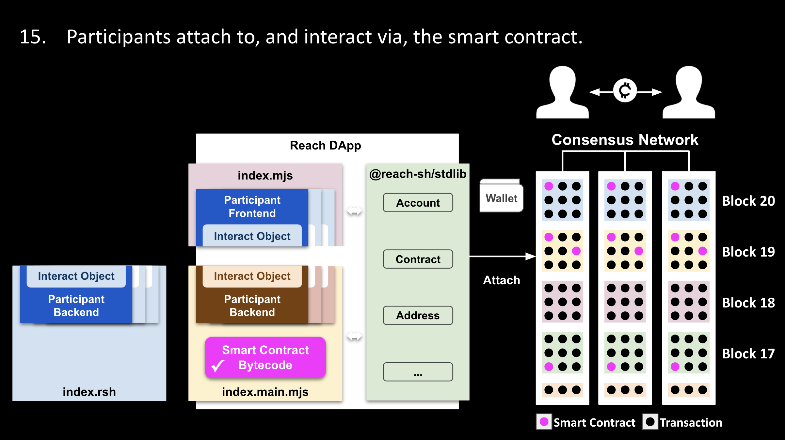

  

  <button class="carousel-control-prev" type="button" data-bs-target="#develop-and-deploy-carousel" data-bs-slide="prev" style="justify-content: left;">
    
    Previous
  </button>
  <button class="carousel-control-next" type="button" data-bs-target="#develop-and-deploy-carousel" data-bs-slide="next" style="justify-content: right;">
    
    Next
  </button>

# Reach DApps

Reach decentralized applications (DApps) enable participants to perform valid negotiations and transactions via smart contracts running on consensus networks. Consider this diagram:

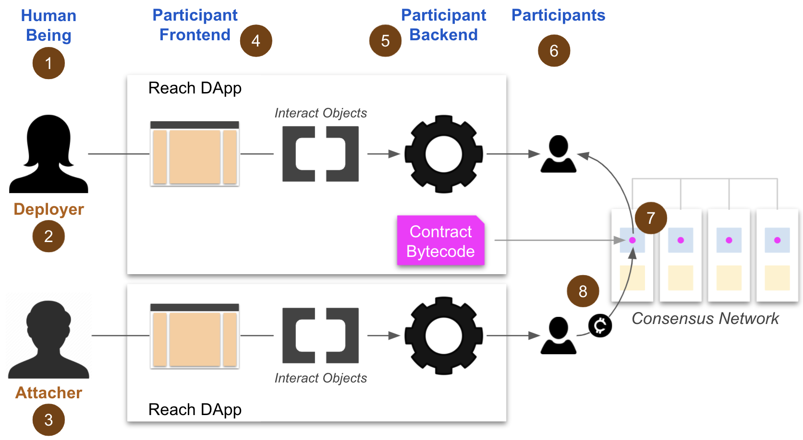

Match the items below to the numbers in the diagram:

1. Human beings give direction and receive information via user interfaces.
1. The deployer deploys the contract to a consensus network.
1. The attacher attaches to the contract and interacts with the deployer and/or other attachers.
1. Participant frontends include UIs and participant interact objects which facilitate communication with backends.
1. Participant backends facilitate communication between frontends and contracts.
1. Participants represent human beings in contract negotiations and transactions.
1. Contracts enable participants to interact, and they enforce rules including order of operation.
1. Buyer accounts *pay* currency to contract accounts which *transfer* currency to seller accounts.

In Reach, a programmer need only specify the actions of participants, what they do individually and what they do in unison. The Reach compiler automatically derives a contract for the consensus network via a connector that enforces these rules.

# Frontend and Backend

In Reach, the terms *frontend* and *backend* denote two halves of a Reach DApp, halves that communicate via interact objects. The following diagram highlights the frontend:

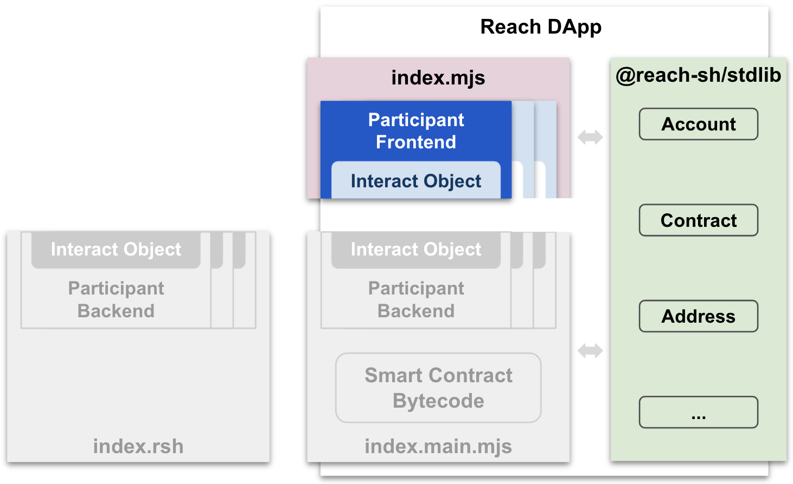

Actually, developers write frontends in one of two ways:

1. Using JavaScript and the Reach JS Standard Library as seen in the diagram.
1. Using C#, Go, JavaScript, or Python and the relevant RPC library accessing the Reach RPC Server.

A pre-compiled backend, on the other hand, is written in the Reach programming language as highlighted in this diagram:

The Reach compiler transforms Reach code into the executable backend (JavaScript) and the smart contract (network-specific bytecode) as highlighted in this diagram:

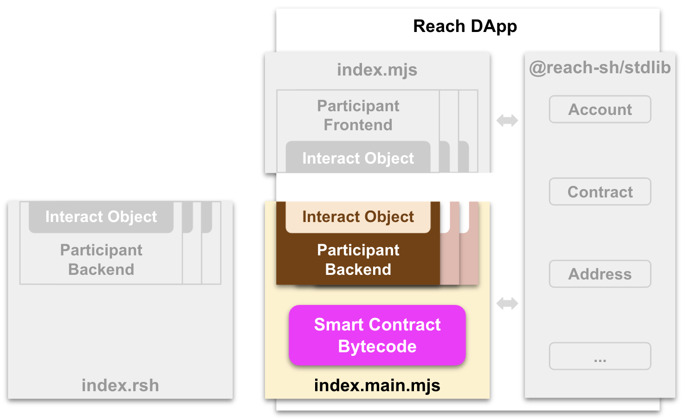

# Interact Objects

For each participant, a Reach DApp requires two interact objects, a frontend JavaScript object and a corresponding backend Reach object. The following diagram shows the frontend and backend interact objects for some *seller* participant:

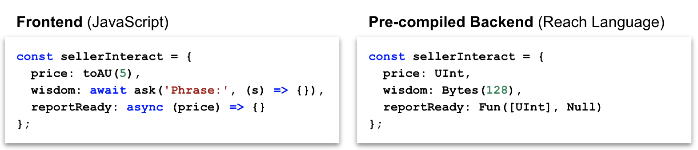

Frontend/backend pairs of interact objects form a communication pipeline between participant frontends and backends. In the diagram above, for example, the backend can call `reportReady` (passing an unsigned integer representing a price) which enables the frontend to do something with `price` like display it to the user.

You can factor properties and methods common to multiple participant interact objects into a `commonInteract` object, and then *spread* the common object into the various participant objects:

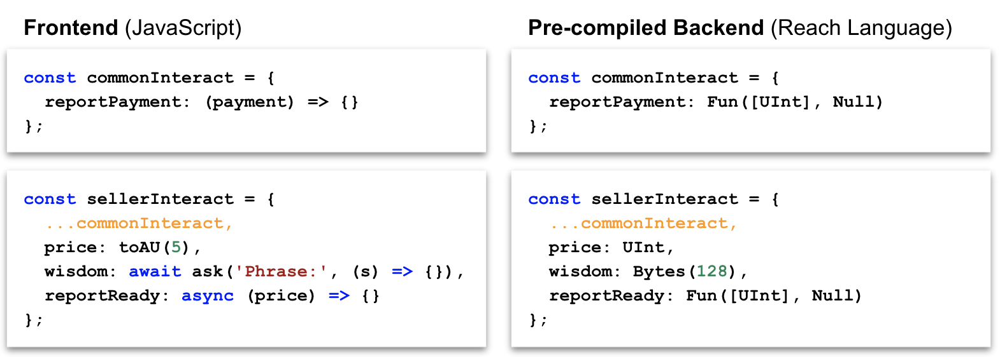

The following diagram provides a broader perspective:

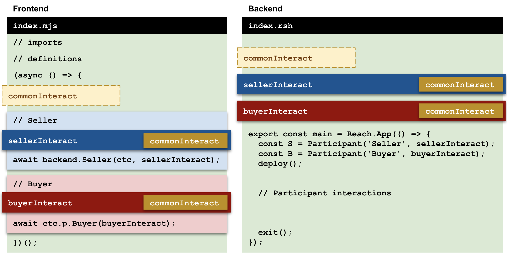
