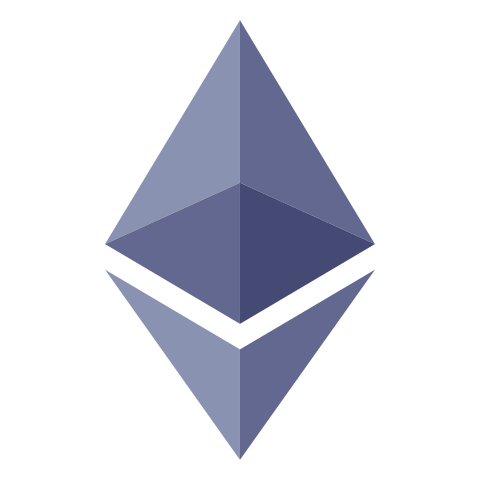

# Network Connectors

  <a href="/en/essentials/network-connectors/algorand/">
    

      

        
      

      

        

          <h5 class="card-title">Algorand</h5>
          
The Reach Algorand connector enables Reach DApps to deploy and interact with smart contracts on Algorand consensus networks.

        

      

    

  </a>

  <a href="/en/essentials/network-connectors/conflux/">
    

      

        
      

      

        

          <h5 class="card-title">Conflux</h5>
          
The Reach Conflux connector enables Reach DApps to deploy and interact with smart contracts on Conflux consensus networks.

        

      

    

  </a>

  <a href="/en/essentials/network-connectors/ethereum/">
    

      

        
      

      

        

          <h5 class="card-title">Ethereum</h5>
          
The Reach Ethereum connector enables Reach DApps to deploy and interact with smart contracts on Ethereum consensus networks.

        

      

    

  </a>

