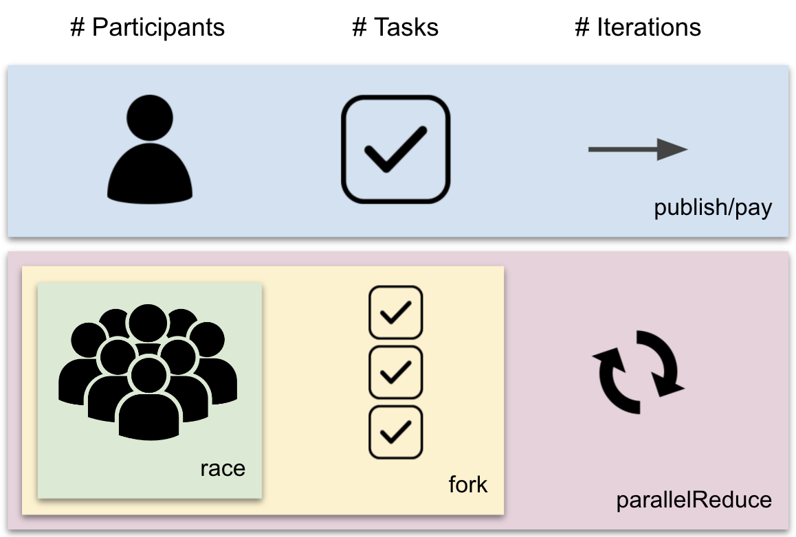

# What do the different consensus transfers mean?

A fundamental concept in Reach is that the application starts in a detached birds-eye perspective called a step where each of the participants is acting completely independently. These independent steps are punctuated by consensus transfers which cause all of the participants to come together and agree on the computation, which is called a consensus step. These consensus steps are what happen "on-chain" and are executed by a so-called "smart contract".

There are many ways to perform a consensus transfer in Reach and each is used for different reasons. The variety can feel a bit bewildering for new users, but here is an intuitive guide to help you decide which you need for any given situation.

## Waiting on one

If the entire DApp is waiting for a single participant to act, such as when at a play the entire theatre waits in anticipation for the stage hands to draw the curtains, then you either need a `pay` or `publish`. If the single participant is sharing information, then you need a `publish`; but if they are only paying a previously known amount, then you need a `pay`. This kind of transfer always explicitly names the party acting, as in:

```js nonum
Auctioneer.publish(openingBid);
```

`pay` and `publish` without a `race` are for when one participant wants to do one thing.

## Competing to go

If the entire DApp has a clear "next step", but multiple participants are able to provide the values used in that step, then you need a `race` to determine the participant used for a `publish` or `pay`. For example, in a radio call-in contest, there is one chance for a listener to call-in first and win the prize. If a participant value is participant class, then all of its actions are `race`s, because the Reach identifier does not represent a specific principal, but a member of a large class. `race`, and participant classes are for when many participants want to do one thing.

## Doing different things

If the DApp doesn't have a clear next step, but multiple participants each have a different option for what the next step should be, then you need a `fork`. For example, a sale DApp might have a buy option and a bid option where the first immediately ends the computation, while the second moves it to an auction. `fork` is for when many participants want to each do a different thing.

## Again and again

If you are in a situation where a `race` or `fork` is needed, and the options are available repeatedly after small diversions, then you need a `parallelReduce`. For example, in an auction, bidders repeatedly provide new bids as they compete to be the highest bidder before a time limit is reached.

## Summary

Determining which consensus transfer to use depends on the answers to three questions:

1. How many participants can act? One or many?
1. How many tasks can be done? One or many?
1. How many times can this be done? Once or many?

* If it happens many times, you want `parallelReduce`.
* If many tasks could happen, you want `fork`.
* If many participants can act, you want `race`.
* Otherwise, you want `publish` or `pay`.

The following diagram summarizes:

<p></p>

This article uses the word "need" when talking about `fork` and `parallelReduce`, but actually you never need these, because they are just abbreviations of particular patterns of using the other features. `fork` works by having each participant `race` to provide a `Data` instance, where the single consensus step does a case analysis on the `Data` to determine which code to run. Similarly, `parallelReduce` is just an abbreviation of a `fork` within a `while` loop.
