# Artwork

## Reach to Blockchain

  

    
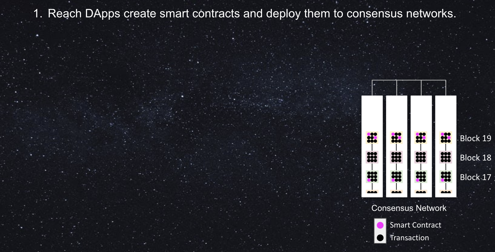

    
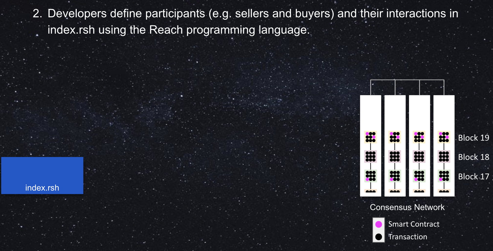

    
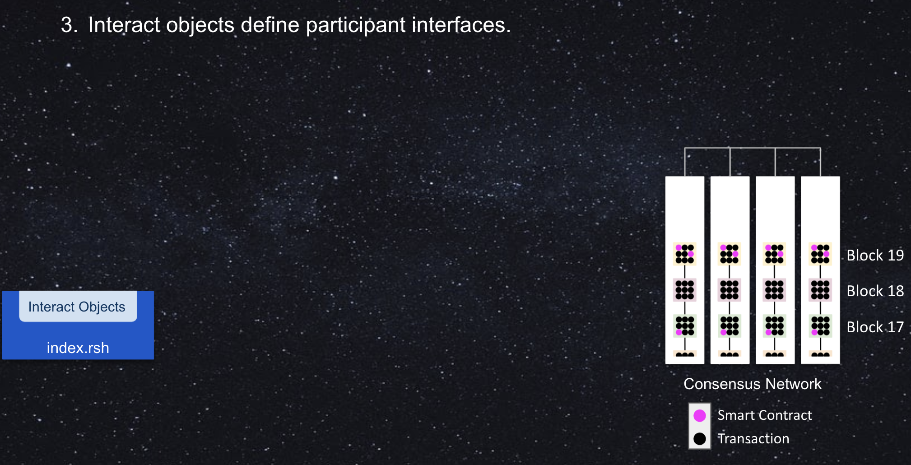

    
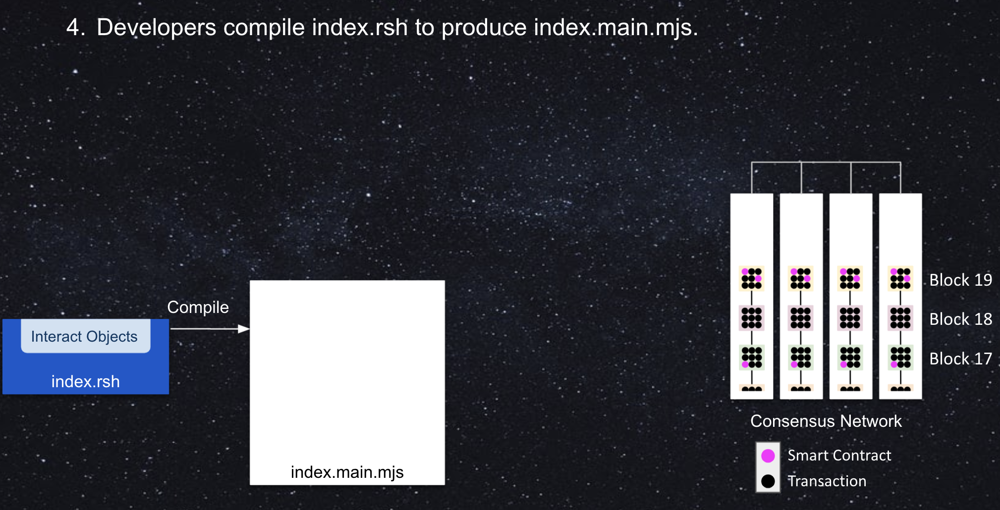

    
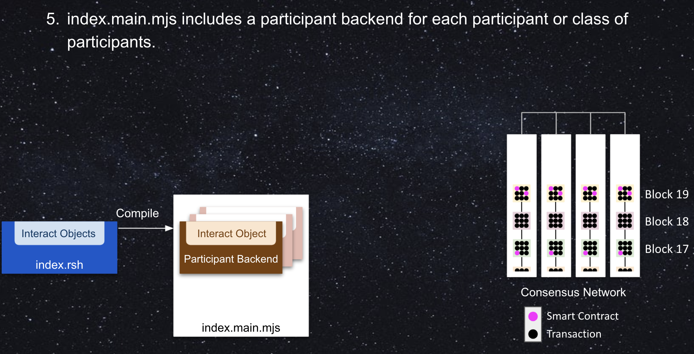

    
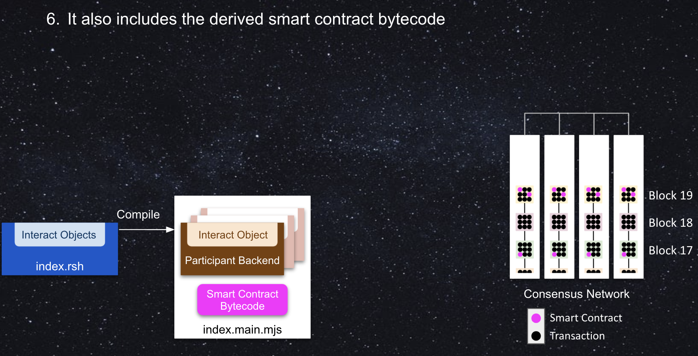

    
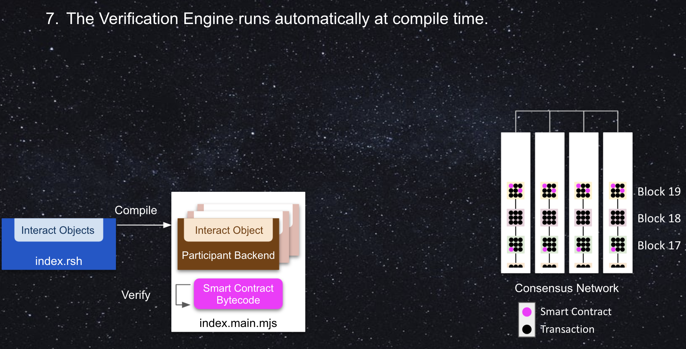

    
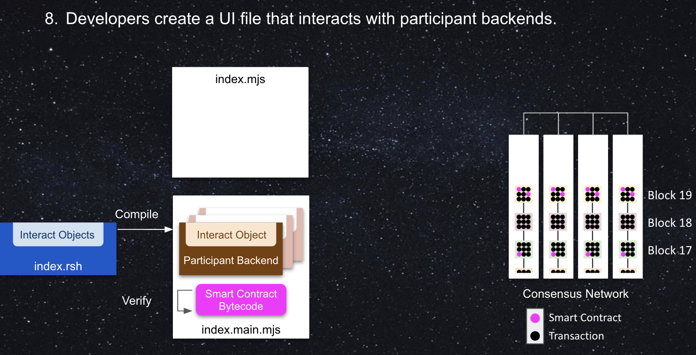

    
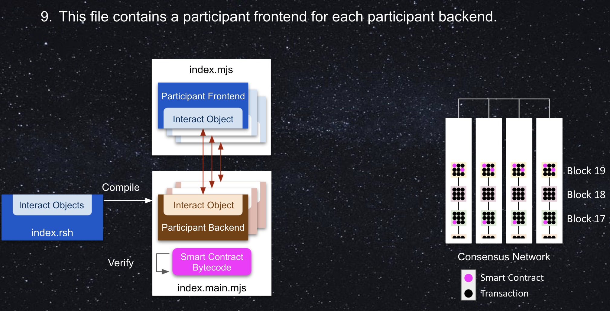

    
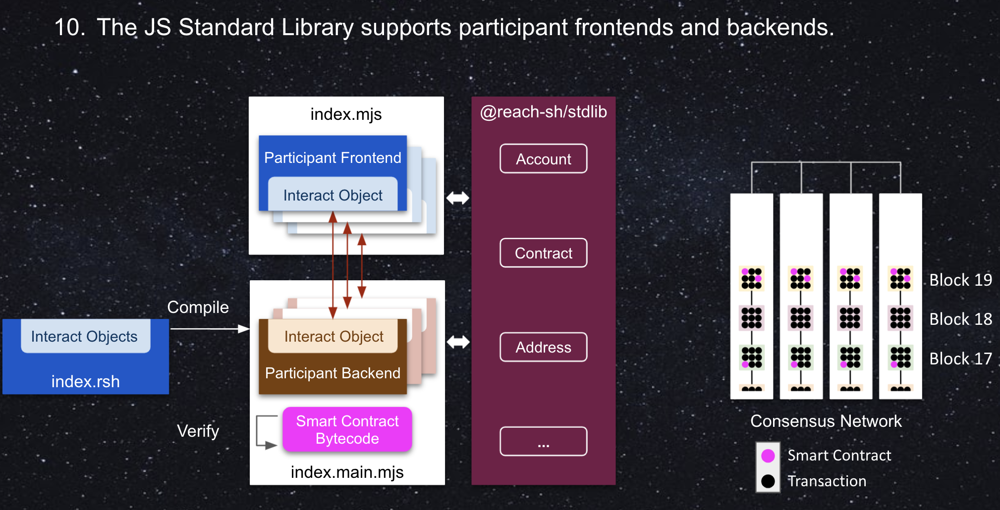

    
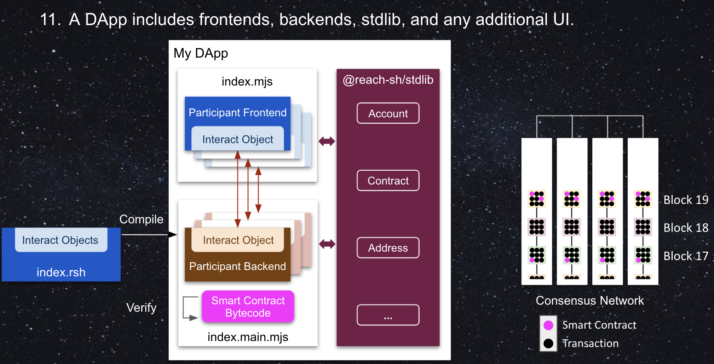

    

    
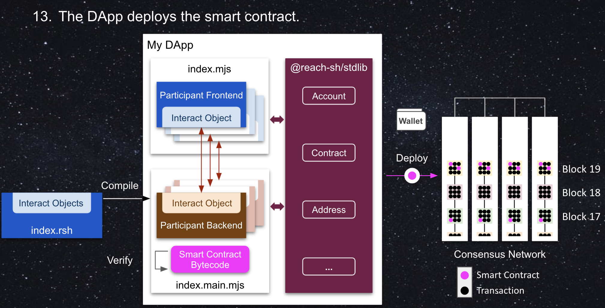

    
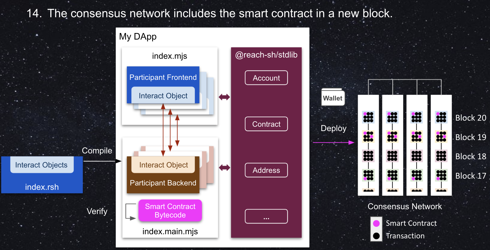

    
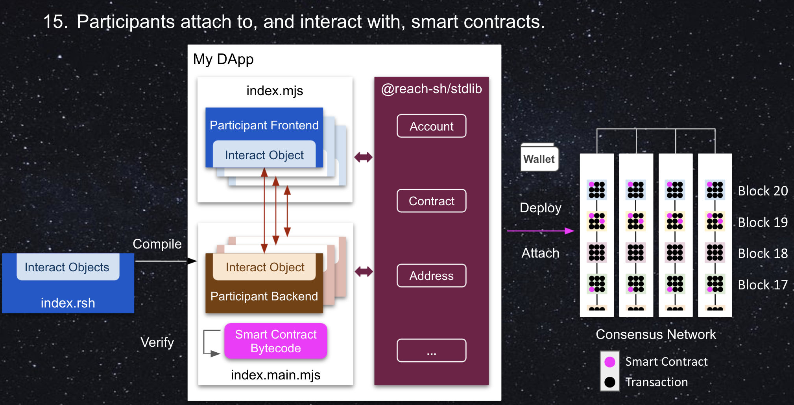

  

  <button class="carousel-control-prev" type="button" data-bs-target="#reach-slides" data-bs-slide="prev">
    
    Previous
  </button>
  <button class="carousel-control-next" type="button" data-bs-target="#reach-slides" data-bs-slide="next">
    
    Next
  </button>

## RD-001.png

A Reach DApp enables human beings to exchange value via a consensus network. 

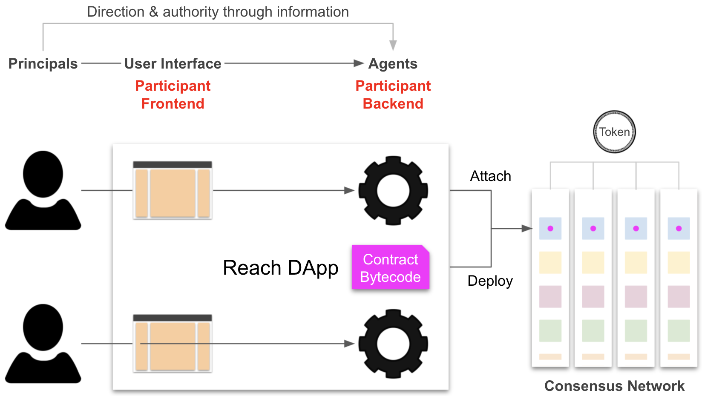
