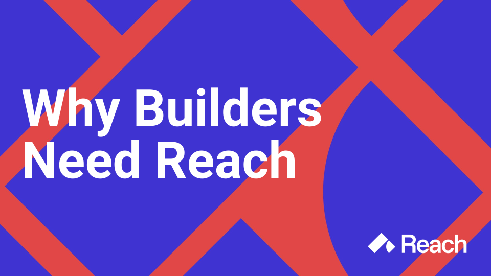
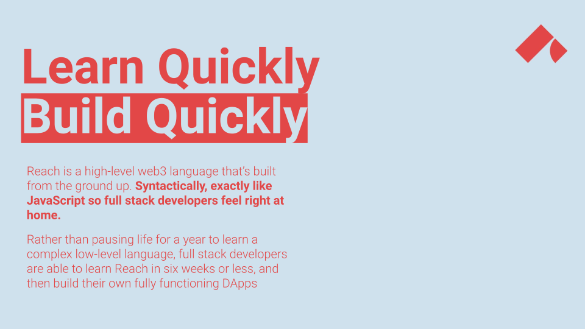
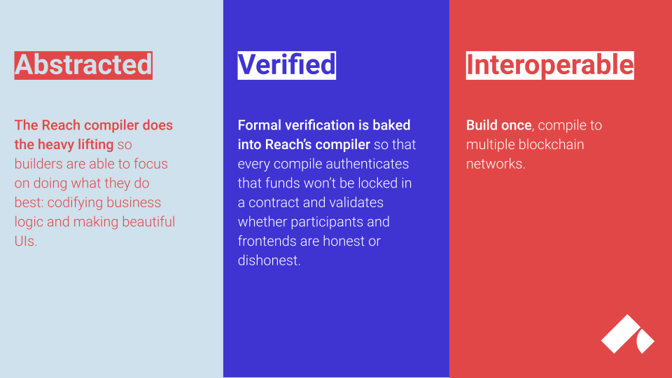
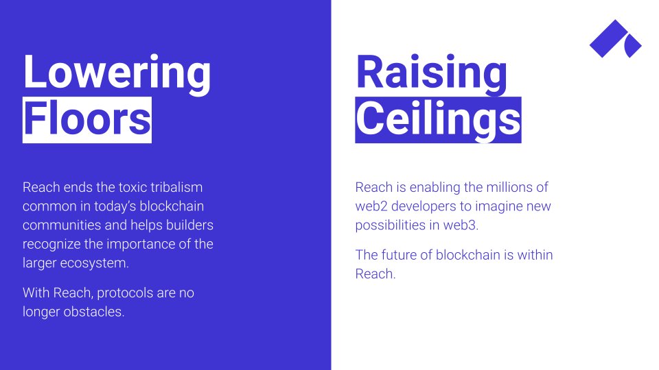
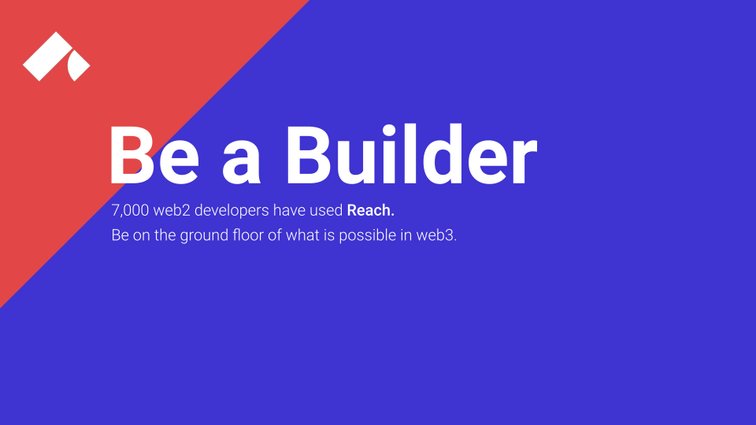

# {#build} Reach is for Builders

<head>
    
</head>
<section class="container g-0 w-75">
    

        

            <button type="button" data-bs-target="#carouselCaptions" data-bs-slide-to="0" class="active" aria-current="true" aria-label="Slide 1"></button>
            <button type="button" data-bs-target="#carouselCaptions" data-bs-slide-to="1" aria-label="Slide 2"></button>
            <button type="button" data-bs-target="#carouselCaptions" data-bs-slide-to="2" aria-label="Slide 3"></button>
            <button type="button" data-bs-target="#carouselCaptions" data-bs-slide-to="3" aria-label="Slide 4"></button>
            <button type="button" data-bs-target="#carouselCaptions" data-bs-slide-to="4" aria-label="Slide 5"></button>
            <button type="button" data-bs-target="#carouselCaptions" data-bs-slide-to="5" aria-label="Slide 6"></button>
        

        

            

                
            

            

                
            

            

                
            

            

                
            

            

                
            

            

                
            

        

    

</section>

    

        <section class="col-sm justify-content-center p-1">
            <a href="/quickstart/#quickstart">
                
                
Download

            </a>
        </section>
        <section class="col-sm justify-content-center p-1">
            <a href="/tut/#tuts">
                
                
Learn

            </a>
        </section>
        <section class="col-sm justify-content-center p-1">
            <a href="@{DISCORD}">
                
                
Join Us

            </a>
        </section>
        <section class="col-sm justify-content-center p-1">
            <a href="@{DISCUSSIONS}">
                
                
Get Help

            </a>
        </section>
        <section class="col-sm justify-content-center p-1">
            <a href="@{REPO}">
                
                
Contribute

            </a>
        </section>
    

 
