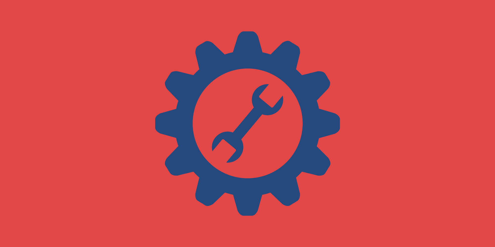

# {#reach-top} Reach: The Smartest, Fastest, and Safest DApp Programming Language

Reach is an interoperable, high-level, domain-specific language. 
It is the most advantageous way to build decentralized applications (DApps) for the blockchain. 
Reach enables full stack developers to become DApp developers in six weeks or less.

<section class="container">
    

        

            <button type="button" data-bs-target="#carouselCaptions" data-bs-slide-to="0" class="active" aria-current="true" aria-label="Slide 1"></button>
            <button type="button" data-bs-target="#carouselCaptions" data-bs-slide-to="1" aria-label="Slide 2"></button>
            <button type="button" data-bs-target="#carouselCaptions" data-bs-slide-to="2" aria-label="Slide 3"></button>
            <button type="button" data-bs-target="#carouselCaptions" data-bs-slide-to="3" aria-label="Slide 4"></button>
            <button type="button" data-bs-target="#carouselCaptions" data-bs-slide-to="4" aria-label="Slide 5"></button>
            <button type="button" data-bs-target="#carouselCaptions" data-bs-slide-to="5" aria-label="Slide 6"></button>
        

        

            

                
            

            

                
            

            

                
            

            

                
            

            

                
            

            

                
            

        

        <button class="carousel-control-prev" type="button" data-bs-target="#carouselCaptions" data-bs-slide="prev">
            
            Previous
        </button>
        <button class="carousel-control-next" type="button" data-bs-target="#carouselCaptions" data-bs-slide="next">
            
            Next
        </button>
    

</section>

    <section class="row align-items-center g-1">
        <section class="col p-3">
            

                
                

                    <h5 class="card-title" style="color:#fff">Reach is for Builders</h5>
                    <a href="/why/#build">
                    <h5 class="btn btn-primary card-title">BUILD WITH US</h5>
                    </a>
                

            

        </section>
        <section class="col p-3">
            

                
                

                    <h5 class="card-title" style="color:#fff">New to Reach</h5>
                    <a href="/quickstart/#quickstart">
                    <h5 class="btn btn-primary card-title">DOWNLOAD REACH</h5>
                    </a>
                

            

        </section>
        <section class="row align-items-center g-1">
            <section class="col p-3">
                

                    
                    

                        <h5 class="card-title" style="color:#fff">Learn Reach</h5>
                        <a href="/tut/#tuts">
                        <h5 class="btn btn-primary card-title">BEGIN</h5>
                        </a>
                    

                

            </section>
            <section class="col p-3">
                

                    
                    

                        <h5 class="card-title" style="color:#fff">Join the Community</h5>
                        <a href="@{DISCORD}">
                        <h5 class="btn btn-primary card-title">CONNECT</h5>
                        </a>
                    

                

            </section>
        </section>
        <section class="row align-items-center g-1">
            <section class="col p-3">
                

                    
                    

                        <h5 class="card-title" style="color:#fff">Get Help</h5>
                        <a href="@{DISCUSSIONS}">
                        <h5 class="btn btn-primary card-title">DISCUSSIONS</h5>
                        </a>
                    

                

            </section>
            <section class="col p-3">
                

                    
                    

                        <h5 class="card-title" style="color:#fff">Contribute</h5>
                        <a href="@{REPO}">
                        <h5 class="btn btn-primary card-title">SOURCE CODE</h5>
                        </a>
                    

                

            </section>
        </section>
    </section>

 