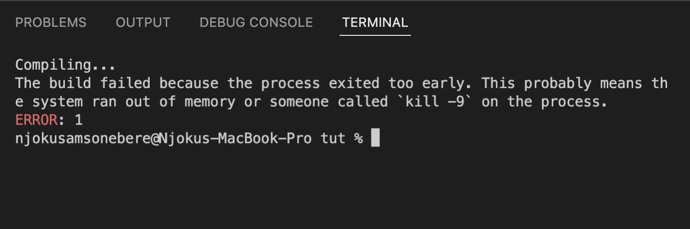
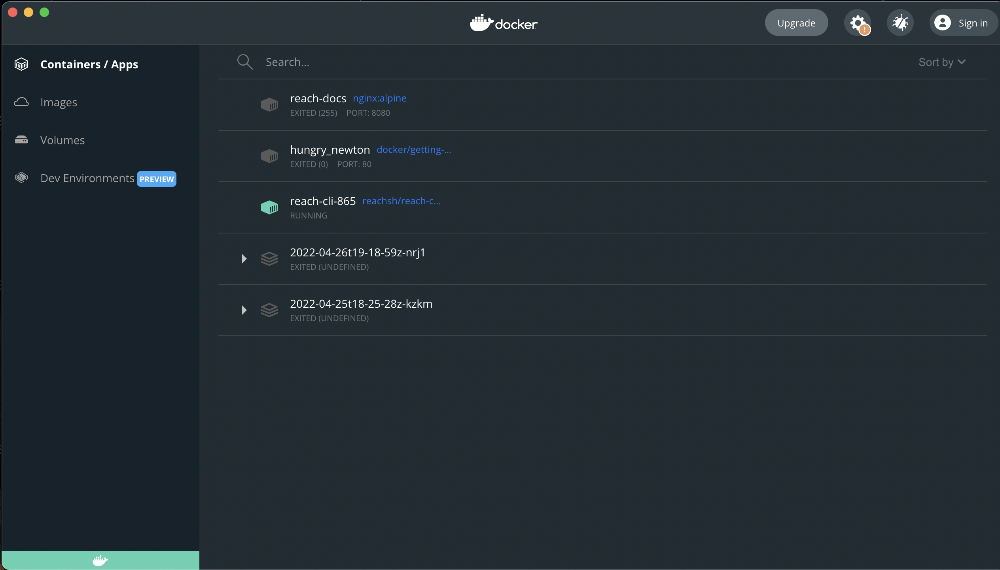
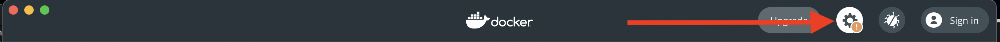
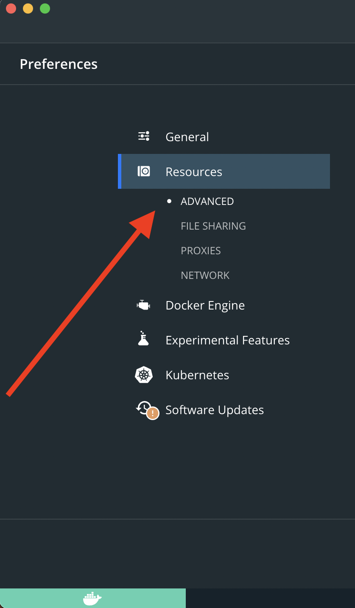
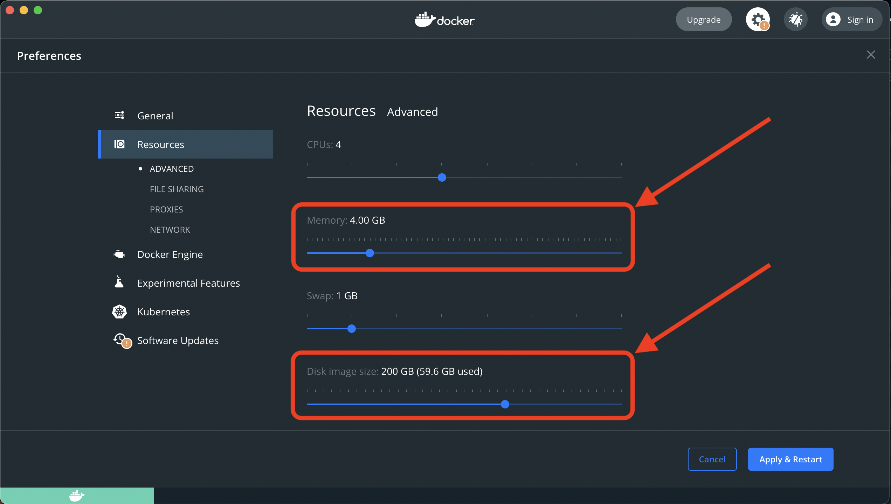
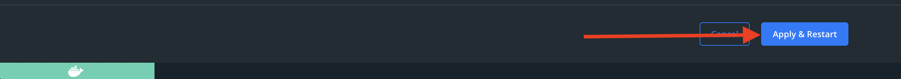

# {#trouble} Troubleshooting

This document contains explanations and solutions for a variety of common
problems we've observed users facing.

## {#ts-perm} Permissions

If you receive one of the following errors:

```cmd
reach: /app/tmp/out.sh: openFile: permission denied (Permission denied)
```

or

```
chmod: cannot access '/tmp/reach.../out.sh': No such file or directory
./reach: 1: /tmp/reach.../out.sh: not found
```

* This generally means that Reach was previously run or installed with `sudo` and directories were created that only `root` can access.

* If this is the case, delete the local copy of the Reach program and reinstall per the instructions.

* You should also delete all of the files in the `/tmp` directory with the
  prefix `reach`.
  You probably need to do this with `sudo`.

## {#ts-win8} Windows 8 Docker installation problems

Unfortunately, Docker Desktop does not support Windows 8.
And Reach requires Docker.
So, Reach is not able to run on Windows 8.
You should upgrade to a newer version of Windows.

## {#ts-reachdir} `./reach: is a directory`

If executing `./reach version` on Linux outputs `./reach: is a directory`, then
it means that you are intending to run the `reach` command, but are doing it in
a directory where it is not installed, but that contains a directory named
`reach`.

For example, if you installed by running
```cmd
$ mkdir -p ~/reach && cd ~/reach
$ curl https://docs.reach.sh/reach -o reach ; chmod +x reach
```

Then you might be running `./reach` in your home directory (`~`), rather than
the Reach direcotry (`~/reach`).

You can check what directory you're in by running `pwd` (print working
directory).

## {#ts-reachsudo} `reach run` seems to require sudo

If running `./reach run` seems to require `sudo`, then it is likely that:

* A component used by `reach` was installed/created using `sudo`, such as the directory. Make sure that the current user has read/write permissions in the directory.

* Docker might have been installed using Snap.

  Snap installation in Ubuntu creates permissions issues.
  Uninstall Docker and then re-install using the `apt` command in the terminal.

* Your user is not authorized to run Docker commands.
  See [Docker's post-installation steps for Linux](https://docs.docker.com/engine/install/linux-postinstall/) for help.

## {#ts-vscode} Troubleshooting Reach VSCode Extension

If you don't see syntax highlighting in VSCode, despite having the Reach extension installed and activated, then you probably need to restart VSCode.

## {#ts-mac-platform} MacOS M1 problems

If you receive the following error on Macs with an M1 chip:

``` cmd
The requested image's platform (linux/amd64) does not match the detected host platform (linux/arm64/v8) and no specific platform was requested`
```

* Check which mode the terminal is in by executing `$ arch` in the terminal.

  On M1 machines, the output should be `arm64`.
  If it doesn't, then open a new terminal without Rosetta.

* Make sure the latest `reach-cli` image is installed: `$ docker pull reachsh/reach-cli:latest`

* Use `reach-cli` to update the other Reach docker images by running `$ ./reach update` in the terminal.

## {#ts-out-of-memory} Out of Memory

If you receive the following error:



Then that is `docker` requesting for more memory space to function properly.

Please follow the next steps to fix the problem:

* Open your docker home page



* Click on the `settings` Icon at the top-right corner.



* In the side bar, click on `Resources`. This drops down a sub menu.

* In the sub menu, click on `Advanced` if it is not selected already.

<p align="center">

</p>

* In the main panel at the middle, adjust the `Memory` to 4GB or more depending on how much RAM you have in your machine.

* Still in the main panel, adjust the `Disk image size` to 200GB or more depending on how much HDD or SSD you have in your machine.



* At the bottom-right, click on `Apply & Restart`.



This should fix the problem after it is done restarting.

:::note
Please if this didn't fix the issue, restart your machine
:::

## Other issues

If the information in this troubleshooting guide does not fix your issue, please report any errors you encounter in the [Discord #help](https://discord.com/channels/628402598663290882/749639931399241792) channel.
This page will be updated based on issues and solutions discovered in that channel.
