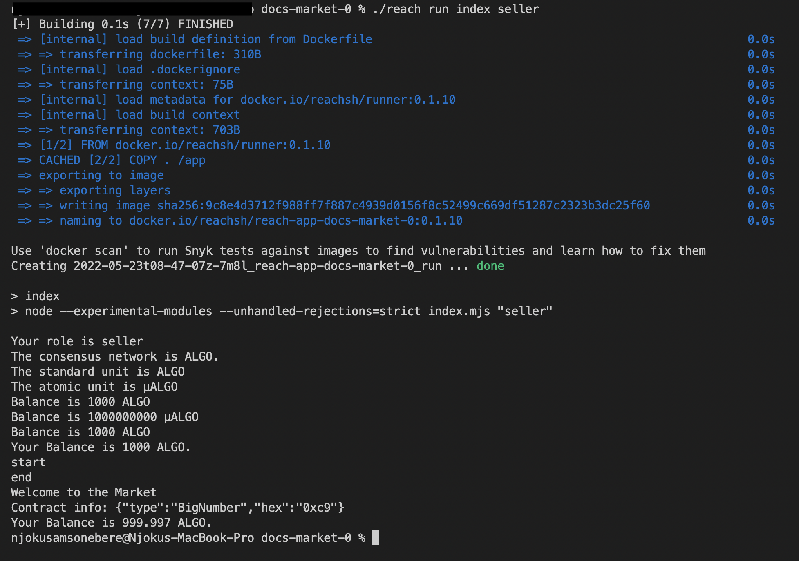

# {#tut-mkt} Market Place

## {#tut-mkt-introduction} Introduction
This tutorial teaches how to create a safe application for two `{!rsh} Participant`s, `Seller` and `Buyer`, to transact business.

:::note
A `{!rsh} Participant` in this context refers to anyone partaking in a particular transaction. 
In other words, A `{!rsh} Participant` is a user.
:::

[Reach](https://reach.sh/) programming language will be used in this tutorial. 
Reach is a development platform for launching smarter blockchain projects in less time.

The following image is a pictorial description of how the application will work at the end of this tutorial.

> **Insert Image Describing the flow of transactions**

This tutorial begins with building a basic DApp, grows into an interactive command-line interface application and concludes with a web application.

By the end, you would have learned:

1. How `Reach` command-line DApp work.
2. How to use the `Reach` standard library.
3. Concepts such as `{!rsh} Participant`, Reach `{!rsh} type`s, variable declaration, variable definition, and steps.
4. How a Reach Web App works.


## {#tut-mkt-prerequisites} Prerequisites
It is assumed that you have installed Reach. If you need help installing Reach, refer to the [Quick Start Guide](https://docs.reach.sh/quickstart/#quickstart).


## {#tut-mkt-starter} Starter Code

This section would guide you on how to create the boilerplate for this project.

1. Create a folder named `market` in your `Reach` directory:

```reach
mkdir market
```

2. Change your working directory into the `market`.

```reach
cd market
```

3.  Create 2 files: `index.rsh` and `index.mjs`.

```reach
touch index.rsh index.mjs
```

* The `index.mjs` is the frontend of the DApp that will be created since it contains the code that the `{!rsh} Participant`s will `{!rsh} interact` with.

* The `index.rsh` is the backend that contains the DApp's instructions and ensures the security of the DApp.
This is actually where the `Reach` code will live.


### {#tut-mkt-starter-backend} Backend


Start working in `index.rsh` by typing out the following code:

```reach
load: /examples/mkt-1-starter/index.rsh
```

This code isn't doing anything yet but it is an important foundation for what is to be built in this tutorial. 
`Reach` projects begin with this structure.

* Line 1 helps `Reach` to decide how to compile or run the DApp.
Without it, you will get an error.

* Line 3 declares a `commonInteract` `{!rsh} object`. 
This would hold properties that are common to those participating in this transaction `seller` and `buyer`.

* Line 5 declares a `sellerInteract` `{!rsh} object`.
 The `seller` would be given access to all the properties that go into the `sellerInteract`.

* Line 7 declares a `buyerInteract` `{!rsh} object`.
 It contains everything that the `buyer` would be able to do during this transaction.

* Lines 9 and 19 are the start and end of the main export from the program. 
Only the code within this block is compiled by the compiler. 

* Lines 10 to 13 defines a `{!rsh} Participant` (i.e. `Seller`) and gives the `{!rsh} Participant` access to the `commonInteract` and `sellerInteract` properties.

* Lines 14 to 17 defines another `{!rsh} Participant` (i.e. `Buyer`) and gives the `{!rsh} Participant` access to the `commonInteract` and `buyerInteract` properties.

* Line 18 is used to start executing the program.
Without it, the program will never start.


### {#tut-mkt-starter-frontend} Frontend


Next, work on the `index.mjs` file. Type the code below:

```reach
load: /examples/mkt-1-starter/index.mjs
```

* Line 1 imports `{!rsh} loadStdlib` from the Reach standard library.

* Line 2 imports the `./build/index.main.mjs` file as the backend.
This file doesn't exist yet.
It would be automatically generated when you run `./reach run` in your terminal.

* Line 3 calls the `loadStdlib` function that was imported on line 1 and the output is stored as `stdlib`.

* Line 5: The `Seller` sets up a contract for the program.

* Line 6: The `Buyer` attaches to the contract.

* Lines 8 to 17 is an asynchronous block that is used to execute the whole of the frontend code.

* Lines 9 to 12 execute the `Seller`'s contract on the `Seller`. 
The `Seller` is also given access to `commonInteract` and `sellerInteract` properties. 

* Lines 13 to 16 execute the `Buyer`'s contract on the `Buyer`. 
But this time around, the `Buyer` is given access to the `commonInteract` and `buyerInteract` properties.

The code that you have just written forms the basis for the DApp that is to be built.

Notice that `commonInteract`, `buyerInteract`, and `sellerInteract` are similar in both the backend and frontend files. 

This is so because `Reach` needs to be sure of how the variables are to be used before being used. 
The program will not be executed if those variables are not used the way they were declared.
So these variables are declared at the backend before being defined in the frontend. 

This might feel like a lot of work especially if you are coming from a language like JavaScript that is weakly typed.
But we would rather use an application with strong security than one with weak security especially when it has to do with money and trust.


### {#tut-mkt-starter-conclusion} Conclusion

In this section we created the boilerplate for the application that this tutorial plans to build.

Two (2) important files were created. And the necessary code was added. 
See full code [here]().

Next, a simple DApp will be built. This will help to visualize what the finished product will look and feel like.
If the diagram above wasn't clear enough, this next section would help.

Time to proceed!


## {#tut-mkt-basic} Basic DApp

In this section, a basic DApp will be created to demonstrate what the finished product will look like. 
By the end, you will see what a basic Reach command-line DApp works.
See full code [here]().


### {#tut-mkt-basic-why} Why Build This Basic DApp
A `seller` relocates to an area where there is high demand for the goods he sells. 
He enjoys a monopoly in the market and soon realizes that he has more `buyer`s than he can handle.
He also finds out that the method he has been using to transact business isn't secure enough as the business grows.

He then decides to build an application that will make it easy for him to transact business with little or no supervision. 
Since he is new to this technology and enjoys a monopoly, he decides to build a simple DApp that gives no autonomy to him or the `buyer`. 
Once he and a `buyer` agree to transact business, the DApp picks a good that both parties must agree to transact upon.

A Reach developer was contracted to build this application and the following are the steps that lead the developer to successfully build the application:


### {#tut-mkt-basic-declare} Declare Variables

Start by fleshing out the constants that have already been declared.
Replace this:

```reach
load: /examples/mkt-1-starter/index.rsh
range: 3 - 7
```

with:

```reach
load: /examples/mkt-2-basic/index.rsh
range: 3 - 37
```

These are just constants. Nothing surprising.

* Line 3: `choice`. 
This is an `{!rsh} integer` that would represent the `product` that the `buyer` decides to order.

:::note
An integer is represented by `{!rsh} UInt`. 
:::

* Line 4: `quantity`. 
This is an `{!rsh} integer` that would represent the quantity of the `product` that the `buyer` order.

* Line 5: `announcement`. 
This is a `{!rsh} String` that would represent a short advertisement made by the `seller`. 

:::note
A string is represented by `{!rsh} Bytes(28)`.
The integer (28) in braces defines how long the string may be.
:::

* Lines 6 to 11: `product`. 
This is an `{!rsh} Object` that contains the properties (i.e. key-value pair) of each product that the `seller` has in stock for sale.

* Line 13: `products`. 
This is an `{!rsh} Array` of `product`. 

* Lines 14 to 25: `commonInteract`.
This would hold properties that would be accessible to both the `seller` and `buyer`.

* Lines 15 to 24: `showResult`.
 This is a  `{!rsh} function` that takes in 2 `Object`s and returns nothing.

:::note
A `{!rsh} function` in Reach is defined as `{!rsh} Fun([input], output)`.
:::

* Lines 27 to 33: `sellerInteract`.
 This would hold all properties accessible by the `seller`.

* Lines 28 to 31: `sellerInfo`.
 This is an `Object` that would contain the `announcement` and `products` that were declared on lines 5 and 13 respectively.

* Line 32: `reportReady`.
 This is a `{!rsh} function` that takes in the `announcement` and `products` and returns nothing.

* Lines 35 to 37: `buyerInteract`.
This would hold all properties accessible by the `buyer`. 

* Line 36: `shop`.
 This is a `{!rsh} function` that represents the buyer's process in looking through the `seller`'s `products` and deciding which one to pick and how many are needed.
 It takes in an `Object` of the `seller`'s `announcement` and `products`. 
 And then returns an `Object` containing the `buyer`'s `choice` and `quantity`.

That is all that needs to be done in the backend for now. 
Attention would be given to the frontend now.

### {#tut-mkt-basic-accounts} Create Accounts
In the [previous section](##tut-mkt-starter-frontend), contracts were setup for the `{!rsh} Participant`s:

```reach
load: /examples/mkt-1-starter/index.mjs
range: 5 - 6
```

These contracts require that each of the `{!rsh} Participant`s have an account set up before entering the contract.

Just before the contracts, type the following code:

```reach
load: /examples/mkt-2-basic/index.mjs
range: 5 - 8
```

* Line 5 sets up some funds that can be used by each `{!rsh} Participant` as starting balance.
`{!rsh} parseCurrency` converts the figure passed into it to an acceptable currency on a DApp.

:::note
Since DApps do not use regular currencies, `{!rsh} parseCurrency` `{!rsh} function` was provided by Reach to help convert regular currencies into currencies acceptable on a DApp
:::

* Lines 7 and 8 create an account for each of the `{!rsh} Participant`.
This is for test purposes. 

With these accounts, the contracts will compile successfully when called upon.

### {#tut-mkt-basic-define} Define Variables
Having told the backend how those variables declared are to be used, these variables will now be given their proper functionalities.

Just below the contracts, enter the following code for the `sellerInteract`:

```reach
load: /examples/mkt-2-basic/index.mjs
range: 13 - 30
```

This code will be made accessible to the `Seller` only.

* Line 13 defines `sellerInteract` as an `{!rsh} Object`.

* Lines 14 to 21 defines the `sellerInfo` as an `{!rsh} Object`.

* Line 15 passes a `{!rsh} string` to the `announcement` variable.

* Lines 16 to 20: The details of each `product` is passed into the `products` `{!rsh} Array` as `{!rsh} Object`s.
It is a list of items that the `Seller` puts up for sale with their properties.

* Lines 22 to 29 creates a  `{!rsh} function` named `reportReady`. 
The `{!rsh} function` takes in `announcement` and `products` as arguments.

* Line 23 logs a `{!rsh} string` to the console.

* Lines 24 to 28 obtain the contract information which is an `{!rsh} Object` and log it to the console as a JSON string.
You can see this as the seller's unique identifier.

That is all that the `Seller` needs for this section.

The `sellerInteract` output would look like this:

```reach
Welcome to the Market
Contract info: {"type":"BigNumber","hex":"0x06"}
```

:::note
This output is just for visualization purposes. 
Some output may not show until a section is completed.
:::

The next code is for the `buyerInteract`:

```reach
load: /examples/mkt-2-basic/index.mjs
range: 32 - 47
```

The `Buyer` would have access to this code.

* Line 32 defines `buyerInteract` as an `{!rsh} Object`.

* Line 33 defines `shop` as a `{!rsh} function`. It takes the `sellerInfo` as an argument.

* Line 34 logs the `Seller`'s `announcement` to the console.

* Lines 35 to 39 loop through the `Seller`'s `products` and list them out for the `Buyer` to see.

* Line 41 gets a random number not more than `4`.
This number stored as `choice` represents the position of an item in the `products` array.
So if the `choice` is `2`, then the `product` chosen will be 
`{ name: "Corn", unit: "ear", units: "ears", price: "5" }`

* Line 41 picks the `quantity` of that `product` the `Buyer` wants.
This is also a random number that is not more than `100`.

* Line 43 displays the `name` of the product that the `Buyer` wants to order.

* Line 45 returns the `decision` (i.e. the `choice` and `quantity`) of the `Buyer`.

That completes the `buyerInteract`. 
The output would look like this:

```reach
List of products for sale:
1. Potatoes at 10 per bag.
2. Carrots at 10 per bunch.
3. Corn at 5 per ear.
Buyer wants Carrots
```

Finally, the type the code below for `commonInteract`:

```reach
load: /examples/mkt-2-basic/index.mjs
range: 49 - 61
```

All `{!rsh} Participant`s would have access to this code.

* Line 49 defines `commonInteract` as a `{!rsh} function` that takes in `person` as an argument.

* Line 50 defines `showResult` as a `{!rsh} function` that takes in `decision` (returned on line 45) and `sellerInfo` as an argument. 

* Lines 51 to 59 log to the console the details of the `product` that the `Buyer` has decided to purchase.
The same `product` is also logged to the console as the `product` that the `Seller` has decided to sell.

A more detailed breakdown of the code:

i. `${person === "Seller" ? "sell" : "buy"}` means if the `${person}` is `Seller`, log `sell` else log `buy` to the console.

ii. `${decision.quantity}` is the `quantity` that the `Buyer` wants out of the original quantity of the `product`.

iii. `${decision.quantity > 1 ? sellerInfo.products[decision.choice].units : sellerInfo.products[decision.choice].unit}` is either the `unit` or `units` of the product the `Buyer` chose. 
This is dependent on the `quantity` that the `Buyer` wants.

iv. `${sellerInfo.products[decision.choice].name}` is the name of the product that the buyer chose.

The `commonInteract` output would look like this:

```
Buyer agrees to buy 92 bunches of Carrots
Seller agrees to sell 92 bunches of Carrots
```

That seals the frontend for this section.
Just one more step! 
Go back to the backend file.


### {#tut-mkt-basic-connect} Connect Frontend to Backend

This stage is the last one for the basic DApp. 
It will make the backend to `{!rsh} interact` with the frontend and that in turn, will log outputs in the console.
To make that happen, all the methods that have just been defined in the frontend, would now be called upon using the `{!rsh} interact` `{!rsh} Object`.

:::note
Calling `{!rsh} interact` on something in Reach is the same thing as calling upon a `{!rsh} function` to execute the code within it.
:::

Go back to the backend file. Just below `{!rsh} init();`, type the following code:

```reach
load: /examples/mkt-2-basic/index.rsh
range: 50 - 55
```

This is called a `{!rsh} local step`. 

:::note
A local step is an action that happens on the `{!rsh} Participant`'s machine. This step is used to execute codes that are only accessible to a particular `{!rsh} Participant`.
:::

* Line 50 calls the `{!rsh} only()` method on the `Seller`.

* Line 51 has the `Seller` `{!rsh} interact` with the `sellerInfo` `{!rsh} Object`. 

After the `{!rsh} interact`ion is done, the program is then permitted to share whatsoever the result of that `{!rsh} interact`ion is with the public. 
To do this, `{!rsh} declassify()` method is used.

:::note
`{!rsh} declassify()` is a Reach method used to make any secret `{!rsh} publish`able or shareable with other `{!rsh} Participant`s.
:::

* Line 53 now publicizes the `sellerInfo` that has been declassified.

* Line 54 then `{!rsh} interact`s with the `Seller`'s `reportReady` `{!rsh} function`. 
The `reportReady` takes in two arguments (i.e. the `Seller`'s `announcement` and `products`)

* Line 55 concludes the `Seller`'s local step by calling `commit()`.

Now, doing a `./reach run` in the terminal would show some output.
That concludes the `Seller`'s interaction.

Next, type in the following code for the `Buyer`'s interaction:

```reach
load: /examples/mkt-2-basic/index.rsh
range: 57 - 61
```

This is the `Buyer`'s local step

* Line 57 calls the `{!rsh} only()` method on the `Buyer`.

* Line 58 has the `Buyer` `{!rsh} interact` with the `shop` `{!rsh} function`. 
The result of that interaction is also declassified. 

* Line 60 publicizes the `decision` from line 58.

* Line 61 concludes the `Buyer`'s steps with a `commit();`

Finally, the result of the program is shown with the following code:

```reach
load: /examples/mkt-2-basic/index.rsh
range: 63 - 63
```

* Line 63 executes the `showResult` `{!rsh} function` on both `{!rsh} Participants`.

In the terminal, type `./reach run` and hit `Enter`.
An output similar to the ones below should be displayed:

```
Welcome to the Market
Contract info: {"type":"BigNumber","hex":"0x6d"}
List of products for sale:
1. Potatoes at 10 per bag.
2. Carrots at 10 per bunch.
3. Corn at 5 per ear.
Buyer wants Potatoes
Buyer agrees to buy 9 bags of Potatoes
Seller agrees to sell 9 bags of Potatoes


Welcome to the Market
Contract info: {"type":"BigNumber","hex":"0x89"}
List of products for sale:
1. Potatoes at 10 per bag.
2. Carrots at 10 per bunch.
3. Corn at 5 per ear.
Buyer wants Carrots
Buyer agrees to buy 10 bunches of Carrots
Seller agrees to sell 10 bunches of Carrots


Welcome to the Market
Contract info: {"type":"BigNumber","hex":"0x90"}
List of products for sale:
1. Potatoes at 10 per bag.
2. Carrots at 10 per bunch.
3. Corn at 5 per ear.
Buyer wants Carrots
Buyer agrees to buy 81 bunches of Carrots
Seller agrees to sell 81 bunches of Carrots
```

Walah!!! You made it.
You have done well.

### {#tut-mkt-basic-conclusion} Conclusion
This section taught the basics of the Reach language and demonstrated how the final DApp to be built would work. That was a good way to start building the market-place application that has just been embarked upon. Hopefully, you found it helpful and easy to follow through. 

It is important to note that Reach offers flexibility in the way code may be written. 
Check [here](/examples/mkt-3-basic-alt) for an optional way that the code for this section may be written.

This tutorial has been able to teach the basics of the Reach language. 
Concepts that were covered include: variable declaration and definition, 
the Reach standard library, `{!rsh} Participant`, `{!rsh} type`s, local steps, `{!rsh} interact` and `{!rsh} function`. 

In the next section, more would be discussed on how `./reach run` works, `process.argv` would be introduced, `{!rsh} Participant`s would be given autonomy and how to manage money and currency would be demonstrated.

## {#tut-mkt-interaction} Interaction and Independence
The previous section demonstrated what building with Reach feels like. 
But more can be done with Reach than that. 

Reach offers autonomy to `{!rsh} Participant`s in a transaction.
This means that the `Seller` and the `Buyer` could decide whether or not to proceed with the transaction and how they will like the transaction to take place. 

This section would build a similar DApp like the last one but will offer more flexibility to the `{!rsh} Participant`s.
By the end, how `./reach run` works would have been properly explained. Other things to learn include what `{!rsh} process.argv` entails, and how to handle money and currency.

This section will begin by explaining how `./reach run` works.


### {#tut-mkt-interaction-reach-run} How `./reach run` Works

The `./reach run` command is used to execute whatever is in the `index.rsh` file because in the background, `index.rsh` is added to the command.
So running `./reach run` in the terminal will behave in the same way just as `./reach run index`.

:::note
`./reach run index.rsh` will throw the following error:

```reach
index.rsh.rsh doesn't exist.
```

This is because Reach adds the extension by default already.
:::

`./reach run` produces an array by default. It looks like this:

```reach
[ '/usr/local/bin/node', '/app/index.mjs' ]
```

So any string added to the `./reach run index` command, would be added to that array.
For example, `./reach run index seller` would produce:

```reach
[ '/usr/local/bin/node', '/app/index.mjs', 'seller' ]
```

The item(s) that come after the second item in the array, tells us the variable that has been passed in.

To see this working, type the following on line 4 of the `index.mjs` file:

```reach
console.log(process.argv);
```

Run `./reach run index seller` in the terminal.

The output it produces would look like this:

```reach
[ '/usr/local/bin/node', '/app/index.mjs', 'seller' ]
Welcome to the Market
Contract info: {"type":"BigNumber","hex":"0xba"}
List of products for sale:
1. Potatoes at 10 per bag.
2. Carrots at 10 per bunch.
3. Corn at 5 per ear.
Buyer wants Potatoes
Buyer agrees to buy 95 bags of Potatoes
Seller agrees to sell 95 bags of Potatoes
```

The first line of the output is the line of interest. 
That will be leveraged in giving the `{!rsh} Participant`s autonomy as the project for this section is developed.

That is the basics of how the `./reach run` command works. 


### {#tut-mkt-interaction-why} Why Build An Interactive DApp
The Basic DApp has been working fine and the business has grown but the `seller` no longer enjoys a monopoly - he now has competitors. 
The `buyer`s have complained of either not getting what they want or not getting the quantity they want.

He realizes that for him to compete, he has to make transactions more flexible for the `buyer`s. 
To do this, the application must be improved.

You're being commissioned once again to improve the DApp. Following the steps below, the application was completed:

### {#tut-mkt-Interaction-basic} Basic Interactive DApp
To make it easy to follow, we'll begin with new files. 

The code for this section can be found [here]().

Type the following code in the backend file:

```reach
load: /examples/mkt-4-interaction-basic/index.rsh
range: 1 - 34
```

This code looks familiar. A few changes were made:

* `choice` and `quantity` has been removed.

* `commonInteract` is currently empty. 
It has also been destructured into the `sellerInteract` and `buyerInteract` `{!rsh} Object`.
This will produce the same result as before when it was destructured inside of the `{!rsh} Participant` definition.

* `shop` `{!rsh} function` now returns an `{!rsh} Object` containing `prodNum` and `prodAmt` instead of `choice` and `quantity`.

* Since `commonInteract` has already been destructured into the `sellerInteract` and `buyerInteract` `{!rsh} Object`, 
`sellerInteract` and `buyerInteract` was passed to the `{!rsh} Participant` definition without destructuring.

* Finally, `Seller` and `buyer` has been changed to `S` and `B`.

That's all for the backend for now. Go to the frontend.

In the `index.mjs` file, type the code below:

```reach
load: /examples/mkt-4-interaction-basic/index.mjs
range: 1 - 12
```

* Line 1 imports the `{!rsh} ask` `{!rsh} Object` alongside `{!rsh} loadStdlib` from the Reach standard library.

:::note
The `{!rsh} ask` `{!rsh} Object` is used to ask questions and obtain answers from the `{!rsh} Participant`s. 
:::

* Line 3 calls on the `{!rsh} loadStdlib` `{!rsh} function` and passes the `{!rsh} process.env` as an argument.

:::note
`{!rsh} process.env` is used to access the environment variable. You can log it to the console to see the output
:::

* Lines 5 to 8 is a conditional statement that checks if there is no third argument passed to the `./reach run` command or if the third argument passed is neither `seller` nor `buyer`.

* Line 6 logs a message telling the `{!rsh} Participant` what command to run for the program to work if line 5 evaluates to `{!rsh} true`.

* Line 7 terminates the program.

* Line 10 stores the third argument passed to the `./reach run` command as `role`.

* Line 11 reveals the role that the `{!rsh} Participant` chose.

* Line 12 reveals the consensus network that the `{!rsh} Participant` chose. 

:::note
A consensus network is like a bank that each `{!rsh} Participant` has decided to use to perform a transaction such as saving and transferring funds.
:::

After that, type in the following:

```reach
load: /examples/mkt-4-interaction-basic/index.mjs
range: 14 - 29
```

* Line 14 accesses the standard unit through the standard library based on the consensus network and stores it as stored as `suStr`.

* Line 15 tells the `{!rsh} Participant` what standard unit is being used.

:::note
A standard unit is the network token unit most commonly associated with a network. 
For example, the standard unit of `Ethereum` is `ETH`. 
:::

* Line 16 accesses the atomic unit through the standard library based on the consensus network and stores it as stored as `auStr`.

* Line 17 tells the `{!rsh} Participant` what atomic unit is being used.

:::note
An atomic unit is the smallest unit of measure for the standard unit. 
It cannot be divided into smaller units.
For example, the atomic unit of `Ethereum` is `WEI`. 
:::

* Line 18 is a `{!rsh} function` that converts money from its standard unit to its atomic unit.

* Line 19 is a `{!rsh} function` that converts money from its atomic unit to its standard unit.

* Line 20 sets up a standard unit balance of 1000.

* Line 21 displays the standard unit balance.

* Line 22 converts the standard unit balance to its atomic unit.

* Line 23 displays the atomic unit balance.

* Line 24 converts the atomic unit balance back to the standard unit balance and displays it to the `{!rsh} Participant`.

* Line 25 is a `{!rsh} function` that returns the account balance of a particular `{!rsh} Participant`.

* Line 27 creates a test account.

* Line 29 defines the `commonInteract` `{!rsh} Object`.

The code so far has defined utilities for the DApp. 
The next thing to do is to utilize these utilities in defining what happens if the `{!rsh} Participant` is a `seller` or a `buyer`.


#### {#tut-mkt-Interaction-basic-seller} Seller
The code below would be executed if the `{!rsh} Participant` is the `seller`:

```reach
load: /examples/mkt-4-interaction-basic/index.mjs
range: 32 - 52
```

* Line 32 checks if the `{!rsh} Participant` is a `seller`

* Lines 33 to 47 looks familiar. This block defines the `sellerInteract` `{!rsh} Object`.

* Line 34 destructures the `commonInteract`.

* Lines 35 to 42 defines the `sellerInfo` `{!rsh} Object`.

* Lines 43 to 46 defines the `reportReady` `{!rsh} function`.

* Line 49 displays the account balance of the `seller` before the transaction begins.

* Line 50 sets up the contract for the transaction.

* Line 51 executes the contract on the `seller`. 
It also gives the `seller` access to the `sellerInteract` properties.

* Line 52 displays the account balance of the `seller` after the transaction ends.

With that line, the `seller`'s part is done.

The `seller`'s output would look like this:

```reach
Your role is seller
The consensus network is ALGO.
The standard unit is ALGO
The atomic unit is μALGO
Balance is 1000 ALGO
Balance is 1000000000 μALGO
Balance is 1000 ALGO
Your Balance is 1000 ALGO.
Welcome to the Market
Contract info: {"type":"BigNumber","hex":"0xc2"}
```

#### {#tut-mkt-Interaction-basic-buyer} Buyer
If the `{!rsh} Participant` is not a `seller`, then the following code would be executed.
Type the following:

```reach
load: /examples/mkt-4-interaction-basic/index.mjs
range: 55 - 78
```

* Line 55 checks if the `{!rsh} Participant` is not a `seller`.

* Lines 56 to 66 defines the `buyerInteract` `{!rsh} Object`. And that also looks familiar.

* Line 57 destructures the `commonInteract` `{!rsh} Object`.

* Lines 58 to 65 defines the `shop` `{!rsh} function`.

* Line 68 uses the `{!rsh} ask` `{!rsh} Object` imported on line 1 to request for the contract details to be pasted in the terminal.


The `buyer`'s output at this point looks like this:

```reach
Your role is buyer
The consensus network is ALGO.
The standard unit is ALGO
The atomic unit is μALGO
Balance is 1000 ALGO
Balance is 1000000000 μALGO
Balance is 1000 ALGO
Paste contract info: 
```


* Lines 69 and 70 are executed after the `buyer` has pasted the details of the contract in the terminal.

* Line 71 attaches the `buyer` to the contract.

* Line 72 displays a success message.

* Line 73 displays the account balance of the `buyer` before the transaction begins.

* Line 74 executes the contract on the `buyer`. 
It also gives the `seller` access to the `buyerInteract` properties.

* Line 75 displays the account balance of the `buyer` after the transaction ends.

* Line 77 ends the usage of the `{!rsh} ask` `{!rsh} Object`.

That ends the buyer's transaction.

The `buyer`'s output now looks like this:

```reach
Your role is buyer
The consensus network is ALGO.
The standard unit is ALGO
The atomic unit is μALGO
Balance is 1000 ALGO
Balance is 1000000000 μALGO
Balance is 1000 ALGO
Paste contract info: 
{"type":"BigNumber","hex":"0xc2"}
Attaching to contract
...
Successfully attached
Your Balance is 1000 ALGO.
List of products for sale:
1. Potatoes at 200 ALGO per unit (bag).
2. Carrots at 100 ALGO per unit (bunch).
3. Corn at 50 ALGO per unit (ear).
Your Balance is 999.998 ALGO.
```

While the `seller`'s output would look like this:

```reach
Your role is seller
The consensus network is ALGO.
The standard unit is ALGO
The atomic unit is μALGO
Balance is 1000 ALGO
Balance is 1000000000 μALGO
Balance is 1000 ALGO
Your Balance is 1000 ALGO.
Welcome to the Market
Contract info: {"type":"BigNumber","hex":"0xc2"}
Your Balance is 999.997 ALGO.
```


#### {#tut-mkt-Interaction-connect} Connect the frontend to the backend
To bring everything together, head back to the `index.rsh` file.
Type the following code after the `{!rsh} init` line for the `seller`:

```reach
load: /examples/mkt-4-interaction-basic/index.rsh
range: 36 - 41
```
The only difference here is that `Seller` has been changed to `S`. 
Every other thing remains the same.

Type the code below for the `buyer`:

```reach
load: /examples/mkt-4-interaction-basic/index.rsh
range: 43 - 55
```

Lines 44 and 46: `decision` was changed to `order`.

Line 47 checks if the `prodNum` is zero (0) or `prodNum` is more than the number of items for sale or `prodAmt` is zero (0).

Lines 48 and 49 `{!rsh} commit`s and `{!rsh} exit`s the program respectively if line 47 evaluates to `{!rsh} true`.

Line 51 `{!rsh} commit`s to the program if line 47 evaluates to `{!rsh} false`.

Line 54 terminates the program.

#### {#tut-mkt-Interaction-test} Testing
To test what has been done so far, open two terminals. 

In the first one, run ` ./reach run index seller` 
While in the second terminal, run `./reach run index buyer`

By the end of the transaction, the output received should look like the following screenshots:

For Seller:



For Buyer


Full Demonstration

> Video here


### {#tut-mkt-Interaction-advance} Advanced
Now that the `seller` can show `products` and the `buyer` can see them,
the final thing to do is to give the `buyer` the ability to make an order and give the `seller` the ability to sell.

The codes for this section can be found [here]().

To do that, navigate to the backend file. 
More variables are to be declared.

#### {#tut-mkt-Interaction-advance-declare} Declare More Variables

Replace the `commonInteract` `{!rsh} Object` with the following code:

```reach
load: /examples/mkt-5-interaction-reports/index.rsh
range: 12 - 19
```

* Line 12 declares the `commonInteract` `{!rsh} Object`.

* Line 13 declares `reportCancellation` `{!rsh} function`. It takes in no argument and returns nothing.

* Line 14 declares `reportExit` `{!rsh} function`. It takes in no argument and returns nothing.

* Line 15 declares `reportPayment` `{!rsh} function`. It takes in a `{!rsh} UInt` and returns nothing.

* Line 16 declares `reportTransfer` `{!rsh} function`. It takes in a `{!rsh} UInt` and returns nothing.

* Line 17 declares `reportFulfillment` `{!rsh} function`. It takes in a `product` and a `{!rsh} UInt` and returns nothing.

* Line 18 declares `statusReport` `{!rsh} function`. It takes in no argument and returns nothing.

In the `buyerInteract` `{!rsh} Object`, add the following `{!rsh} function`:

```reach
load: /examples/mkt-5-interaction-reports/index.rsh
range: 36 - 36
```

* Line 36 declares the `confirmPurchase` `{!rsh} function`. It takes in a `{!rsh} UInt` and returns a `{!rsh} Bool`.

That's all that is needed for the declaration of variables. 
Proceed to the frontend file.

#### {#tut-mkt-Interaction-advance-define} Define More Variables
The variables that have just been added to the backend file will now be defined or given their functionalities here.

In the frontend file, replace the `commonInteract` `{!rsh} Object` with the following code:

```reach
load: /examples/mkt-5-interaction-reports/index.mjs
range: 29 - 42
```

* Line 29 defines the `commonInteract` as an `{!rsh} Object`.

* Lines 30 - 32 define the `reportCancellation`. It takes in no argument.

* Line 31 logs to the console an order cancellation message.

* Line 33 defines the `reportPayment` `{!rsh} function`. 
It takes `payment` as an argument and logs to the console a message confirming payment by the `buyer`.

* Line 34 defines the `reportTransfer` `{!rsh} function`. 
It takes `payment` as an argument and logs to the console a message showing that funds have been transferred to the `seller`.

* Lines 35 to 39 define the `reportFulfillment`. 
It takes in `p` (i.e. `product`) and `amt` (i.e. quantity requested by the `buyer`).

* Line 36 defines the subject (`subjectVerb`) of the message to be displayed.

* Line 36 defines the object (`directObject`) of the message to be displayed

* Line 38 logs to the console the details of the `product` that the `seller` now owes the `buyer`.

* Line 40 defines the `reportExit`. It takes in no argument.
It logs to the console an order cancellation message.

* Line 41 defines the `statusReport`. It takes in no argument.
It reveals who passed the status report.

That concludes the definition of the `commonInteract`.

In the `buyerInteract`, add the following code:

```reach
load: /examples/mkt-5-interaction-reports/index.mjs
range: 87 - 87
```

* Line 87 defines `confirmPurchase` `{!rsh} function`. 
It uses the `{!rsh} ask` `{!rsh} Object` to ask the `buyer` to confirm the purchase or cancel the transaction.

No more changes would be done to the frontend file. 
Like always, the frontend has to be connected to the backend file for all these to work.
Head back to the backend file.


#### {#tut-mkt-Interaction-advance-connect} Connect the frontend to the backend

Replace this code:

```reach
load: /examples/mkt-4-interaction-basic/index.rsh
range: 47 - 52
```

With this:

```reach
load: /examples/mkt-5-interaction-reports/index.rsh
range: 55 - 62
```

* Line 55 checks if the `prodNum` (i.e. product number) entered doesn't match any product or if the `prodAmt` entered is zero (0).

* Line 56 `{!rsh} commit`s if Line 55 is true.

* Line 57 calls the `reportCancellation` `{!rsh} function` on each of the `{!rsh} Participant`.

* Line 58 calls the `reportExit` `{!rsh} function` on each of the `{!rsh} Participant`.

* Line 59 terminates the transaction by calling the `{!rsh} exit` method.

* Line 61 `{!rsh} commit`s if Line 55 is false.


Next, type the following code:

```reach
load: /examples/mkt-5-interaction-reports/index.rsh
range: 64 - 73
```

* Line 64 starts another `seller`'s only block.

* Line 65 calculates the total price to be paid by the `buyer` depending on the `product` selected. This is calculated by multiplying the `price` of the `product` by the quantity that the buyer wants.

* Line 67 publishes the total price.

* Line 68 ends this local step.

* Line 70 starts another `buyer`'s only block.

* Line 71 calls the `confirmPurchase` `{!rsh} function` and passes the `total` from line 65 to it.
This obtains the `buyer`'s consent and stores it as `willBuy`.

* Line 73 publishes `willBuy`


Now enter the code below:

```reach
load: /examples/mkt-5-interaction-reports/index.rsh
range: 75 - 82
```


* Line 75 checks if the `willBuy` is false.

* Line 76 `{!rsh} commit`s if Line 75 is true.

* Line 77 calls the `reportCancellation` `{!rsh} function` on each of the `{!rsh} Participant`.

* Line 78 calls the `reportExit` `{!rsh} function` on each of the `{!rsh} Participant`.

* Line 79 terminates the transaction by calling the `{!rsh} exit` method.

* Line 81 `{!rsh} commit`s if Line 75 is true.


Finally, the following code handles payment and delivery if all goes well:

```reach
load: /examples/mkt-5-interaction-reports/index.rsh
range: 84 - 90
```

* Line 84 has the `buyer` pay the `total` into the contract.

* Line 85 calls the `reportPayment` `{!rsh} function` on each of the `{!rsh} Participant`.

* Line 86 transfers the money paid by the `buyer` to the `seller`.

* line 87  calls the `reportTransfer` `{!rsh} function` on each of the `{!rsh} Participant`.

* line 88  calls the `reportFulfillment` `{!rsh} function` on each of the `{!rsh} Participant`.

* line 89  calls the `statusReport` `{!rsh} function` on each of the `{!rsh} Participant`.

* Line 90 `{!rsh} commit` to the program.

And That concludes the application.

Yayeh, You came this far!

You are a rockstar!

Congratulations on this new feat!

#### {#tut-mkt-Interaction-advance-test} Testing the application

Open two terminals. In the first one, 
run ` ./reach run index seller` 
and in the second terminal, 
run `./reach run index buyer`

If the transaction is canceled, the output received should look like this:

For Seller:

```reach
> index
> node --experimental-modules --unhandled-rejections=strict index.mjs "seller"

Your role is seller
The consensus network is ALGO.
The standard unit is ALGO
The atomic unit is μALGO
Balance is 1000 ALGO
Balance is 1000000000 μALGO
Balance is 1000 ALGO
Your Balance is 1000 ALGO.
Welcome to the Market
Contract info: {"type":"BigNumber","hex":"0xe0"}
The buyer cancelled the order.
The buyer cancelled the order.
Your Balance is 999.997 ALGO.
```

For Buyer:

```reach
> index
> node --experimental-modules --unhandled-rejections=strict index.mjs "buyer"

Your role is buyer
The consensus network is ALGO.
The standard unit is ALGO
The atomic unit is μALGO
Balance is 1000 ALGO
Balance is 1000000000 μALGO
Balance is 1000 ALGO
Paste contract info: 
{"type":"BigNumber","hex":"0xe0"}
Attaching to contract
...
Successfully attached
Your Balance is 1000 ALGO.
List of products for sale: 
1. Potatoes at 200 ALGO per unit (bag).
2. Carrots at 100 ALGO per unit (bunch).
3. Corn at 50 ALGO per unit (ear).
Enter 1-3, or 0 to exit:
2
Enter number of units, or 0 to exit:
0
You are ordering 0 bunches of Carrots at 100 ALGO per bunch.
You cancelled the order.
You cancelled the order.
Your Balance is 999.998 ALGO.
```


If the transaction is successful, the output received should look like this:

For Seller:

```reach
> index
> node --experimental-modules --unhandled-rejections=strict index.mjs "seller"

Your role is seller
The consensus network is ALGO.
The standard unit is ALGO
The atomic unit is μALGO
Balance is 1000 ALGO
Balance is 1000000000 μALGO
Balance is 1000 ALGO
Your Balance is 1000 ALGO.
Welcome to the Market
Contract info: {"type":"BigNumber","hex":"0xe6"}
The Buyer paid 200 ALGO to the contract.
The contract paid 200 ALGO to you.
You owe the buyer 2 bunches of Carrots.
Seller passes status report.
Your Balance is 1199.996 ALGO.
```

For Buyer:

```reach
> index
> node --experimental-modules --unhandled-rejections=strict index.mjs "buyer"

Your role is buyer
The consensus network is ALGO.
The standard unit is ALGO
The atomic unit is μALGO
Balance is 1000 ALGO
Balance is 1000000000 μALGO
Balance is 1000 ALGO
Paste contract info: 
{"type":"BigNumber","hex":"0xe6"}
Attaching to contract
...
Successfully attached
Your Balance is 1000 ALGO.
List of products for sale: 
1. Potatoes at 200 ALGO per unit (bag).
2. Carrots at 100 ALGO per unit (bunch).
3. Corn at 50 ALGO per unit (ear).
Enter 1-3, or 0 to exit:
2
Enter number of units, or 0 to exit:
2
You are ordering 2 bunches of Carrots at 100 ALGO per bunch.
Do you want to complete the purchase for 200 ALGO?
y
You paid 200 ALGO to the contract.
The contract paid 200 ALGO to the seller.
The seller owes you 2 bunches of Carrots.
Buyer passes status report.
Your Balance is 799.994 ALGO.
```


### {#tut-mkt-Interaction-conclusion} Conclusion
This section has been able to explain in detail how the `./reach run` command works. 
Understanding that made it easy to manipulate the command and create an interactive DApp.
This is a better version of the DApp since the `{!rsh} Participant`s have been honored with the ability to make their own choice instead of being forced to accept random choices. 

This section also taught how to use the `process.argv` (argument variables), 
how to `{!rsh} pay` and `{!rsh} transfer` money on a DApp, 
how to use the `{!rsh} ask` `{!rsh} Object` and so on.

But there is more that can be done. 
Since regular transactions happen with a GUI and not on a terminal, how can Reach enable the building of a GUI instead of a terminal application?

The next section has been designed to teach everything that you need to know about building a web application using Reach.

