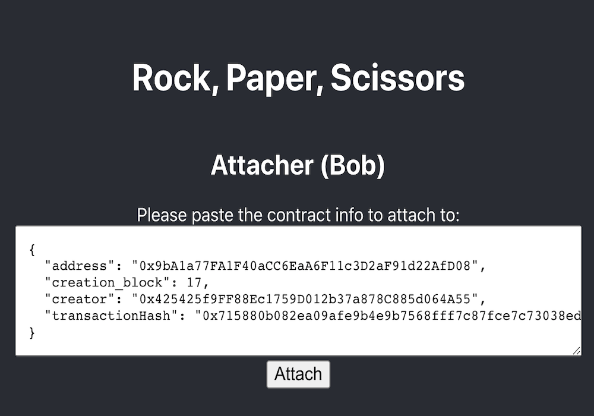
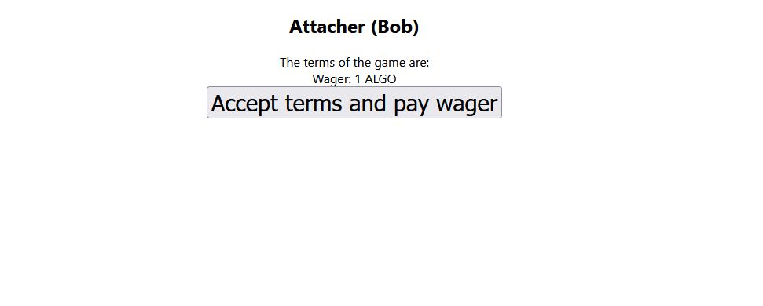

# {#tut} Rock, Paper, Scissors!

This tutorial walks through the creation of a simple decentralized application.
It contains everything you need to know to build and test this application and assumes no prior experience with DApp/blockchain development of any kind.
If you want a broad overview before diving in it, we recommend reading [the overview](##overview) first.
On the other hand, if this is too simple, then you may want to start [the workshop](##workshop) for larger and less constrained projects or [the reference manual](##ref) for the minute details of Reach.

If you're ready, click through to the [first step](##tut-1)!

## {#tut-1} Install and Initialize

Reach is designed to work on POSIX systems with [make](https://en.wikipedia.org/wiki/Make_(software)), [Docker](https://www.docker.com/get-started), and [Docker Compose](https://docs.docker.com/compose/install/) installed.
The best way to install Docker on Mac and Windows is with [Docker Desktop](https://www.docker.com/products/docker-desktop).

:::note
You probably already have `make` installed.
For example, OS X and many other POSIX systems come with `make`, but some versions of Linux do not include it by default and will require you to install it.
If you're on Ubuntu, you can run `sudo apt install make` to get it.
:::

You'll know that you have everything installed if you can run the following three commands without errors

```cmd
$ make --version
```

```cmd
$ docker --version
```

```cmd
$ docker-compose --version
```

:::note
If you're using Windows, consult [the guide to using Reach on Windows](##guide-windows).
:::

Once you've confirmed that they are installed, choose a directory for this project. We recommend

```cmd
$ mkdir -p ~/reach/tut && cd ~/reach/tut
```

Next, download Reach by running

```cmd
$ curl https://docs.reach.sh/reach -o reach ; chmod +x reach
```

You'll know that the download worked if you can run

```cmd
$ ./reach version
```

The recommended next step, although optional, is to set up your environment with

```cmd
$ ./reach config
```

This will make subsequent uses of the `reach` script more convenient by tuning its runtime behavior to your specific needs and only downloading the dependencies you'll actually use.

`{!cmd} reach config` sets overridable defaults for _all_ Reach projects on your development machine and not just the current one, so feel free to skip this step if you'd prefer not to make your choices global.

Since Reach is Dockerized, when you first use it, you'll need to download the images it uses.
Fetch them by running

```cmd
$ ./reach update
```

You'll know that everything is in order if you can run

```cmd
$ ./reach compile --help
```

---

:::note
Get language support for Reach in your editor by visiting @{seclink("guide-editor-support")}.
:::

Now that your Reach installation is in order, you should open a text editor and get ready to [write your first Reach application](##tut-2)!

## {#tut-2} Scaffolding and Setup

In this tutorial, we'll be building a version of _Rock, Paper, Scissors!_ where two players, _Alice_ and _Bob_, can wager on the result of the game.
We'll start simple and slowly make the application more fully-featured.

You should follow along by copying each part of the program and seeing how things go.
If you're like us, you may find it beneficial to type each line out, rather than copying & pasting so you can start building your muscle memory and begin to get a sense for each part of a Reach program.

Let's start by creating a file named `index.rsh`.
It doesn't matter where you put this file, but we recommend putting it in the current directory, which would be `~/reach/tut` if you're following along exactly.
In all the subsequent code samples, we'll label the files based on the chapter of the tutorial you're reading.
For example, start off by typing the following into `index.rsh`:

```
load: /examples/rps-1-setup/index.rsh
md5: 31dcf80dd184f4e31efac02cc2c7f66e
```

:::note
Did you notice that [`rps-1-setup/index.rsh`](@{REPO}/examples/rps-1-setup/index.rsh) was a link in the box above the code sample?
You can always click on these links to see the entire file in our [GitHub](https://github.com/reach-sh/reach-lang) repository.
:::

:::note
Did you notice the attractive copy icon on the top the right of that box?
You can click on it and the content of the code box will be copied onto your clipboard.
:::

:::note
Did your text editor recognize `index.rsh` as a Reach program and give you proper syntax highlighting?
If not, check if there's a plugin available for your editor by visiting @{seclink("guide-editor-support")} or manually
configure it to treat Reach (`.rsh`) files as JavaScript and things will be mostly correct.
:::

This is just a shell of a program that doesn't do much, but it has a few important components.

+ Line 1 indicates that this is a Reach program.
You'll always have this at the top of every program.
+ Line 3 defines the main export from the program.
When you compile, this is what the compiler will look at.
+ Lines 4 through 9 specify the two participants to this application, _Alice_ and _Bob_.
+ Line 10 marks the deployment of the the Reach program, which allows the program to start doing things.

Before we go too much further, let's create a similar shell for our JavaScript frontend code.
Open a new file named `index.mjs` and fill it with this:

```
load: /examples/rps-1-setup/index.mjs
md5: ed82d3f3222714d10cfe0536c19f7e54
```

This JavaScript code is similarly schematic and will be consistent across all of your test programs.

+ Line 1 imports the Reach standard library loader.
+ Line 2 imports your backend, which `./reach compile` will produce.
+ Line 3 loads the standard library dynamically based on the `REACH_CONNECTOR_MODE` environment variable.
+ Line 5 defines a quantity of network tokens as the starting balance for each test account.
+ Lines 6 and 7 create test accounts with initial endowments for Alice and Bob.
This will only work on the Reach-provided developer testing network.
+ Line 9 has Alice deploy the application.
:::note
The program defined in [`rps-1-setup/index.rsh`](@{REPO}/examples/rps-1-setup/index.rsh) will only begin to run after it has been deployed via [rps-1-setup/index.mjs](@{REPO}/examples/rps-1-setup/index.mjs).
:::

+ Line 10 has Bob attach to it.
+ Lines 13 through 15 initialize a backend for Alice.
+ Lines 16 through 18 initialize a backend for Bob.
+ Line 12 waits for the backends to complete.

This is now enough for Reach to compile and run our program. Let's try by running

```cmd
$ ./reach run
```

Reach should now build and launch a Docker container for this application.
Since the application doesn't do anything, you'll just see a lot of diagnostic messages though, so that's not very exciting.

:::note
The entire process that we just went through can be automated by running
```cmd
$ ./reach init
```
 when you start your next project!
:::

In [the next step](##tut-3), we'll implement the logic of _Rock, Paper, Scissors!_ and our application will start doing something!

::::testQ
When you write a DApp using Reach, do you
1. write a smart contract in Solidity, a backend in JavaScript using the Ethereum SDK, and a frontend in JavaScript, then use Reach to test and deploy it;
1. write a program in Reach that generates a smart contract & a backend and a front-end in JavaScript, then use Reach to test and deploy it?

:::testA
2; Reach abstracts away the details of the underlying consensus network
:::

::::

## {#tut-3} Rock, Paper, and Scissors

In this section, we'll have Alice and Bob actually execute the game of _Rock, Paper, Scissors!_.

We have to decide how to represent the hands of the game.
A simple way is to represent them as the numbers `{!rsh} 0`, `{!rsh} 1`, and `{!rsh} 2`, standing for `Rock`, `Paper`, and `Scissors`.
However, Reach does not support unsigned integers of exactly two bits, so it is better to represent them as the equivalence class of integers modulo three, so we won't distinguish between `{!rsh} 0` and `{!rsh} 3` as `Rock`.

We'll use a similar strategy for representing the three outcomes of the game: `B wins`, `Draw`, and `A wins`.

The first step is to change the Reach program to specify that Alice and Bob's frontends can be interacted with to get the move that they will play, and later informed of the outcome of the game.

```
load: /examples/rps-2-rps/index.rsh
md5: 3ea7718e88c86dd41e97b503d7aa3b67
range: 1-17
```

+ Lines 3 through 6 define a participant interact interface that will be shared between the two players.
In this case, it provides two methods: `{!rsh} getHand`, which returns a number; and `{!rsh} seeOutcome`, which receives a number.
+ Lines 9 through 14 use this interface for both participants.
Because of this line, `{!rsh} interact` in the rest of the program will be bound to an object with methods corresponding to these actions, which will connect to the frontend of the corresponding participant.

Before continuing with the Reach application, let's move over to the JavaScript interface and implement these methods in our frontend.

```
load: /examples/rps-2-rps/index.mjs
md5: 997ba05e8422c076a3c29cd5bcf427aa
range: 12-32
```

+ Lines 12 and 13 define arrays to hold the meaning of the hands and outcomes.
+ Line 14 defines a constructor for the `{!js} Player` implementation.
+ Lines 15 through 19 implement the `{!js} getHand` method.
+ Lines 20 through 22 implement the `{!js} seeOutcome` method.
+ Finally, lines 27 and 30 instantiate the implementation once for Alice and once for Bob.
These are the actual objects that will be bound to `{!rsh} interact` in the Reach program.

There should be nothing interesting or controversial about these implementations; that's the point of Reach: we get to just write normal business logic without worrying about the details of the consensus network and decentralized application.

Let's return to the Reach program and look inside of the body of the program for what actions Alice and Bob take.

In a real-life game of _Rock, Paper, Scissors!_, Alice and Bob simultaneously decide what hand they will play and reveal it at the same time.
"Simultaneity" is a complex concept that is hard to realize in practice.
For example, if you've ever played against a little kid, you may notice them trying to see what you're going to choose and delaying until the last minute to show their hand so they will win.
In a decentralized application, it is not possible to have simultaneity.
Instead, we have to select a particular participant who will "go first".
In this case, we'll choose Alice.

:::note
Does Alice go first, or do we call the player that goes first "Alice"?
This might seem like an unnecessary distinction to make, but it is a very subtle point about the way that Reach works.
In our frontend, we explicitly ran `{!rsh} backend.Alice` and `{!rsh} backend.Bob`.
When we did that, we were committing that particular JavaScript thread to be either Alice or Bob.
In our game, whoever chose to run the Alice backend is the one that will go first.
In other words, **Alice goes first**.
This will be more obvious at [the end of the tutorial](##tut-8) when we'll make the choice interactively about which role to play.
:::

The game proceeds in three steps.

First, the backend for Alice interacts with its frontend, gets Alice's hand, and publishes it.

```
load: /examples/rps-2-rps/index.rsh
md5: 3ea7718e88c86dd41e97b503d7aa3b67
range: 17-21
```

+ Line 17 states that this block of code is something that _only_ `{!rsh} Alice` performs.
+ That means that the variable, `{!rsh} handAlice`, bound on line 18 is known only to Alice.
+ Line 18 binds that value to the result of interacting with Alice through the `{!rsh} getHand` method, which we wrote in JavaScript.
+ Line 18 also declassifies the value, because in Reach, all information from frontends is secret until it is explicitly made public.
+ Line 20 has Alice join the application by publishing the value to the consensus network, so it can be used to evaluate the outcome of the game.
Once this happens, the code is in a "consensus step" where all participants act together.
+ Line 21 commits the state of the consensus network and returns to "local step" where individual participants can act alone.

The next step is similar, in that Bob publishes his hand; however, we don't immediately commit the state, instead we compute the outcome of the game.

```
load: /examples/rps-2-rps/index.rsh
md5: 3ea7718e88c86dd41e97b503d7aa3b67
range: 23-29
```

+ Lines 23 through 26 match Alice's similar local step and joining of the application through a consensus transfer publication.
+ But, line 28 computes the outcome of the game before committing.
(`{!rsh} (handAlice + (4 - handBob)) % 3` is a clever equation to compute the winner of a game of _Rock, Paper, Scissors!_ using modular arithmetic.
Consider when `{!rsh} handAlice` is `{!rsh} 0` (i.e., `Rock`) and `{!rsh} handBob` is `{!rsh} 2` (i.e., `Scissors`),
then this equation is `{!rsh} ((handAlice + (4 - handBob)) % 3) = ((0 + (4 - 2)) % 3) = ((0 + 2) % 3) = (2 % 3) = 2`,
which is the last outcome, that is `Alice wins`, as we expect it to be.)

Finally, we use the each form to have each of the participants send the final outcome to their frontends.

```
load: /examples/rps-2-rps/index.rsh
md5: 3ea7718e88c86dd41e97b503d7aa3b67
range: 31-33
```

+ Line 31 states that this is a local step that each of the participants performs.

At this point, we can run the program and see its output by running

```cmd
$ ./reach run
```

Since the players act randomly, the results will be different every time.
When I ran the program three times, this is the output I got:

```cmd
$ ./reach run
Alice played Scissors
Bob played Paper
Alice saw outcome Alice wins
Bob saw outcome Alice wins

$ ./reach run
Alice played Scissors
Bob played Paper
Alice saw outcome Alice wins
Bob saw outcome Alice wins

$ ./reach run
Alice played Paper
Bob played Rock
Alice saw outcome Alice wins
Bob saw outcome Alice wins
```

Alice is pretty good at _Rock, Paper, Scissors!_!

Consensus networks in general, and Reach specifically, guarantee that all participants agree on the outcome of their decentralized computation.
Indeed, this is where the name consensus network comes from, as they enable these distributed, and untrusted, parties to come to a consensus, or agreement, about the intermediate states of a computation; and if they agree on the intermediate states, they will also agree on the output.
That's why every time you run `./reach run`, both Alice and Bob will see the same outcome!

:::note
If your version isn't working, look at the complete versions of [`rps-2-rps/index.rsh`](@{REPO}/examples/rps-2-rps/index.rsh) and [`rps-2-rps/index.mjs`](@{REPO}/examples/rps-2-rps/index.mjs) to make sure you copied everything down correctly!
:::

In [the next step](##tut-4), we'll add some stakes to the game, because Alice needs to take her skills to the bank!

::::testQ
Reach programs allow interaction with a user interface through which of the following methods?
1. by forcing you to write a custom backend for the user interface that connects to the generated smart contract,
1. by allowing the frontends to provide values directly to the Reach application,
1. by allowing the Reach program to callback to the frontend via the interact object.

:::testA
2 and 3; Reach programs specify a two-way interface between the frontend and the backend via the participant interact interface.
:::

::::

::::testQ
How do participants in a Reach application share information with each other and find out what others have shared?
1. Reach generates a smart contract, but you need to implement a process to scan the blockchain for events that correspond to sharing;
1. The Reach primitive `{!rsh} publish` allows a participant to share information with all other participants, which happens automatically without the other parties needing to do anything special;

1. The Reach primitive `{!rsh} publish` allows a participant to share information with all other participants, but they need to explicitly run the receive primitive to receive published information.

:::testA
2; the `{!rsh} publish` primitive does everything for you.
:::

::::

## {#tut-4} Bets and Wagers

Although it's fun to play _Rock, Paper, Scissors!_ with friends for a laugh, it's even better to play it with enemies and your entire life-savings on the line!
Let's change our program so that Alice can offer a wager to Bob and whoever wins will take the pot.

This time, let's start with changes to the JavaScript frontend and then we'll go back into the Reach code and connect the new methods up.

Since we're going to be having funds get transferred, we'll record the balances of each participant before the game starts, so we can more clearly show what they won at the end.
We'll add this code in between account creation and contract deployment.

```
load: /examples/rps-3-bets/index.mjs
md5: fc6187211ecfeacd41be9495aa22deaf
range: 5-12
```

+ Line 9 shows a helpful function for displaying currency amounts with up to 4 decimal places.
+ Line 10 shows a helpful function for getting the balance of a participant and displaying it with up to 4 decimal places.
+ Lines 11 and 12 get the balance before the game starts for both Alice and Bob.

Next, we'll update Alice's interface object to include her wager.

```
load: /examples/rps-3-bets/index.mjs
md5: fc6187211ecfeacd41be9495aa22deaf
range: 31-34
```

+ Line 32 splices the common `{!js} Player` interface into Alice's interface.
+ Line 33 defines her wager as `5` units of the network token.
This is an example of using a concrete value, rather than a function, in a participant interact interface.

For Bob, we'll modify his interface to show the wager and immediately accept it by returning.

```
load: /examples/rps-3-bets/index.mjs
md5: fc6187211ecfeacd41be9495aa22deaf
range: 35-40
```

+ Lines 37 through 39 define the `{!js} acceptWager` function.

Finally, after the computation is over, we'll get the balance again and show a message summarizing the effect.

```
load: /examples/rps-3-bets/index.mjs
md5: fc6187211ecfeacd41be9495aa22deaf
range: 43-47
```

+ Lines 44 and 45 get the balances afterwards.
+ Lines 47 and 48 print out the effect.

These changes to the frontend only deal with issues of presentation and interfacing.
The actual business logic of making the wager and transferring the funds will happen in the Reach code.

Let's look at that now.

First, we need to update the participant interact interface.

```
load: /examples/rps-3-bets/index.rsh
md5: 4116cbc1247ecc15271aa776eedf1676
range: 1-19
```

+ Lines 9 through 12 define Alice's interface as the `{!rsh} Player` interface, plus an integer value called `{!rsh} wager`.
+ Lines 13 through 16 do the same for Bob, where he has a method called `{!rsh} acceptWager` that can look at the wager value.

Each of the three parts of the application have to be updated to deal with the wager.
Let's look at Alice's first step first.

```
load: /examples/rps-3-bets/index.rsh
md5: 4116cbc1247ecc15271aa776eedf1676
range: 19-25
```

+ Line 20 has Alice declassify the wager for transmission.
+ Line 23 is updated so that Alice shares the wager amount with Bob.
+ Line 24 has her transfer the amount as part of her publication.
The Reach compiler would throw an exception if `{!rsh} wager` did not appear on line 23, but did appear on line 24.
Change the program and try it.
This is because the consensus network needs to be able to verify that the amount of network tokens included in Alice's publication match some computation available to consensus network.

Next, Bob needs to be shown the wager and given the opportunity to accept it and transfer his funds.

```
load: /examples/rps-3-bets/index.rsh
md5: 4116cbc1247ecc15271aa776eedf1676
range: 27-32
```

+ Line 28 has Bob accept the wager.
If he doesn't like the terms, his frontend can just not respond to this method and the DApp will stall.
+ Line 32 has Bob pay the wager as well.

The DApp is now running in a consensus step and
the contract itself now holds twice the wager amount.
Before, it would compute the outcome and then commit the state; but now, it needs to look at the outcome and use it to balance the account.

```
load: /examples/rps-3-bets/index.rsh
md5: 4116cbc1247ecc15271aa776eedf1676
range: 34-41
```

+ Lines 35 through 38 compute the amounts given to each participant depending on the outcome by determining how many `{!rsh} wager` amounts each party gets.
If the outcome is `{!rsh} 2`, `Alice wins`, then she gets two portions; while if it is `{!rsh} 0`, `Bob wins`, then he gets two portions; otherwise they each get one portion.
+ Lines 39 and 40 transfer the corresponding amounts.
This transfer takes place from the contract to the participants, not from the participants to each other, because all of the funds reside inside of the contract.
+ Line 41 commits the state of the application and allows the participants to see the outcome and complete.

At this point, we can run the program and see its output by running

```cmd
$ ./reach run
```

Since the players act randomly, the results will be different every time.
When I ran the program three times, this is the output I got:

```cmd
$ ./reach run
Alice played Paper
Bob accepts the wager of 5.
Bob played Rock
Alice saw outcome Alice wins
Bob saw outcome Alice wins
Alice went from 100 to 104.9999.
Bob went from 100 to 94.9999.

$ ./reach run
Alice played Paper
Bob accepts the wager of 5.
Bob played Scissors
Alice saw outcome Bob wins
Bob saw outcome Bob wins
Alice went from 100 to 94.9999.
Bob went from 100 to 104.9999.

$ ./reach run
Alice played Rock
Bob accepts the wager of 5.
Bob played Scissors
Alice saw outcome Alice wins
Bob saw outcome Alice wins
Alice went from 100 to 104.9999.
Bob went from 100 to 94.9999.
```

:::note
How come Alice and Bob's balances go back to `100` every time?
It's because each time we run `./reach run`, it creates fresh accounts for both players.
:::

:::note
How come the balances aren't exactly `100`, `105`, and `95`?
It's because consensus network charge fees to run transactions.

If we had shown all the decimals, they'd look like this:

---

```
Alice went from 100 to 104.999999999999687163.
Bob went from 100 to 94.999999999999978229.
...
Alice went from 100 to 94.999999999999687163.
Bob went from 100 to 104.999999999999978246.
```

---

Why does Alice win slightly less than Bob when she wins?
She has to pay to deploy the contract, because she publishes the first message in her frontend.
:::

Alice is doing okay - if she keeps this up, she'll make a fortune on _Rock, Paper, Scissors!_!

:::note
If your version isn't working, look at the complete versions of [`rps-3-bets/index.rsh`](@{REPO}/examples/rps-3-bets/index.rsh) and [`rps-3-bets/index.mjs`](@{REPO}/examples/rps-3-bets/index.mjs) to make sure you copied everything down correctly!
:::

Now that there is a reason to play this game, it turns out that there's a major security vulnerability.
We'll fix this in [the next step](##tut-5); make sure you don't launch with this version, or Alice is going to go broke!

::::testQ
How do Reach programs manage token funds?
1. They don’t; you need to manage them explicitly in parallel to the Reach program;
1. The `{!rsh} pay` primitive can be added to a `{!rsh} publish` primitive to send funds to the Reach program, which can then use the `{!rsh} transfer` primitive to send funds back to participants, and other addresses.

:::testA
2; the `{!rsh} pay` and `{!rsh} transfer` primitives do everything for you.
:::

::::

## {#tut-5} Trust and Commitments

In the last section, we made it so that Alice and Bob can actually exchange currency when they play _Rock, Paper, Scissors!_.
However, the version of the application we wrote has a fundamental flaw: Bob can win every game!

How is that possible?
We showed executions of the game where Alice won, like the following

```cmd
$ ./reach run
Alice played Rock
Bob accepts the wager of 5.
Bob played Scissors
Alice saw outcome Alice wins
Bob saw outcome Alice wins
Alice went from 100 to 104.9999.
Bob went from 100 to 94.9999.
```

The problem is that this version of the game only executed an honest version of Bob, that is, one that followed the Reach program exactly, including in his private local steps.
It is possible for a deviant and dishonest version of a Bob backend to execute different code and always win by computing the appropriate guess based on what value Alice provided for `{!rsh} handAlice`.

If we change Bob's code to the following:

```
load: /examples/rps-4-attack/index.rsh
md5: bd577e73ff25f098ef38106416a3bff1
range: 27-32
```

then he will ignore the frontend and just compute the correct value.

If we run this version of the program, we will see output like this:

```cmd
$ ./reach run
Alice played Scissors
Bob accepts the wager of 5.
Alice saw outcome Bob wins
Bob saw outcome Bob wins
Alice went from 100 to 94.9999.
Bob went from 100 to 104.9999.
```

In this version, unlike the honest version, Bob never consults the frontend and so it never prints out the message of what hand Bob played.
No matter what Alice chooses, Bob will always win.

---

Is it just a fluke of the random number generator that we observed Bob always winning?
How would we know?
Reach comes with an    [automatic verification](##guide-assert) engine that we can use to mathematically prove that this version will always result in the `{!rsh} outcome` variable equalling `{!rsh} 0`, which means Bob wins.
We can instruct Reach to prove this theorem by adding these lines after computing the `{!rsh} outcome`:

```
load: /examples/rps-4-attack/index.rsh
md5: bd577e73ff25f098ef38106416a3bff1
range: 34-37
```

+ Line 35 requires that the dishonest version of Bob be used for the proof.
+ Line 36 conducts the proof by including an assert statement in the program.

Before we had this line in the file, when we ran `./reach compile`, it would print out the message:

```
load: /examples/rps-3-bets/index.txt
md5: 28d95cc29c6b14c1cc26c778d196f184
range: 3-8
```

But now, it prints out

```
load: /examples/rps-4-attack/index.txt
md5: 110e527c76781aa90248cd73afb2d87a
range: 3-8
```

+ Line 7 is different and shows that more theorems have been proven about our program.
It prints out five more, rather than one more, because the theorem is proved differently in the different verification modes.

---

Many programming languages include [assertions](https://en.wikipedia.org/wiki/Assertion_(software_development)) like this,
but Reach is one of a small category where the compiler doesn't just insert a runtime check for the property,
but actually conducts a mathematical proof at compile-time that the expression _always_ evaluates to `{!rsh} true`.

In this case, we used Reach's [automatic verification](##guide-assert) engine to prove that an attack did what we expected it would.
But, it is better to use verification to show that _no flaw_ exists and _no attack_ is possible.

Reach includes some such assertions automatically in every program.
That's why every version of _Rock, Paper, Scissors!_ has said that a number of theorems were checked.
We can see what these theorems do by deliberately inserting an error into the program.

Let's start by undoing the changes we made earlier by changing

```
load: /examples/rps-4-attack/index.rsh
md5: bd577e73ff25f098ef38106416a3bff1
range: 29-29
```

back to

```
load: /examples/rps-4-attack/index-bad.rsh
md5: c0015df1e967946be01b3bdab70c9c12
range: 29-29
```

and removing

```
load: /examples/rps-4-attack/index.rsh
md5: bd577e73ff25f098ef38106416a3bff1
range: 35-36
```

Let's change the computation of the payout and make it so that if Alice wins, then she only gets her wager back, not Bob's.

We should now have something that looks like

```
load: /examples/rps-4-attack/index-bad.rsh
md5: c0015df1e967946be01b3bdab70c9c12
range: 27-41
```

+ Line 36 has `{!rsh} [1, 0]`, but should have `{!rsh} [2, 0]`.

When we run `./reach compile rps-4-attack/index-bad.rsh`, it gives details about the error:

```
load: /examples/rps-4-attack/index-bad.txt
md5: f3e303f988d9e814893c783592a61280
range: 5-32
```

There's a lot of information in the compiler output that can help an experienced programmer track down the problem. But the most important parts are

+ Line 7 says that this is an attempt to prove the theorem that the balance at the end of the program is zero, which means that no network tokens are sealed in the contract forever.
+ Lines 10-20 describe the values that could cause the theorem to fail.
+ Lines 23-31 outline the theorem that failed.

:::note
Refer to @{seclink("how-to-read-verification-failures")} if you'd like to learn more about the details of this output.
:::

These kinds of [automatic verifications](##guide-assert) are helpful for Reach programmers, because they don't need to remember to put them in their program, and they will still be protected from entire categories of errors.

---

However, now let's add an assertion to the program that will ensure that every version of the program that allows Bob to know Alice's hand before he chooses his own will be rejected.

We'll go back to the version of [`rps-3-bets/index.rsh`](@{REPO}/examples/rps-3-bets/index.rsh) from the last section, which has an honest version of Bob.
(Click on the preceding link if you need to see what it contained.)

We'll add a single line to the program after Alice publishes, but before Bob takes a local step:

```
load: /examples/rps-4-attack/index-fails.rsh
md5: ee8173e8806e4b9757fe9b9e28a6d4b9
range: 23-31
```

+ Line 27 contains a knowledge assertion that Bob cannot know Alice's value `{!rsh} handAlice` at this point in the program.
In this case, it is obvious that this is not true, because Alice shares `{!rsh} handAlice` at line 23.
In many cases, this is not obvious and Reach's [automatic verification](##guide-assert) engine has to reason about how values that Bob _does know_ are connected to values that might be related to Alice's secret values.

When we run `./reach run`, it reports that this assertion is false:

```
load: /examples/rps-4-attack/index-fails.txt
md5: 50af6bc7a17c513531f63cb7c8ec7efa
range: 3-7
```

It is not enough to correct failures and attacks when you discover them.
You must **always** add an assertion to your program that would fail to hold if the attack or failure were present.
This ensures that all similar attacks are not present and that they will not accidentally be reintroduced.

---

Let's use these insights into [automatic verification](##guide-assert) and rewrite our _Rock, Paper, Scissors!_ so that it is more trustworthy and secure.

Since we've been making lots of changes to the code, let's start fresh with a new version and we'll look at every single line again, to make sure that you aren't missing anything.

First, we'll define the rules of _Rock, Paper, Scissors!_ a little bit more abstractly, so we can separate the logic of the game from the details of the application:

```
load: /examples/rps-5-trust/index.rsh
md5: 68fff9bccfaf2c29fba5ad5c1b41af17
range: 1-7
```

+ Line 1 is the usual Reach version header.
+ Lines 3 and 4 define enumerations for the hands that may be played, as well as the outcomes of the game.
+ Lines 6 and 7 define the function that computes the winner of the game.

When we first wrote _Rock, Paper, Scissors!_, we asked you to trust that this formula for computing the winner is correct, but it is good to actually check.
One way to check would be to implement a JavaScript frontend that didn't interact with a real user, nor would it randomly generate values, but instead, it would return specific testing scenario values and check that the output is as expected.
That's a typical way to debug and is possible with Reach.
However, Reach allows us to write such test cases directly into the Reach program as verification assertions.

```
load: /examples/rps-5-trust/index.rsh
md5: 68fff9bccfaf2c29fba5ad5c1b41af17
range: 9-11
```

+ Line 9 makes an assertion that when Alice plays Rock and Bob plays Paper, then Bob wins as expected.

But, Reach's [automatic verification](##guide-assert) allows us to express even more powerful statements about our program's behavior.
For example, we can state that no matter what values are provided for `{!rsh} handAlice` and `{!rsh} handBob`, `{!rsh} winner` will always provide a valid outcome:

```
load: /examples/rps-5-trust/index.rsh
md5: 68fff9bccfaf2c29fba5ad5c1b41af17
range: 13-15
```

And we can specify that whenever the same value is provided for both hands, no matter what it is, `{!rsh} winner` always returns `{!rsh} DRAW`:

```
load: /examples/rps-5-trust/index.rsh
md5: 68fff9bccfaf2c29fba5ad5c1b41af17
range: 17-18
```

These examples both use `{!rsh} forall`, which allows Reach programmers to quantify over all possible values that might be provided to a part of their program.
You might think that these theorems will take a very long time to prove, because they have to loop over all the billions and billions of possibilities (e.g., Ethereum uses 256-bits for its unsigned integers) for the bits of `{!rsh} handAlice` (twice!) and `{!rsh} handBob`.
In fact, on rudimentary laptops, it takes less than half a second.
That's because Reach uses an advanced [symbolic execution engine](##guide-reach) to reason about this theorem abstractly without considering individual values.

Let's continue the program by specifying the participant interact interfaces for Alice and Bob.
These will be mostly the same as before, except that we will also expect that each frontend can provide access to random numbers.
We'll use these later on to protect Alice's hand.

```
load: /examples/rps-5-trust/index.rsh
md5: 68fff9bccfaf2c29fba5ad5c1b41af17
range: 20-24
```

The only line that is different is line 21, which includes `{!rsh} hasRandom`, from the Reach standard library, in the interface.
We'll use this to generate a random number to protect Alice's hand.

```
load: /examples/rps-5-trust/index.mjs
md5: d4b76de20d7406b04f2a430fc9c41b18
range: 19-29
```

Similarly, we only need to modify one line of our JavaScript frontend.
Line 20 allows each participant's Reach code to generate random numbers as necessary.

These two changes might look identical, but they mean very different things.
The first, line 21 in the Reach program, adds `{!rsh} hasRandom` to the interface that the backend expects the frontend to provide.
The second, line 20 in the JavaScript, adds `{!rsh} hasRandom` to the implementation that the frontend provides to the backend.

Next, we'll create the Reach app and the participant interact interface for Alice and Bob. Nothing here is new.

```
load: /examples/rps-5-trust/index.rsh
md5: 68fff9bccfaf2c29fba5ad5c1b41af17
range: 26-35
```

We're now at the crucial juncture where we will implement the actual application and ensure that Alice's hand is protected until after Bob reveals his hand.
The simplest thing would be to have Alice just publish the wager, but this, of course, would just leave Bob vulnerable.
We need Alice to be able to publish her hand, but also keep it secret.
This is a job for a [cryptographic commitment scheme](https://en.wikipedia.org/wiki/Commitment_scheme).
Reach's standard library comes with `{!rsh} makeCommitment` to make this easier for you.

```
load: /examples/rps-5-trust/index.rsh
md5: 68fff9bccfaf2c29fba5ad5c1b41af17
range: 37-45
```

+ Line 39 has Alice compute her hand, but _not_ declassify it.
+ Line 40 has her compute a commitment to the hand.
It comes with a secret "salt" value that must be revealed later.
This "salt" was generated by the `{!rsh} random` function inside of `{!rsh} hasRandom` and it's why we pass `{!rsh} interact` to this function.
+ Line 41 has Alice declassify the commitment.
+ Line 43 has her publish them, and line 44 has her include the wager funds in the publication.

At this point, we can state the knowledge assertion that Bob can't know either the hand or the "salt" and continue with his part of the program.

:::note
It is important to include the salt in the commitment, so that multiple commitments to the same value are not identical.
Similarly, it is important not to share the salt until later, because if an attacker knows the set of possible values, they can enumerate them and compare with the result of the commitment and learn the value.
That's why we use a randomly generated salt.
:::

```
load: /examples/rps-5-trust/index.rsh
md5: 68fff9bccfaf2c29fba5ad5c1b41af17
range: 47-54
```

+ Line 47 states the knowledge assertion.
+ Lines 48 through 53 are unchanged from the original version.
+ Line 54 has the transaction commit, without computing the payout, because we can't yet, because Alice's hand is not yet public.

We now return to Alice who can reveal her secrets.

```
load: /examples/rps-5-trust/index.rsh
md5: 68fff9bccfaf2c29fba5ad5c1b41af17
range: 56-61
```

+ Lines 57 and 58 have Alice declassify the secret information.
+ Line 60 has her publish it.
+ Line 61 checks that the published values match the original values.
This will always be the case with honest participants, but dishonest participants may violate this assumption.

The rest of the program is unchanged from the original version, except that it uses the new names for the outcomes:

```
load: /examples/rps-5-trust/index.rsh
md5: 68fff9bccfaf2c29fba5ad5c1b41af17
range: 63-74
```

Since we didn't have to change the frontend in any meaningful way, the output of running `./reach run` is still the same as it ever was:

```cmd
$ ./reach run
Alice played Scissors
Bob accepts the wager of 5.
Bob played Paper
Bob saw outcome Alice wins
Alice saw outcome Alice wins
Alice went from 100 to 104.9999.
Bob went from 100 to 94.9999.

$ ./reach run
Alice played Paper
Bob accepts the wager of 5.
Bob played Scissors
Bob saw outcome Bob wins
Alice saw outcome Bob wins
Alice went from 100 to 94.9999.
Bob went from 100 to 104.9999.

$ ./reach run
Alice played Scissors
Bob accepts the wager of 5.
Bob played Scissors
Bob saw outcome Draw
Alice saw outcome Draw
Alice went from 10 to 9.9999.
Bob went from 10 to 9.9999.
```

Except now, behind the scenes, and without any changes to the frontend, Alice takes two steps in our program and Bob only takes one, and she is protected against Bob finding her hand and using it to ensure he wins!

When we compile this version of the application, Reach's [automatic formal verification](##guide-assert) engine proves many theorems and protects us against a plethora of mistakes one might make when writing even a simple application like this.
Non-Reach programmers that try to write decentralized applications are on their own trying to ensure that these problems don't exist.

:::note
If your version isn't working, look at the complete versions of [`rps-5-trust/index.rsh`](@{REPO}/examples/rps-5-trust/index.rsh) and [`rps-5-trust/index.mjs`](@{REPO}/examples/rps-5-trust/index.mjs) to make sure you copied everything down correctly!
:::

Now our implementation of _Rock, Paper, Scissors!_ is secure and doesn't contain any exploits for either Alice or Bob to guarantee a win.
However, it still has a final category of mistake that is common in decentralized applications: [non-participation](##guide-timeout).
We'll fix this in [the next step](##tut-6); make sure you don't launch with this version, or Alice may decide to back out of the game when she knows she's going to lose!

::::testQ
Since blockchain programs run on a single, global, publicly-checked and certified consensus network, you don’t need to test them as much as normal software, which run on a wide variety of different platforms and operating systems.
:::testA
False
:::

::::

::::testQ
It is easy to write correct programs that handle financial information, and even if you make a mistake, blockchains support an "Undo" operation that allows you to rollback to earlier versions of the ledger to correct mistakes and recover lost funds.
:::testA
False
:::

::::

::::testQ
Reach provides automatic verifications to ensure that your program does not lose, lock away, or overspend funds and guarantees that your applications are free from entire categories of errors.
:::testA
True
:::

::::

::::testQ
Reach provides tools for you to add custom verifications to your program, like ensuring that information is known only to one party, or that your implementation of a sensitive algorithm is correct.
:::testA
True
:::

::::

## {#tut-6} Timeouts and Participation

In the last section, we removed a security vulnerability from _Rock, Paper, Scissors!_ that was a clear attack on the viability of the application.
In this section, we'll focus on a more subtle issue that is important and unique to decentralized applications: [non-participation](##guide-timeout).

Non-participation refers to the act of one party ceasing to continue playing their role in an application.

In traditional client-server programs, like a Web server, this would be the case of a client not sending any more requests to the server, or the server stopping sending responses to the client.
In these sorts of traditional programs, non-participation is an exceptional circumstance that normally leads to an error message for clients and, at most, a log entry for servers.
Sometimes traditional programs will need to recycle resources, like network ports, on non-participation, but they would have also needed to do that if the transaction ended by normal means.
In other words, for traditional client-server programs, it is not necessary for designers to meticulously consider the consequences of non-participation.

In contrast, decentralized applications must be carefully designed with an eye towards their behavior in the face of non-participation.
For example, consider what happens in our _Rock, Paper, Scissors!_ game if after Alice has paid her wager, Bob never accepts and the application doesn't continue.
In this case, Alice's network tokens would be locked inside of the contract and lost to her.
Similarly, if after Bob accepted and paid his wager, Alice stopped participating and never submitted her hand, then both their funds would be locked away forever.
In each of these cases, both parties would be greatly hurt and their fear of that outcome would introduce an additional cost to transacting, which would lower the value they got from participating in the application.
Of course, in a situation like _Rock, Paper, Scissors!_ this is unlikely to be an important matter, but recall that _Rock, Paper, Scissors!_ is a microcosm of decentralized application design.

:::note
Technically, in the first case, when Bob fails to start the application, Alice is not locked away from her funds: since Bob's identity is not fixed until after his first message, she could start another instance of the game as the Bob role and then she'd win all of the funds, less any transaction costs of the consensus network.
In the second case, however, there would be no recourse for either party.
:::

In the rest of this section, we'll discuss how Reach helps address non-participation.
For a longer discussion, refer to [the guide chapter on non-participation](##guide-timeout).

---

In Reach, non-participation is handled through a "timeout" mechanism whereby each consensus transfer can be paired with a step that occurs for all participants if the originator of the consensus transfer fails to make the required publication before a particular network time.
We'll integrate this mechanism into our version of _Rock, Paper, Scissors!_ and deliberately insert non-participation into our JavaScript testing program to watch the consequences play out.

First, we'll modify the participant interact interface to allow the frontend to be informed that a timeout occurred.

```
load: /examples/rps-6-timeouts/index.rsh
md5: b390a5f23cadf2f5da1533378a83f52f
range: 20-25
```

+ Line 24 introduces a new method, `{!rsh} informTimeout`, that receives no arguments and returns no information.
We'll call this function when a timeout occurs.

We'll make a slight tweak to our JavaScript frontend to be able to receive this message and display it on the console.

```
load: /examples/rps-6-timeouts/index.mjs
md5: f1852dd1b33b99dcac138ee2c7fab9f2
range: 19-32
```

Back in the Reach program, we'll declare a value to use as a standard deadline throughout the program.
Similar to how she provides the wager, we will have Alice also provide the deadline.

```
load: /examples/rps-6-timeouts/index.rsh
md5: b390a5f23cadf2f5da1533378a83f52f
range: 28-32
```

+ Line 31 adds the `{!js} deadline` field to Alice's participant interact interface.
It is defined as some number of time delta units,
which are an abstraction of the underlying notion of network time in the consensus network.
In many networks, like Ethereum, this number is a number of blocks.

Next, at the start of the Reach application, we'll define a helper function to inform each of the participants of the timeout by calling this new method.

```
load: /examples/rps-6-timeouts/index.rsh
md5: b390a5f23cadf2f5da1533378a83f52f
range: 39-43
```

+ Line 39 defines the function as an arrow expression.
+ Line 40 has each of the participants perform a local step.
+ Line 41 has them call the new `{!rsh} informTimeout` method.

We will have Alice declassify and publish the `{!rsh} deadline` for later timeout clauses.

We won't add a timeout clause to Alice's first message, because there is no consequence to her non-participation:
if she doesn't start the game, then no one is any worse off.

```
load: /examples/rps-6-timeouts/index.rsh
md5: b390a5f23cadf2f5da1533378a83f52f
range: 45-54
```

+ Line 50 has Alice declassify the `{!rsh} deadline` time delta.
+ Line 52 now has Alice publish the `{!rsh} deadline`.

However, we will adjust Bob's first message, because if he fails to participate, then Alice's initial wager will be lost to her.

```
load: /examples/rps-6-timeouts/index.rsh
md5: b390a5f23cadf2f5da1533378a83f52f
range: 61-64
```

+ Line 63 adds a timeout handler to Bob's publication.

The timeout handler specifies that if Bob does not complete this action within a time delta of `{!rsh} deadline`, then the application transitions to the step given by the arrow expression.
In this case, the timeout code is a call to `{!rsh} closeTo`, which is a Reach standard library function that allows anyone to send a message and transfer all of the funds in the contract to Alice, then call the given function afterwards.
This means that if Bob fails to publish his hand, then Alice will take her network tokens back.

We will add a similar timeout handler to Alice's second message.

```
load: /examples/rps-6-timeouts/index.rsh
md5: b390a5f23cadf2f5da1533378a83f52f
range: 70-71
```

But in this case, Bob will be able to claim all of the funds if Alice doesn't participate.
You might think that it would be "fair" for Alice's funds to be returned to Alice and Bob's to Bob.
However, if we implemented it that way,
then Alice would be wise to always timeout if she were going to lose,
which she knows will happen, because she knows her hand and Bob's hand.

These are the only changes we need to make to the Reach program to make it robust against non-participation: eleven lines!

---

Let's modify the JavaScript frontend to deliberately cause a timeout sometimes when Bob is supposed to accept the wager.

```
load: /examples/rps-6-timeouts/index.mjs
md5: f1852dd1b33b99dcac138ee2c7fab9f2
range: 34-53
```

+ Line 38 has Alice specify a `{!js} deadline` of ten blocks.
+ Lines 42 through 51 redefine Bob's `{!js} acceptWager` method as an asynchronous function,
where half of the time it will take at least ten blocks on the Ethereum network by waiting for ten units of time to pass.
We know that ten is the value of `{!js} deadline`, so this will cause a timeout.

---

Let's run the program and see what happens:

```cmd
$ ./reach run
Alice played Rock
Bob accepts the wager of 5.
Bob played Paper
Bob saw outcome Bob wins
Alice saw outcome Bob wins
Alice went from 100 to 94.9999.
Bob went from 100 to 104.9999.

$ ./reach run
Alice played Scissors
  Bob takes his sweet time...
  Bob takes his sweet time...
  Bob takes his sweet time...
  Bob takes his sweet time...
  Bob takes his sweet time...
  Bob takes his sweet time...
  Bob takes his sweet time...
  Bob takes his sweet time...
  Bob takes his sweet time...
  Bob takes his sweet time...
Bob played Scissors
Bob observed a timeout
Alice observed a timeout
Alice went from 10 to 9.9999.
Bob went from 10 to 9.9999.

$ ./reach run
Alice played Paper
  Bob takes his sweet time...
  Bob takes his sweet time...
  Bob takes his sweet time...
  Bob takes his sweet time...
  Bob takes his sweet time...
  Bob takes his sweet time...
  Bob takes his sweet time...
  Bob takes his sweet time...
  Bob takes his sweet time...
  Bob takes his sweet time...
Bob played Scissors
Bob observed a timeout
Alice observed a timeout
Alice went from 10 to 9.9999.
Bob went from 10 to 9.9999.
```

Of course, when you run, you may not get two of the three times ending in a timeout.

:::note
If your version isn't working, look at the complete versions of [`rps-6-timeouts/index.rsh`](@{REPO}/examples/rps-6-timeouts/index.rsh) and [`rps-6-timeouts/index.mjs`](@{REPO}/examples/rps-6-timeouts/index.mjs) to make sure you copied everything down correctly!
:::

Now our implementation of _Rock, Paper, Scissors!_ is robust against either participant dropping from the game.
In [the next step](##tut-7), we'll extend the application to disallow draws and have Alice and Bob play again until there is a winner.

::::testQ
What happens in a decentralized application when one participant refuses to take the next step of the program? For example, if Alice refuses to share her hand with Bob in a game of ‘Rock, Paper, Scissors’.
1. This is not possible, because the blockchain guarantees that each party performs a particular set of actions;
1. The program hangs forever waiting for Alice to provide the value;
1. Alice is punished and the program proceeds as-if Bob were the winner;
1. It depends on how the program was written; if the developer used Reach, the default is (2), but the developer could include a `{!rsh} timeout` block to implement the (3) behavior.

:::testA
4; Reach empowers programmers to design the application with the business logic they want.
:::

::::

## {#tut-7} Play and Play Again

In this section, we extend our application so that Alice and Bob will continue to play against each other until there is a clear winner, so if it is a draw they will continue playing.

This will only require a change to the Reach program, not the JavaScript frontend, but we will take the opportunity to modify the frontend so that timeouts can happen to both parties when they are asked to submit their hands.
Let's do that to get it out of the way and not distract from the main task of removing draws.

We'll modify the `{!js} Player` interact object so that it will have a different `{!js} getHand` method.

```
load: /examples/rps-7-loops/index.mjs
md5: 6af4573c7186ac0f544f46341767cff1
range: 19-38
```

+ Lines 24 through 29 moves the forced timeout code that we wrote for Bob's `{!js} acceptWager` function into this method.
We also change the threshold so that timeouts only happen 1% of the time.
This isn't a very interesting behavior, so we'll make it much less frequent.

We also adjust Bob's `{!js} acceptWager` function to remove the timeout code, since we're testing that differently now.
It's just a matter of reverting to the simpler version from before.

```
load: /examples/rps-7-loops/index.mjs
md5: 6af4573c7186ac0f544f46341767cff1
range: 40-52
```

+ Lines 48 through 50 have the simpler `{!js} acceptWager` method for Bob.

---

Now, let's look at the Reach application.
All of the details about the playing of the game and the interface to the players will remain the same.
The only thing that's going to be different is the order the actions take place.

It used to be that the steps were:

1. Alice sends her wager and commitment.
2. Bob accepts the wager and sends his hand.
3. Alice reveals her hand.
4. The game ends.

But, now because the players may submit many hands, but should only  have a single wager, we'll break these steps up differently, as follows:

1. Alice sends her wager.
2. Bob accepts the wager.
3. Alice sends her commitment.
4. Bob sends his hand.
5. Alice reveals her hand.
6. If it's draw, return to step 3; otherwise, the game ends.

Let's make these changes now.

```
load: /examples/rps-7-loops/index.rsh
md5: ee287e712cdfe8d91bbb038c383d25d3
range: 45-51
```

+ Line 49 has Alice publish the wager and deadline.
+ Line 50 has Alice pay the wager.

```
load: /examples/rps-7-loops/index.rsh
md5: ee287e712cdfe8d91bbb038c383d25d3
range: 53-58
```

+ Line 56 has Bob pay the wager.
+ Line 58 does **not** have this consensus step commit.

---

It's now time to begin the repeatable section of the application, where each party will repeatedly submit hands until the the outcome is not a draw.
In normal programming languages, such a circumstance would be implemented with a `{!js} while` loop, which is exactly what we'll do in Reach.
However, `{!rsh} while` loops in Reach require extra care, as discussed in [the guide on loops in Reach](##guide-loop-invs), so we'll take it slow.

In the rest of a Reach program, all identifier bindings are static and unchangeable, but if this were the case throughout all of Reach, then `{!rsh} while` loops would either never start or never terminate, because the loop condition would never change.
So, a `{!rsh} while` loop in Reach can introduce a variable binding.

Next, because of Reach's [automatic verification](##guide-assert) engine, we must be able to make a statement about what properties of the program are invariant before and after a `{!rsh} while` loop body's execution, a so-called ["loop invariant"](##guide-loop-invs).

Finally, such loops _may only occur_ inside of consensus steps.
That's why Bob's transaction was not committed, because we need to remain inside of the consensus to start the `{!rsh} while` loop.
This is because all of the participants must agree on the direction of control flow in the application.

Here's what the structure looks like:

```
load: /examples/rps-7-loops/index.rsh
md5: ee287e712cdfe8d91bbb038c383d25d3
range: 59-61
```

+ Line 59 defines the loop variable, `{!rsh} outcome`.
+ Line 60 states the invariant that the body of the loop does not change the balance in the contract account and that  `{!rsh} outcome` is a valid outcome.
+ Line 61 begins the loop with the condition that it continues as long as the outcome is a draw.

Now, let's look at the body of the loop for the remaining steps, starting with Alice's commitment to her hand.

```
load: /examples/rps-7-loops/index.rsh
md5: ee287e712cdfe8d91bbb038c383d25d3
range: 62-71
```

+ Line 62 commits the last transaction, which at the start of the loop is Bob's acceptance of the wager, and at subsequent runs of the loop is Alice's publication of her hand.
+ Lines 64 through 71 are almost identical to the older version, except the wager is already known and paid.

```
load: /examples/rps-7-loops/index.rsh
md5: ee287e712cdfe8d91bbb038c383d25d3
range: 73-79
```

Similarly, Bob's code is almost identical to the prior version, except that he's already accepted and paid the wager.

```
load: /examples/rps-7-loops/index.rsh
md5: ee287e712cdfe8d91bbb038c383d25d3
range: 81-87
```

Alice's next step is actually identical, because she is still revealing her hand in exactly the same way.

Next is the end of the loop.

```
load: /examples/rps-7-loops/index.rsh
md5: ee287e712cdfe8d91bbb038c383d25d3
range: 89-91
```

+ Line 89 updates the `{!rsh} outcome` loop variable with the new value.
+ Line 90 continues the loop.
Unlike most programming languages, Reach **requires** that `{!rsh} continue` be explicitly written in the loop body.

The rest of the program could be exactly the same as it was before, except now it occurs outside of the loop, but we will simplify it, because we know that the outcome can never be a draw.

```
load: /examples/rps-7-loops/index.rsh
md5: ee287e712cdfe8d91bbb038c383d25d3
range: 93-95
```

+ Line 93 asserts that the outcome is never draw, which is trivially true because otherwise the `{!rsh} while` loop would not have exited.
+ Line 94 transfers the funds to the winner.

---

Let's run the program and see what happens:

```cmd
$ ./reach run
Bob accepts the wager of 5.
Alice played Paper
Bob played Rock
Bob saw outcome Alice wins
Alice saw outcome Alice wins
Alice went from 100 to 104.9999.
Bob went from 100 to 94.9999.

$ ./reach run
Bob accepts the wager of 5.
Alice played Rock
Bob played Rock
Alice played Paper
Bob played Scissors
Bob saw outcome Bob wins
Alice saw outcome Bob wins
Alice went from 100 to 94.9999.
Bob went from 100 to 104.9999.

$ ./reach run
Bob accepts the wager of 5.
Alice played Scissors
Bob played Rock
Bob saw outcome Bob wins
Alice saw outcome Bob wins
Alice went from 100 to 94.9999.
Bob went from 100 to 104.9999.
```

As usual, your results may differ, but you should be able to see single round victories like this, as well as multi-round fights and timeouts from either party.

:::note
If your version isn't working, look at the complete versions of [`rps-7-loops/index.rsh`](@{REPO}/examples/rps-7-loops/index.rsh) and [`rps-7-loops/index.mjs`](@{REPO}/examples/rps-7-loops/index.mjs) to make sure you copied everything down correctly!
:::

Now our implementation of _Rock, Paper, Scissors!_ will always result in a pay-out, which is much more fun for everyone.
In [the next step](##tut-8), we'll show how to exit "testing" mode with Reach and turn our JavaScript into an interactive _Rock, Paper, Scissors!_ game with real users.

::::testQ
How do you write an application in Reach that runs arbitrarily long, like a game of Rock, Paper, Scissors that is guaranteed to not end in a draw?
1. This is not possible, because all Reach programs are finitely long;
1. You can use a `{!rsh} while` loop that runs until the outcome of the game is decided.

:::testA
2; Reach supports `{!rsh} while` loops.
:::

::::

::::testQ
When you check if a program with a `{!rsh} while` loop is correct, you need to have a property called a loop invariant. Which of the following statements have to be true about the loop invariant?
1. The part of the program before the `{!rsh} while` loop must establish the invariant.

1. The condition and the body of the loop must establish the invariant.
1. The negation of the condition and the invariant must establish any properties of the rest of the program.

:::testA
All of the above.
:::

::::

## {#tut-8} Interaction and Independence

In the last section, we made our _Rock, Paper, Scissors!_ run until there was a definitive winner.
In this section, we won't be making any changes to the Reach program itself.
Instead, we'll introduce customizations to the JavaScript frontend which facilitate interactivity and provide the option to connect to a real consensus network.

---

We'll start from scratch and show every line of the program again.
You'll see a lot of similarity between this and the last version, but for completeness, we'll show every line.

```
load: /examples/rps-8-interact/index.mjs
md5: 9f824fcd58e5fdda4f4761b99093cfdc
range: 1-4
```

+ Line 1 has been updated to import the `ask` object of `@reach-sh/stdlib`, the Reach standard library.
We'll see how `ask` is used below.
+ Lines 2, and 3 are the same as before: importing the standard library and the backend.

```
load: /examples/rps-8-interact/index.mjs
md5: 9f824fcd58e5fdda4f4761b99093cfdc
range: 5-10
```

+ Lines 5 through 8 ask the question whether they are playing as Alice and expect a "Yes" or "No" answer.
`{!js} ask.ask` presents a prompt and collects a line of input until its argument does not error.
`{!js} ask.yesno` errors if it is not given "y" or "n".

```
load: /examples/rps-8-interact/index.mjs
md5: 9f824fcd58e5fdda4f4761b99093cfdc
range: 11-27
```

+ Lines 14 through 17 present the user with the choice of creating a test account if they can or inputting a secret to load an existing account.
+ Line 19 creates the test account as before.
+ Line 25 loads the existing account.

```
load: /examples/rps-8-interact/index.mjs
md5: 9f824fcd58e5fdda4f4761b99093cfdc
range: 28-39
```

+ Line 29 branches based on whether the player is running as Alice, who must deploy the contract, or Bob, who must attach to it.
+ Lines 30 through 32 deploy it and print out public information (`{!js} ctc.getInfo`) that can be given to the other player when it becomes available.
+ Lines 34 through 39 request, parse, and process this information.

```
load: /examples/rps-8-interact/index.mjs
md5: 9f824fcd58e5fdda4f4761b99093cfdc
range: 41-47
```

Next we define a few helper functions and start the participant interaction interface.

```
load: /examples/rps-8-interact/index.mjs
md5: 9f824fcd58e5fdda4f4761b99093cfdc
range: 49-52
```

Then we define a timeout handler.

```
load: /examples/rps-8-interact/index.mjs
md5: 9f824fcd58e5fdda4f4761b99093cfdc
range: 54-71
```

Next, we request the wager amount or define the `{!js} acceptWager` method, depending on if we are Alice or not.

```
load: /examples/rps-8-interact/index.mjs
md5: 9f824fcd58e5fdda4f4761b99093cfdc
range: 73-90
```

Next, we define the shared `{!js} getHand` method.

```
load: /examples/rps-8-interact/index.mjs
md5: 9f824fcd58e5fdda4f4761b99093cfdc
range: 92-95
```

Finally, the `{!js} seeOutcome` method.

```
load: /examples/rps-8-interact/index.mjs
md5: 9f824fcd58e5fdda4f4761b99093cfdc
range: 97-103
```

Lastly, we choose the appropriate backend function and await its completion.

---

We can now run

```cmd
$ ./reach run
```

in one terminal in this directory to play as Alice and

```cmd
$ ./reach run
```

in another terminal in this directory to play as Bob.

Here's an example run:

```cmd
$ ./reach run
Are you Alice?
y
Starting Rock, Paper, Scissors as Alice
Would you like to create an account? (only possible on devnet)
y
Your balance is 999.9999
How much do you want to wager?
10
The contract is deployed as = "0x132b724e55AEb074C15A5CBb7b8EeE0dBEd45F7b"
What hand will you play?
r
You played Rock
The outcome is: Bob wins
Your balance is now 989.9999
```

and

```cmd
$ ./reach run
Are you Alice?
n
Starting Rock, Paper, Scissors as Bob
Would you like to create an account? (only possible on devnet)
y
Please paste the contract information:
"0x132b724e55AEb074C15A5CBb7b8EeE0dBEd45F7b"
Your balance is 1000
Do you accept the wager of 10?
y
What hand will you play?
p
You played Paper
The outcome is: Bob wins
Your balance is now 1009.9999
```

Of course, when you run the exact amounts and addresses may be different.

:::note
If your version isn't working, compare with [`rps-8-interact/index.rsh`](@{REPO}/examples/rps-8-interact/index.rsh) and [`rps-8-interact/index.mjs`](@{REPO}/examples/rps-8-interact/index.mjs) to ensure you've copied everything down correctly!
:::

If we were to instead run

```cmd
$ REACH_CONNECTOR_MODE=ALGO-devnet ./reach run
```

in two terminals we'd see equivalent output from running our application on a private Algorand devnet.

Connecting to live consensus networks is similarly easy:

```cmd
$ REACH_CONNECTOR_MODE=ETH-live ETH_NODE_URI="http://some.node.fqdn:8545" ./reach run
```

---

Now our implementation of _Rock, Paper, Scissors!_ is finished!
We are protected against attacks, timeouts, and draws, and we can run interactively on non-test networks.

In this step, we made a command-line interface for our Reach program.
In [the next step](##tut-9), we'll replace this with a Web interface for the same Reach program.

::::testQ
Reach helps you build automated tests for your decentralized application, but it doesn’t support building interactive user-interfaces.
:::testA
False; Reach does not impose any constraints on what kind of frontend is attached to your Reach application.
:::

::::

## {#tut-9} Web Interaction

In the last section, we made _Rock, Paper, Scissors!_ run as a command-line application, without any changes to the Reach program.
In this section, we again won't be making any changes to the Reach program.
Instead, we'll replace the command-line interface with a Web interface.

We will use [React.js](https://reactjs.org/) for this tutorial, but the same principles apply to any Web framework.

:::note
If you've never used React before, here are some basics about how it works:
+ React programs are JavaScript programs that use a special library that allows you to mix HTML inside of the body of your JavaScript.
+ React has a special compiler that combines a bundle of JavaScript programs, and all their dependencies, into one large file that can be deployed on a static Web server.
This is called "packing".
+ When you're developing and testing with React, you run a special development Web server that watches and updates this packed file every time you modify a source file, so you don't have to constantly run the compiler.
+ Reach automates the process of starting this development server for you when you run `./reach react` and gives you access to it at `http://localhost:3000/`.

:::

Similarly, in this tutorial, we assume that we will be deploying (and testing) with Ethereum.
Reach Web applications rely on the Web browser to provide access to a consensus network account and its associated wallet.
On Ethereum, the standard wallet is [MetaMask](https://metamask.io).
If you want to test this code, you'll need to install it and set it up.
Furthermore, MetaMask does not support multiple active accounts, so if you want to test _Rock, Paper, Scissors!_ locally, you'll need to have two separate browser instances: one to act as Alice and another to act as Bob.

To complete this section we'll use the `index.rsh` you've already written and create an `index.js` file from scratch which replaces `index.mjs`.

:::note
If you do not replace `index.mjs`, then you will get an error when you run `reach react`.
You can avoid this error by renaming the file to `index.mjs.bak`, or by creating a totally new directory with a copy of the old `index.rsh.`
We do the second option.
:::

This code is also supplemented with [index.css](@{REPO}/examples/rps-9-web/index.css)
and some [views](@{REPO}/examples/rps-9-web/views).
These details are not specific to Reach, and are fairly trivial,
so we will not explain the specifics of those files.
If you run this locally, you'll want to download those files.
Your directory should look like:

```
.
├── index.css
├── index.js
├── index.rsh
└── views
    ├── AppViews.js
    ├── AttacherViews.js
    ├── DeployerViews.js
    ├── PlayerViews.js
    └── render.js
```

---

We will focus on [`rps-9-web/index.js`](@{REPO}/examples/rps-9-web/index.js),
because [`rps-9-web/index.rsh`](@{REPO}/examples/rps-9-web/index.rsh) is the same as previous sections.

```
load: /examples/rps-9-web/index.js
md5: 5e5c8976731882c06e7f094e05ca43b3
range: 1-9
```

On lines 1 thru 6, we import our view code and CSS.
On line 7, we import the compiled `{!rsh} backend`.
On lines 8 and 9, we load the `{!rsh} stdlib` as `{!rsh} reach`.

React compiles the Reach standard library in such a way that
it does not have direct access to the environment variables
which are used to select the desired standard library.
This is why you need to pass `{!js} process.env` as an argument
to achieve the desired effect.

```
load: /examples/rps-9-web/index.js
md5: 5e5c8976731882c06e7f094e05ca43b3
range: 10-14
```

On these lines we define a few helpful constants and defaults for later,
some corresponding to the enumerations we defined in Reach.

### {#tut-9-App} Application component

We start defining the main application view, `{!js} App`, as a React component,
and tell it what to do once it mounts, which is the React term for starting.

```
load: /examples/rps-9-web/index.js
md5: 5e5c8976731882c06e7f094e05ca43b3
range: 15-31
```

```
load: /examples/rps-9-web/index.js
md5: 5e5c8976731882c06e7f094e05ca43b3
range: 39-41
```

+ On line 19, we initialize the component state to display @{seclink("tut-9-ConnectAccount")}.
+ On lines 21 thru 31, we hook into [React's `{!js} componentDidMount` lifecycle event](https://reactjs.org/docs/react-component.html#componentdidmount), which is called when the component starts.
+ On line 22, we use `{!js} getDefaultAccount`, which accesses the default browser account.
For example, when used with Ethereum, it can discover the currently-selected MetaMask account.
+ On line 26, we use `{!js} canFundFromFaucet` to see if we can access the Reach developer testing network faucet.
+ On line 27, if `{!js} canFundFromFaucet` was `{!js} true`, we set the component state to display @{seclink("tut-9-FundAccount")}.
+ On line 29, if `{!js} canFundFromFaucet` was `{!js} false`, we set the component state to skip to @{seclink("tut-9-DeployerOrAttacher")}.
+ On line 39, we render the appropriate view from [rps-9-web/views/AppViews.js](@{REPO}/examples/rps-9-web/views/AppViews.js).

### {#tut-9-ConnectAccount} Connect Account dialog

When we combine the application component with the view ([rps-9-web/views/AppViews.js](@{REPO}/examples/rps-9-web/views/AppViews.js#L19-L28)) it will look like:


### {#tut-9-FundAccount} Fund Account dialog

Next, we define callbacks on `{!js} App` for what to do when the user clicks certain buttons.

```
load: /examples/rps-9-web/index.js
md5: 5e5c8976731882c06e7f094e05ca43b3
range: 32-36
```

+ On lines 32 thru 35, we define what happens when the user clicks the `Fund Account` button.
+ On line 33, we transfer funds from the faucet to the user's account.
+ On line 34, we set the component state to display @{seclink("tut-9-DeployerOrAttacher")}.
+ On line 36, we define what to do when the user clicks the `Skip` button,
which is to set the component state to display @{seclink("tut-9-DeployerOrAttacher")}.

When we combine this with the view ([rps-9-web/views/AppViews.js](@{REPO}/examples/rps-9-web/views/AppViews.js#L30-L54)) it will look like:


### {#tut-9-DeployerOrAttacher} Choose Role

```
load: /examples/rps-9-web/index.js
md5: 5e5c8976731882c06e7f094e05ca43b3
range: 37-38
```

On lines 37 and 38, we set a sub-component
based on whether the user clicks `Deployer` or `Attacher`.

When we combine this with the view ([rps-9-web/views/AppViews.js](@{REPO}/examples/rps-9-web/views/AppViews.js#L56-L78)) it will look like:


### {#tut-9-Player} Player component

Next, we will define `{!js} Player` as a React component,
that will hold all of the behavior of the players and
which will be extended by the specialized components for Alice and Bob.

Our Web frontend needs to implement the participant interact interface for players, which we defined as:

```
load: /examples/rps-9-web/index.rsh
md5: ee287e712cdfe8d91bbb038c383d25d3
range: 20-25
```

We will provide these callbacks via the React component directly.

```
load: /examples/rps-9-web/index.js
md5: 5e5c8976731882c06e7f094e05ca43b3
range: 42-55
```

+ On line 43, we provide the `{!js} random` callback
+ On lines 44 thru 50, we provide the `{!js} getHand` callback.
+ On lines 45 thru 47, we set the component state to display @{seclink("tut-9-GetHand")},
and wait for a `{!js} Promise` which can be resolved via user interaction.
+ On line 48, which occurs after the `{!js} Promise` is resolved,
we set the component state to display @{seclink("tut-9-WaitingForResults")}.
+ On lines 51 and 52, we provide the `{!js} seeOutcome` and `{!js} informTimeout` callbacks,
which set the component state to display @{seclink("tut-9-Done")} and @{seclink("tut-9-Timeout")}, respectively.
+ On line 53, we define what happens when the user clicks `Rock`, `Paper`, or `Scissors`:
The `{!js} Promise` from line 45 is resolved.

### {#tut-9-GetHand} Get Hand dialog

The dialog used to get a hand from the player ([rps-9-web/views/PlayerViews.js](@{REPO}/examples/rps-9-web/views/PlayerViews.js#L8-L32)) looks like:


### {#tut-9-WaitingForResults} Waiting for results display

The dialog used to get a hand from the player ([rps-9-web/views/PlayerViews.js](@{REPO}/examples/rps-9-web/views/PlayerViews.js#L34-L42)) looks like:


### {#tut-9-Done} Done display

The display when the player sees the end of the game ([rps-9-web/views/PlayerViews.js](@{REPO}/examples/rps-9-web/views/PlayerViews.js#L44-L54)) looks like:


### {#tut-9-Timeout} Timeout display

The display when the player sees a timeout ([rps-9-web/views/PlayerViews.js](@{REPO}/examples/rps-9-web/views/PlayerViews.js#L56-L64)) looks like:


### {#tut-9-Deployer} Deployer component

Next, we will define `{!js} Deployer` as a React component for Alice,
which extends `{!js} Player`.

Our Web frontend needs to implement the participant interact interface for Alice, which we defined as:

```
load: /examples/rps-9-web/index.rsh
md5: ee287e712cdfe8d91bbb038c383d25d3
range: 28-32
```

We will provide the `{!js} wager` and `{!js} deadline` values,
and define some button handlers in order to trigger the deployment of the contract.

```
load: /examples/rps-9-web/index.js
md5: 5e5c8976731882c06e7f094e05ca43b3
range: 56-72
```

+ On line 59, we set the component state to display @{seclink("tut-9-SetWager")}.
+ On line 61, we define what to do when the user clicks the `Set Wager` button,
which is to set the component state to display @{seclink("tut-9-Deploy")}.
+ On lines 62 thru 69, we define what to do when the user clicks the `Deploy` button.
+ On line 63, we call `{!js} acc.deploy`, which triggers a deploy of the contract.
+ On line 64, we set the component state to display @{seclink("tut-9-Deploying")}.
+ On line 65, we set the `{!js} wager` property.
+ On line 66, we set the `{!js} deadline` property based on which connector is being used.
+ On line 67, we start running the Reach program as Alice, using the `{!js} this` React component
as the participant interact interface object.
+ On lines 68 and 69, we set the component state to display @{seclink("tut-9-WaitingForAttacher")},
which displays the deployed contract info as JSON.
+ On line 71, we render the appropriate view from [rps-9-web/views/DeployerViews.js](@{REPO}/examples/rps-9-web/views/DeployerViews.js).

### {#tut-9-SetWager} Set Wager dialog

The dialog used to set the wager ([rps-9-web/views/DeployerViews.js](@{REPO}/examples/rps-9-web/views/DeployerViews.js#L20-L38)) looks like:


### {#tut-9-Deploy} Deploy dialog

The dialog used to deploy ([rps-9-web/views/DeployerViews.js](@{REPO}/examples/rps-9-web/views/DeployerViews.js#L40-L53)) looks like:


### {#tut-9-Deploying} Deploying display

The display shown while deploying ([rps-9-web/views/DeployerViews.js](@{REPO}/examples/rps-9-web/views/DeployerViews.js#L55-L61)) looks like:


### {#tut-9-WaitingForAttacher} Waiting for Attacher display

The display shown while waiting for the attacher ([rps-9-web/views/DeployerViews.js](@{REPO}/examples/rps-9-web/views/DeployerViews.js#L63-L90)) looks like:


### {#tut-9-Attacher} Attacher component

Our Web frontend needs to implement the participant interact interface for Bob, which we defined as:

```
load: /examples/rps-9-web/index.rsh
md5: ee287e712cdfe8d91bbb038c383d25d3
range: 33-36
```

We will provide the `{!js} acceptWager` callback,
and define some button handlers in order to attach to the deployed contract.

```
load: /examples/rps-9-web/index.js
md5: 5e5c8976731882c06e7f094e05ca43b3
range: 73-95
```

+ On line 76, we initialize the component state to display @{seclink("tut-9-Attach")}.
+ On lines 78 thru 82, we define what happens when the user clicks the `Attach` button.
+ On line 79, we call `{!js} acc.attach`
+ On line 80, we set the component state to display @{seclink("tut-9-Attaching")}.
+ On line 81, we start running the Reach program as Bob, using the `{!js} this` React component
as the participant interact interface object.
+ On lines 83 thru 88, we define the `{!js} acceptWager` callback.
+ On lines 85 thru 87, we set the component state to display @{seclink("tut-9-AcceptTerms")},
and wait for a `{!js} Promise` which can be resolved via user interaction.
+ On lines 89 thru 92, we define what happens when the user clicks the `Accept Terms and Pay Wager` button:
the `{!js} Promise` from line 90 is resolved, and we set the component state to display @{seclink("tut-9-WaitingForTurn")}.
+ On line 93, we render the appropriate view from [rps-9-web/views/AttacherViews.js](@{REPO}/examples/rps-9-web/views/AttacherViews.js)

### {#tut-9-Attach} Attach dialog

The dialog used to attach ([rps-9-web/views/AttacherViews.js](@{REPO}/examples/rps-9-web/views/AttacherViews.js#L18-L39)) looks like:


### {#tut-9-Attaching} Attaching display

The display when attaching ([rps-9-web/views/AttacherViews.js](@{REPO}/examples/rps-9-web/views/AttacherViews.js#L41-L49)) looks like:


### {#tut-9-AcceptTerms} Accept Terms dialog

The dialog used to accept the terms of the wager ([rps-9-web/views/AttacherViews.js](@{REPO}/examples/rps-9-web/views/AttacherViews.js#L51-L70)) looks like:


### {#tut-9-WaitingForTurn} Waiting for Turn display

The display when waiting for a turn ([rps-9-web/views/AttacherViews.js](@{REPO}/examples/rps-9-web/views/AttacherViews.js#L72-L81)) looks like:


### {#tut-9-Final} Putting it all together

```
load: /examples/rps-9-web/index.js
md5: 5e5c8976731882c06e7f094e05ca43b3
range: 96-96
```

Finally, we call a small helper function from [rps-9-web/views/render.js](@{REPO}/examples/rps-9-web/views/render.js)
to render our App component.

---
As a convenience for running the React development server,
you can call:

```cmd
$ ./reach react
```

:::note
If you get an error or it does not seem to be working correctly, make sure that the folder does not have an `index.mjs` file.
If you do, you can rename it to `index.mjs.bak` or move it to a new directory with a copy of the old `index.rsh`.
:::

---

To run the React development server with Algorand,
you can call:

```cmd
$ REACH_CONNECTOR_MODE=ALGO ./reach react
```

:::note
If you expect that your Algorand users do not have access to an [ARC-0011](https://github.com/algorandfoundation/ARCs/blob/main/ARCs/arc-0011.md) browser wallet, you want to provide a fallback.

If you add the following to your program, then you can provide a simple wallet where the user copies and pastes their mnemonic for each interaction.
```js
reach.setWalletFallback(reach.walletFallback({}));
```

Instead, if you would like to allow your users to use [MyAlgo](https://wallet.myalgo.com/home), then you can add the following:
```js
import { ALGO_MyAlgoConnect as MyAlgoConnect } from '@reach-sh/stdlib';
reach.setWalletFallback(reach.walletFallback({
  providerEnv: 'TestNet', MyAlgoConnect }));
```

Or, you could have your users use [WalletConnect](https://walletconnect.com/) to connect to the [Algorand Wallet](https://algorandwallet.com/), by adding the following:
```js
import { ALGO_WalletConnect as WalletConnect } from '@reach-sh/stdlib';
reach.setWalletFallback(reach.walletFallback({
  providerEnv: 'TestNet', WalletConnect }));
```

(Of course, you may want to replace `'TestNet'` in either of these samples with a different network name, like `'MainNet'`.)

Because these are fallbacks, you need to decide for your users which wallet they'll use, or make a user interface element to let them select which wallet fallback to use.

:::

Similarly, to run with Conflux:

```cmd
$ REACH_CONNECTOR_MODE=CFX ./reach react
```

:::note
To adapt this example for Conflux TestNet or MainNet,
you can add this after the imports:

```js
reach.setProviderByName('TestNet'); // or 'MainNet'
```

For details, see [the Conflux FAQ](##cfx-faq-mainnet).
:::

---
If you'd like to instead use Reach in your own JavaScript project,
you can call:

```cmd
$ npm install @reach-sh/stdlib
```

:::note
The Reach standard library is undergoing continual improvement and is updated often.
If you are experiencing issues with the Node.js package, try updating!
:::

As usual, you can compile your Reach program `index.rsh` to the `{!js} backend` build artifact `build/index.main.mjs` with:

```cmd
$ ./reach compile
```

---
Now our implementation of _Rock, Paper, Scissors!_ is live in the browser!
We can leverage callbacks in the participant interact interface to display to and gather information from the user,
through any Web UI framework of our choice.

If we wanted to deploy this application to the world, then we would take the static files that React produces and host them on a Web server.
These files embed your compiled Reach program, so there's nothing more to do than provide them to the world.

In [the next section](##tut-10), we'll summarize where we've gone and direct you to the next step of your journey to decentralized application mastery.

::::testQ
Reach integrates with all Web interface libraries, like React, Vue, and so on, because Reach frontends are just normal JavaScript programs.
:::testA
True
:::

::::

::::testQ
Reach accelerates your development with React by baking-in a React development server and the deployment process to test React programs locally.
:::testA
True
:::

::::

## {#tut-10} Onward and Further

Let's review what we've done through this tutorial:

+ In [part one](##tut-1), we saw how Reach can be installed with one command on almost any system without any dependencies beyond what most developers have anyways.
+ In [part two](##tut-2), we saw how Reach programs have a succinct setup that easily abstracts the details of your chosen consensus network into a couple lines and three key API calls.
+ In [part three](##tut-3), we saw how Reach allows developers to focus on the business logic of their decentralized application and look past the nitty-gritty details of blockchain interaction and protocol design.
+ In [part four](##tut-4), we saw that it is just as easy for Reach to deal with tokens and network transactions as it is to deal with data sharing.
+ In [part five](##tut-5), we introduced you to the Reach [automatic formal verification](##guide-assert) engine and its ability to ensure our program doesn't have entire categories of flaws and security vulnerabilities.
+ In [part six](##tut-6), we saw how Reach allows you to specify how to deal with [non-participation](##guide-timeout) and protect against funds being locked in contracts.
+ In [part seven](##tut-7), we saw how Reach can express arbitrary length interactions and how flexible the Reach frontends are to variations in the backend.
+ In [part eight](##tut-8), we saw how to decouple your Reach program from the Reach standard testing environment and launch an interactive version on a real network.
+ In [part nine](##tut-9), we saw how to deploy your Reach program as a fully decentralized Web application.

Despite having done so much, this is really just a brief introduction to what is possible with Reach.

How difficult was all this?
Let's look at the final versions of our programs.

First, let's look at the Reach program:

```
load: /examples/rps-8-interact/index.rsh
md5: ee287e712cdfe8d91bbb038c383d25d3
```

Next, the JavaScript command-line frontend:

```
load: /examples/rps-8-interact/index.mjs
md5: 9f824fcd58e5fdda4f4761b99093cfdc
```

And finally, the Web frontend:

```
load: /examples/rps-9-web/index.js
md5: 5e5c8976731882c06e7f094e05ca43b3
```

We wrote about a hundred lines of Reach and two different frontends.
Our command-line version is about a hundred lines of JavaScript, while our Web version is about the same length, but has a lot of presentation code as well.

Behind the scenes, Reach generated hundreds of lines of Solidity (which you can look at here: [`rps-8-interact/build/index.main.sol`](@{REPO}/examples/rps-8-interact/build/index.main.sol)), almost two thousand lines of TEAL (which you can look at here: [`rps-8-interact/build/index.main.appApproval.teal`](@{REPO}/examples/rps-8-interact/build/index.main.appApproval.teal)), as well as over a thousand lines of JavaScript (which you can look at here: [`rps-8-interact/build/index.main.mjs`](@{REPO}/examples/rps-8-interact/build/index.main.mjs)).
If we weren't using Reach, then we'd have to write all this code ourselves and ensure that they are consistent and updated at every change to the application.

Now that you've seen an entire Reach application from beginning to end, it's time for you to start working on your own applications!

+ You may want to start [the workshop](##workshop), which is a self-study course on practicing and learning Reach through different specific projects.
+ Or, maybe you'd like to spend some time in [the guide](##guide) learning about the background of some of the concepts used in Reach programs.
+ Or, maybe it's time for you to dive into [the reference](##ref) and look into the minutiae of Reach's features.
+ Finally, you may like to repeat a portion of this tutorial, but using [a language other than JavaScript](##tut-7-rpc), like Python or Go!

No matter what you decide to read or work on next, we hope you'll join us on [the Discord community](@{DISCORD}).
Once you join, message `@team, I just completed the tutorial!` and we'll give you the `tutorial veteran` role, so you can more easily help others work through it!

Thanks for spending your afternoon with us!
