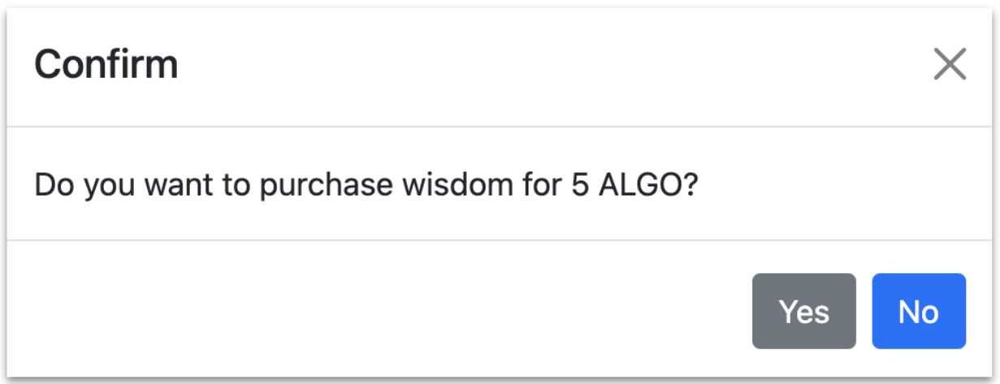

# {#wfs} Wisdom For Sale

Wisdom for Sale is a command-line and Web-based application that enables two participants (a `seller` and a `buyer`) to trade wise expressions for tokens via a Reach Decentralized Application (DApp).
Reach programs are built using a Docker container on your computer.
If you need help installing Reach and its prerequisites then get started at our [Quick Installation Guide](##quickstart).

Wisdom For Sale creates and funds two accounts (one for each participant), enables the `seller` and `buyer` to make a transaction, and then exits.

# {#wfs-1} Learning Objectives

At the end of this tutorial you will be able to:

1. Define essential Reach terms.
1. Build a Reach command-line DApp.
1. Convert the command-line DApp into a vanilla Web-app.

# {#wfs-2} Reach Modes

Reach programs (the `index.rsh` portion of your Reach DApp) are organized into four modes: `Init Mode`, `Step Mode`, `Local Step Mode`, and `Consensus Step Mode`.
Consider this diagram:


The dark blue boxes in the diagram represent modes.
The light blue boxes represent actions (functions) permitted within the mode.
The red text represents functions that cause transitions between modes.

## {#wfs-3} Reach Mode Definitions

### {#wfs-4} Init Mode

Application Initialization defines participants and views.

:::note
If you want to see the entire program from the start, skip to the section [View the contract](##wfs-20) later in this tutorial.
:::

Lines 2 and 3 below occur in the `App Init` section of the program:

``` js
export const main = Reach.App(() => {
  const S = Participant('Seller', sellerInteract);
  const B = Participant('Buyer', buyerInteract);
  init();
```

The `{!rsh} init` function transitions the program from `App Init` to `Step`.

### {#wfs-5} Step Mode

A `Step` specifies actions taken by each and every participant.
`exit()`, for example, is a function that must occur within a step, and it means that each and every participant exits the contract after which that instance of the contract becomes forever unavailable.

### {#wfs-6} Local Step Mode

A `Local Step` specifies actions taken by a single participant.
Local steps must occur within the body of `{!rsh} only` or `{!rsh} each` statements.
Here is an example:

``` js
S.only(() => { const price = declassify(interact.price); });
```

`{!rsh} only()` and `{!rsh} each()` transition to a local step and then back to the originating mode (either `Step` or `Consensus Step`).

### {#wfs-7} Consensus Step Mode

A `Consensus Step` specifies actions taken by the contract itself.
Later in this tutorial, the contract calls `{!rsh} transfer` to transfer funds from the contract to the `seller`.

# {#wfs-8} Pre-coding preparation

Before you start to code, it is a good idea to think about the application that you want to create and write down a plan for the actions.
This makes it easier to code the app, add in all of the functionality, and be less likely to make a mistake.

Wisdom for Sale requirements:

1. Wisdom for Sale requires two participants, a `Buyer` and a `Seller`.
1. The `buyer` will need a pay function and a function that displays the wisdom.
1. The `seller` will need a function to input the wisdom, and to put it up for sale.
1. Both participants will be publishing information: the seller will publish the wisdom and the price, the buyer will publish their decision to purchase.
1. The `buyer` needs to be able to decide to NOT purchase the wisdom, so we need to create a function for cancelling the sale.
1. If the `buyer` does decide to buy the wisdom, then there needs to be a function that reports the payment to both the `seller` and the `buyer`.

# {#wfs-9} Examine the transaction

The following diagram represents the Wisdom for Sale application flow:


This particular transaction took place on an Algorand devnet.
The Algorand cryptocurrency standard token unit is the `ALGO`.
As indicated by the final balances in the diagram, the `seller` received 0.006 ALGO less than the agreed upon price, and the `buyer` paid 0.003 ALGO more.
These expenses represent `fees`, the cost of doing business on a consensus network.
The `seller` paid a little more fees than the `buyer` because the `seller` paid a small fee to deploy the contract.

# {#wfs-10} Create the files

1. Create a project folder and `{!cmd} cd` into it via the command line.

    ```cmd
    $ mkdir -p ~/reach/wisdom && cd ~/reach/wisdom
    ```

1. Create `index.mjs` and `index.rsh` in your project folder and open both new files in your preferred editor.

    

## {#wfs-11} Create the Frontend

Type the following code into the file named `index.mjs`.

``` js
load: /examples/wisdom-1-starter/index.mjs
md5: 77f7503ee58c2459f3793262212ca702
range: 1-8
```

* Line 1: Import the Reach JS Standard Library loader.
* Line 2: Import the JS backend compiled from `index.rsh`.
* Line 4: Hard-code the role. You will change this later.
* Line 5: Display the role.
* Line 7: Load the Reach JS Stdlib for the consensus network specified by `{!cmd} REACH_CONNECTOR_MODE` env var.
* Line 8: Display the consensus network type.

``` js
load: /examples/wisdom-1-starter/index.mjs
md5: 77f7503ee58c2459f3793262212ca702
range: 10-10
```

* Line 10: Define an empty (for now) common interaction object.

``` js
load: /examples/wisdom-1-starter/index.mjs
md5: 77f7503ee58c2459f3793262212ca702
range: 12-16
```

* Line 13: Code for when you run this app as the `seller`.
* Line 14: Define an empty (for now) Seller interaction object.

``` js
load: /examples/wisdom-1-starter/index.mjs
md5: 77f7503ee58c2459f3793262212ca702
range: 18-20
```

* Line 18: Create an account for the `seller`. `{!js} parseCurrency` transforms units from standard to atomic.
* Line 19: Get a reference to the contract.
* Line 20: Initiate interaction with contract for `seller`.

``` js
load: /examples/wisdom-1-starter/index.mjs
md5: 77f7503ee58c2459f3793262212ca702
range: 22-28
```

* Line 23: Code for when you run this app as the `buyer`.
* Line 24 and 25: Define empty (for now) Buyer interaction object.

## {#wfs-12} Create the Backened

Type the following into `index.rsh`:

``` reach
load: /examples/wisdom-1-starter/index.rsh
md5: 94716b0192ec5b060a7a9efb2d2ad292
range: 1-9
```

* Line 1: Instruction to the compiler.
* Lines 3-9: Define empty (for now) participant interaction interface objects.

``` reach
load: /examples/wisdom-1-starter/index.rsh
md5: 94716b0192ec5b060a7a9efb2d2ad292
range: 11-16
```

* Line 11: Reach standard application initialization.
* Line 12: Define a constant to represent the `seller`.
* Line 13: Define a constant to represent the `buyer`.
* Line 14: Finalize participant and other options, and proceed to a Reach step.
* Line 16: Terminate computation.

# {#wfs-13} Run the DApp

Reach can currently compile the DApp to run on any of the following consensus network types:

* `ALGO` -- Algorand
* `CFX` -- Conflux
* `ETH` -- Ethereum (and other EVM-based networks)

1. Instruct the Reach compiler to connect to a network by setting the `{!cmd} REACH_CONNECTOR_MODE` environment variable.
Open a command prompt, and run the following command:

    ```cmd
    $ export REACH_CONNECTOR_MODE=ALGO
    ```

1. Run the program with the following command:

    ```cmd
    $ ./reach run
    ```

1. You can repeat the first step to switch the consensus network to `CFX` and `ETH`.

    > For consistency, output in this tutorial reflects `{!cmd} REACH_CONNECTOR_MODE=ALGO`.

    :::note
    Where does the DApp run?
    In a local "devnet" environment, the Reach compiler, the consensus network devnets, your application, and the smart contract run on your computer in Docker containers instantiated from Reach Docker images.
    A devnet refers to Reach's Dockerized developer network that allows developers to rapidly test their DApp.
    :::

    The bottom of the output should have the following lines:

    ```
    The consensus network is ALGO.
    Your role is seller.
    ```

# {#wfs-14} Pass an argument

This section shows you how to tell your DApp whether to run as the `seller` or the `buyer`.
You do this by passing `role` as a command-line argument (e.g. `{!cmd} reach run index seller`).
You cannot do this by passing `role` as a custom environment variable (e.g. `{!cmd} ROLE=seller reach run`) because in order to protect you, the `{!cmd} reach` tool exports only a pre-determined list of environment variables (including `{!cmd} REACH_CONNECTOR_MODE`) within the Docker container where it runs your DApp.
Follow these directions to pass `role` as a command-line argument:

1. In `index.mjs`, find the following line:

    ``` js
    load: /examples/wisdom-1-starter/index.mjs
    md5: 77f7503ee58c2459f3793262212ca702
    range: 4-4
    ```

1. Replace it with the following to be able to set the role in the command line arguments, and save the file:

    ``` js
    load: /examples/wisdom-2-roles/index.mjs
    md5: 1c1a401485c7053388922bbcac4eb14c
    range: 4-8
    ```

1. Open two terminals (i.e. shells):

    

1. Change the directory in both terminals by typing the following command:

    ```cmd
    $ cd reach/wisdom/
    ```

1. In the Seller Terminal, run your DApp as the `seller`:

    ```cmd
    $ ./reach run index seller
    ```

    When you pass arguments to `{!cmd} ./reach run`, the first one must be the name of the `rsh` file without the extension (i.e. `index`) as seen above.

    Application output should resemble the following:

    ```
    The consensus network is ALGO.
    Your role is seller.
    ```

1. In the Buyer Terminal, run your DApp as the `buyer`:

    ```
    $ ./reach run index buyer
    ```

    The output should resemble the following:

    ```
    The consensus network is ALGO.
    Your role is buyer.
    ```

# {#wfs-15} Explore units and balances

This section helps you explore standard and atomic units using the [JavaScript Standard Library](##ref-frontends-rpc-js).
Regarding tokens, each consensus network has a (divisible) standard unit and an (indivisible) atomic unit.
Users usually want to see standard units.
A smart contract, on the other hand, always deals with atomic units.

So, your DApp needs to convert between the two frequently.
We use the commands `{!js} parseCurrency` and `{!js} formatCurrency` to do the conversions.
`{!js} parseCurrency` converts from standard to atomic.
`{!js} formatCurrency` converts from atomic to standard.

As mentioned, `{!js} parseCurrency` is often used for human interactions: setting a contract price, paying the contract, wagers, staking, and other items where a user will either set the amount, or use the amount.
`{!js} formatCurrency` is more frequently used with computer interactions or with small costs: such as paying fees, making sure the contract balance is zero, or showing wallet balances after contracts exit.

1. In `index.mjs`, find the `{!js} console.log` statement below:

    ``` js
    load: /examples/wisdom-2-roles/index.mjs
    md5: 1c1a401485c7053388922bbcac4eb14c
    range: 12-12
    ```

1. Add the following two `{!js} console.log` statements that utilize the `{!js} stdlib.standardUnit` and `{!js} stdlib.atomicUnit` below it, and run your DApp as the `seller` to view the standard and atomic units for your network:

    ``` js
    load: /examples/wisdom-3-units1/index.mjs
    md5: ddea8b4f2eabe22280ca769fe27dec1e
    range: 13-14
    ```

    The output should resemble the following:

    ```
    The consensus network is ALGO.
    The standard unit is ALGO
    The atomic unit is μALGO
    ```

1. Remove the two `{!js} console.log` additions and then create `suStr` and `auStr`.
Set `suStr` to `{!js} standardUnit`, and `auStr` to `{!js} atomicUnit`.
Replace the `{!js} stdlib` statements with the corresponding `{!js} const` statements:

    ``` js
    load: /examples/wisdom-4-units2/index.mjs
    md5: 0a8d31fecdf9a62e0f3f82757eaa88a9
    range: 13-16
    ```

    The output should be the same.

1. Now, let's create a way to go back and forth between the two unit types.
We will then utilize `{!js} parseCurrency` and `{!js} formatCurrency` to change unit types.
We will also create a `suBal` to add 1000 standard units of funds, then utilize the `toAU` method to change the unit type of `suBal` to atomic units.
Let's write a couple of statements to the console to make sure it works as we expect, and then run again:

    ``` js
    load: /examples/wisdom-5-swap-units/index.mjs
    md5: 36609a212f1cfe6b51743e1fd580176d
    range: 13-21
    ```

    The output should resemble the following:

    ```
    The consensus network is ALGO.
    Balance is 1000 ALGO
    Balance is 1000000000 μALGO
    Balance is 1000 ALGO
    ```

1. Now, since that worked, we should refine the code.
We want to keep `toAU` and `toSU` because they are useful, but we do not need all of the console statements.
Instead, we can create a single `{!js} const` named `iBalance` and set it to atomic units using `toAU`, then wrap the account with `toSU` when we want to display standard units.
We want to display the account balance to the console, as well as test wrapping the account with `toSU`, so let's write one more statement to the console.
Your new code should look like the following:

    ``` js
    load: /examples/wisdom-6-swap-refined/index.mjs
    md5: 262be1cf2a189096986b250eefa4f777
    range: 14-17
    ```

    You use `iBalance` and `showBalance` in the next steps.

1. In `index.mjs`, find the line below and replace `stdlib.parseCurrency(1000)` with `iBalance`:

    ``` js
    load: /examples/wisdom-6-swap-refined/index.mjs
    md5: 262be1cf2a189096986b250eefa4f777
    range: 27-27
    ```

1. In `index.mjs`, insert `showBalance` in the two places shown below to show the account balance before and after contract deployment:

    ``` js
    load: /examples/wisdom-7-display-balance/index.mjs
    md5: 95b219c1d1332827d54aef69fbbe5144
    range: 27-31
    ```

1. Run your DApp again. Output should resemble the following:

    ```
    Your role is seller.
    The consensus network is ALGO.
    Your balance is 1000 ALGO.
    Your balance is 1000 ALGO.
    ```

    The second balance is now poised to reflect the results of the transactions you will implement below.

# {#wfs-16} Deploy the contract (seller)

This section shows you how to have the `seller` (1) deploy the contract and (2) return the contract information to be used later by the `buyer` to attach to the contract.
The format of contract information varies depending on the consensus network but can always be serialized to and from JSON without losing information.
The following are examples of contract information written in JSON:

|Consensus Network|Contract Information Example|
|-|-|
|Algorand|`{"type":"BigNumber","hex":"0x6e"}`|
|Conflux|`"NET999:TYPE.CONTRACT:ACDWGDGH6DKDAJ528Y5CCWMX8NBVPHXU72S3FPF8CY"`|
|Ethereum|`"0x403372276F841d7451E6417Cc7B17fDD159FE34C"`|

In this tutorial, the `seller` outputs the contract information to the Seller Terminal, and the `buyer` copies & pastes the contract information from the Seller Terminal to the Buyer Terminal (including the quotation marks if present).
In an actual deployment, the `seller` would need to search for a contract name and its associated contract information in some repository, or receive it in the form of something like a QR code.

Follow these directions to have the `seller` deploy the contract and return the contract information:

1. In `index.mjs`, find the `sellerInteract` code:

    ``` js
    load: /examples/wisdom-7-display-balance/index.mjs
    md5: 95b219c1d1332827d54aef69fbbe5144
    range: 21-25
    ```

1. Add `price` and `reportReady` methods to it:

    ``` js
    load: /examples/wisdom-8-pricing/index.mjs
    md5: 8669f708a34c09e769615516ed89d727
    range: 21-30
    ```

    You will add a `wisdom` property to the `sellerInteract` later in the tutorial.

1. In `index.rsh`, find the `sellerInteract` code:

    ``` reach
    load: /examples/wisdom-8-pricing/index.rsh
    md5: ce20f5ed8b89dd0d4671989972e692a9
    range: 4-5
    ```

1. Add `price` and `reportReady` that was added in the `index.mjs` file to the `index.rsh` code:

    ``` reach
    load: /examples/wisdom-8-pricing/index.rsh
    md5: ce20f5ed8b89dd0d4671989972e692a9
    range: 4-8
    ```

    * Line 4: `sellerInteract` is a user-defined Reach object.
    * Line 5: The spread syntax `...` adds all `commonInteract` properties (none yet) to the object.
    * Line 6: `price` is a `{!rsh} UInt`, a Reach-defined unsigned integer.
    * Line 7: `reportReady` is a function that takes a `{!rsh} UInt` as an argument and returns nothing.

1. In `index.rsh`, add the following code between `{!rsh} init` and `{!rsh} exit`:

    ``` reach
    load: /examples/wisdom-8-pricing/index.rsh
    md5: ce20f5ed8b89dd0d4671989972e692a9
    range: 16-23
    ```

    * Line 16: `{!rsh} init` initializes the DApp, and transitions to a step.
    * Line 18: `{!rsh} S.only()` transitions to a local step in which `seller` gets `price`.
    * Line 19: `{!rsh} S.publish()` transitions to a consensus step.
    * Line 20: `{!rsh} S.interact` transitions to a local step in which `seller` passes `price` to frontend.
    * Line 21: `{!rsh} commit()` transitions to a step.
    * Line 23: `{!rsh} exit()` halts the contract forever.

    The next section explains these functions in more detail.
    For now, know that Reach programs (the `index.rsh` portion of your Reach DApp) are organized into four modes, and that `{!rsh} init`, `{!rsh} only`, `{!rsh} publish`, `{!rsh} commit`, and `{!rsh} exit` cause mode transitions.

1. Run your DApp as the `seller`.
   The output should resemble the following:

    ```
    Your role is seller.
    The consensus network is ALGO.
    Your balance is 1000 ALGO.
    Your wisdom is for sale at 5 ALGO.
    Contract info: {"type":"BigNumber","hex":"0xa6"}
    Your balance is 999.996 ALGO.
    ```

    The `seller` creates the contract, retrieves the contract information, and makes it available to the `buyer` who will use the information to attach to the contract.
    Deploying the contract costs the `seller` a fee.
    Here, you can see that the balance after creating the contract is displayed using atomic units, because `acc` references `iBalance` which takes the input of 1000 standard units and turns it into the atomic units using `{!js} parseCurrency`.

The interact objects introduced in this section facilitate communication between the frontend (e.g. `index.mjs`) and backend (e.g. `index.main.mjs`) of Reach applications, (remembering that `index.rsh` is the pre-compiled version of `index.main.mjs`).

# {#wfs-17} Attach to the contract (buyer)

This section demonstrates how the `buyer` attaches to the contact.
It also introduces `@reach-sh/stdlib/ask.mjs`, a minimal Reach Node.js package for command-line input.

Interaction is often necessary between the DApp and the participants.
`{!js} ask` is a convenient way to allow interaction in a variety of different ways, each with a specific use.
`{!js} ask.yesno` is used to ask a question where the answer is either yes or no, and accepts a single letter response (`y` for yes and `n` for no).
`{!js} ask.ask` is valuable for queries where the expected response is a string, such as "What is your name?".
`{!js} ask.done` is used when there are no more questions.

1. In `index.mjs`, add `ask` to the imports from the Reach standard library:

    ``` js
    load: /examples/wisdom-9-interaction/index.mjs
    md5: c07daef24eed633d510f2469b8dbe1ba
    range: 1 - 3
    ```

1. In `index.mjs`, find the `buyerInteract` code:

    ``` js
    load: /examples/wisdom-8-pricing/index.mjs
    md5: 8669f708a34c09e769615516ed89d727
    range: 38-42
    ```

1. Replace it with the following:

    ``` js
    load: /examples/wisdom-9-interaction/index.mjs
    md5: c07daef24eed633d510f2469b8dbe1ba
    range: 39-51
    ```

    * Line 44: `{!js} ask.ask` and `{!js} ask.yesno` are functions in `@reach-sh/stdlib`.
      `{!js} ask.yesno` accepts only `y` or `n`.
    * Line 48: You must parse contract information (so, it must be parsable).
    * Line 51: You can substitute `participants` for `p`.

1. And, add `{!js} ask.done();` at the bottom of the file.

    ``` js
    load: /examples/wisdom-9-interaction/index.mjs
    md5: c07daef24eed633d510f2469b8dbe1ba
    range: 53-53
    ```

    `{!js} ask.done();` needs to be after `};` so that it is accessible by both the `Seller` and the `Buyer`

1. In `index.rsh`, find the `buyerInteract` code:

    ``` reach
    load: /examples/wisdom-8-pricing/index.rsh
    md5: ce20f5ed8b89dd0d4671989972e692a9
    range: 9-11
    ```

1. Add a `confirmPurchase` method as shown below:

    ``` reach
    load: /examples/wisdom-9-interaction/index.rsh
    md5: c01d2793ba9dc53f3d00900b075007b1
    range: 9-12
    ```

    After the `...commonInteract`, there needs to be a comma.
    When you add a property, all properties above the final property require a comma at the end of the line.

    * Line 9: `buyerInteract` is a user-defined Reach object.
    * Line 10: The spread syntax `...` adds all `commonInteract` properties (none yet) to the object.
    * Line 11: `confirmPurchase` is a function that takes a `UInt` and returns a `Bool`.

1. In `index.rsh`, add the following before `{!rsh} exit()` to utilize `confirmPurchase`:

    ``` reach
    load: /examples/wisdom-9-interaction/index.rsh
    md5: c01d2793ba9dc53f3d00900b075007b1
    range: 24-30
    ```

    * Line 24: `confirmPurchase` passes `price` and returns `true` or `false` from frontend.
    * Line 25: `B.publish()` transitions to a consensus step.
    * Line 27: `{!rsh} commit()` transitions to a step.

1. Run your DApp as both the `seller` and the `buyer`.
   When prompted, copy & paste the contract info from the Seller Terminal to the Buyer Terminal.
   Output should resemble the following:

    ::::alongside
    :::alongsideColumn
    ```
    Your role is seller.
    The consensus network is ALGO.
    Your balance is 1000 ALGO.
    Your wisdom is for sale at 5 ALGO.
    Contract info: {"type":"BigNumber","hex":"0xa6"}
    Your balance is 999.997 ALGO.
    ```
    :::
    :::alongsideColumn
    ```
    Your role is buyer.
    The consensus network is ALGO.
    Paste contract info:
    {"type":"BigNumber","hex":"0xa6"}
    Your balance is 1000 ALGO.
    Do you want to purchase wisdom for 5 ALGO?
    n
    Your balance is 999.998 ALGO.
    ```
    :::
    ::::

# {#wfs-18} Cancel a transaction

This section shows you how to display that a transaction is cancelled.

1. In `index.mjs`, find the following line:

    ``` js
    load: /examples/wisdom-9-interaction/index.mjs
    md5: c07daef24eed633d510f2469b8dbe1ba
    range: 20-20
    ```

1. Replace it with the following:

    ``` js
    load: /examples/wisdom-10-cancel1/index.mjs
    md5: cf4d87c4c5ac17a8c95bddbb9eedf47b
    range: 20-22
    ```

1. In `index.rsh`, find the following line:

    ``` reach
    load: /examples/wisdom-9-interaction/index.rsh
    md5: c01d2793ba9dc53f3d00900b075007b1
    range: 3-3
    ```

1. Replace it with the following:

    ``` reach
    load: /examples/wisdom-10-cancel1/index.rsh
    md5: e3eee2862c1aecc78e2e04aaa8d873a5
    range: 3-5
    ```

1. In `index.rsh`, add Lines 3 and 4 to existing code:

    ``` reach
    load: /examples/wisdom-10-cancel1/index.rsh
    md5: e3eee2862c1aecc78e2e04aaa8d873a5
    range: 28-34
    ```

1. Run your DApp as both the `seller` and the `buyer`.
   Answer `n` when asked to buy wisdom. Output should include the following:

    ::::alongside
    :::alongsideColumn
    ```
    Your role is seller.
    The buyer cancelled the order.
    ```
    :::
    :::alongsideColumn
    ```
    Your role is buyer.
    The buyer cancelled the order.
    ```
    :::
    ::::

    In the Buyer Terminal, it might be more consistent to output `You cancelled the order` instead of `The buyer cancelled the order`.
    The following steps implement this slight change.

1. In `index.mjs`, modify `commonInteract`:

    ``` js
    load: /examples/wisdom-11-cancel2/index.mjs
    md5: 3cff8f0b9c48ff6e3cf12aaa4e0cce33
    range: 20-22
    ```

1. In `index.mjs`, modify both `sellerInteract` and `buyerInteract` to pass `role` to `commonInteract`:

    ``` js
    load: /examples/wisdom-11-cancel2/index.mjs
    md5: 3cff8f0b9c48ff6e3cf12aaa4e0cce33
    range: 27-27
    ```

1. Rerun your DApp as the `seller` and `buyer`.
   Answer `n` again. Now, `buyer` output should include `You cancelled the order`:

    ::::alongside
    :::alongsideColumn
    ```
    Your role is seller.
    The buyer cancelled the order.
    ```
    :::
    :::alongsideColumn
    ```
    Your role is buyer.
    You cancelled the order.
    ```
    :::
    ::::

# {#wfs-19} Complete a transaction

This section shows you how to get wisdom from the `seller` on the frontend, and swap it for tokens on the backend.

1. In `index.mjs`, add a `wisdom` property to `sellerInteract` right after the `price` property:

    ``` js
    load: /examples/wisdom-12-complete/index.mjs
    md5: 601ca2fa79d21e1623af6c7d6745e3ce
    range: 26-35
    ```

1. In `index.rsh`, add a `wisdom` property to `sellerInteract` right after the `price` property:

    ``` reach
    load: /examples/wisdom-12-complete/index.rsh
    md5: ac58c8a9ba51e3daa9ec60b5929b219c
    range: 8-11
    ```

1. In `index.mjs`, add a `reportPayment` property to `commonInteract`:

    ``` js
    load: /examples/wisdom-12-complete/index.mjs
    md5: 601ca2fa79d21e1623af6c7d6745e3ce
    range: 21-21
    ```

1. In `index.rsh`, add a `reportPayment` property to `commonInteract` right after the `reportCancellation` property:

    ``` reach
    load: /examples/wisdom-12-complete/index.rsh
    md5: ac58c8a9ba51e3daa9ec60b5929b219c
    range: 3-6
    ```

1. In `index.mjs`, add `reportWisdom` to `buyerInteract` after `confirmPurchase`:

    ``` js
    load: /examples/wisdom-12-complete/index.mjs
    md5: 601ca2fa79d21e1623af6c7d6745e3ce
    range: 49-53
    ```

1. In `index.rsh`, add `reportWisdom` to `buyerInteract`:

    ``` reach
    load: /examples/wisdom-12-complete/index.rsh
    md5: ac58c8a9ba51e3daa9ec60b5929b219c
    range: 13-17
    ```

1. In `index.rsh`, add the following before `{!rsh} exit()`:

    ``` reach
    load: /examples/wisdom-12-complete/index.rsh
    md5: ac58c8a9ba51e3daa9ec60b5929b219c
    range: 39-47
    ```

    * Line 39: The `buyer` always pays the contract.
    * Line 42: After the `buyer` commits to purchase, the `seller` declassifies the wisdom.
    * Line 43: The `seller` makes the wisdom available to the `buyer`.
    * Line 44: The contract transfers funds to the `seller`.
    * Line 47: The `buyer` sends the new wisdom to the frontend for the user.

    It might be nice to inform the `seller` and the `buyer` when the `{!rsh} pay` and `{!rsh} transfer` actions take place.
    The next steps add these improvements.

1. In `index.mjs`, add `reportTransfer` to `commonInteract`:

    ``` js
    load: /examples/wisdom-13-reports/index.mjs
    md5: 2085c1ee9691223495a5e0059df1f5ab
    range: 23-23
    ```

1. In `index.rsh`, add `reportTransfer` to `commonInteract`:

    ``` reach
    load: /examples/wisdom-13-reports/index.rsh
    md5: 9944f5a6fb8df38715f0095226bff55c
    range: 5-5
    ```

1. In `index.rsh`, add Lines 41 and 49 to existing code:

    ``` reach
    load: /examples/wisdom-13-reports/index.rsh
    md5: 9944f5a6fb8df38715f0095226bff55c
    range: 40-50
    ```

    * Line 41: `{!rsh} each` calls `{!rsh} interact.reportPayment` for each participant in the array.
    * Line 49: `{!rsh} each` calls `{!rsh} interact.reportTransfer` for each participant in the array.

1. Run your DApp as the `seller` and the `buyer`.
   Answer `y` when asked to buy wisdom.
   Output should resemble the following:

    ::::alongside
    :::alongsideColumn
    ```
    Your role is seller.
    The consensus network is ALGO.
    Enter a wise phrase, or press Enter for default:

    Build healthy communities.
    Your balance is 1000 ALGO.
    Your wisdom is for sale at 5 ALGO.
    Contract info: {"type":"BigNumber","hex":"0x6e"}
    The buyer paid 5 ALGO to the contract.
    The contract paid 5 ALGO to you.
    Your balance is 1004.994 ALGO.
    ```
    :::
    :::alongsideColumn
    ```
    Your role is buyer.
    The consensus network is ALGO.
    Paste contract info:
    {"type":"BigNumber","hex":"0x6e"}
    Your balance is 1000 ALGO.
    Do you want to purchase wisdom for 5 ALGO?
    y
    You paid 5 ALGO to the contract.
    The contract paid 5 ALGO to the seller.
    Your new wisdom is "Build healthy communities."
    Your balance is 994.997 ALGO.
    ```
    :::
    ::::

    Congratulations on completing the contract!
    So far, you have learned how to create a contract, attach to the contract, cancel the contract, and complete the contract.
    These are some of the most common interactions participants will experience after deploying or attaching to a Reach DApp.

    Let's take a look at the final Reach code:

    ```reach
    load: /examples/wisdom-13-reports/index.rsh
    md5: 9944f5a6fb8df38715f0095226bff55c
    ```

    And the final frontend code:

    ```js
    load: /examples/wisdom-13-reports/index.mjs
    md5: 2085c1ee9691223495a5e0059df1f5ab
    ```

# {#wfs-20} View the contract

You have learned about command-line DApps, but customers prefer to use a GUI DApp.
GUI stands for "graphical user interface" and uses buttons, pop-ups, or other graphical elements to make the interface more user-friendly.
This section gives a taste of using a GUI to have the `buyer` peek into the deployed contract before attaching to view the price.
Allowing a `buyer` to view the contract before attaching is a better user experience, and better user experiences generally lead to more users.

Review the the `index.mjs` version of `confirmPurchase` from the `buyerInteract` object:

``` js
load: /examples/wisdom-9-interaction/index.mjs
md5: c07daef24eed633d510f2469b8dbe1ba
range: 43 - 43
```

Currently, the backend calls the function passing the `price` of the contract, and the frontend displays `price` to the `buyer`, asks for a decision, waits for the answer, and returns `true` or `false` to the backend.
This approach doesn't work well for a Web-app which might use a modal (an informative pop-up) in place of `{!js} ask.yesno`:

<div></div>

Here is how to display a modal using Bootstrap:

``` js
const modal = new bootstrap.Modal(document.getElementById('confirm-modal'), {})
modal.show();
```

A Web-app can do the following prior to attaching to the contract:

1. Get and display the price to the `buyer`.
1. Get confirmation from the `buyer`.

Once confirmed, the Web-app can attach to the contract and complete the transaction.
The following directions show you how to obtain `price` from the contract before attaching:

1. In `index.rsh`, add Lines 23 and 29:

    ``` reach
    load: /examples/wisdom-14-modal/index.rsh
    md5: ba3a13f791cd8b66554d685957ea1d9d
    range: 20-30
    ```

1. In `index.mjs`, add Lines 59 and 60 (in the `buyer` section):

    ``` js
    load: /examples/wisdom-14-modal/index.mjs
    md5: 3199de6edbb580ccdc95e57212b1577d
    range: 56-63
    ```

1. Run your DApp as the `seller` and the `buyer`.
   `Buyer` output should include the following:

    ```
    The price of wisdom is 5 ALGO.
    ```

The `buyer` is able to obtain `price` before attaching to the contract by using a view.
Now, if the `buyer` decides not to buy, he did not pay the cost of connecting to the contract, as he did in [Attach to the contract](##wfs-17).
This saves the `buyer` money and frustration from paying a fee while getting nothing in return, and greatly improves the user experience.
If you want to learn more about GUI Dapps, see our next tutorial.

# {#wfs-21} Review and further learning

Let's review the subjects learned in this tutorial:

+ In [Reach Modes](##wfs-2), we learned the different modes of a Reach program: Init, Step, Local Step, and Consensus Step.
+ [Pre-coding preparation](##wfs-8) helped us learn how to pre-code, increasing coding accuracy and speed.
+ In [Create the files](##wfs-10), we created the initial Reach files so we could start coding our DApp.
+ [Run the DApp](##wfs-13) showed us how to run a Reach program.
+ We explored `{!rsh} formatCurrency` and `{!rsh} parseCurrency`, their uses, and how to convert between them in [Explore units and balances](##wfs-15).
+ In [Deploy the contract](##wfs-16), we learned how to deploy a contract to the devnet.
+ We learned about attaching to a contract in [Attach to the contract](##wfs-17).
+ We figured out how to tell participants that the contract was cancelled in [Cancel a transaction](##wfs-18).
+ In [Complete a transaction](##wfs-19), we completed the transaction and saw the results of the contract.
+ And finally, in [View the contract](##wfs-20), we utilized Bootstrap to allow buyers to see the contract prior to attaching.

Congratulations!
A great next step is to check out the next [tutorial](##tut) to continue your learning, or visit one of our [guide topics](##guide) or [workshops](##workshop) for self-guided exploration of Reach.

Join us on Discord [the Discord community](@{DISCORD}) and message `@team, I just completed the Wisdom For Sale tutorial!`.
We will give you the `tutorial veteran` role, so you can more easily help others work through it!

# {#wfs-22} Self Assessment

Click on the question to view the answer.

::::testQ
Do smart contracts use standard or atomic units?

::::testA
Smart contracts use atomic (indivisible) units. User interfaces, on the other hand, often use standard units to present cryptocurrency amounts to users. Therefore, Reach frontends frequently need to convert between the two. The Reach JS Stdlib function `{!rsh} parseCurrency` converts from standard to atomic, and the function `{!rsh} formatCurrency` converts from atomic to standard.
:::

::::

::::testQ
Reach DApps create smart contracts that enable ____ to interact on consensus networks.

::::testA
Participants. A Reach program describes participant interactions from which the Reach compiler derives a smart contract.
:::

::::

::::testQ
Name the objects that comprise the interface between Reach frontend and backend participants.

::::testA
Interact objects enable Reach frontend and backend participants to communicate.
:::

::::

::::testQ
Name the Reach default frontend and backend files.

::::testA
`index.mjs` and `index.rsh` are the default frontend and backend filenames respectively. The Reach compiler compiles `index.rsh` into `index.main.mjs`.
:::

::::

::::testQ
In addition to participant backends, what does `index.main.mjs` contain?

::::testA
It also contains the smart contract bytecode for each supported consensus network.
:::

::::

::::testQ
When does the Reach Verification Engine run?

::::testA
Compile time.
:::

::::

::::testQ
Can Reach DApps run on local Dockerized devnets?

::::testA
Yes. Running Reach DApps on local Dockerized devnets is a convenient way to develop and test.
:::

::::

::::testQ
Name the environment variable used by Reach to determine the target consensus network.

::::testA
`{!cmd} REACH_CONNECTOR_MODE`
:::

::::

::::testQ
Name the `{!cmd} reach` command that stops and removes all Reach Docker containers.

::::testA
`./reach down`
:::

::::

::::testQ
Name the Reach object that allows frontends to peak into a contract without attaching.

::::testA
`{!rsh} View`
:::

::::
