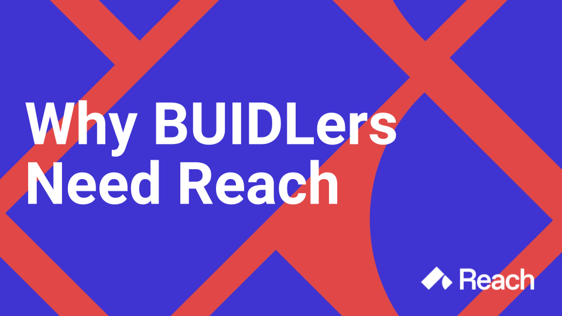
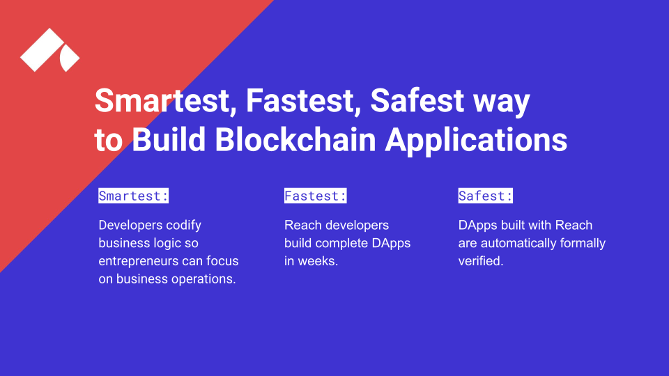
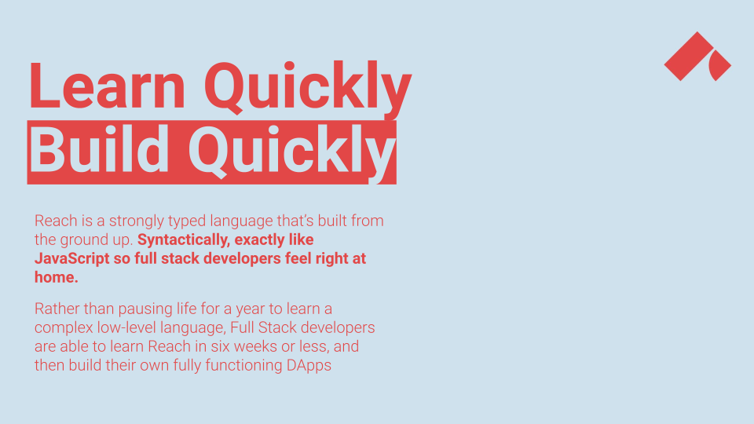
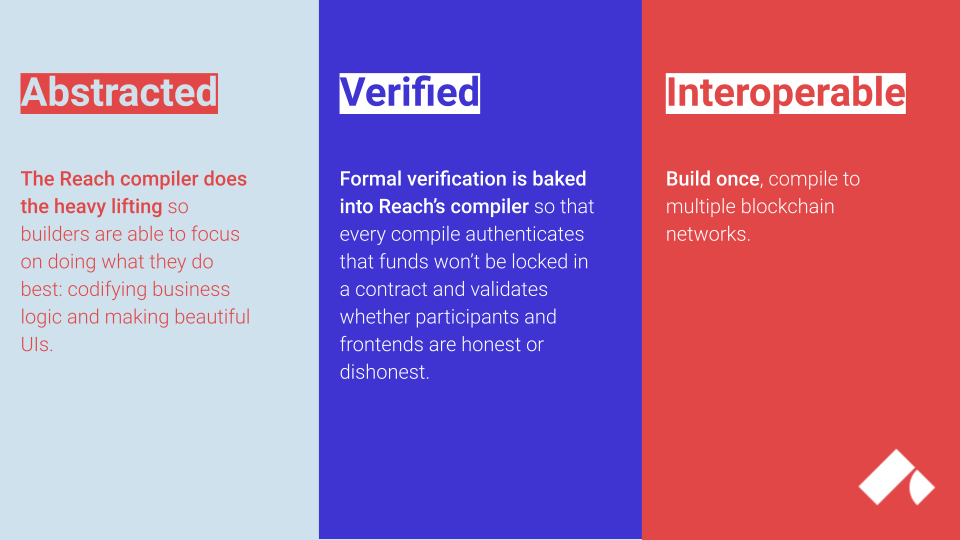
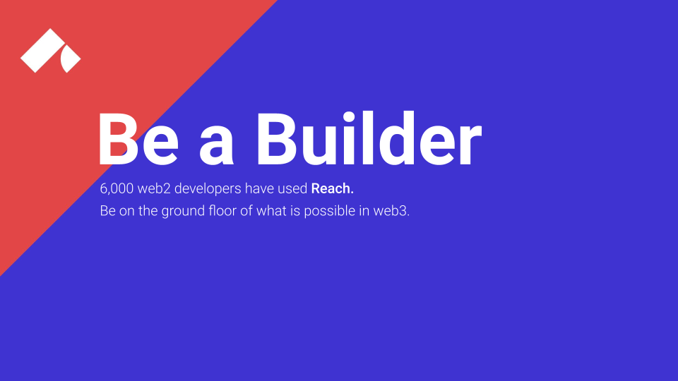

# {#build} Reach is for Builders

<section class="container">
    

        

            <button type="button" data-bs-target="#carouselExampleCaptions" data-bs-slide-to="0" class="active" aria-current="true" aria-label="Slide 1"></button>
            <button type="button" data-bs-target="#carouselExampleCaptions" data-bs-slide-to="1" aria-label="Slide 2"></button>
            <button type="button" data-bs-target="#carouselExampleCaptions" data-bs-slide-to="2" aria-label="Slide 3"></button>
            <button type="button" data-bs-target="#carouselExampleCaptions" data-bs-slide-to="3" aria-label="Slide 4"></button>
            <button type="button" data-bs-target="#carouselExampleCaptions" data-bs-slide-to="4" aria-label="Slide 5"></button>
            <button type="button" data-bs-target="#carouselExampleCaptions" data-bs-slide-to="5" aria-label="Slide 6"></button>
        

        

            

                
                

                    <h5>Why Builders Need Reach</h5>
                

            

            

                
                

                    <h5>Smartest, Fastest, Safest way to Build Blockchain Applications</h5>
                    
Smartest: Developers codify business logic so entrepreneurs can focus on business operations.

                    
Fastest: Reach developers build complete DApps in weeks.

                    
Safest: DApps built with Reach are automatically formally verified.

                

            

            

                
                

                    <h5>Learn Quickly; Build Quickly</h5>
                    
Reach is a high-level web3 language that's built from the ground up. Syntactically, exactly like JavaScript so full full stack developers feel right at home.

                    
Rather than pausing life for a year to learn a complex low-level language, full stack developers are able to learn Reach in six weeks or less, and then build their own fully functioning DApps.

                

            

            

                
                

                    <h5>Abstracted; Verified; Interoperable</h5>
                    
The Reach compiler does the heavy lifting so builders are able to focus on doing what they do best: codifying business logic and making beautiful UIs.

                    
Formal verification is baked into Reach's compiler; every compile authenticates that funds won't be locked in a contract and validates whether participants and frontends are honest or dishonest.

                

            

            

                
                

                    <h5>Lowering Floors; Raising Ceilings</h5>
                    
Reach ends the toxic tribalism common in today's blockchain communities and helps builders recognize the importance of the larger ecosystem.

                    
With Reach, protocols are no longer obstacles.

                    
Reach is enabling the millions of web2 developers to imagine new possibilities in web3.

                    
The future of blockchain is within Reach.

                

            

            

                
                

                    <h5>Be a Builder</h5>
                    
6,000 web2 developers have used Reach.

                    
Be on the ground floor of what is possible in web3.

                

            

        

        <button class="carousel-control-prev" type="button" data-bs-target="#carouselExampleCaptions" data-bs-slide="prev">
            
            Previous
        </button>
        <button class="carousel-control-next" type="button" data-bs-target="#carouselExampleCaptions" data-bs-slide="next">
            
            Next
        </button>
    

</section>

    <section class="row align-items-center g-1">
        <section class="col p-3">
            

                
                

                    <a href="../quickstart">
                      <h5 class="btn btn-primary card-title">Download Reach</h5>
                    </a>
                

            

        </section>
        <section class="col p-3">
            

                
                

                    <a href="@{DISCORD}">
                      <h5 class="btn btn-primary card-title">Join the Community</h5>
                    </a>
                

            

        </section>
        <section class="row align-items-center g-1">
            <section class="col p-3">
                

                    
                    

                        <a href="@{DISCUSSIONS}">
                        <h5 class="btn btn-primary card-title">Get Help</h5>
                        </a>
                    

                

            </section>
            <section class="col p-3">
                

                    
                    

                        <a href="../tut">
                        <h5 class="btn btn-primary card-title">Begin the Tutorial</h5>
                        </a>
                    

                

            </section>
        </section>
    </section>

 