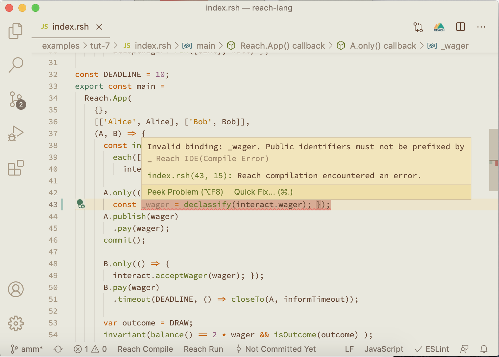

# Reach IDE

This extension provides IDE support for the Reach DApp programming language.

This project implements a Reach language server and VS Code extension to help with writing Reach programs that can be deployed onto Ethereum and Algorand.

## Screenshot

## Features
This extension will automatically download and set up the Reach compiler along with providing:
- Syntax support for Reach programs (`.rsh` files)
- Real time diagnostic highlighting for Reach compilation errors
- Quick fixes with suggestions provided by Reach compiler
- Hover documentation for all Reach keywords
- Snippet insertion for Reach templates
- Buttons to compile and Run Reach programs
- A Button to open the Reach documentation
- Right-click menu commands to:
	- Compile a program
	- Run a program
	- Update the compiler
